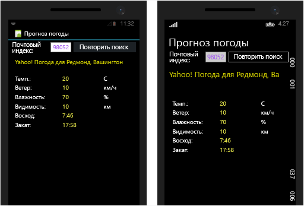
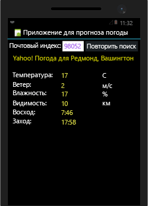
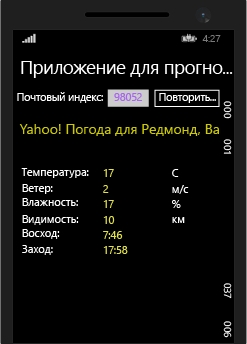

# <a name="build-apps-with-native-ui-using-xamarin-in-visual-studio"></a>Создание приложений с нативным пользовательским интерфейсом с использованием Xamarin в Visual Studio
Выполнив действия, описанные в разделах [Установка и настройка](../cross-platform/setup-and-install.md) и [Проверка среды Xamarin](../cross-platform/verify-your-xamarin-environment.md), вы можете перейти к этому пошаговому руководству, в котором будет описано, как создать базовое приложение Xamarin (показано ниже) с собственным пользовательским интерфейсом. При использовании собственного пользовательского интерфейса общий код находится в переносимой библиотеке классов (PCL), а проекты для отдельных платформ содержат определения пользовательского интерфейса.  
  
   
  
 Вам предстоит выполнить следующие действия.  
  
-   [Настройка решения](#solution)  
  
-   [Создание общего кода для службы данных](#dataservice)  
  
-   [Разработка пользовательского интерфейса для приложения Android](#Android)  
  
-   [Разработка пользовательского интерфейса для приложения Windows Phone](#Windows)  
  
-   [Дальнейшие действия](#next)  
  
> [!TIP]
>  Полный исходный код этого проекта можно найти в [репозитории mobile-samples в GitHub](https://github.com/xamarin/mobile-samples/tree/master/Weather).
>
>   При возникновении проблем или ошибок разместите свой вопрос на сайте [forums.xamarin.com](http://forums.xamarin.com). Для исправления многих ошибок можно обновить пакеты SDK Xamarin до последней версии. Эти пакеты описаны в разделе [Заметки о выпуске Xamarin](https://developer.xamarin.com/releases/) для каждой платформы.    
  
> [!NOTE]
>  Документация для разработчиков Xamarin также предлагает несколько пошаговых руководств с разделами "Краткое руководство" и "Подробное рассмотрение", приведенными ниже. На этих страницах убедитесь, что выбран пункт Visual Studio в правом верхнем углу страницы, чтобы увидеть пошаговые руководства именно для Visual Studio.  
>   
>  -   Приложения Xamarin с нативным пользовательским интерфейсом:  
>   
>      -   [Привет, Android](https://developer.xamarin.com/guides/android/getting_started/hello,android/) (простое приложение с одним экраном)  
>     -   [Привет, Android (несколько экранов)](https://developer.xamarin.com/guides/android/getting_started/hello,android_multiscreen/) (приложение с переходами между экранами)  
>     -   [Пошаговое руководство по фрагментам в Android](http://developer.xamarin.com/guides/android/platform_features/fragments/fragments_walkthrough/) (помимо прочего, используется для иерархических экранов)  
>     -   [Привет, iOS](https://developer.xamarin.com/guides/ios/getting_started/hello,_iOS/)  
>     -   [Привет, iOS (несколько экранов)](https://developer.xamarin.com/guides/ios/getting_started/hello,_iOS_multiscreen/)  
> -   Приложения Xamarin с Xamarin.Forms (общий пользовательский интерфейс)  
>   
>      -   [Привет, Xamarin.Forms](https://developer.xamarin.com/guides/cross-platform/xamarin-forms/getting-started/hello-xamarin-forms/quickstart/)  
>     -   [Привет, Xamarin.Forms (несколько экранов)](https://developer.xamarin.com/guides/cross-platform/xamarin-forms/getting-started/hello-xamarin-forms-multiscreen/)  
  
##  <a name="solution"></a> Настройка решения  
 С помощью этих действий создается решение Xamarin с собственным пользовательским интерфейсом, которое содержит переносимую библиотеку классов для общего кода и два добавленных пакета NuGet.  
  
1.  В Visual Studio создайте решение **Пустое приложение (Native Portable)** и назовите его **WeatherApp**. Чтобы найти этот шаблон, введите **Native Portable** в поле поиска.  
  
     Если он отсутствует, может потребоваться установить Xamarin или включить компонент Visual Studio 2015 (см. раздел [Установка и настройка](../cross-platform/setup-and-install.md)).  
  
2.  Нажав кнопку ОК для создания решения, вы получите несколько отдельных проектов.  
  
    -   **WeatherApp (переносимое)**: библиотека переносимых классов, в которой вы напишете общий код для разных платформ, включая общую бизнес-логику и код пользовательского интерфейса с помощью Xamarin.Forms.  
  
    -   **WeatherApp.Droid**: проект, который содержит машинный код для Android. Он задается как запускаемый проект по умолчанию.  
  
    -   **WeatherApp.iOS**: проект, который содержит машинный код для iOS.  
  
    -   **WeatherApp.WinPhone (Windows Phone 8.1)**: проект, который содержит машинный код Windows Phone.  
  
     В каждом проекте с машинным кодом вы получите доступ к собственному конструктору для соответствующей платформы и сможете реализовать окна для конкретной платформы.  
  
3.  Добавьте **Newtonsoft.Json** и пакет NuGet в проект PCL. Они будут использоваться для обработки информации, полученной от службы данных о погоде.  
  
    -   Щелкните правой кнопкой на **решении WeatherApp** в обозревателе решений и выберите **Управление пакетами NuGet для решения...** .  
  
         В окне NuGet перейдите на вкладку **Обзор** и наберите **Newtonsoft** в строке поиска.  
  
    -   Выберите **Newtonsoft.Json**.  
  
    -   В правой части окна установите флажок для проекта **WeatherApp** (это единственный проект, в котором потребуется установить пакет).  
  
    -   Убедитесь, что в поле **Версия** указана **последняя стабильная** версия.  
  
    -   Нажмите кнопку **Установить**.  
  
    -     
  
4.  Повторите шаг 3 для поиска и установки пакета **Microsoft.Net.Http**.  
  
5.  Соберите свое решение и убедитесь в отсутствии ошибок сборки.  
  
##  <a name="dataservice"></a> Создание общего кода для службы данных  
 Именно в проекте **WeatherApp (переносимый)** вы будете писать код для переносимой библиотеки классов, общей для всех платформ. Переносимая библиотека классов автоматически включается в пакеты приложений для iOS, Android и Windows Phone.  
  
 Далее в переносимую библиотеку классов добавляется код, который обращается к данным от службы погоды и сохраняет эти данные:  
  
1.  Чтобы запустить этот пример, необходимо сначала зарегистрироваться для получения бесплатного ключа API на сайте [http://openweathermap.org/appid](http://openweathermap.org/appid).  
  
2.  Щелкните проект **WeatherApp** правой кнопкой мыши и выберите пункт **Добавить > Класс…** В диалоговом окне **Добавление нового элемента** дайте файлу имя **Weather.cs**. Этот класс будет использован для хранения данных службы погоды.  
  
3.  Замените все содержимое файла **Weather.cs** следующим кодом:  
  
    ```csharp  
    namespace WeatherApp  
    {  
        public class Weather  
        {  
            public string Title { get; set; }  
            public string Temperature { get; set; }  
            public string Wind { get; set; }  
            public string Humidity { get; set; }  
            public string Visibility { get; set; }  
            public string Sunrise { get; set; }  
            public string Sunset { get; set; }  
  
            public Weather()  
            {  
                //Because labels bind to these values, set them to an empty string to  
                //ensure that the label appears on all platforms by default.  
                this.Title = " ";  
                this.Temperature = " ";  
                this.Wind = " ";  
                this.Humidity = " ";  
                this.Visibility = " ";  
                this.Sunrise = " ";  
                this.Sunset = " ";  
            }  
        }  
    }  
    ```  
  
4.  Добавьте в проект переносимой библиотеки классов класс **DataService.cs**, в котором вы будете обрабатывать данные JSON из службы погоды.  
  
5.  Замените все содержимое файла **DataService.cs** следующим кодом:  
  
    ```csharp  
    using System.Threading.Tasks;  
    using Newtonsoft.Json;  
    using System.Net.Http;  
  
    namespace WeatherApp  
    {  
        public class DataService  
        {  
            public static async Task<dynamic> getDataFromService(string queryString)  
            {  
                HttpClient client = new HttpClient();  
                var response = await client.GetAsync(queryString);  
  
                dynamic data = null;  
                if (response != null)  
                {  
                    string json = response.Content.ReadAsStringAsync().Result;  
                    data = JsonConvert.DeserializeObject(json);  
                }  
  
                return data;  
            }  
        }  
    }  
    ```  
  
6.  Добавьте в переносимую библиотеку классов третий класс **Core**, где будет размещаться общая бизнес-логика, которая, например, формирует строку запроса с помощью почтового индекса, вызывает службу погоды и заполняет экземпляр класса **Weather**.  
  
7.  Замените содержимое файла **Core.cs** следующим кодом:  
  
    ```csharp  
    using System;  
    using System.Threading.Tasks;  
  
    namespace WeatherApp  
    {  
        public class Core  
        {  
            public static async Task<Weather> GetWeather(string zipCode)  
            {  
                //Sign up for a free API key at http://openweathermap.org/appid  
                string key = "YOUR KEY HERE";  
                string queryString = "http://api.openweathermap.org/data/2.5/weather?zip="  
                    + zipCode + ",us&appid=" + key + "&units=imperial";  

                //Make sure developers running this sample replaced the API key
                if (key == "YOUR API KEY HERE")
                {
                    throw new ArgumentException("You must obtain an API key from openweathermap.org/appid and save it in the 'key' variable.");
                }
  
                dynamic results = await DataService.getDataFromService(queryString).ConfigureAwait(false);  
  
                if (results["weather"] != null)  
                {  
                    Weather weather = new Weather();  
                    weather.Title = (string)results["name"];                  
                    weather.Temperature = (string)results["main"]["temp"] + " F";  
                    weather.Wind = (string)results["wind"]["speed"] + " mph";                  
                    weather.Humidity = (string)results["main"]["humidity"] + " %";  
                    weather.Visibility = (string)results["weather"][0]["main"];  
  
                    DateTime time = new System.DateTime(1970, 1, 1, 0, 0, 0, 0);  
                    DateTime sunrise = time.AddSeconds((double)results["sys"]["sunrise"]);  
                    DateTime sunset = time.AddSeconds((double)results["sys"]["sunset"]);  
                    weather.Sunrise = sunrise.ToString() + " UTC";  
                    weather.Sunset = sunset.ToString() + " UTC";  
                    return weather;  
                }  
                else  
                {  
                    return null;  
                }  
            }  
        }  
    }  
    ```  
  
8.  Замените содержимое поле *ВСТАВЬТЕ СВОЙ КЛЮЧ СЮДА* на ключ API, полученный на шаге 1 (он должен быть заключен в кавычки).  
  
9. Удалите файл MyClass.cs в переносимой библиотеке классов, так как мы не будем его использовать.  
  
10. Соберите проект переносимой библиотеки классов **WeatherApp** , чтобы убедиться в правильности кода.  
  
##  <a name="Android"></a> Разработка пользовательского интерфейса для приложения Android  
 Теперь мы разработаем пользовательский интерфейс, подключим его к общему коду, а затем запустим приложение.  
  
### <a name="design-the-look-and-feel-of-your-app"></a>Разработка интерфейса приложения  
  
1.  В **обозревателе решений** разверните узел **WeatherApp.Droid**>**Ресурсы**>**макет** и откройте файл **Main.axml**. Файл откроется в визуальном конструкторе. (При появлении ошибки, связанной с Java, см. следующую [запись в блоге](http://forums.xamarin.com/discussion/32365/connection-to-the-layout-renderer-failed-in-xs-5-7-and-xamarinvs-3-9).)  
  
    > [!TIP]
    >  В этом проекте есть много других файлов. Их изучение выходит за рамки этого раздела, но, если вы хотите подробно рассмотреть структуру проекта Android, обратитесь к разделу [Часть 2. Подробное описание структуры](http://developer.xamarin.com/guides/android/getting_started/hello,android/hello,android_deepdive/) на странице Hello Android на сайте xamarin.com.  
  
2.  Выберите и удалите кнопку по умолчанию, которая отображается в конструкторе.  
  
3.  Откройте панель элементов, выбрав пункт меню **Просмотр > Другие окна > Панель элементов**.  
  
4.  Перетащите элемент управления **RelativeLayout**с **панели элементов** в конструктор. Этот элемент управления можно использовать в качестве родительского контейнера для других элементов управления.  
  
    > [!TIP]
    >  Если макет отображается неправильно, сохраните файл и переключитесь между вкладками **Структура** и **Исходный код**, чтобы обновить макет.  
  
5.  В окне **Свойства** установите свойство **background** (в группе "Стиль") в значение `#545454`.  
  
6.  Перетащите элемент управления **TextView**с **панели элементов** в элемент управления **RelativeLayout** .  
  
7.  Установите эти свойства в окне **Свойства** (примечание: для удобства можно отсортировать список в алфавитном порядке с помощью сортировки кнопки на панели инструментов окна "Свойства"):  
  
    |Свойство|Значение|  
    |--------------|-----------|  
    |**text**|**Search by Zip Code**|  
    |**id**|`@+id/ZipCodeSearchLabel`|  
    |**layout_marginLeft**|`10dp`|  
    |**textColor**|`@android:color/white`|  
    |**textStyle**|`bold`|  
  
    > [!TIP]
    >  Обратите внимание, что многие свойства не содержат раскрывающегося списка значений, доступных для выбора.  Прогнозирование значения, которое следует использовать для какого-либо свойства, может оказаться сложным. Чтобы просмотреть предложения, попробуйте ввести имя свойства на странице класса [R.attr](http://developer.android.com/reference/android/R.attr.html) .  
    >   
    >  Также быстрый поиск в Интернете позволит найти на сайте [http://stackoverflow.com/](http://stackoverflow.com/) страницу, на которой другие пользователи использовали то же свойство.  
  
     Для справки можно переключиться в представление **Исходный код**, и вы должны увидеть следующий код для этого элемента:  
  
    ```xml  
    <TextView  
        android:text="Search by Zip Code"  
        android:layout_width="wrap_content"  
        android:layout_height="wrap_content"  
        android:id="@+id/ZipCodeSearchLabel"  
        android:layout_centerVertical="true"  
        android:layout_marginLeft="10dp"  
        android:textColor="@android:color/white"  
        android:textStyle="bold" />  
  
    ```  
  
8.  Перетащите элемент управления **TextView** c **панели элементов** на элемент управления **RelativeLayout** и разместите его под элементом управления ZipCodeSearchLabel. Для этого переместите и отпустите новый элемент управления у соответствующего края существующего элемента управления; при необходимости измените масштаб в окне конструктора.  
  
9. В окне **Свойства** задайте следующие свойства.  
  
    |Свойство|Значение|  
    |--------------|-----------|  
    |**текст**|**Почтовый индекс**|  
    |**id**|`@+id/ZipCodeLabel`|  
    |**layout_marginLeft**|`10dp`|  
    |**layout_marginTop**|`5dp`|  
  
     Код в представлении **Исходный код** должен выглядеть следующим образом:  
  
    ```xml  
    <TextView  
        android:text="Zip Code"  
        android:layout_width="wrap_content"  
        android:layout_height="wrap_content"  
        android:layout_below="@id/ZipCodeSearchLabel"  
        android:id="@+id/ZipCodeLabel"  
        android:layout_marginTop="5dp"  
        android:layout_marginLeft="10dp" />  
    ```  
  
10. Перетащите элемент управления **Number** c **панели элементов** на элемент управления **RelativeLayout** и разместите его под меткой **Zip Code**. Затем установите следующие свойства:  
  
    |Свойство|Значение|  
    |--------------|-----------|  
    |**id**|`@+id/zipCodeEntry`|  
    |**layout_marginLeft**|`10dp`|  
    |**layout_marginBottom**|`10dp`|  
    |**width**|`165dp`|  
  
     Код будет следующим:  
  
    ```xml  
    <EditText  
        android:inputType="number"  
        android:layout_width="wrap_content"  
        android:layout_height="wrap_content"  
        android:layout_below="@id/ZipCodeLabel"  
        android:id="@+id/zipCodeEntry"  
        android:layout_marginLeft="10dp"  
        android:layout_marginBottom="10dp"  
        android:width="165dp" />  
    ```  
  
11. Перетащите элемент управления **Button** c **панели элементов** на элемент управления **RelativeLayout** и разместите его справа от элемента управления zipCodeEntry. Затем установите следующие свойства:  
  
    |Свойство|Значение|  
    |--------------|-----------|  
    |**id**|`@+id/weatherBtn`|  
    |**текст**|**Get Weather**|  
    |**layout_marginLeft**|`20dp`|  
    |**layout_alignBottom**|`@id/zipCodeEntry`|  
    |**width**|`165dp`|  
  
    ```xml  
    <Button    android:text="Get Weather"  
        android:layout_width="wrap_content"  
        android:layout_height="wrap_content"  
        android:layout_toRightOf="@id/zipCodeEntry"  
        android:id="@+id/weatherBtn"  
        android:layout_marginLeft="20dp"  
        android:layout_alignBottom="@id/zipCodeEntry"  
        android:width="165dp" />  
    ```  
  
12. Теперь вы можете создать базовый пользовательский интерфейс с помощью конструктора Android. Для создания пользовательского интерфейса также можно добавить разметку непосредственно в ASXML-файл на странице. Для создания остальной части пользовательского интерфейса таким же образом переключитесь в режим исходного кода в конструкторе и вставьте следующий код *под* тегом `</RelativeLayout>` (да, под тегом; эти элементы не содержатся в ReleativeLayout).  
  
    ```xml  
    <TextView  
            android:text="Location"  
            android:textAppearance="?android:attr/textAppearanceSmall"  
            android:layout_width="match_parent"  
            android:layout_height="wrap_content"  
            android:id="@+id/locationLabel"  
            android:layout_marginLeft="10dp"  
            android:layout_marginTop="10dp" />  
        <TextView  
            android:textAppearance="?android:attr/textAppearanceMedium"  
            android:layout_width="match_parent"  
            android:layout_height="wrap_content"  
            android:id="@+id/locationText"  
            android:layout_marginLeft="20dp"  
            android:layout_marginBottom="10dp" />  
        <TextView  
            android:text="Temperature"  
            android:textAppearance="?android:attr/textAppearanceSmall"  
            android:layout_width="match_parent"  
            android:layout_height="wrap_content"  
            android:id="@+id/tempLabel"  
            android:layout_marginLeft="10dp" />  
        <TextView  
            android:textAppearance="?android:attr/textAppearanceMedium"  
            android:layout_width="match_parent"  
            android:layout_height="wrap_content"  
            android:id="@+id/tempText"  
            android:layout_marginBottom="10dp"  
            android:layout_marginLeft="20dp" />  
        <TextView  
            android:text="Wind Speed"  
            android:textAppearance="?android:attr/textAppearanceSmall"  
            android:layout_width="match_parent"  
            android:layout_height="wrap_content"  
            android:id="@+id/windLabel"  
            android:layout_marginLeft="10dp" />  
        <TextView  
            android:textAppearance="?android:attr/textAppearanceMedium"  
            android:layout_width="match_parent"  
            android:layout_height="wrap_content"  
            android:id="@+id/windText"  
            android:layout_marginBottom="10dp"  
            android:layout_marginLeft="20dp" />  
        <TextView  
            android:text="Humidity"  
            android:textAppearance="?android:attr/textAppearanceSmall"  
            android:layout_width="match_parent"  
            android:layout_height="wrap_content"  
            android:id="@+id/humidtyLabel"  
            android:layout_marginLeft="10dp" />  
        <TextView  
            android:textAppearance="?android:attr/textAppearanceMedium"  
            android:layout_width="match_parent"  
            android:layout_height="wrap_content"  
            android:id="@+id/humidityText"  
            android:layout_marginBottom="10dp"  
            android:layout_marginLeft="20dp" />  
        <TextView  
            android:text="Visibility"  
            android:textAppearance="?android:attr/textAppearanceSmall"  
            android:layout_width="match_parent"  
            android:layout_height="wrap_content"  
            android:id="@+id/visibilityLabel"  
            android:layout_marginLeft="10dp" />  
        <TextView  
            android:textAppearance="?android:attr/textAppearanceMedium"  
            android:layout_width="match_parent"  
            android:layout_height="wrap_content"  
            android:id="@+id/visibilityText"  
            android:layout_marginBottom="10dp"  
            android:layout_marginLeft="20dp" />  
        <TextView  
            android:text="Time of Sunrise"  
            android:textAppearance="?android:attr/textAppearanceSmall"  
            android:layout_width="match_parent"  
            android:layout_height="wrap_content"  
            android:id="@+id/sunriseLabel"  
            android:layout_marginLeft="10dp" />  
        <TextView  
            android:textAppearance="?android:attr/textAppearanceMedium"  
            android:layout_width="match_parent"  
            android:layout_height="wrap_content"  
            android:id="@+id/sunriseText"  
            android:layout_marginBottom="10dp"  
            android:layout_marginLeft="20dp" />  
        <TextView  
            android:text="Time of Sunset"  
            android:textAppearance="?android:attr/textAppearanceSmall"  
            android:layout_width="match_parent"  
            android:layout_height="wrap_content"  
            android:id="@+id/sunsetLabel"  
            android:layout_marginLeft="10dp" />  
        <TextView  
            android:textAppearance="?android:attr/textAppearanceMedium"  
            android:layout_width="match_parent"  
            android:layout_height="wrap_content"  
            android:id="@+id/sunsetText"  
            android:layout_marginBottom="10dp"  
            android:layout_marginLeft="20dp" />  
  
    ```  
  
13. Сохраните файл и переключитесь в представление **Макет**. Пользовательский интерфейс будет выглядеть следующим образом:  
  
       
  
14. Откройте файл **MainActivity.cs** и удалите строки в методе *OnCreate*, которые ссылаются на кнопку по умолчанию, которая была удалена ранее. Готовый код должен выглядеть следующим образом:  
  
    ```  
    protected override void OnCreate (Bundle bundle)  
    {  
        base.OnCreate (bundle);  
  
        // Set our view from the "main" layout resource  
        SetContentView (Resource.Layout.Main);  
    }  
    ```  
  
15. Чтобы проверить свою работу, создайте проект Android. Обратите внимание, что при сборке в файл **Resource.Designer.cs** будут добавлены идентификаторы элементов управления, чтобы в коде можно было ссылаться на элементы управления по имени.  
  
### <a name="consume-your-shared-code"></a>Использование общего кода  
  
1.  Откройте файл **MainActivity.cs** проекта **WeatherApp** в редакторе кода и замените его содержимое следующим кодом. Этот код вызывает метод `GetWeather` , определенный в общем коде. Затем он отобразит в пользовательском интерфейсе приложения данные, полученные из этого метода.  
  
    ```csharp  
    using System;  
    using Android.App;  
    using Android.Widget;  
    using Android.OS;  
  
    namespace WeatherApp.Droid  
    {  
        [Activity(Label = "Sample Weather App", MainLauncher = true, Icon = "@drawable/icon")]  
        public class MainActivity : Activity  
        {  
            protected override void OnCreate(Bundle bundle)  
            {  
                base.OnCreate(bundle);  
  
                SetContentView(Resource.Layout.Main);  
  
                Button button = FindViewById<Button>(Resource.Id.weatherBtn);  
  
                button.Click += Button_Click;  
            }  
  
            private async void Button_Click(object sender, EventArgs e)  
            {  
                EditText zipCodeEntry = FindViewById<EditText>(Resource.Id.zipCodeEntry);  
  
                if (!String.IsNullOrEmpty(zipCodeEntry.Text))  
                {  
                    Weather weather = await Core.GetWeather(zipCodeEntry.Text);  
                    FindViewById<TextView>(Resource.Id.locationText).Text = weather.Title;  
                    FindViewById<TextView>(Resource.Id.tempText).Text = weather.Temperature;  
                    FindViewById<TextView>(Resource.Id.windText).Text = weather.Wind;  
                    FindViewById<TextView>(Resource.Id.visibilityText).Text = weather.Visibility;  
                    FindViewById<TextView>(Resource.Id.humidityText).Text = weather.Humidity;  
                    FindViewById<TextView>(Resource.Id.sunriseText).Text = weather.Sunrise;  
                    FindViewById<TextView>(Resource.Id.sunsetText).Text = weather.Sunset;  
                }  
            }  
        }  
    }  
    ```  
  
### <a name="run-the-app-and-see-how-it-looks"></a>Запуск и просмотр приложения  
  
1.  В **обозревателе решений** установите проект **WeatherApp.Droid** в качестве проекта, загружаемого при запуске.  
  
2.  Выберите подходящее устройство или эмулятор, а затем запустите приложение, нажав клавишу F5.  
  
3.  На устройстве или в эмуляторе введите действительный почтовый индекс США в поле ввода (например, 60601), а затем нажмите кнопку **Узнать погоду**. В элементах управления появятся данные о погоде в этом регионе.  
  
       
  
> [!TIP]
>  Полный исходный код этого проекта можно найти в [репозитории mobile-samples в GitHub](https://github.com/xamarin/mobile-samples/tree/master/Weather).  
  
##  <a name="Windows"></a> Разработка пользовательского интерфейса для приложения Windows Phone  
 Теперь мы разработаем пользовательский интерфейс для Windows Phone, подключим его к общему коду, а затем запустим приложение.  
  
### <a name="design-the-look-and-feel-of-your-app"></a>Разработка интерфейса приложения  
 Процесс создания собственного пользовательского интерфейса для Windows Phone в приложении Xamarin ничем не отличается от процесса создания интерфейса для других собственных приложений Windows Phone. Поэтому мы не будем углубляться в подробности использования конструктора. Для получения дополнительных сведений обратитесь к разделу [Создание пользовательского интерфейса с помощью конструктора XAML](../designers/creating-a-ui-by-using-xaml-designer-in-visual-studio.md).  
  
 Вместо этого просто откройте файл MainPage.xaml и замените весь код XAML следующим:  
  
```xaml  
<Page  
    x:Class="WeatherApp.WinPhone.MainPage"  
    xmlns="http://schemas.microsoft.com/winfx/2006/xaml/presentation"  
    xmlns:x="http://schemas.microsoft.com/winfx/2006/xaml"  
    xmlns:local="using:WeatherApp.WinPhone"  
    xmlns:d="http://schemas.microsoft.com/expression/blend/2008"  
    xmlns:mc="http://schemas.openxmlformats.org/markup-compatibility/2006"  
    mc:Ignorable="d"  
    Background="{ThemeResource ApplicationPageBackgroundThemeBrush}">  
  
    <Grid>  
        <StackPanel HorizontalAlignment="Left" Height="40" Margin="10,0,0,0" VerticalAlignment="Top" Width="400">  
            <TextBlock x:Name="pageTitle" Text="Weather App" FontSize="30" />  
        </StackPanel>  
        <StackPanel HorizontalAlignment="Left" Height="120" Margin="10,40,0,0" VerticalAlignment="Top" Width="400" Background="#FF545454">  
  
            <TextBlock x:Name="zipCodeSearchLabel" TextWrapping="Wrap" Text="Search by Zip Code" FontSize="18" FontWeight="Bold" HorizontalAlignment="Left" Margin="10,10,0,0"/>  
            <TextBlock x:Name="zipCodeLabel" TextWrapping="Wrap" Text="Zip Code" Margin="10,5,0,0" FontSize="14" Foreground="#FFA8A8A8"/>  
            <StackPanel Orientation="Horizontal">  
                <TextBox x:Name="zipCodeEntry" Margin="10,10,0,0" Text="" VerticalAlignment="Top" InputScope="Number" Width="165" />  
                <Button x:Name="weatherBtn" Content="Get Weather" Width="165" Margin="20,0,0,0" Height="60" Click="GetWeatherButton_Click"/>  
            </StackPanel>  
        </StackPanel>  
        <StackPanel Margin="10,175,0,0">  
            <TextBlock x:Name="locationLabel" HorizontalAlignment="Left" FontSize="14" Foreground="#FFA8A8A8" TextWrapping="Wrap" Text="Location" VerticalAlignment="Top"/>  
            <TextBlock x:Name="locationText" Margin="10,0,0,10" HorizontalAlignment="Left" FontSize="18" TextWrapping="Wrap" VerticalAlignment="Top"/>  
            <TextBlock x:Name="tempLabel" HorizontalAlignment="Left" FontSize="14" Foreground="#FFA8A8A8" TextWrapping="Wrap" Text="Temperature" VerticalAlignment="Top"/>  
            <TextBlock x:Name="tempText" Margin="10,0,0,10" HorizontalAlignment="Left" FontSize="18" TextWrapping="Wrap" VerticalAlignment="Top"/>  
            <TextBlock x:Name="windLabel" HorizontalAlignment="Left" FontSize="14" Foreground="#FFA8A8A8" TextWrapping="Wrap" Text="Wind Speed" VerticalAlignment="Top"/>  
            <TextBlock x:Name="windText" Margin="10,0,0,10" HorizontalAlignment="Left" FontSize="18" TextWrapping="Wrap" VerticalAlignment="Top"/>  
            <TextBlock x:Name="humidityLabel" HorizontalAlignment="Left" FontSize="14" Foreground="#FFA8A8A8" TextWrapping="Wrap" Text="Humidity" VerticalAlignment="Top"/>  
            <TextBlock x:Name="humidityText" Margin="10,0,0,10" HorizontalAlignment="Left" FontSize="18" TextWrapping="Wrap" VerticalAlignment="Top"/>  
            <TextBlock x:Name="visibilityLabel" HorizontalAlignment="Left" FontSize="14" Foreground="#FFA8A8A8" TextWrapping="Wrap" Text="Temperature" VerticalAlignment="Top"/>  
            <TextBlock x:Name="visibilityText" Margin="10,0,0,10" HorizontalAlignment="Left" FontSize="18" TextWrapping="Wrap" VerticalAlignment="Top"/>  
            <TextBlock x:Name="sunriseLabel" HorizontalAlignment="Left" FontSize="14" Foreground="#FFA8A8A8" TextWrapping="Wrap" Text="Time of Sunriweatherse" VerticalAlignment="Top"/>  
            <TextBlock x:Name="sunriseText" Margin="10,0,0,10" HorizontalAlignment="Left" FontSize="18" TextWrapping="Wrap" VerticalAlignment="Top"/>  
            <TextBlock x:Name="sunsetLabel" HorizontalAlignment="Left" FontSize="14" Foreground="#FFA8A8A8" TextWrapping="Wrap" Text="Time of Sunset" VerticalAlignment="Top"/>  
            <TextBlock x:Name="sunsetText" Margin="10,0,0,10" HorizontalAlignment="Left" FontSize="18" TextWrapping="Wrap" VerticalAlignment="Top"/>  
        </StackPanel>  
    </Grid>  
</Page>  
```  
  
 В представлении конструктора пользовательский интерфейс должен выглядеть следующим образом:  
  
   
  
### <a name="consume-your-shared-code"></a>Использование общего кода  
  
1.  В конструкторе нажмите кнопку **Узнать погоду** .  
  
2.  В окне **Свойства** нажмите кнопку обработчика событий ().  
  
     Этот значок появится в верхнем углу окна **Свойства** .  
  
3.  Рядом с событием **Click** введите **GetWeatherButton_Click**и нажмите клавишу ВВОД.  
  
     Будет создан обработчик событий с именем `GetWeatherButton_Click`. Откроется редактор кода, и курсор будет находиться в блоке кода обработчика событий.  Примечание: если при нажатии клавиши ВВОД редактор не открывается, дважды щелкните имя события.  
  
4.  Замените этот обработчик событий следующим кодом.  
  
    ```csharp  
    private async void GetWeatherButton_Click(object sender, RoutedEventArgs e)  
    {  
        if (!String.IsNullOrEmpty(zipCodeEntry.Text))  
        {  
            Weather weather = await Core.GetWeather(zipCodeEntry.Text);  
            locationText.Text = weather.Title;  
            tempText.Text = weather.Temperature;  
            windText.Text = weather.Wind;  
            visibilityText.Text = weather.Visibility;  
            humidityText.Text = weather.Humidity;  
            sunriseText.Text = weather.Sunrise;  
            sunsetText.Text = weather.Sunset;  
  
            weatherBtn.Content = "Search Again";  
        }  
    }  
    ```  
  
     Этот код вызывает метод `GetWeather` , определенный в общем коде. Это тот же метод, который вызывался в приложении Android. Данный код также отображает данные, полученные из этого метода в элементах управления пользовательского интерфейса приложения.  
  
5.  В открывшемся файле MainPage.xaml.cs удалите весь код внутри метода **OnNavigatedTo**. Этот код просто обрабатывает кнопку по умолчанию, которая была удалена, когда мы заменили содержимое файла MainPage.xaml.  
  
### <a name="run-the-app-and-see-how-it-looks"></a>Запуск и просмотр приложения  
  
1.  В **обозревателе решений** установите проект **WeatherApp.WinPhone** в качестве проекта, загружаемого при запуске.  
  
2.  Запустите приложение, нажав клавишу F5.  
  
3.  В эмуляторе Windows Phone введите действительный почтовый индекс США в поле ввода (например, 60601), а затем нажмите кнопку **Узнать погоду**. В элементах управления появятся данные о погоде в этом регионе.  
  
       
  
> [!TIP]
>  Полный исходный код этого проекта можно найти в [репозитории mobile-samples в GitHub](https://github.com/xamarin/mobile-samples/tree/master/Weather).  
  
##  <a name="next"></a> Дальнейшие действия  
 **Добавление пользовательского интерфейса для iOS в решение**  
  
 Расширьте этот пример, добавив собственный пользовательский интерфейс для iOS. Для этого необходимо подключиться к компьютеру Mac в локальной сети, на котором установлены Xcode и Xamarin. После этого можно использовать конструктор iOS непосредственно в Visual Studio. Законченное приложение можно найти [в репозитории mobile-samples в GitHub](https://github.com/xamarin/mobile-samples/tree/master/Weather).  
  
 Также обратитесь к пошаговому руководству [Привет, iOS](http://developer.xamarin.com/guides/ios/getting_started/hello,_iOS/hello,iOS_quickstart/) (xamarin.com). Обратите внимание, что для отображения правильного набора инструкций в правом верхнем углу страниц сайта xamarin.com должен быть выбран пункт "Visual Studio".  
  
 **Добавление кода конкретной платформы в общий проект**  
  
 Общий код в переносимой библиотеке классов не зависит от платформы, так как эта библиотека компилируется один раз и включается в пакеты приложений для каждой платформы. Если вы хотите писать общий код, который использует условную компиляцию для изоляции кода для конкретных платформ, можете воспользоваться *общим* проектом. Дополнительные сведения см. в разделе [Варианты совместного использования кода](http://developer.xamarin.com/guides/cross-platform/application_fundamentals/building_cross_platform_applications/sharing_code_options/) (xamarin.com).  
  
## <a name="see-also"></a>См. также  
 [Сайт разработчиков на Xamarin](http://developer.xamarin.com/)   
 [Центр разработки для Windows](https://dev.windows.com/en-us)   
 [Краткий справочник по Swift и C# в виде таблицы](http://aka.ms/scposter)