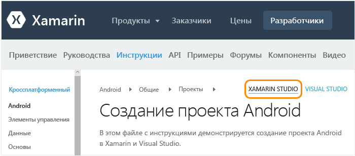
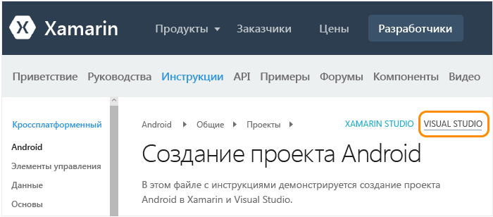

# Программа установки, установка и проверки для пользователей Mac

Эта статья предназначена для разработчиков, которые работают в основном на Mac и которые будут при необходимости использовать Visual Studio на виртуальной машине Windows на компьютере Mac. Если вы работаете в основном на компьютере с Windows и вам нужно настроить дополнительный компьютер Mac, чтобы разрабатывать приложения для iOS, см. основную статью [Настройка и установка](../cross-platform/setup-and-install.md) .

Для работы с Xamarin на Mac потребуется следующее.

-   Компьютер Mac под управлением сmacOS Sierra 10.12 или выше, на котором установлены Xcode и Xamarin.

-   одна из следующих конфигураций:

    -   **Запуск Xamarin Studio непосредственно на компьютере Mac.** Xamarin Studio — окружение разработки Xamarin, которое поддерживает создание приложений для Android, iOS и Windows с помощью C#.  Краткий обзор Xamarin Studio см. на [сайте с основной информацией о Xamarin Studio](https://xamarin.com/studio) (xamarin.com).

    -   **Parallels или VMWare уже настроен на компьютере Mac.** Запустите Windows с Visual Studio 2017 и Xamarin внутри Parallels или VMWare.  В такой конфигурации Xamarin устанавливается вместе с Visual Studio как расширение, которое позволяет использовать Visual Studio в качестве окружения разработки для создания приложений Android, iOS и Windows с помощью C#.  Обратите внимание, что можно получить бесплатную 3-месячную подписку на Parallels в рамках программы Visual Studio Developer Essentials. См. публикацию [Microsoft Visual Studio Dev Essentials будет включать доступ к Parallels Desktop Pro и Parallels Access](http://blog.parallels.com/blog/2015/11/18/visual-studio-dev-essentials/) (блог Parallels).

В этой статье содержатся инструкции, связанные с данными требованиями.  Во время установки вы можете получить прочитать статью [Подробности о разработке мобильных приложений с использованием Xamarin](../cross-platform/learn-about-mobile-development-with-xamarin.md), чтобы изучить и посмотреть необходимые материалы общего характера.

##   Настройка Mac (Apple ID, Xcode и Xamarin)

1.  Создайте бесплатный идентификатор Apple ID в разделе [Мой идентификатор Apple ID](https://appleid.apple.com/), если у вас его нет. Это необходимо для установки приложения Xcode и входа в него.

2.  Загрузите и установите Xcode с сайта [https://developer.apple.com/xcode/](https://developer.apple.com/xcode/).

3.  Скачайте и установите Xamarin, следуя указаниям в статье [Установка и настройка Xamarin.iOS](http://developer.xamarin.com/guides/ios/getting_started/installation/mac/) (xamarin.com).

4.  После завершения установки Xamarin на компьютерах Mac и Windows следуйте инструкциям в статье [Подключение к Mac с помощью XMA](http://developer.xamarin.com/guides/ios/getting_started/installation/windows/#Connecting_to_the_Mac_Using_XMA) (xamarin.com), чтобы обеспечить возможность работы с iOS и Mac из Visual Studio на компьютере с ОС Windows.

##   Программа установки Windows в Parallels (Visual Studio и Xamarin)

1.  С помощью рабочего стола Windows, который настроен в Parallels или VMWare, [скачайте и запустите установщик для любого выпуска Visual Studio 2017](https://visualstudio.microsoft.com/downloads/?utm_medium=microsoft&utm_source=docs.microsoft.com&utm_campaign=button+cta&utm_content=download+vs2017) (Community, Professional или Enterprise). Visual Studio 2017 Community — это бесплатный выпуск; выпуски Professional и Enterprise можно бесплатно использовать для ознакомления в течение 30 дней.

2.  В программе установки щелкните значок **Выбор дополнительных вариантов** (три полоски), расположенный _рядом с_ кнопкой **Запуск**, затем выберите **Изменить**.

     

3.  Установите следующие флажки.

    1.  **Мобильные приложения и игры > Разработка мобильных приложений на платформе .NET**. При этом также будут автоматически выбраны различные инструменты Android в разделе "Общие средства и пакеты средств разработки". Этот параметр также позволяет обновить любую существующую установку Xamarin.

         

    2. **Windows > Разработка с помощью универсальной платформы Windows"** (необязательно). Здесь вы можете выбрать образы эмуляторов, на скачивание которых потребуется дополнительное время. Также вы можете запустить установщик Visual Studio в любое время позже, чтобы добавить их.

4.  Нажмите кнопку **Изменить** и дождитесь завершения процесса. Для завершения может потребоваться некоторое время, в течение которого можно продолжить изучение инструкций по настройке Mac и ознакомиться со статьей [Подробности о разработке мобильных приложений с использованием Xamarin](../cross-platform/learn-about-mobile-development-with-xamarin.md).

5.  После завершения установки запустите Visual Studio и выполните вход с помощью учетной записи Майкрософт при появлении соответствующего запроса (это та же учетная запись, что используется и в Windows).

6.  После завершения установки Xamarin на компьютерах Mac и Windows следуйте инструкциям в статье [Подключение к Mac с помощью XMA](http://developer.xamarin.com/guides/ios/getting_started/installation/windows/#Connecting_to_the_Mac_Using_XMA) (xamarin.com), чтобы обеспечить возможность работы с iOS из Visual Studio.

##   Проверка окружения

После завершения работы установщиков потратьте несколько минут на проверку готовности системы к разработке приложений в Xamarin.

### Xamarin Studio

Во-первых, убедитесь, что при переходе по указанным ссылкам у вас выбран **Xamarin Studio** в правом верхнем углу, чтобы увидеть правильную версию документации по Xamarin:

**Android**

1.  Проверьте, правильно ли создается проект Android, следуя инструкциям в статье [Создание проекта Android](http://developer.xamarin.com/recipes/android/general/projects/create_an_android_project/) (xamarin.com).

2.  Проверьте отладку в эмуляторе Android, используя инструкции из статьи [Android Player > Документация по интеграции с Xamarin Studio](https://developer.xamarin.com/guides/android/getting_started/installation/android-player/#Integration_with_Xamarin_Studio) (на сайте xamarin.com).

**iOS**

1.  Проверьте, правильно ли создается проект iOS, следуя инструкциям в статье [Создание проекта iOS](http://developer.xamarin.com/recipes/ios/general/projects/create_an_ios_project/) (xamarin.com).

2.  Проверьте отладку в симуляторе iOS с помощью статьи [Документация по отладке в симуляторе](https://developer.xamarin.com/guides/ios/deployment,_testing,_and_metrics/debugging_in_xamarin_ios/#Debugging_on_the_Simulator) (xamarin.com).

### Visual Studio

Во-первых, убедитесь, что при переходе по указанным ссылкам у вас выбран **Visual Studio** в правом верхнем углу, чтобы увидеть правильную версию документации по Xamarin:

**Android**

1.  Проверьте, правильно ли создается проект Android, следуя инструкциям в статье [Создание проекта Android](http://developer.xamarin.com/recipes/android/general/projects/create_an_android_project/) (xamarin.com).

2.  Проверьте конструктор Android: в проекте Android в обозревателе решений откройте файл **"Ресурсы" > "Макет" > "Main.axml"**.

    -   Если появляется ошибка "Слишком старый установленный пакет SDK Android", нажмите кнопку **Open Android SDK** (Открыть пакет SDK для Android) в том сообщении и выберите новейшую версию пакета SDK. Обратите внимание, что необходимо использовать Visual Studio от имени администратора, чтобы обновить пакет SDK.

3.  Проверьте возможность подключения из Visual Studio к эмулятору, установленному на вашем Mac.  В результате вы должны увидеть проигрыватель Xamarin Player в списке эмуляторов, которые доступны в Visual Studio для отладки.  Чтобы сделать это, следуйте инструкциям в статье [Подключение Visual Studio к Xamarin Android Player](http://developer.xamarin.com/guides/android/deployment,_testing,_and_metrics/android-player-with-visual-studio-in-vm/) (xamarin.com).

**iOS**

1.  Убедитесь в том, что компьютер Mac доступен в сети и связан с Visual Studio, как описано в статье [Подключение к Mac](https://developer.xamarin.com/guides/ios/getting_started/installation/windows/#Connecting_to_the_Mac) (xamarin.com).

2.  Проверьте, правильно ли создается проект iOS, следуя инструкциям в статье [Создание проекта iOS](http://developer.xamarin.com/recipes/ios/general/projects/create_an_ios_project/) (xamarin.com).

3.  Проверьте конструктор раскадровки: в проекте iOS в обозревателе решений откройте файл **MainStoryboard.storyboard** . Здесь Visual Studio размещает конструктор, который выполняется удаленно на компьютере Mac.

4.  Проверьте сборку и отладку.

    1.  В обозревателе решений щелкните правой кнопкой мыши проект iOS и выберите команду **Назначить запускаемым проектом**.

    2.  Выберите целевой объект **iPhoneSimulator** из раскрывающегося списка сборки Visual Studio, как показано ниже. Если симуляторов в списке нет, запустите Xcode на компьютере Mac, выберите **Xcode -> Preferences** (Xcode -> Параметры) и нажмите кнопку **Download** (Cкачать). В разделе **Components** (Компоненты) вы должны увидеть доступные для скачивания версии симулятора. Дополнительные инструкции по отладке можно найти на странице Xamarin [Отладка](https://developer.xamarin.com/guides/ios/deployment,_testing,_and_metrics/debugging_in_xamarin_ios/#Debugging_on_the_Simulator) (xamarin.com).

         

    3.  Выберите целевой объект iPhone в раскрывающемся списке отладки Visual Studio, как показано ниже, и запустите отладчик, нажав клавишу F5. Это откроет симулятор на Mac, где можно будет взаимодействовать с приложением во время отладки из Visual Studio.

         