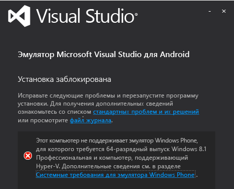
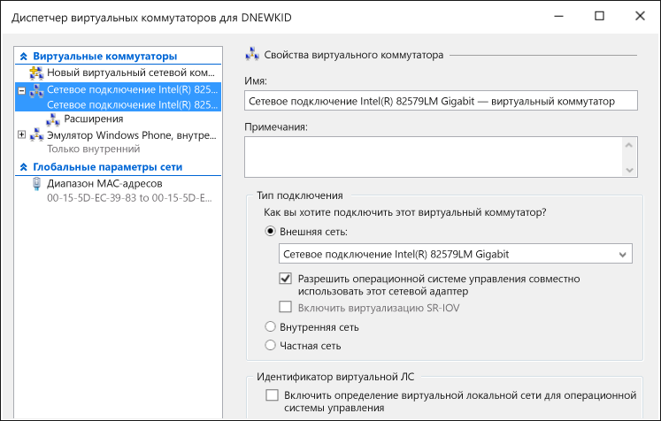

# Устранение неполадок с эмулятором Android для Visual Studio
В этом разделе содержатся сведения об устранении неполадок, которые могут возникать при использовании эмулятора Visual Studio для Android.  
  
> [!WARNING]
>  Когда эмулятор установлен, программа установки проверяет наличие необходимых компонентов для запуска программного обеспечения. Если необходимые компоненты не установлены, она отображает предупреждения, но он не требует их установки.  
  
 В этом разделе содержатся следующие подразделы.  
  
-   [Перед началом работы](#BeforeYouStart)  
  
-   [Не удается запустить эмулятор](#NoInstall)  
  
-   [Не удается подключиться к сетевым пунктам назначения в домене или в корпоративной сети](#DomainNetwork)  
  
-   [Не удается подключиться к сетевым пунктам назначения, если параметры сети необходимо настраивать вручную](#ManualNetworkConfig)  
  
-   [Эмулятор запускается медленно, не запускается из-за истечения времени ожидания, или развертывание приложения завершается с ошибкой](#SlowStart)  
  
-   [Не удается запустить эмулятор](#NoStart2)  
  
-   [Emulator fails to start (first use)](#NoStart)  
  
-   [Компьютер не загружается после установки эмулятора](#NoBoot)  
  
-   [Visual Studio зависает при попытке развернуть приложение в эмуляторе, или эмулятор не отображается как целевой объект отладки в других IDE](#ADB)  
  
-   [Эмулятор зависает, так как ему не удалось настроить UDP-порт](#XamarinPlayer)  
  
-   [Не удается подключить отладчик к проекту Xamarin](#Skylake)  
  
-   [Эмулятор не может запустить приложение, которое использует Сервисы Google Play](#GooglePlay)  
  
-   [Перетаскивание файла, APK или ZIP-файла с поддержкой флэш-памяти не работает](#DragAndDrop)  
  
-   [Неверное разрешение снимка экрана](#Resolution)  
  
-   [Эмулятор не может преобразовать контент OpenGL для просмотра](#OpenGL)  
  
-   [Эмулятор не реагирует на мультисенсорные жесты](#Multitouch)  
  
-   [Ресурсы поддержки](#Support)  
  
##   Перед началом работы  
 Прежде чем приступить к устранению проблем, может оказаться полезным ознакомиться со следующими разделами:  
  
-   [Требования к системе для эмулятора Visual Studio для Android](../cross-platform/system-requirements-for-the-visual-studio-emulator-for-android.md)  
  
##   Не удается запустить эмулятор  
 Если не установлен Hyper-V, появится следующее сообщение при попытке установить эмулятор. Необходимо иметь компьютер, поддерживающий Hyper-v, который должен быть включен.  
  
   
  
> [!NOTE]
>  Это сообщение относится к эмулятору Visual Studio для Android и к эмулятору Windows Phone. Windows 8.1 и Windows 10 поддерживают эмулятор.  
  
 Если отображается данное сообщение, проверьте [требования к системе для эмулятора Visual Studio для Android](../cross-platform/system-requirements-for-the-visual-studio-emulator-for-android.md), чтобы узнать, можно ли запустить эмулятор.  
  
##   Не удается подключиться к сетевым пунктам назначения в домене или в корпоративной сети  
 Эмулятор Visual Studio для Android отображается в сети как отдельное устройство с собственным IP-адресом. Он не присоединен к домену Windows и не использует учетные данные домена или рабочей группы совместно с главным компьютером.  
  
 Если для сети требуется проверка подлинности домена или рабочей группы для базовой сети и подключения к Интернету, попросите ИТ-администратора сделать исключение. Такое исключение позволяет использовать компьютер разработчика в качестве граничного компьютера и принимать на нем подключения от сетевых устройств, не присоединенных к домену, например, от эмулятора.  
  
 Эмулятор Visual Studio для Android также использует свой собственный набор MAC-адресов. Если из эмулятора нет доступа к сети или ресурсам в Интернете, обратитесь к ИТ-администратору, чтобы авторизовать MAC-адреса эмулятора сети.  
  
#### Просмотр MAC-адресов эмулятора  
  
1.  Запустите эмулятор.  
  
2.  На панели инструментов эмулятора нажмите кнопку шеврона (>>), чтобы открыть окно «Дополнительные средства».  
  
3.  В этом окне перейдите на вкладку «Сеть».  
  
4.  На странице «Сеть» найдите физические адреса.  
  
##   Не удается подключиться к сетевым пунктам назначения, если параметры сети необходимо настраивать вручную  
 Чтобы подключаться к сетевым пунктам назначения из эмулятора, сеть должна отвечать следующим требованиям:  
  
-   DHCP. Эмулятору требуется DHCP, так как он настраивается сам как отдельное устройство в сети с собственным IP-адресом.  
  
-   Автоматически настраиваемые параметры DNS и шлюза. Вручную настраивать параметры DNS и шлюза для эмулятора невозможно.  
  
 Если для сети требуется настроить параметры вручную, попросите своего ИТ-администратора уточнить способ включения подключения к сети для эмулятора.  
  
##   Эмулятор запускается медленно, не запускается из-за истечения времени ожидания, или развертывание приложения завершается с ошибкой  
 При определенных условиях запуск эмулятора занимает несколько минут, либо при его запуске происходит сбой из-за истечения времени ожидания. Если запустить эмулятор не удается, появляется следующее сообщение: `App deployment failed. Please try again`. Эта ошибка может происходить по следующим причинам.  
  
-   Запуск эмулятора Visual Studio для Android с загрузочного виртуального жесткого диска. Такая конфигурация не поддерживается.  
  
-   Неисправный жесткий диск. Рекомендуется запустить программу chkdsk.  
  
-   Жесткий диск необходимо дефрагментировать. Рекомендуется выполнить дефрагментацию диска.  
  
-   Жесткий диск почти полностью заполнен. Проверьте объем свободного места на диске.  
  
-   Не хватает памяти из-за других работающих приложений. Сократите количество приложений, которые потребляют память, или увеличьте объем памяти.  
  
-   В целом, любой фактор, который приводит к снижению производительности системы. Начните устранение неполадок с компонента, имеющего наименьший показатель в индексе производительности Windows, который можно найти на странице «Счетчики и средства производительности» на панели управления.  
  
##   Не удается запустить эмулятор  
 Если эмулятор ранее работал, но теперь не работает, выполните следующие действия. Если эмулятор используется впервые, см. раздел [Emulator fails to start (first use)](#NoStart) перед выполнением следующих действий.  
  
-   Удалите все прочие экземпляры Hyper-V эмулятора.  
  
    1.  Закройте Visual Studio.  
  
    2.  Откройте диспетчер и остановите все экземпляры Hyper-V эмулятора (виртуальные машины), которые уже работают и, возможно, находятся в поврежденном состоянии.  
  
    3.  В диспетчере Hyper-V удалите все другие виртуальные машины эмулятора.  
  
    4.  Перезагрузите компьютер.  
  
-   Убедитесь, что у вас есть системная память емкостью не менее 4 ГБ, и что она не используется другими ресурсоемкими приложениями и процессами (например, попробуйте закрыть окна браузера).  
  
-   В диспетчере Hyper-V откройте диспетчер виртуальных коммутаторов и проверьте наличие двух сетевых коммутаторов. Убедитесь, один из них является внутренним, а второй — внешним.  
  
       
  
     Если настройка неверна и используется Windows 10, можно попробовать [переустановить сетевые устройства с помощью команды netcfg-d](http://windows.microsoft.com/en-us/windows-10/fix-network-connection-issues) (раздел 6).  
  
-   Если эти шаги не решат проблему, см. раздел [Emulator fails to start (first use)](#NoStart) для получения сведений о программном обеспечении сторонних производителей, которое может мешать работе эмулятора.  
  
##   Emulator fails to start (first use)  
 Если не удается запустить эмулятор, выполните следующие задачи, чтобы определить проблему и устранить ее.  
  
-   Убедитесь, что соблюдены минимальные требования к оборудованию и применяются корректные параметры BIOS.  
  
     Для эмулятора и Windows 8 Hyper-V требуется 64-разрядный процессор с преобразованием адресов второго уровня (SLAT). Для Intel вам потребуется, в частности, процессор Core i3, i5 или i7 (или один из многих вариантов Xeon). Список микросхем AMD см. [здесь](http://support.amd.com/en-us).  
  
    1.  Убедитесь, что ваш компьютер удовлетворяет [требованиям к системе](../cross-platform/system-requirements-for-the-visual-studio-emulator-for-android.md).  
  
    2.  Убедитесь, что [средство SLAT](https://slatstatuscheck.codeplex.com/) сообщает, что компьютер поддерживает SLAT.  
  
    3.  В области параметров BIOS компьютера убедитесь, что вся технология виртуализации включена. Производители оборудования могут использовать разное описание BIOS. Как правило, необходимо включить функции, связанные со следующими технологиями:  
  
        -   SLAT (преобразование адресов второго уровня)  
  
        -   EPT (таблицы Extended Page Tables) (Intel)  
  
        -   NPT (таблицы Nested Page Tables) (AMD)  
  
        -   RVI (Rapid Virtualization Indexing) (AMD)  
  
        -   VMX (сокращение компании Intel, указывающее на аппаратную поддержку виртуализации)  
  
        -   SVM (сокращение компании AMD, указывающее на аппаратную поддержку виртуализации)  
  
        -   XD (Execute Disable) (Intel); данный параметр необходимо включить  
  
        -   NX (No Execute)(AMD); данный параметр необходимо включить  
  
    4.  Если в BIOS имеются следующие параметры, отключите их.  
  
        -   Отключить Intel VT-d  
  
        -   Отключить Trusted Execution  
  
         Дополнительные сведения см. в статье: Technet: Hyper-V: How to Fix BIOS Errors Enabling Hyper-V (Как исправлять ошибки BIOS с помощью Hyper-V)  
  
    5.  Убедитесь, что у вас есть системная память емкостью не менее 4 ГБ, и что она не используется другими ресурсоемкими приложениями и процессами.  
  
    6.  Убедитесь, что на вашем компьютере установлена ОС Windows 8 Профессиональная или более высокая версия (Windows Server 2008 не поддерживается). Windows Server 2012 поддерживается, но необходимо включить возможности рабочего стола.  
  
     Чтобы определить наличие ошибок гипервизора, воспользуйтесь средством просмотра событий. Для этого откройте средство просмотра событий (нажмите клавиши **ПУСК**+**R**, а затем введите `eventvwr`) и выберите **Журналы Windows**, **Система**. Затем выполните фильтрацию журнала по источнику события. Для этого для источника установите значение **Hyper-V-Hypervisor**. Проверьте наличие ошибок, чтобы попытаться установить основную причину.  
  
     Если ваш процессор удовлетворяет минимальным требованиям, но гипервизор по-прежнему не работает, выясните, имеется ли обновление BIOS для вашего компьютера. Если такое обновление существует, и вы решили выполнить процедуру обновления, обязательно соблюдайте все меры предосторожности, предписанные производителем для обновления BIOS (например, необходимо исключить перебои электропитания в процессе обновления встроенного ПО BIOS, так как это может привести к повреждению BIOS).  
  
-   Убедитесь, что у вас есть системная память емкостью не менее 4 ГБ, и что она не используется другими ресурсоемкими приложениями и процессами.  
  
-   Удалите или отключите драйверы или программное обеспечение сторонних производителей, которое может мешать работе виртуальной сети.  
  
     Применительно к ряду продуктов сторонних производителей, установленных в ОС Windows 8, существуют некоторые известные проблемы, например, с сетевыми драйверами и протоколами, которые не полностью совместимы с сетевым стеком Hyper-V.  
  
     Как правило, именно разработчики этих продуктов должны обновить свое программное обеспечение, чтобы обеспечить совместимость с Windows 8 и Hyper-V.  
  
     Обновление для обеспечения совместимости с Windows 8 может потребоваться для следующих продуктов: VirtualBox, Virtual PC 7, VMWare, некоторых клиентов VPN, программных брандмауэров, некоторых версий клиентов Cisco VPN и других систем виртуализации. Поддерживайте связь с разработчиками нестабильно работающего программного обеспечения виртуализации. Убеждайте их обновлять программное обеспечение, чтобы оно было полностью совместимым с Windows 8 и Hyper-V.  
  
     В качестве *решения* можно отключить все драйверы и приложения сторонних производителей, которые могут мешать работе виртуальной сети, используемой эмулятором для взаимодействия с Visual Studio. К таким приложениям могут относиться:  
  
    -   Антивирусные приложения (которые взаимодействуют с сетевым стеком)  
  
    -   Инструменты мониторинга сети  
  
    -   Инструменты ведения сетевых журналов  
  
    -   Другое программное обеспечение мониторинга системы  
  
     Данную проблему можно попытаться решить по-другому, не прибегая к удалению конкретного продукта (и не предлагая разработчику выпустить обновленную версию), если выполнить следующие действия.  
  
    1.  Запустите диспетчер сетевых подключений (на начальном экране введите `View Network Connections` и выберите этот параметр, чтобы просмотреть сетевые подключения).  
  
    2.  Для адаптера vEthernet (Внутренний порт Ethernet —  эмулятор Windows Phone, внутренний коммутатор) выберите **Свойства** в контекстном меню.  
  
           
  
         Здесь показаны свойства адаптера.  
  
           
  
    3.  Для этого адаптера в списке **Это подключение использует следующие компоненты** необходимо выбрать только следующие элементы:  
  
        -   Клиент для сетей Microsoft  
  
        -   Планировщик пакетов QoS  
  
        -   Служба доступа к файлам и принтерам сетей Microsoft  
  
        -   Драйвер протокола LLDP (Майкрософт)  
  
        -   Драйвер в/в обнаружения топологии канального уровня  
  
        -   Отвечающее устройство обнаружения топологии канального уровня  
  
        -   Протокол Интернета версии 6 (TCP/IPv6)  
  
        -   Протокол Интернета версии 4 (TCP/IPv4)  
  
    4.  Снимите флажки у всех других элементов.  
  
     Недостаток данного метода заключается в том, что указанную выше процедуру нужно будет повторять каждый раз, когда новый продукт стороннего производителя установит неподдерживаемые драйверы, или каждый раз, когда будет установлен эмулятор.  
  
     После удаления продуктов сторонних производителей может потребоваться восстановление внутреннего коммутатора эмулятора Windows Phone. Для этого следует выполнить следующие действия:  
  
    -   Откройте Hyper-V и перейдите в диспетчер виртуальных коммутаторов. Создайте виртуальный коммутатор с именем «Внутренний коммутатор эмулятора Windows Phone» и для типа соединения установите значение **Внутренняя сеть**.  
  
           
  
     Теперь запустите эмулятор. Он должен работать.  
  
##   Компьютер не загружается после установки эмулятора  
 Эта проблема может возникнуть при следующих условиях:  
  
-   На компьютере установлена системная плата Gigabyte.  
  
-   На этой плате включен USB3.  
  
 Чтобы решить эту проблему, отключите USB3 в настройках BIOS для системной платы и перезагрузите компьютер. Затем убедитесь, что компания Gigabyte выпустила обновление BIOS для своей системной платы.  
  
 Дополнительные сведения см. в следующей статье базы знаний: [Boot failure after installation of Hyper-V role on Gigabyte systems (Сбой загрузки после установки роли Hyper-V в системах Gigabyte)](https://support.microsoft.com/en-us/kb/2693144).  
  
##   Visual Studio зависает при попытке развернуть приложение в эмуляторе, или эмулятор не отображается как целевой объект отладки в других IDE  
 Если эмулятор работает, но не подключен к ADB (мост отладки Android) или не виден в средствах Android, которые используют ADB (например, Android Studio или Eclipse), возможно, вам потребуется изменить место поиска ADB эмулятором. Эмулятор использует раздел реестра для определения базового расположения пакета SDK для Android и выполняет поиск файла \platform-tools\adb.exe в этом каталоге. Чтобы изменить путь к пакету SDK для Android, используемому эмулятором, выполните следующие действия:  
  
-   Откройте редактор реестра: выберите **Запуск** в контекстном меню кнопки Пуск, введите `regedit` в диалоговом окне и нажмите кнопку **ОК**.  
  
-   Перейдите в раздел *HKEY_LOCAL_MACHINE\SOFTWARE\Wow6432Node\Android SDK Tools* в дереве папок слева.  
  
-   Измените значение переменной реестра **Путь** (оно должно соответствовать пути к пакету SDK для Android).  
  
 Перезапустите эмулятор. Теперь эмулятор должен быть подключен к ADB и связанным средствам Android.  
  
##   Эмулятор зависает, так как ему не удалось настроить UDP-порт  
 Эта проблема может возникнуть из-за несовместимости с Xamarin Player. Признаком возникновения такой неполадки является зависание эмулятора или появление сообщения об ошибке "Не удается подключиться к операционной системе устройства эмулятора: не удалось настроить порт UDP.  Некоторые функциональные возможности могут быть недоступны". Выполните следующие действия.  
  
1.  Удалите Xamarin Player.  
  
2.  Убедитесь в удалении виртуального окна (Xamarin Player работает на базе виртуального окна).  
  
3.  Перейдите в диспетчер устройств, выберите параметр отображения скрытых устройств и удалите все, кроме физических сетевых карт.  
  
4.  Можно попробовать удалить и повторно установить Hyper-V после удаления любого нефизического сетевого адаптера.  
  
##   Не удается подключить отладчик к проекту Xamarin  
 При запуске Windows 10 на процессорах Intel Skylake приложений Xamarin могут завершаться со сбоем в эмуляторе либо к ним может не подключаться отладчик Visual Studio. Это вызвано проблемой, связанной с Hyper-V и процессорами Skylake. Чтобы избежать этого, выполните указанные ниже действия.  
  
1.  Откройте диспетчер Hyper-V и выберите виртуальную машину для профиля эмулятора, который вы используете.  
  
2.  Выберите **Удаление сохраненного состояния** (внизу справа).  
  
3.  Выберите **Параметры...**  
  
4.  Разверните узел процессора и выберите **Совместимость**.  
  
5.  Включите параметр **Выполнить перенос на физический компьютер с другой версией процессора**.  
  
6.  Перезапустите службу (в разделе **Действия**) и повторите попытку.  
  
##   Эмулятор не может запустить приложение, которое использует Сервисы Google Play  
 Эмулятор не поставляется вместе с библиотеками для служб Google Play. Тем не менее, эмулятор поддерживает установку ZIP-файлов с поддержкой флэш-памяти в режиме перетаскивания.  
  
##   Перетаскивание файла, APK или ZIP-файла с поддержкой флэш-памяти не работает  
 Эмулятор использует файл ADB.exe для упрощения передачи файла при его перетаскивании на экран. При попытке перетащить файл возникает ошибка. Это указывает, что эмулятор, возможно, не подключен к ADB.exe. Чтобы решить, выполните действия в [Visual Studio зависает при попытке развернуть приложение в эмуляторе, или эмулятор не отображается как целевой объект отладки в других IDE](#ADB).  
  
##   Неверное разрешение снимка экрана  
 Если вы делаете снимок экрана с помощью вкладки «Экран» в окне **Дополнительные средства** , но полученное изображение имеет непредвиденный размер, возможно, необходимо изменить уровень масштаба экрана перед нажатием кнопки **Захват**. Эмулятор получает снимки экрана с разрешением экрана, установленным на мониторе главного компьютера.  
  
##   Эмулятор не может преобразовать контент OpenGL для просмотра  
 Эмулятор отображает контент OpenGL с помощью графического процессора главного компьютера и использует проект ANGLE для преобразования этих вызовов в DirectX и из него. Если приложение правильно отображается на устройстве, но неправильно на эмуляторе, то возможная проблема заключается в том, что устройство подавляет некорректный вызов OpenGL (например, с помощью переменных шейдера, которые не совпадают друг с другом).  
  
##   Эмулятор не реагирует на мультисенсорные жесты  
 В некоторых случаях эмулятор может запускаться, но не отвечать на мультисенсорные жесты, выполняемые либо непосредственно на сенсорном экране, либо с помощью мультисенсорного средства на панели инструментов эмулятора. Если это так, нажмите кнопку **Поворот** на панели инструментов эмулятора и попытайтесь снова использовать мультисенсорное средство. Если проблема сохранится, читайте проблему [Эмулятор не может преобразовать контент OpenGL для просмотра](#OpenGL) .  
  
##   Ресурсы поддержки  
 Если главный компьютер отвечает требованиям к системе и возникают проблемы, не описанные в этом руководстве по устранению неполадок:  
  
-   Задать вопрос об использовании StackOverflow с помощью тегов [android-emulator](http://stackoverflow.com/questions/tagged/android-emulator) и visual-studio.  
  
-   сообщите о проблеме с помощью средства отправки одобрения в Visual Studio или в диспетчере эмуляторов.