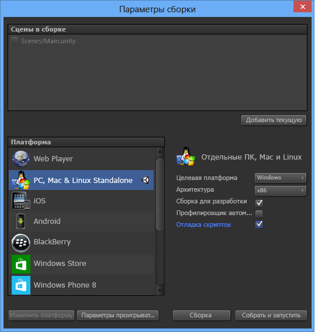

# Применение набора средств Visual Studio для Unity
В этом разделе мы рассмотрим, как использовать возможности интеграции и повышения производительности набора средств Visual Studio для Unity, а также как использовать отладчик Visual Studio для разработки Unity.

## Интеграция и производительность Unity
 Набор средств Visual Studio для Unity интегрируется с редактором Unity, что позволяет повысить производительность вашей работы. Повышение производительности заключается в автоматизации типичных задач создания скриптов и передаче данных из Unity в Visual Studio, поэтому вам не нужно переключаться в редактор Unity для их поиска.

### Доступ к документации по Unity
 Доступ к документации по созданию скриптов Unity можно быстро получать из Visual Studio. Если набор средств Visual Studio для Unity не находит документацию по API в локальном режиме, он попытается найти ее через Интернет.

##### Доступ к документации по Unity

-   В Visual Studio выделите API Unity, с которым хотите ознакомиться (или наведите курсор), а затем нажмите клавиши **CTRL+ALT+M, CTRL+H**.

### Мастер создания скриптов Unity MonoBehavior
 В Unity большинство скриптов реализуются путем наследования от класса MonoBehavior и переопределения некоторых его методов. Мастер MonoBehavior можно использовать для быстрого создания пустых определений методов MonoBehavior, для которых нужно создать перегрузку. С помощью этого мастера можно выбрать из списка доступных методов один метод или несколько методов, для которых нужно создать перегрузку, указать, куда они должны быть вставлены в коде, и решить, следует ли включить комментарии о том, как они используются.

 

##### Создание определений пустых методов MonoBehavior с помощью мастера MonoBehavior

1.  В Visual Studio поместите курсор туда, куда вы хотите вставить методы, а затем нажмите клавиши **CTRL+SHIFT+M** для запуска мастера MonoBehavior. Если же вы хотите вставить новые методы после метода, который уже реализован, это можно будет указать позже. Просто нажмите клавиши **CTRL+SHIFT+M**.

2.  Выберите методы, для которых требуется создать перегрузку. В окне **Создание методов скриптов** в разделе **Выбор создаваемых методов** установите флажок рядом с именем каждого метода, для которого нужно создать перегрузку.

3.  Убедитесь, что версия платформы, отображаемая в раскрывающемся меню **Версия платформы**, совпадает с версией, которую вы используете. Если версии не соответствуют друг другу, выберите в раскрывающемся меню версию, которую вы хотите использовать.

4.  Выберите место для вставки методов. По умолчанию методы вставляются там, где находится курсор. Если их требуется вставить в другом месте, это можно будет сделать после любого метода, который уже реализован в вашем классе. Чтобы выбрать одно из расположений, измените значение в раскрывающемся меню **Точка вставки**.

5.  Если вы хотите, чтобы мастер создавал комментарии для выбранных методов, установите флажок **Создать комментарии к методу**. Эти комментарии позволяют лучше понять, когда вызывается метод и каковы его общие функции.

6.  Нажмите кнопку **ОК**, чтобы выйти из мастера и вставить методы в код.

 Мастер MonoBehavior особенно удобен в ходе ознакомления с Unity API или при необходимости создать перегрузку для метода, с которым вы не знакомы. В дальнейшем во время работы с Unity API вы, возможно, предпочтете использовать мастер Quick MonoBehavior для быстрого создания методов, с которыми вы уже знакомы.

#### Мастер создания скриптов Quick MonoBehavior
 Если вы уже знакомы с Unity API, перегруженные методы можно реализовать еще быстрее с помощью мастера Quick MonoBehavior. Этот мастер позволяет указать только один метод, который вставляется без комментариев на позицию курсора.

 

###### Создание определения пустого метода MonoBehavior с помощью мастера Quick MonoBehavior

1.  В Visual Studio поместите курсор туда, куда вы хотите вставить метод, а затем нажмите клавиши **CTRL+SHIFT+Q** для запуска мастера Quick MonoBehavior. В отличие от мастера MonoBehavior, в мастере Quick MonoBehavior курсор необходимо размещать преднамеренно, так как новый метод всегда вставляется на этой позиции.

2.  Убедитесь, что версия платформы, отображаемая в правом верхнем углу окна **Создание метода скрипта**, совпадает с версией, которую вы используете. Если версии не соответствуют друг другу, выберите в раскрывающемся меню версию, которую вы хотите использовать.

3.  Найдите метод, для которого требуется создать перегрузку. В окне "Создать метод скрипта" начните вводить в текстовом поле имя метода. Появится список методов, имена которых совпадают с вводимым именем.

4.  Выберите метод, для которого требуется создать перегрузку. Если нужный метод отображается в списке, выберите его с помощью мыши или клавиш со стрелками, а затем нажмите клавишу **ВВОД**. Если это единственный метод в списке, достаточно просто нажать клавишу **ВВОД**. Метод будет вставлен в ваш код.

### Обозреватель проектов Unity
 Для перехода в Visual Studio к какому-либо проекту Unity можно использовать обозреватель проектов Unity.

 

##### Работа с обозревателем проектов Unity

-   В Visual Studio в главном меню выберите **Представление** и **Обозреватель проектов Unity**. (Или нажмите клавиши **ALT+SHIFT+E**.)

     

 Обозреватель проектов Unity отображает все файлы и каталоги проекта Unity так же, как это делает редактор Unity. Это отличается от способа организации скриптов Unity в обозревателе решений, который содержит только файлы скриптов и отображает их в виде проектов, а решение, создаваемое набором средств Visual Studio для Unity, их организует. Зачастую проще найти скрипт, который требуется изменить, с помощью обозревателя проектов Unity, особенно в крупных проектах. Он также позволяет легко изменять другие файлы (например, текстовые файлы конфигурации) в Visual Studio, не добавляя их в какой-либо из проектов решения Visual Studio.

### Список ошибок Unity
 Не выходя из среды Visual Studio, можно просматривать сообщения консоли Unity, когда среда подключена к экземпляру Unity. К таким сообщениям относятся ошибки и предупреждения из Unity. Сообщения отображаются в Visual Studio в окне **Список ошибок**: сообщения об ошибках из Unity отображаются на вкладке **Ошибки**, предупреждения — на вкладке **Предупреждения**, а другие сообщения (например, сообщения, отправленные с помощью API Unity Debug.Log) — на вкладке **Сообщения**.

 Чтобы увидеть сообщения, проект Unity должен быть настроен, как описано в разделе [Отладка проекта в проигрывателе Unity](#debugging-your-project-in-a-unity-player). Это необходимо, чтобы включить поддержку для отладки скриптов и импортировать пакет набора средств Visual Studio для Unity, который соответствует вашей версии Visual Studio. Среда Visual Studio должна быть настроена, как описано в разделе [Подключение Visual Studio к Unity](#connecting-visual-studio-to-unity).

 Если вы не хотите, чтобы сообщения об ошибках, предупреждения и другие сообщения из Unity отображались в Visual Studio в окне **Список ошибок**, их можно отключить в меню "Конфигурация".

### Сочетания клавиш
 Для быстрого доступа средств Unity к функциям Visual Studio можно использовать соответствующие сочетания клавиш. Ниже приведен список таких сочетаний клавиш.

|Команда|Сочетание клавиш|Имя контекстной команды|
|-------------|--------------|---------------------------|
|Открыть мастер MonoBehavior|**CTRL+SHIFT+M**|**EditorContextMenus.CodeWindow.ImplementMonoBehaviours**|
|Открыть мастер Quick MonoBehavior|**Ctrl+Shift+Q**|**EditorContextMenus.CodeWindow.QuickMonoBehaviours**|
|Открыть обозреватель проектов Unity|**ALT+SHIFT+E**|**View.UnityProjectExplorer**|
|Доступ к документации по Unity|**CTRL+ALT+M, CTRL+H**|**Help.UnityAPIReference**|
|Присоединиться к отладчику Unity (проигрыватель или редактор)|***Значение по умолчанию отсутствует***|**Debug.AttachUnityDebugger**|

 Если вас не устраивает сочетание клавиш по умолчанию, его можно изменить. Как это сделать, см. в статье [Определение и настройка сочетаний клавиш в Visual Studio](../ide/identifying-and-customizing-keyboard-shortcuts-in-visual-studio.md).

## Отладка Unity
 Набор средств Visual Studio для Unity позволяет отлаживать скрипты редакторов и игр для проекта Unity с помощью мощного отладчика Visual Studio.

###   Подключение Visual Studio к Unity
 Набор средств Visual Studio для Unity взаимодействует с Unity по UDP-соединению. Это означает, что к экземпляру Unity, работающему локально или где-то в сети, можно подключаться одинаковым образом. Для подключения к любому из экземпляров Unity, которые есть в вашей сети, используйте диалоговое окно **Выбор экземпляра Unity**.

##### Открытие диалогового окна "Выбор экземпляра Unity"

-   В главном меню Visual Studio выберите **Отладка** и **Присоединить отладчик Unity**.

     

-   *Или* щелкните значок подключения, отображаемый в строке состояния в правом нижнем углу Visual Studio.

     

> [!TIP]
>  Если в значке подключения отображается галочка, это означает, что вы уже подключены к экземпляру Unity.

 В диалоговом окне **Выбор экземпляра Unity** отображаются сведения о каждом экземпляре Unity, к которому можно подключиться.

 

 **Проект** Имя проекта Unity, который выполняется в этом экземпляре Unity.

 **Компьютер** Имя компьютера или устройства, на котором выполняется этот экземпляр Unity.

 **Тип** **Редактор**, если этот экземпляр Unity выполняется как часть редактора Unity; **Проигрыватель**, если этот экземпляр Unity является автономным проигрывателем.

 **Порт** Номер порта UDP-сокета, через который данный экземпляр Unity обменивается данными.

> [!IMPORTANT]
>  Так как набор средств Visual Studio для Unity и экземпляр Unity взаимодействуют через сетевой UDP-сокет, ваш брандмауэр может об этом запросить. В данном случае соединение нужно авторизовать, чтобы VSTU и Unity могли обмениваться данными.

### Устранение неполадок соединения между Unity и Visual Studio

#### Проверка включения присоединения редактора

В меню Unity выберите **Edit > Preferences** (Правка > Настройки) и перейдите на вкладку **External Tools** (Внешние средства). Проверьте, установлен ли флажок **Editor Attaching** (Присоединение редактора). Дополнительные сведения см. в [документации по настройкам Unity](https://docs.unity3d.com/Manual/Preferences.html).

###  Отладка проекта в проигрывателе Unity
 Набор средств Visual Studio для Unity можно подключить непосредственно к приложению Unity, работающему в автономном проигрывателе, когда вы не используете редактор Unity, или для отладки проблем, относящихся к конкретной платформе.

##### Включение отладки скриптов в проигрывателе Unity

-   Убедитесь, что сборку разработки вы создаете с включенным режимом отладки скриптом. В параметрах сборки проекта Unity установите флажки **Сборка разработки** и **Отладка скриптов**.

 

 Кроме того, для отладки приложения Unity, которое запущено в **веб-проигрывателе Unity**, необходимо настроить использование **канала выпусков разработки**.

##### Настройка канала выпусков разработки в веб-проигрывателе Unity

-   В веб-проигрывателе Unity в контекстном меню выберите **Канал выпусков** и убедитесь, что параметр **Разработка** включен.

    > [!IMPORTANT]
    >  В Unity версии 4.2 и выше пункт **Канал выпусков** доступен в контекстном меню веб-проигрывателя, только если при открытии контекстного меню вы нажимаете клавишу **ALT**. Если веб-проигрыватель запущен в Mac OS X, используйте клавишу **OPTION**.

 Наконец убедитесь, что вы подключены к экземпляру Unity, который требуется отладить. Дополнительные сведения см. в разделе [Подключение Visual Studio к Unity](#connecting-visual-studio-to-unity).

### Отладка библиотеки DLL в проекте Unity
 Многие разработчики Unity создают компоненты кода в виде внешних библиотек DLL, чтобы разрабатываемые ими функции можно было легко совместно использовать с другими проектами. Набор средств Visual Studio для Unity упрощает отладку кода в этих библиотеках DLL без создания проблем для другого кода в проекте Unity.

> [!NOTE]
>  В настоящее время набор средств Visual Studio для Unity поддерживает только управляемые библиотеки DLL. Он не поддерживает отладку библиотек DLL машинного кода, например библиотек, созданных на языке C++.

 Обратите внимание, что описанный здесь сценарий предполагает, что у вас есть исходный код, то есть вы разрабатываете или повторно используете свой собственный код, или у вас есть исходный код для библиотеки стороннего разработчика и вы планируете его развернуть в проекте Unity как библиотеку DLL. Данный сценарий не описывает отладку библиотеки DLL, для которой у вас нет исходного кода.

##### Отладка проекта с управляемой библиотекой DLL, используемой в проекте Unity

1.  Добавьте существующий проект библиотеки DLL в решение Visual Studio, которое создается набором средств Visual Studio для Unity. В ряде случаев вы можете создать новый проект с управляемой библиотекой DLL, который будет содержать компоненты кода проекта Unity. В этом сценарии в решение Visual Studio можно добавить новый проект с управляемой библиотекой DLL. Дополнительные сведения о добавлении нового или существующего проекта в решение см. в разделе [Практическое руководство. Добавление проектов в решение](https://msdn.microsoft.com/en-us/library/vstudio/ff460187.aspx).

     

     В любом случае набор средств Visual Studio для Unity сохраняет ссылку на проект, даже если он должен повторно создать файлы проекта и решения, поэтому эти действия нужно будет выполнить только один раз.

2.  Создайте ссылку на нужный профиль платформы Unity в проекте DLL. В Visual Studio в свойствах проекта DLL для свойства **Целевая платформа** укажите версию платформы Unity, которую вы используете. Это библиотека базового класса Unity, соответствующая уровню совместимости API, на который ориентирован ваш проект, например библиотека базовых классов Unity full, micro или web. Благодаря этому ваша библиотека DLL не будет вызывать методы платформы, существующие на других платформах или уровнях совместимости, но которые могут отсутствовать в версии платформы Unity, которую вы используете.

     

3.  Скопируйте библиотеку DLL в папку Asset (ресурсы) своего проекта Unity. В Unity ресурсы представляют собой файлы, которые упаковываются и развертываются вместе с вашим приложением Unity, чтобы их можно было загружать во время выполнения. Так как библиотеки DLL связываются во время выполнения, их необходимо развертывать как ресурсы. Для развертывания в виде ресурса редактору Unity требуется, чтобы библиотеки DLL были помещены в папку Assets вашего проекта Unity. Предусмотрены два способа выполнения этой задачи.

    -   Измените параметры сборки проекта DLL, чтобы добавить выполняемую после сборки задачу, которая скопирует выходные файлы DLL и PDB из выходной папки в папку **Активы** проекта Unity.

    -   Измените параметры сборки проекта DLL, чтобы сделать выходной папкой папку **Assets** проекта Unity. Теперь файлы DLL и PDB будут сразу помещаться в папку **Assets**.

     PDB-файлы необходимы для отладки, так как они содержат символы отладки библиотеки DLL и сопоставляют код DLL с формой его исходного кода. Набор средств Visual Studio для Unity будет использовать сведения из файлов DLL и PDB для создания файла DLL.MDB, который имеет формат отладочных символов, применяемый модулем работы со скриптами Unity.

4.  Выполните отладку своего кода. Теперь вы можете отлаживать свой исходный код DLL вместе с исходным кодом проекта Unity и использовать все доступные функции, например точки останова и пошаговое выполнение кода.
