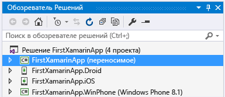
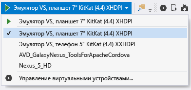
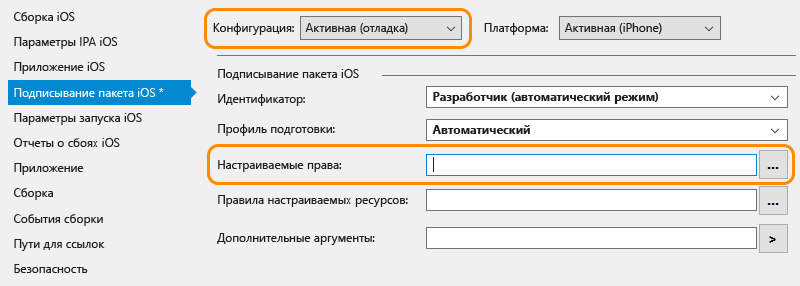

# Проверка окружения Xamarin

После завершения работы установщиков (см. [Setup and install](../cross-platform/setup-and-install.md)) потратьте несколько минут на проверку готовности системы к разработке приложений в Xamarin.

 После завершения проверки установки попробуйте выполнить одно или оба указанных ниже пошаговых руководства:

-   [Основы создания приложений с помощью Xamarin.Forms в Visual Studio](../cross-platform/learn-app-building-basics-with-xamarin-forms-in-visual-studio.md), чтобы научиться создавать приложения с помощью Xamarin.Forms.

-   [Создание приложений с нативным пользовательским интерфейсом с использованием Xamarin в Visual Studio](../cross-platform/build-apps-with-native-ui-using-xamarin-in-visual-studio.md), чтобы научиться использовать нативные пользовательские интерфейсы на каждой платформе, но при этом совместно использовать часть кода в библиотеке .NET Standard.

## Все платформы

В Visual Studio выберите **Сервис > Расширения и обновления** и проверьте, не требуется ли обновление каким-либо компонентам Xamarin.

Затем создайте новое решение Xamarin.Forms в Visual Studio, выбрав **Файл > Новый проект**. В диалоговом окне разверните **Visual C# > Кроссплатформенные**, выберите **Мобильное приложение (Xamarin.Forms)** и нажмите кнопку "ОК". В следующем диалоговом окне выберите **Пустое приложение**. В разделе **Стратегия совместного использования кода** выберите **.NET Standard**. Нажмите кнопку ОК.

В результате этих действий будет создано решение с четырьмя проектами: проект с общей библиотекой .NET Standard 2.0 и проекты приложений для Android, iOS и универсальной платформы Windows (UWP):

## Android

1. Убедитесь, что установлена последняя версия Android SDK Tools, для этого откройте **Сервис > Android > Диспетчер пакетов SDK Android**. Установите последние версии Android SDK Tools, Android SDK Platform Tools и Android SDK Build tools. Устанавливать самый последний уровень API Android нет необходимости. Необходимый уровень API зависит от уровня платформы, для которой вы будете разрабатывать приложения. Обычно при установке платформы Xamarin устанавливается требуемый уровень платформы Android.

2.  Проверка сборки и отладки на устройстве или в эмуляторе:

    -   В обозревателе решений щелкните правой кнопкой мыши проект Android и выберите команду **Назначить запускаемым проектом**.

    -   На панели инструментов появится раскрывающийся список, содержащий доступные устройства и эмуляторы Android.

    На устройствах Android должна быть включена отладка по USB в параметрах разработчика на странице настроек. Затем необходимо подключить устройство к компьютеру с помощью кабеля USB.

    Также отображается список эмуляторов. Выберите устройство или эмулятор Visual Studio:

  

  Дополнительные сведения см. в статье [Введение в эмулятор Visual Studio для Android](http://blogs.msdn.com/b/visualstudioalm/archive/2014/11/12/introducing-visual-studio-s-emulator-for-android.aspx) (блог по Visual Studio ALM). При возникновении проблем с запуском эмулятора см. раздел [Troubleshooting the Visual Studio Emulator for Android](../cross-platform/troubleshooting-the-visual-studio-emulator-for-android.md). Можно также создать новые профили устройств для эмулятора, выбрав **Сервис > Android > Диспетчер эмуляторов Android**.

3. Нажмите клавишу F5, чтобы скомпилировать и развернуть программу на устройстве или эмуляторе Android.

## Windows

1.  В обозревателе решений щелкните правой кнопкой мыши проект приложения для универсальной платформы Windows и выберите команду **Назначить запускаемым проектом**.

2.  В раскрывающемся списке **Платформы решения** выберите **x86** или **x64**. Выберите **Локальный компьютер**.

3.  Нажмите клавишу F5 для развертывания программы на рабочем столе.

## iOS

1.  Убедитесь, что компьютер Mac доступен в сети и связан с Visual Studio, как описано в статье [Подключение к Mac](/xamarin/ios/get-started/installation/windows/connecting-to-mac/).

2.  В обозревателе решений щелкните правой кнопкой мыши проект iOS и выберите команду **Назначить запускаемым проектом**.

3.  Выберите в качестве целевого объекта **iPhoneSimulator** из раскрывающегося списка сборки Visual Studio, как показано ниже, или **iPhone**, если имеется связанное с компьютером Mac устройство.

 

 Если в списке нет симуляторов, запустите Xcode на компьютере Mac, выберите **Xcode -> Preferences** (Xcode -> Параметры) и нажмите кнопку **Download** (Загрузить). В разделе **Components** (Компоненты) вы должны увидеть доступные для скачивания версии симулятора. Дополнительные инструкции по отладке можно найти на странице Xamarin [Отладка iOS](/xamarin/ios/deploy-test/debugging-in-xamarin-ios/?tabs=vsmac#Debugging_on_the_Simulator).

4.  Выберите целевой эмулятор устройства из раскрывающегося списка в Visual Studio:

 

5. Запустите отладчик, нажав клавишу F5. На компьютере Mac откроется симулятор, где можно будет взаимодействовать с приложением во время отладки из Visual Studio. Если у вас есть физический iPhone или iPad, подключенный к Mac, они отобразятся в списке, чтобы вы могли выбрать их. Если не отображается ни одного устройства или симулятора, проверьте подключение к компьютеру Mac. Ознакомьтесь со статьей, на которую дана ссылка на шаге 1 выше или перейдите к **Сервис > iOS > Соединиться с компьютером Mac**

6.  Если возникли проблемы с подключением к Mac, ознакомьтесь со статьей [Устранение неполадок при подключении](/xamarin/ios/get-started/installation/windows/connecting-to-mac/troubleshooting/).

7.  Если отображается ошибка "Нет установленных профилей подготовки, которые соответствуют установленным ключам подписи iOS", попробуйте выполните следующие рекомендации:

  - Убедитесь, что учетная запись Apple ID добавлена в Xcode на компьютере Mac, как описано в статье [Добавление учетной записи для Xcode](https://developer.apple.com/library/content/documentation/IDEs/Conceptual/AppStoreDistributionTutorial/AddingYourAccounttoXcode/AddingYourAccounttoXcode.html#//apple_ref/doc/uid/TP40013839-CH40-SW1) (apple.com).  После добавления учетной записи перезапустите Visual Studio и Xcode.

  - Убедитесь, что в свойствах проекта iOS на вкладке подписывания пакета iOS поле Custom (Настраиваемые) пусто для активной конфигурации отладки.  Примечание. Удалять этот параметр следует, только если отображается указанное выше сообщение об ошибке.

  
