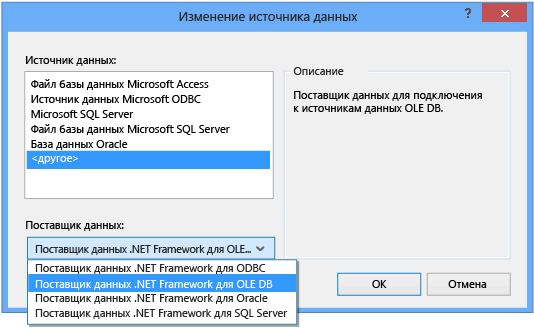
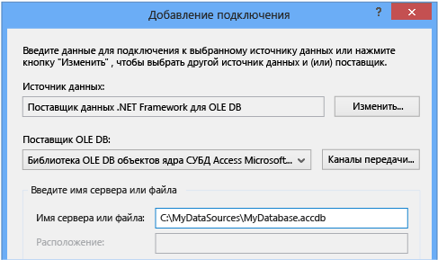
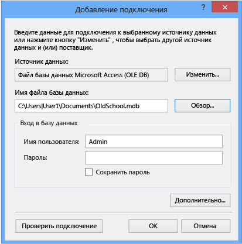

# Пошаговое руководство. Подключение к данным в базе данных Access (Windows Forms)
Можно подключиться к базе данных Access \(к MDF\-файлу или ACCDB\-файлу\) с помощью Visual Studio.  После того как определено подключение, источник данных отображается в окне **Источник данных**.  Здесь можно перетаскивать таблицы и представления на формы.  О том, как система проектов в Visual Studio управляет локальными файлами баз данных, см. в разделе [Практическое руководство. Управление локальными файлами данных в проекте](../data-tools/how-to-manage-local-data-files-in-your-project.md).  
  
## Обязательные компоненты  
 Для работы с этими процедурами требуется проект приложения Windows Forms и база данных Access \(ACCDB\-файл\) или база данных Access 2000—2003 \(MDB\-файл\).  Выполните процедуру, соответствующую типу файла.  
  
## Создание набора данных для ACCDB\-файла  
 Следующая процедура позволяет подключиться к базам данных, созданным с помощью Access 2013, Office 365, Access 2010 или Access 2007.  
  
#### Создание набора данных  
  
1.  Откройте приложение Windows Forms, к которому требуется подключить данные.  
  
2.  В меню **Вид** выберите **Другие окна** \> **Источники данных**.  
  
       
  
3.  В окне **Источники данных** выберите **Добавить новый источник данных**.  
  
       
  
4.  На странице **Выбор типа источника данных** выберите **База данных** и нажмите кнопку **Далее**.  
  
5.  На странице **Выбор модели базы данных** выберите **Набор данных** и нажмите кнопку **Далее**.  
  
6.  На странице **Выбор подключения базы данных** выберите **Новое подключение** для настройки нового подключения к данным.  
  
7.  Задайте параметру **Источник данных** значение **Поставщик данных .NET Framework для OLE DB**.  
  
       
  
    > [!IMPORTANT]
    >  Хотя на первый взгляд подходящим источником данных является **Файл базы данных Microsoft Access \(OLE DB\)**, этот тип источника используется только для MDB\-файлов.  
  
8.  В списке **Поставщик OLE DB** выберите **Поставщик OLE DB для ядра СУБД Microsoft Office 12.0 Access**.  
  
       
  
9. В поле **Имя сервера или файла** укажите путь и имя ACCDB\-файла, к которому требуется подключиться, и нажмите кнопку **ОК**.  
  
    > [!NOTE]
    >  При необходимости укажите имя пользователя и пароль, а затем нажмите **ОК**.  
  
10. На странице **Выбор подключения базы данных** нажмите кнопку **Далее**.  
  
11. На странице **Сохранить строку подключения в файле конфигурации приложения** нажмите кнопку **Далее**.  
  
12. Разверните узел **Таблицы** на странице **Выбор объектов базы данных**.  
  
13. Выберите необходимые таблицы и представления объекта DataSet и нажмите кнопку **Готово**.  
  
     Объект DataSet добавляется в проект, и таблицы и представления отображаются в окне **Источники данных**.  
  
## Создание набора данных для MDB\-файла  
 Набор данных создается при помощи **Мастера настройки источника данных**.  
  
#### Создание набора данных  
  
1.  Откройте приложение Windows Forms, к которому требуется подключить данные.  
  
2.  В меню **Вид** выберите **Другие окна** \> **Источники данных**.  
  
       
  
3.  В окне **Источники данных** выберите **Добавить новый источник данных**.  
  
       
  
4.  На странице **Выбор типа источника данных** выберите **База данных** и нажмите кнопку **Далее**.  
  
5.  На странице **Выбор модели базы данных** выберите **Набор данных** и нажмите кнопку **Далее**.  
  
6.  На странице **Выбор подключения базы данных** выберите **Новое подключение** для настройки нового подключения к данным.  
  
7.  Если параметру **Источник данных** не задано значение **Файл базы данных Microsoft Access \(OLE DB\)**, выберите **Изменить** и в диалоговом окне **Сменить источник данных** выберите **Файл базы данных Microsoft Access**, затем нажмите кнопку **ОК**.  
  
8.  В поле **Имя файла базы данных** укажите путь и имя MDB\-файла, к которому требуется подключиться, и нажмите кнопку **ОК**.  
  
       
  
9. На странице **Выбор подключения базы данных** нажмите кнопку **Далее**.  
  
10. На странице **Сохранить строку подключения в файле конфигурации приложения** нажмите кнопку **Далее**.  
  
11. Разверните узел **Таблицы** на странице **Выбор объектов базы данных**.  
  
12. Выберите необходимые таблицы и представления объекта DataSet и нажмите кнопку **Готово**.  
  
     Объект DataSet добавляется в проект, и таблицы и представления отображаются в окне **Источники данных**.  
  
## Безопасность  
 Хранение конфиденциальных сведений \(например, пароля\) может повлиять на безопасность приложений.  Использование проверки подлинности Windows \(также называемой встроенными средствами безопасности\) — более безопасный способ управления доступом к базе данных.  Дополнительные сведения см. в разделе [Защита сведений о соединении](../Topic/Protecting%20Connection%20Information.md).  
  
## Следующие действия  
 Только что созданный набор данных станет доступным в окне **Источники данных**.  Теперь можно выполнить любую из следующих задач  
  
-   Выберите элементы в окне **Источники данных** и перетащите их на форму \(см. раздел [Привязка элементов управления Windows Forms к данным в Visual Studio](../data-tools/bind-windows-forms-controls-to-data-in-visual-studio.md)\).  
  
-   Откройте источник данных в [Конструкторе набора данных](../data-tools/creating-and-editing-typed-datasets.md) для добавления или изменения объектов, составляющих набор данных.  
  
-   Добавьте логику проверки данных в событие <xref:System.Data.DataTable.ColumnChanging> или <xref:System.Data.DataTable.RowChanging> таблиц набора данных \(см. раздел [Проверка данных в наборах данных](../data-tools/validate-data-in-datasets.md)\).  
  
## См. также  
 [Подключение к данным в Visual Studio](../data-tools/connecting-to-data-in-visual-studio.md)   
 [Подготовка приложения к получению данных](../Topic/Preparing%20Your%20Application%20to%20Receive%20Data.md)   
 [Выборка данных в приложение](../data-tools/fetching-data-into-your-application.md)   
 [Привязка элементов управления к данным в Visual Studio](../data-tools/bind-controls-to-data-in-visual-studio.md)   
 [Редактирование данных в приложении](../data-tools/editing-data-in-your-application.md)   
 [Проверка данных](../Topic/Validating%20Data.md)   
 [Сохранение данных](../data-tools/saving-data.md)   
 [Пошаговые руководства работы с данными](../Topic/Data%20Walkthroughs.md)