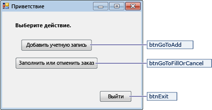
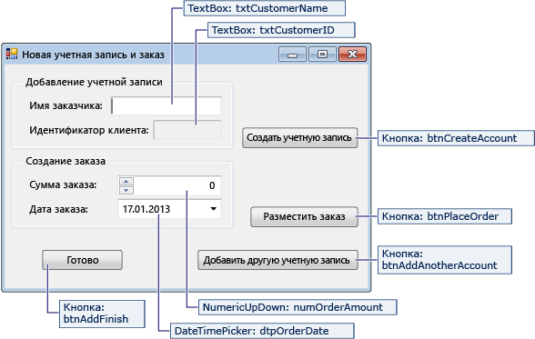
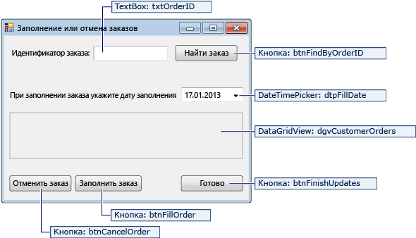

# <a name="create-a-simple-data-application-by-using-adonet"></a>Создание простых данных приложения с помощью ADO.NET
При создании приложения, которое работает в базе данных, необходимо выполнить основные задачи, такие как определение строк подключения, вставка данных и выполнения хранимых процедур. В этом разделе, вы можете узнать, как взаимодействовать с базой данных из простого приложения «форм на основе данных» Windows Forms с помощью Visual C# или Visual Basic и ADO.NET.  Все данные технологии .NET, включая наборы данных, LINQ to SQL и Entity Framework, в конечном счете выполните действия, которые очень похожи на те, приведенными в этой статье.  
  
 В этой статье демонстрируется простой способ получить данные из базы данных в виде очень быстро. Если приложению требуется изменить данные необычный способами и обновления базы данных, следует с использованием платформы Entity Framework и привязка данных к автоматически синхронизировать элементы управления пользовательского интерфейса для изменения в базовых данных.  
  
> [!IMPORTANT]
>  С целью упрощения код не включает обработку исключений в рабочей среде.  
  
 **Содержание раздела**  
  
-   [Настройка образца базы данных](../data-tools/create-a-simple-data-application-by-using-adonet.md#BKMK_setupthesampledatabase)  
  
-   [Создание форм и добавление элементов управления](../data-tools/create-a-simple-data-application-by-using-adonet.md#BKMK_createtheformsandaddcontrols)  
  
-   [Сохранение строки подключения](../data-tools/create-a-simple-data-application-by-using-adonet.md#BKMK_storetheconnectionstring)   
  
-   [Написание кода для форм](../data-tools/create-a-simple-data-application-by-using-adonet.md#BKMK_writethecodefortheforms)  
  
-   [Тестирование приложения](../data-tools/create-a-simple-data-application-by-using-adonet.md#BKMK_testyourapplication)  
  
## <a name="prerequisites"></a>Предварительные требования  
 Для создания приложения вам потребуются следующие компоненты.  
  
-   Visual Studio Community Edition.  
  
-   SQL Server Express LocalDB. Если у вас нет SQL Server Express LocalDB, его можно установить с [страница загрузки выпуски SQL Server](https://www.microsoft.com/en-us/server-cloud/Products/sql-server-editions/sql-server-express.aspx).  

В этом разделе предполагается, что уже знакомы с основными функциями интегрированной среды разработки Visual Studio и можно создавать приложения Windows Forms, добавить формы в проект, добавить кнопки и другие элементы управления в формы, задать свойства элементов управления и код для простых событий. Если вы не уверены, что справитесь с этими задачами, рекомендуем выполнить [Приступая к работе с Visual C# и Visual Basic](../ide/getting-started-with-visual-csharp-and-visual-basic.md) раздела перед выполнением этого пошагового руководства.  
  
##  <a name="BKMK_setupthesampledatabase"></a>Настройка образца базы данных  
Создание образца базы данных, выполнив следующие действия:  

1. В Visual Studio откройте **обозревателя серверов** окна.  

2. Щелкните правой кнопкой мыши **подключения к данным** и выберите ** создания новой базы данных SQL Server...».  

3. В **имя сервера** текста введите **(localdb) \mssqllocaldb**.  

4. В **новое имя базы данных** текста введите **продажи**, затем выберите **ОК**.  

     Пустые **Sales** база данных создана и добавлена в узел подключения данных в обозревателе серверов.  

5. Щелкните правой кнопкой мыши **продажи** подключения данных и нажмите кнопку **новый запрос**.  

     Откроется окно редактора запросов.  

6. Копировать [сценарий продаж Transact-SQL](https://github.com/MicrosoftDocs/visualstudio-docs/raw/master/docs/data-tools/samples/sales.sql) в буфер обмена.  

7. Вставьте скрипт T-SQL в редакторе запросов, а затем выберите **Execute** кнопки.  

     Через некоторое время завершения выполнения запроса и создания объектов базы данных. База данных содержит две таблицы: клиенты и заказы. Эти таблицы не содержат данных изначально, но можно добавлять данные при запуске приложения, которое будет создано. База данных также содержит четыре простых хранимых процедур.   
  
##  <a name="BKMK_createtheformsandaddcontrols"></a>Создание форм и добавление элементов управления  
  
1.  Создайте проект для приложения Windows Forms и назовите его SimpleDataApp.  
  
     Visual Studio создает проект и несколько файлов, включая пустую форму Windows Forms с именем Form1.  
  
2.  Добавьте две формы Windows forms в проект, чтобы он включал три формы и назначьте им следующие имена:  
  
    -   Навигация  
  
    -   NewCustomer  
  
    -   FillOrCancel  
  
3.  Для каждой формы добавьте текстовые поля, кнопки и другие элементы управления, которые отображаются на рисунках ниже. Для каждого элемента управления задайте свойства, указанные в таблицах.  
  
    > [!NOTE]
    >  Элементы управления "группа" и "надпись" обеспечивают большую ясность, но не используются в коде.  
  
 **Форма навигации**  
  
   
  
|Элементы управления формы навигации|Свойства|  
|--------------------------------------|----------------|  
|Кнопка|Name = btnGoToAdd|  
|Кнопка|Name = btnGoToFillOrCancel|  
|Кнопка|Name = btnExit|  
  
 **Форма NewCustomer**  
  
   
  
|Элементы управления формы NewCustomer|Свойства|  
|---------------------------------------|----------------|  
|TextBox|Name = txtCustomerName|  
|TextBox|Name = txtCustomerID<br /><br /> Readonly = True|  
|Кнопка|Name = btnCreateAccount|  
|NumericUpDown|DecimalPlaces = 0<br /><br /> Maximum = 5000<br /><br /> Name = numOrderAmount|  
|DateTimePicker|Format = Short<br /><br /> Name = dtpOrderDate|  
|Кнопка|Name = btnPlaceOrder|  
|Кнопка|Name = btnAddAnotherAccount|  
|Кнопка|Name = btnAddFinish|  
  
 **Форма FillOrCancel**  
  
   
  
|Элементы управления формы FillOrCancel|Свойства|  
|----------------------------------------|----------------|  
|TextBox|Name = txtOrderID|  
|Кнопка|Name = btnFindByOrderID|  
|DateTimePicker|Format = Short<br /><br /> Name = dtpFillDate|  
|DataGridView|Name = dgvCustomerOrders<br /><br /> Readonly = True<br /><br /> RowHeadersVisible = False|  
|Кнопка|Name = btnCancelOrder|  
|Кнопка|Name = btnFillOrder|  
|Кнопка|Name = btnFinishUpdates|  
  
##  <a name="BKMK_storetheconnectionstring"></a>Сохранение строки подключения  
 Когда приложение пытается открыть подключение к базе данных, оно должно иметь доступ к строке подключения. Чтобы избежать ручного ввода строки в каждой форме, сохранить строку в файл App.config в проекте и создайте метод, который возвращает строку, которая при вызове метода из любой формы в приложении.  
  
 Строку подключения можно найти, щелкнув правой кнопкой мыши **продажи** подключение к данным в **обозревателя серверов** и выбрав **свойства**. Найдите **ConnectionString** свойства, а затем используйте сочетание клавиш Ctrl + A, Ctrl + C, чтобы выбрать и скопировать строку в буфер обмена. 
  
1.  Если вы используете C# в **обозревателе решений**, разверните **свойства** узел проекта, а затем открыть **Settings.settings** файла.  
    Если вы используете Visual Basic в **обозревателе решений**, нажмите кнопку **Показать все файлы**, разверните **Мой проект** узел, а затем откройте **Settings.settings** файл.
  
2.  В **имя** столбца, введите `connString`.  
  
3.  В **тип** выберите **(строка подключения)**.  
  
4.  В **область** выберите **приложения**.    

5.  В **значение** , введите строку подключения (без каких-либо за пределами кавычек) и сохраните изменения.  
  
> [!NOTE]
>  В реальном приложении, следует сохранить строку подключения безопасно, как описано в [строки соединения и файлы конфигурации](/dotnet/framework/data/adonet/connection-strings-and-configuration-files).     
  
##  <a name="BKMK_writethecodefortheforms"></a>Написание кода для форм  
 Этот раздел содержит краткий обзор функций назначение каждой формы. Он также предоставляет код, который определяет базовую логику, при нажатии кнопки на форме.  
  
### <a name="navigation-form"></a>Форма навигации  

Форма навигации открывается при запуске приложения. **Добавить учетную запись** кнопка открывает форму NewCustomer. **Заполнения или Отмена заказов** кнопки открывает форму fillorcancel. **Выхода** кнопки закрывает приложение.  
  
#### <a name="make-the-navigation-form-the-startup-form"></a>Преобразование формы навигации в начальную форму  
 Если вы используете C# в **обозревателе решений**, откройте файл Program.cs и измените `Application.Run` строки к этому:`Application.Run(new Navigation());`  
  
 Если вы используете Visual Basic в **обозревателе решений**откройте **свойства** выберите **приложения** , а затем выберите  **SimpleDataApp.Navigation** в **Начальная форма** списка.  
  
#### <a name="create-auto-generated-event-handlers"></a>Создание обработчиков событий, автоматически сгенерированный  
 Дважды щелкните три кнопки в форме навигации, чтобы создавать методы обработчика события. Двойной щелчок кнопки также добавляет автоматически созданный код в файл кода конструктора, который позволяет нажатие кнопки для вызова события.  
  
#### <a name="add-code-for-the-navigation-form-logic"></a>Добавьте код для логики формы навигации   
 На странице кода для формы навигации полный тела метода для три кнопки обработчики событий click как показано в следующем коде.  
  
[!code-csharp[Navigation#1](../data-tools/codesnippet/CSharp/SimpleDataApp/Navigation.cs#1)]  
[!code-vb[Navigation#1](../data-tools/codesnippet/VisualBasic/SimpleDataApp/Navigation.vb#1)]   
  
### <a name="newcustomer-form"></a>Форма NewCustomer  
 При вводе имени клиента и затем выберите **Создание учетной записи** кнопки, форма NewCustomer создает учетную запись клиента и SQL Server возвращает значение идентификатора в качестве нового идентификатора клиента. Затем можно разместить заказ для новой учетной записи, указав количество и дату заказа и выбрав **заказать** кнопки.  
  
#### <a name="create-auto-generated-event-handlers"></a>Создание обработчиков событий, автоматически сгенерированный  
 Создать пустой выберите обработчик событий для каждой кнопки в форме NewCustomer двойным щелчком на каждой из четырех кнопок. Двойной щелчок кнопки также добавляет автоматически созданный код в файл кода конструктора, который позволяет нажатие кнопки для вызова события.  
  
#### <a name="add-code-for-the-newcustomer-form-logic"></a>Добавьте код для логики формы NewCustomer  
Чтобы выполнить логику формы NewCustomer, выполните следующие действия.  

1. Переведите ```System.Data.SqlClient``` пространства имен в область действия, чтобы не нужно полностью квалифицировать имена его членов.  

     ```csharp  
     using System.Data.SqlClient  
     ```  
     ```vb  
     Imports System.Data.SqlClient  
     ```  

2. Добавьте некоторые переменные и вспомогательные методы для класса, как показано в следующем коде.  

     [!code-csharp[NewCustomer#1](../data-tools/codesnippet/CSharp/SimpleDataApp/NewCustomer.cs#1)]  
     [!code-vb[NewCustomer#1](../data-tools/codesnippet/VisualBasic/SimpleDataApp/NewCustomer.vb#1)]  

3. Завершение тела метода для четыре кнопки, щелкните обработчиков событий как показано в следующем коде.  

     [!code-csharp[NewCustomer#2](../data-tools/codesnippet/CSharp/SimpleDataApp/NewCustomer.cs#2)]  
     [!code-vb[NewCustomer#2](../data-tools/codesnippet/VisualBasic/SimpleDataApp/NewCustomer.vb#2)]  

### <a name="fillorcancel-form"></a>Форма FillOrCancel  
 Форма FillOrCancel выполняет запрос на возврат заказа при вводе идентификатора заказа и нажмите кнопку **Find Order** кнопки. Возвращенная строка отображается в сетке данных только для чтения. Можно пометить заказ как отмененные (X), при выборе **Отмена заказа** кнопки, или можно пометить заказ как выполненный (F) при выборе **Fill Order** кнопки. При выборе **Find Order** кнопку еще раз, появится обновленная строка.  
#### <a name="create-auto-generated-event-handlers"></a>Создание обработчиков событий, автоматически сгенерированный  
 Создайте пустые обработчики события нажатия для четырех кнопок в форму FillOrCancel двойным щелчком кнопки. Двойной щелчок кнопки также добавляет автоматически созданный код в файл кода конструктора, который позволяет нажатие кнопки для вызова события.  
  
#### <a name="add-code-for-the-fillorcancel-form-logic"></a>Добавьте код для логики формы FillOrCancel  
Чтобы выполнить логику форму FillOrCancel, выполните следующие действия.  

1. Размещение следующие два пространства имен в область таким образом, чтобы не нужно использовать полные имена их членов.  

     ```csharp  
     using System.Data.SqlClient;  
     using System.Text.RegularExpressions;  
     ```  
     ```vb  
     Imports System.Data.SqlClient  
     Imports System.Text.RegularExpressions  
     ```  

2. Добавьте переменную и вспомогательный метод к классу, как показано в следующем коде.  

     [!code-csharp[FillOrCancel#1](../data-tools/codesnippet/CSharp/SimpleDataApp/FillOrCancel.cs#1)]  
     [!code-vb[FillOrCancel#1](../data-tools/codesnippet/VisualBasic/SimpleDataApp/FillOrCancel.vb#1)]  

3. Завершение тела метода для четыре кнопки, щелкните обработчиков событий как показано в следующем коде.  

     [!code-csharp[FillOrCancel#2](../data-tools/codesnippet/CSharp/SimpleDataApp/FillOrCancel.cs#2)]  
     [!code-vb[FillOrCancel#2](../data-tools/codesnippet/VisualBasic/SimpleDataApp/FillOrCancel.vb#2)]  

##  <a name="BKMK_testyourapplication"></a>Тестирование приложения  
Выберите **F5** ключ для сборки и тестирования приложения после кода каждого обработчика события нажатия кнопки, а затем по окончании Готово кодирования.

## <a name="see-also"></a>См. также
[Visual Studio Data Tools для .NET](../data-tools/visual-studio-data-tools-for-dotnet.md)
