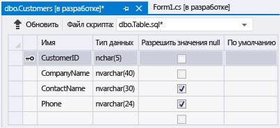
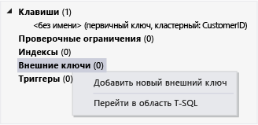

# Пошаговое руководство. Создание локального файла базы данных в Visual Studio
Изучить основные задачи, например добавление таблиц и определение столбцов, можно используя Visual Studio для создания и обновления файла локальной базы данных в SQL Server Express LocalDB, описанного в [Общие сведения о локальных данных](../data-tools/local-data-overview.md).  Изучив данное пошаговое руководство, вы можете ознакомиться с расширенными функциональными возможностями, используя свою локальную базу данных в качестве отправной точки для работы с другими пошаговыми руководствами, требующими использование базы данных.  
  
 Дополнительные сведения о создании базы данных с помощью среды SQL Server Management Studio или Transact\-SQL см. в разделе [Create a Database](http://msdn.microsoft.com/ru-ru/4c4beea2-6cbc-4352-9db6-49ea8130bb64).  
  
 В этом пошаговом руководстве вам предстоит выполнить следующие задачи:  
  
-   [Создание проекта и файла локальной базы данных](../data-tools/create-a-sql-database-by-using-a-designer.md#BKMK_CreateNewSQLDB).  
  
-   [Создание таблиц, столбцов, первичных и внешних ключей](../data-tools/create-a-sql-database-by-using-a-designer.md#BKMK_CreateNewTbls).  
  
-   [Заполнение таблиц данными](../data-tools/create-a-sql-database-by-using-a-designer.md#BKMK_Populating).  
  
## Обязательные компоненты  
 Для выполнения шагов этого руководства требуется [!INCLUDE[vs_dev12_expwin](../data-tools/includes/vs_dev12_expwin_md.md)], Visual Studio Professional 2013, Visual Studio Premium 2013 или Visual Studio Ultimate 2013.  Эти версии Visual Studio содержат SQL Server Data Tools.  
  
##  <a name="BKMK_CreateNewSQLDB"></a> Создание проекта и файла локальной базы данных  
  
#### Создание проекта и файла базы данных  
  
1.  Создайте проект Windows Forms с именем `SampleDatabaseWalkthrough`.  
  
     См. раздел [Создание проектов и решений](../ide/creating-solutions-and-projects.md).  
  
2.  В строке меню выберите **Проект**, **Добавить новый элемент**.  
  
     Откроется диалоговое окно **Добавить новый элемент**, в котором можно добавлять элементы, допустимые в проекте Windows Forms.  
  
3.  В списке шаблонов элементов прокрутите вниз до тех пор, пока не появится **База данных, основанная на службах**, и выберите его.  
  
       
  
4.  Назовите базу данных "Пример базы данных" и нажмите кнопку **Добавить**.  
  
5.  Если окно "Источники данных" еще не открыто, нажмите клавиши SHIFT\+ALT\+D или выберите в строке меню **Вид**, **Другие окна**, **Источники данных**.  
  
6.  В окне "Источники данных" щелкните ссылку **Добавить новый источник данных**.  
  
7.  В окне **Мастер настройки источника данных** нажмите кнопку **Далее** четыре раза, чтобы принять параметры по умолчанию, затем кнопку **Готово**.  
  
 В окне свойств базы данных отображается строка подключения и расположение основного MDF\-файла базы данных.  
  
-   В Visual Studio Express выберите **Вид**, **Другие окна**, **Обозреватель баз данных**, если это окно еще не открыто.  Откройте окно свойств. Для этого разверните узел **Подключения данных**, откройте контекстное меню файла SampleDatabase.mdf и выберите **Свойства**.  
  
-   В других версиях Visual Studio выберите **Вид**, **Обозреватель серверов**, если это окно еще не открыто.  Откройте окно свойств. Для этого разверните узел **Подключения данных**, откройте контекстное меню файла SampleDatabase.mdf и выберите **Свойства**.  
  
##  <a name="BKMK_CreateNewTbls"></a> Создание таблиц, столбцов, первичных и внешних ключей  
 В этом разделе создается несколько таблиц, первичный ключ в каждой таблице и несколько строк данных выборки.  В следующем пошаговом руководстве можно получить сведения о том, как эта информация может выглядеть в приложении.  Здесь также создается внешний ключ, чтобы определить, как записи в одной таблице могут соотноситься с записями в другой таблице.  
  
#### Чтобы создать таблицу Customers  
  
1.  В области **Обозреватель серверов** или **Обозреватель баз данных** разверните узел **Подключения данных**, а затем узел **SampleDatabase.mdf**.  
  
     Если обозреватель еще не открыт в используемой версии Visual Studio, выберите в строке меню **Вид**, **Обозреватель серверов** или **Вид**, **Другие окна**, **Обозреватель баз данных**.  
  
2.  Откройте контекстное меню для раздела **Таблицы**, выберите **Добавить новую таблицу**.  
  
     Будет открыт **Конструктор таблиц**, отобразится сетка с одной строкой по умолчанию, которая представляет один столбец в создаваемой таблице.  Путем добавления строк в сетку будут добавлены столбцы в таблицу.  
  
3.  В сетке добавьте строку для каждой из следующих записей.  
  
    |Имя столбца|Тип данных|Разрешить значения null|  
    |-----------------|----------------|-----------------------------|  
    |`CustomerID`|`nchar(5)`|False \(не установлен\)|  
    |`CompanyName`|`nvarchar(40)`|False \(не установлен\)|  
    |`ContactName`|`nvarchar (30)`|True \(установлен\)|  
    |`Phone`|`nvarchar (24)`|True \(установлен\)|  
  
4.  Откройте контекстное меню для столбца `CustomerID` и выберите **Задать первичный ключ**.  
  
5.  Откройте контекстное меню для строки по умолчанию и выберите **Удалить**.  
  
6.  Назовите таблицу "Клиенты" путем обновления первой строки в области скриптов, как показано в следующем примере:  
  
    ```  
    CREATE TABLE [dbo].[Customers]  
    ```  
  
7.  В левом верхнем углу конструктора таблиц нажмите кнопку **Обновить**, как показано на следующем рисунке.  
  
       
  
8.  В диалоговом окне **Предварительный просмотр обновления базы данных** нажмите кнопку **Обновить базу данных**.  
  
     Ваши изменения сохраняются в файл локальной базы данных.  
  
#### Чтобы создать таблицу Orders  
  
1.  Создайте еще одну таблицу, а затем добавьте строку для каждой записи следующей таблицы.  
  
    |Имя столбца|Тип данных|Разрешить значения null|  
    |-----------------|----------------|-----------------------------|  
    |`OrderID`|`int`|False \(не установлен\)|  
    |`CustomerID`|`nchar(5)`|False \(не установлен\)|  
    |`OrderDate`|`datetime`|True \(установлен\)|  
    |`OrderQuantity`|`int`|True \(установлен\)|  
  
2.  Выберите **OrderID** в качестве первичного ключа и удалите строку по умолчанию.  
  
3.  Назовите таблицу "Заказы" путем обновления первой строки в области скриптов, как показано в следующем примере:  
  
    ```  
    CREATE TABLE [dbo].[Orders]  
    ```  
  
4.  В левом верхнем углу конструктора таблиц нажмите кнопку **Обновить**.  
  
5.  В диалоговом окне **Предварительный просмотр обновления базы данных** нажмите кнопку **Обновить базу данных**.  
  
     Ваши изменения сохраняются в файл локальной базы данных.  
  
#### Создание внешнего ключа  
  
1.  В области контекста в правой части сетки откройте контекстное меню элемента **Внешние ключи** и выберите команду **Добавить новый внешний ключ**, как показано на следующем рисунке.  
  
       
  
2.  В появившемся текстовом поле замените **ToTable** на `Клиенты`.  
  
3.  В области скриптов обновите последнюю строку в соответствии со следующим примером:  
  
    ```  
    CONSTRAINT [FK_Orders_Customers] FOREIGN KEY ([CustomerID]) REFERENCES [Customers]([CustomerID])  
    ```  
  
4.  В левом верхнем углу конструктора таблиц нажмите кнопку **Обновить**.  
  
5.  В диалоговом окне **Предварительный просмотр обновления базы данных** нажмите кнопку **Обновить базу данных**.  
  
     Ваши изменения сохраняются в файл локальной базы данных.  
  
##  <a name="BKMK_Populating"></a> Заполнение таблиц данными  
  
#### Заполнение таблиц данными  
  
1.  В области **Обозреватель серверов** или **Обозреватель баз данных** разверните узел примера базы данных.  
  
2.  Откройте контекстное меню для узла "Таблицы", выберите **Обновить**, затем разверните узел "Таблицы".  
  
3.  Откройте контекстное меню для таблицы "Клиенты" и выберите пункт **Показать таблицу данных**.  
  
4.  Добавьте любые данные для по крайней мере трех клиентов.  
  
     Можно указать любые пять символов как ИД клиентов, но хотя бы один нужно выбрать и запомнить для дальнейшего использования в этой процедуре.  
  
5.  Открыть контекстное меню для таблицы "Заказы" и выберите пункт **Показать таблицу данных**.  
  
6.  Добавьте данные для как минимум трех заказов.  
  
    > [!IMPORTANT]
    >  Убедитесь, что все идентификаторы заказов и количества заказов — целые числа, и каждый идентификатор клиента соответствует значению, указанному в столбце CustomerID таблицы клиентов.  
  
7.  В строке меню выберите **Файл**, **Сохранить все**.  
  
8.  В меню **Файл** выберите **Закрыть решение**.  
  
    > [!NOTE]
    >  Рекомендуется создать резервную копию только что созданного файла базы данных путем его копирования с последующей вставкой в другое место или присвоения копии другого имени.  
  
## Следующие действия  
 Теперь, когда имеется файл локальной базы данных с некоторыми примерами данных, можно завершить работу с [Пошаговое руководство. Подключение к данным в локальном файле базе данных \(Windows Forms\)](../Topic/Walkthrough:%20Connecting%20to%20Data%20in%20a%20Local%20Database%20File%20\(Windows%20Forms\).md) в дополнение к другим пошаговым руководствам, демонстрирующим решение задач базы данных.  
  
## См. также  
 [Практическое руководство. Управление локальными файлами данных в проекте](../data-tools/how-to-manage-local-data-files-in-your-project.md)   
 [Общие сведения о локальных данных](../data-tools/local-data-overview.md)   
 [Привязка элементов управления Windows Forms к данным в Visual Studio](../data-tools/bind-windows-forms-controls-to-data-in-visual-studio.md)   
 [Общие сведения о приложениях для работы с данными в Visual Studio](../data-tools/overview-of-data-applications-in-visual-studio.md)   
 [Подключение к данным в Visual Studio](../data-tools/connecting-to-data-in-visual-studio.md)   
 [Подготовка приложения к получению данных](../Topic/Preparing%20Your%20Application%20to%20Receive%20Data.md)   
 [Выборка данных в приложение](../data-tools/fetching-data-into-your-application.md)   
 [Привязка элементов управления к данным в Visual Studio](../data-tools/bind-controls-to-data-in-visual-studio.md)   
 [Редактирование данных в приложении](../data-tools/editing-data-in-your-application.md)   
 [Проверка данных](../Topic/Validating%20Data.md)   
 [Сохранение данных](../data-tools/saving-data.md)