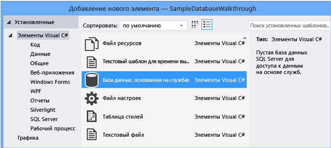

# <a name="create-a-database-and-add-tables-in-visual-studio"></a>Создание базы данных и добавление таблиц в Visual Studio

Visual Studio можно использовать для создания и обновления файла локальной базы данных в SQL Server Express LocalDB. Можно также создать базу данных, выполнив инструкции Transact-SQL в окне **Обозреватель объектов SQL Server** инструментов в Visual Studio. В этом разделе мы создадим *MDF* файл и добавим таблицы и ключи с помощью Конструктор таблиц.

## <a name="prerequisites"></a>Предварительные требования

Для выполнения этого пошагового руководства вам потребуются рабочие нагрузки **.NET для настольных приложений** и **хранения и обработки данных** , установленные в Visual Studio. Чтобы установить их, откройте **Visual Studio Installer** и выберите команду **изменить** (или **несколько**  >  **изменений**) рядом с версией Visual Studio, которую необходимо изменить.

> [!NOTE]
> Процедуры, описанные в этой статье, применимы только к проектам .NET Framework Windows Forms, а не к проектам .NET Core Windows Forms.

## <a name="create-a-project-and-a-local-database-file"></a>Создание проекта и файла локальной базы данных

1. Создайте новый проект **Windows Forms приложения (.NET Framework)** и назовите его **сампледатабасевалксраугх**.

2. В строке меню выберите **проект**  >  **Добавить новый элемент**.

3. В списке шаблонов элементов прокрутите вниз и выберите **база данных на основе службы**.

   

4. Присвойте базе данных имя **сампледатабасе**и нажмите кнопку **Добавить**.

### <a name="add-a-data-source"></a>Добавление источника данных

1. Если окно **Источники данных** не открыто, откройте его, нажав клавиши **SHIFT** + **ALT** + **D** или выбрав пункт **Просмотр**  >  **других**  >  **источников данных** Windows в строке меню.

1. В окне **Источники данных** выберите **Добавить новый источник данных**.

   

   Откроется **Мастер настройки источника данных** .

1. На странице **Выбор типа источника данных** выберите **база данных** , а затем нажмите кнопку **Далее**.

1. На странице **Выбор модели базы данных** нажмите кнопку **Далее** , чтобы принять значение по умолчанию (набор данных).

1. На странице **Выбор подключения к данным** выберите файл **сампледатабасе. mdf** в раскрывающемся списке и нажмите кнопку **Далее**.

1. На странице **сохранить строку подключения в файле конфигурации приложения** нажмите кнопку **Далее**.

1. На странице **Выбор объектов базы данных** появится сообщение о том, что база данных не содержит объектов. Нажмите кнопку **Готово**.

### <a name="view-properties-of-the-data-connection"></a>Просмотр свойств подключения к данным

Чтобы просмотреть строку подключения для файла *сампледатабасе. mdf* , откройте окно свойств подключения к данным:

- Выберите **Просмотр**  >  **Обозреватель объектов SQL Server** , чтобы открыть окно **Обозреватель объектов SQL Server** . Разверните узел **(LocalDB) \MSSQLLocalDB**  >  **базы данных**, а затем щелкните правой кнопкой мыши *сампледатабасе. mdf* и выберите пункт **Свойства**.

- Кроме того, можно выбрать пункт **Просмотреть**  >  **Обозреватель сервера**, если это окно еще не открыто. Откройте окно свойств, развернув узел **подключения к данным** , щелкнув правой кнопкой мыши *сампледатабасе. mdf*и выбрав пункт **Свойства**.

  > [!TIP]
  > Если вы не можете развернуть узел подключения к данным или подключение Сампледатабасе. mdf отсутствует в списке, нажмите кнопку **подключиться к базе данных** на панели инструментов Обозреватель сервера. В диалоговом окне **Добавление соединения** убедитесь, что в поле **источник данных**выбран **Microsoft SQL Server файл базы данных** , а затем найдите и выберите файл сампледатабасе. mdf. Завершите добавление подключения, нажав **кнопку ОК**.

## <a name="create-tables-and-keys-by-using-table-designer"></a>Создание таблиц и ключей с помощью конструктор таблиц

В этом разделе вы создадите две таблицы, первичный ключ в каждой таблице и несколько строк образца данных. Вы также создадите внешний ключ, чтобы указать, как записи в одной таблице соответствуют записям в другой таблице.

### <a name="create-the-customers-table"></a>Создание таблицы Customers

1. В **Обозреватель сервера**разверните узел **подключения к данным** , а затем узел **сампледатабасе. mdf** .

   Если вы не можете развернуть узел подключения к данным или подключение Сампледатабасе. mdf отсутствует в списке, нажмите кнопку **подключиться к базе данных** на панели инструментов Обозреватель сервера. В диалоговом окне **Добавление соединения** убедитесь, что в поле **источник данных**выбран **Microsoft SQL Server файл базы данных** , а затем найдите и выберите файл сампледатабасе. mdf. Завершите добавление подключения, нажав **кнопку ОК**.

2. Щелкните правой кнопкой мыши **таблицы** и выберите команду **Добавить новую таблицу**.

   Будет открыт Конструктор таблиц, отобразится сетка с одной строкой по умолчанию, которая представляет один столбец в создаваемой таблице. Путем добавления строк в сетку будут добавлены столбцы в таблицу.

3. В сетке добавьте строку для каждой из следующих записей.

   |Имя столбца|Тип данных|Разрешить значения null|
   |-----------------|---------------|-----------------|
   |`CustomerID`|`nchar(5)`|False (не установлен)|
   |`CompanyName`|`nvarchar(50)`|False (не установлен)|
   |`ContactName`|`nvarchar (50)`|True (установлен)|
   |`Phone`|`nvarchar (24)`|True (установлен)|

4. Щелкните строку правой кнопкой мыши `CustomerID` и выберите пункт **Задать первичный ключ**.

5. Щелкните строку по умолчанию () правой кнопкой мыши `Id` и выберите пункт **Удалить**.

6. Назовите таблицу "Клиенты" путем обновления первой строки в области скриптов, как показано в следующем примере:

   ```sql
   CREATE TABLE [dbo].[Customers]
   ```

   Вы увидите нечто вроде этого:

   

7. В левом верхнем углу **Конструктор таблиц**выберите **Обновить**.

8. В диалоговом окне **Предварительный просмотр обновлений базы данных** выберите **обновить базу данных**.

   Таблица Customers создается в файле локальной базы данных.

### <a name="create-the-orders-table"></a>Создание таблицы Orders

1. Создайте еще одну таблицу, а затем добавьте строку для каждой записи следующей таблицы.

   |Имя столбца|Тип данных|Разрешить значения null|
   |-----------------|---------------|-----------------|
   |`OrderID`|`int`|False (не установлен)|
   |`CustomerID`|`nchar(5)`|False (не установлен)|
   |`OrderDate`|`datetime`|True (установлен)|
   |`OrderQuantity`|`int`|True (установлен)|

2. Задайте **OrderID** в качестве первичного ключа, а затем удалите строку по умолчанию.

3. Назовите таблицу "Заказы" путем обновления первой строки в области скриптов, как показано в следующем примере:

   ```sql
   CREATE TABLE [dbo].[Orders]
   ```

4. В левом верхнем углу **Конструктор таблиц**выберите **Обновить**.

5. В диалоговом окне **Предварительный просмотр обновлений базы данных** выберите **обновить базу данных**.

   Таблица Orders создается в файле локальной базы данных. Если развернуть узел **таблицы** в обозреватель сервера, отобразятся две таблицы:

   

### <a name="create-a-foreign-key"></a>Создание внешнего ключа

1. В контекстной области в правой части сетки конструктор таблиц для таблицы Orders щелкните правой кнопкой мыши **внешние ключи** и выберите **Добавить новый внешний ключ**.

   

2. В появившемся текстовом поле замените текст **ToTable** на **Customers**.

3. На панели T-SQL обновите последнюю строку, чтобы она соответствовала следующему примеру:

   ```sql
   CONSTRAINT [FK_Orders_Customers] FOREIGN KEY ([CustomerID]) REFERENCES [Customers]([CustomerID])
   ```

4. В левом верхнем углу **Конструктор таблиц**выберите **Обновить**.

5. В диалоговом окне **Предварительный просмотр обновлений базы данных** выберите **обновить базу данных**.

   Создается внешний ключ.

## <a name="populate-the-tables-with-data"></a>Заполнение таблиц данными

1. В **Обозреватель сервера** или **Обозреватель объектов SQL Server**разверните узел образца базы данных.

2. Откройте контекстное меню для узла **таблицы** , выберите **Обновить**, а затем разверните узел **таблицы** .

3. Откройте контекстное меню таблицы Customers и выберите команду **отобразить данные таблицы**.

4. Добавьте необходимые данные для некоторых клиентов.

    Можно указать любые пять символов как ИД клиентов, но хотя бы один нужно выбрать и запомнить для дальнейшего использования в этой процедуре.

5. Откройте контекстное меню таблицы Orders и выберите пункт **отобразить данные таблицы**.

6. Добавление данных для некоторых заказов.

    > [!IMPORTANT]
    > Убедитесь, что все идентификаторы заказов и количества заказов — целые числа, и каждый идентификатор клиента соответствует значению, указанному в столбце **CustomerID** таблицы клиентов.

7. В строке меню выберите **файл**  >  **сохранить все**.

## <a name="see-also"></a>См. также

- [Доступ к данным в Visual Studio](accessing-data-in-visual-studio.md)
