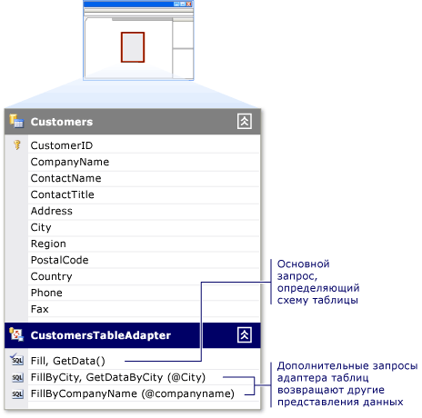

# Создайте и настройте адаптеры таблиц TableAdapter
Адаптеры таблиц обеспечивают связь между приложением и базой данных. Подключении к базе данных, выполнения запросов или хранимых процедур и возвращают новые данные таблицы или заполнения существующего <xref:System.Data.DataTable> возвращенными данными. Адаптеры таблиц можно также отправлять обновленные данные из приложения в базе данных.  
  
Адаптеры таблиц создаются автоматически при выполнении одного из следующих действий:  
  
-   Запустите [мастер настройки источника данных](../data-tools/media/data-source-configuration-wizard.png) и выберите либо **базы данных** или **веб-службы** тип источника данных.  
  
-   Перетащите объекты базы данных из **обозревателя серверов** в **конструктора наборов данных**.  
  
Можно также создать новый адаптер и настройте его с источником данных, перетащив адаптера таблицы из панели элементов в пустую область в **конструктора наборов данных** поверхности.  
  
Вводные сведения для адаптеров таблиц см. в разделе [заполнения набора данных с помощью адаптера таблицы](../data-tools/fill-datasets-by-using-tableadapters.md).  
  
[!INCLUDE[note_settings_general](../data-tools/includes/note_settings_general_md.md)]  
  
## Используйте мастер настройки адаптера таблицы  
Запустите **мастер настройки адаптера таблицы** для создания или редактирования адаптеров таблиц и сопоставленные с ними. Можно настроить, щелкнув его в существующий адаптер таблицы **конструктора наборов данных**.  
  
  
  
Если новый адаптер таблицы перетащите из области элементов при **конструктора наборов данных** находится в фокус, запускается мастер, и запросы, можно указать, какие данные источника адаптера таблицы должны подключаться к. На следующей странице то мастер предложит какого рода команды следует использовать для взаимодействия с базой данных, инструкции SQL или хранимые процедуры. (Вы не увидите это при настройке адаптера таблицы должен быть связан с источником данных.)  
  
-   Вы можете создать новую хранимую процедуру в основной базе данных, при наличии разрешений для базы данных. Если у вас нет разрешения, это не будет параметр.  
  
-   Вы также можете запускать существующие хранимые процедуры для **ВЫБЕРИТЕ**, **вставить**, **обновление**, и **удалить** команды Адаптер таблицы. Хранимая процедура, назначенный **обновление** , например, команда при `TableAdapter.Update()` вызывается метод.  
  
Сопоставьте параметры из выбранной хранимой процедуры с соответствующими столбцами в таблице данных. Например, если хранимая процедура принимает параметр с именем `@CompanyName` передается `CompanyName` набор столбцов в таблице, **исходный столбец** из `@CompanyName` параметр `CompanyName`.  
  
> [!NOTE]
>  Хранимая процедура, назначенной для команды SELECT выполняется путем вызова метода адаптера таблицы с именем в следующем шаге мастера. Метод по умолчанию — `Fill`, поэтому код, который обычно используется для выполнения процедуры SELECT имеет `TableAdapter.Fill(tableName)`. Если изменить имя по умолчанию из `Fill`, замените `Fill` с именем назначения и замените «Адаптер таблицы» фактическое имя адаптера таблицы (например, `CustomersTableAdapter`).  
  
-   При выборе **создать методы для отправки обновлений непосредственно в базу данных** параметр аналогичен параметру `GenerateDBDirectMethods` значение true. Параметр будет недоступен, если исходная инструкция SQL не предоставляет достаточно сведений или запрос не обновляемый запрос. Такая ситуация может возникнуть, например, в **JOIN** запросы и запросы, которые возвращают одно (скалярное) значение.  
  
**Дополнительно** мастера позволяют:  
- Создать инструкции INSERT, UPDATE и DELETE на основе инструкции SELECT, которая определена на **Создание инструкций SQL** страницы
- Использовать оптимистическую блокировку
- Укажите, следует ли обновить таблицу данных после вставки и выполняются инструкции UPDATE  
  
## Настройка метода Fill адаптера  
Иногда может потребоваться изменить схему таблицы TableAdapter. Для этого измените основной TableAdapter `Fill` метод. Адаптеры таблиц создаются с основной `Fill` метод, который определяет схему связанной таблицы данных. Основной `Fill` метод основан на запрос или хранимую процедуру, введенное при первоначальной настройке адаптера таблицы. Он является первым (верхним) методом в таблице данных в конструкторе наборов данных.  
  
  
  
Любые изменения, внесенные в адаптер таблицы основной `Fill` метод отражаются в схеме связанной таблицы данных. Например, удаление столбца из запроса в основном `Fill` метод также удаляет столбец из связанной таблицы данных. Кроме того, удаление столбца из главной `Fill` метод удаляет столбец из любых дополнительных запросов для этого TableAdapter.  
  
Мастер настройки запроса адаптера таблицы можно использовать для создания и изменения дополнительных запросов для адаптера таблицы. Эти дополнительные запросы, которые должны соответствовать схему таблицы, если они возвращают скалярное значение.  Каждый дополнительный запрос имеет имя, которое можно указать.  
 
В следующем примере показано, как вызвать дополнительный запрос с именем `FillByCity`:  
 
`CustomersTableAdapter.FillByCity(NorthwindDataSet.Customers, "Seattle")`  
  
#### Чтобы запустить мастер настройки запроса адаптера таблицы с помощью нового запроса  
  
1.  Откройте свой набор данных в **конструктора наборов данных**.  
  
2.  Если вы создаете новый запрос, перетащите **запроса** объекта из **набора данных** вкладке **элементов** на <xref:System.Data.DataTable>, или выберите **добавить запрос**его контекстном меню. Можно также перетащить **запроса** объекта в пустую область конструктора **конструктора наборов данных**, которая создает адаптер таблиц без связанного <xref:System.Data.DataTable>. Эти запросы можно только возвращать отдельные (скалярные) значения или выполнения UPDATE, INSERT или удалять команды в базе данных.  
  
3.  На **Выбор подключения к данным** экране выберите или создайте подключение, которое будет использоваться запросом.  
  
    > [!NOTE]
    >  Этот экран появляется только в том случае, если конструктор не может определить, какое подключение для использования или доступных соединений нет.  
  
4.  На **Выбор типа команды** экрана, выберите один из следующих методов получения данных из базы данных:  
  
    -   **Использование инструкций SQL** позволяет ввести инструкцию SQL для выборки данных из базы данных.  
  
    -   **Создать новую хранимую процедуру** позволяет с помощью мастера создания нового хранимой процедуры (в базе данных) на основе указанной инструкции SELECT.  
  
    -   **Использовать существующие хранимые процедуры** позволяет запускать существующей хранимой процедуры при запуске запроса.  
  
#### Чтобы запустить мастер настройки запроса адаптера таблицы для существующего запроса  
  
-   При редактировании существующего запроса адаптера таблицы щелкните правой кнопкой мыши запрос и выберите **Настройка** в контекстном меню.  
  
    > [!NOTE]
    >  Щелкните правой кнопкой мыши основной запрос адаптера таблицы перенастраивает адаптер таблицы и <xref:System.Data.DataTable> схемы. Тем не менее, щелкнув правой кнопкой мыши дополнительный запрос в TableAdapter, настраивает только выбранный запрос. **Мастер настройки адаптера таблицы** перенастраивает определение адаптера таблицы, пока мастер настройки запроса адаптера таблицы перенастраивает только выбранный запрос.  
  
#### Добавление глобального запроса адаптера таблицы  
  
-   *Глобальные запросы* SQL-запросы, которые возвращают одно (скалярное) значение или значение отсутствует. Как правило глобальные функции выполняют операции с базой данных, например операции вставки, обновления, удаления. Они также статистические сведения, такие как количество клиентов в таблице или общих издержек для всех элементов в определенном порядке.  
  
     Добавление глобальных запросов путем перетаскивания **запроса** объекта из **DataSet** вкладке **элементов** фигуру на пустую область конструктора **конструктора наборов данных**.  
  
-   Введите запрос, выполняющий нужную задачу, например, `SELECT COUNT(*) AS CustomerCount FROM Customers`.  
  
    > [!NOTE]
    >  Перетаскивание **запроса** объекта непосредственно на **конструктора наборов данных** создает метод, который возвращает только скалярное значение (одно). Во время запроса или хранимой процедуры, при выборе может возвращать более одного значения, метод, который создается с помощью мастера возвращает только одно значение. Например запрос может возвращать первый столбец первой строки возвращенных данных.

## См. также
[Заполнение наборов данных с помощью адаптера таблицы](../data-tools/fill-datasets-by-using-tableadapters.md)