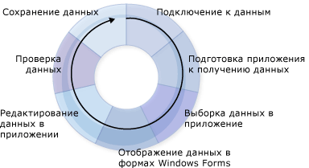

# Создание приложений для работы с данными
Visual Studio предоставляет множество средств разработки, которые призваны помочь в процессе создания приложений, получающих доступ к данным.  Это введение представляет обзор основных процессов, задействованных при создании приложений, работающих с данными.  В приведенной здесь информации намеренно пропущены многие подробности, она может использоваться как источник общих сведений и содержит ссылки на многие страницы помощи, связанные с созданием приложений, работающих с данными.  
  
 При разработке приложений, работающих с данными в [!INCLUDE[vsprvs](../code-quality/includes/vsprvs_md.md)], могут возникнуть различные требования.  В некоторых случаях нужно только отобразить данные в форме.  В других случаях может потребоваться разработать способ обмена информацией с другими приложениями или процессами.  
  
 Для всех операций, выполняемых с данными, существуют некоторые основные понятия, которые следует понимать.  Возможно, вам никогда не потребуется узнать некоторые сведения об обработке данных — например, может не потребоваться программно создавать базу данных. В то же время, очень полезно иметь общие представления о данных, так же как и умение использовать средства для работы с данными \(мастера и конструкторы\), доступные в [!INCLUDE[vsprvs](../code-quality/includes/vsprvs_md.md)].  
  
 В обычных приложениях для работы с данными используется большинство процессов, показанных на следующей схеме.  
  
   
Цикл данных  
  
 При создании приложения продумайте задачу, которую оно должно выполнять.  Используйте следующие разделы для поиска доступных средств и объектов [!INCLUDE[vsprvs](../code-quality/includes/vsprvs_md.md)].  
  
> [!NOTE]
>  [!INCLUDE[vsprvs](../code-quality/includes/vsprvs_md.md)] предоставляет мастеры для упрощения нескольких процессов, показанных на предыдущей схеме.  Например, запуск **Мастера настройки источника данных** предоставляет приложению достаточно сведений для подключения к данным, создания типизированного набора данных для получения данных и переноса данных в приложение.  
  
 Чтобы ознакомиться с краткой информацией о том, как [!INCLUDE[vsprvs](../code-quality/includes/vsprvs_md.md)] помогает в разработке приложений, работающих с данными, обратитесь к разделу [Пошаговое руководство. Создание простого приложения для работы с данными](../Topic/Walkthrough:%20Creating%20a%20Simple%20Data%20Application.md).  
  
## Подключение к данным  
 Чтобы перенести данные в приложение \(и отправить изменения обратно в источник данных\), необходимо установить двустороннее соединение.  Как правило, это двустороннее соединение обрабатывается объектами в модели данных.  
  
 Например, `TableAdapter` подключается к приложениям, использующим наборы данных для базы данных, а <xref:System.Data.Objects.ObjectContext> подключается к сущностям в Entity Framework для базы данных.  [!INCLUDE[vsprvs](../code-quality/includes/vsprvs_md.md)] предоставляет несколько средств, с помощью которых можно создавать подключения для приложений.  Дополнительные сведения о подключении приложения к данным содержатся в разделе [Подключение к данным в Visual Studio](../data-tools/connecting-to-data-in-visual-studio.md).  
  
 Чтобы получить сведения о том, как использовать наборы данных для подключения приложения к данным в базе данных, см. [Пошаговое руководство. Подключение к данным в базе данных \(Windows Forms\)](../Topic/Walkthrough:%20Connecting%20to%20Data%20in%20a%20Database%20\(Windows%20Forms\).md).  
  
## Подготовка приложения к получению данных  
 Если приложение использует модель отключенных данных, необходимо временно хранить данные в приложении во время работы с ним.  Visual Studio предоставляет средства, помогающие создавать объекты, которые приложение использует для временного хранения данных: наборы данных, сущности и объекты [!INCLUDE[vbtecdlinq](../data-tools/includes/vbtecdlinq_md.md)].  
  
> [!NOTE]
>  Приложение, использующее модель отключенных данных, подключится к базе данных обычным образом, выполнит запрос, передающий данные в приложение, отключится от базы данных, а затем будет оперировать данными в автономном режиме до повторного подключения и обновления базы данных.  
  
 Дополнительные сведения о создании типизированных наборов данных в приложении см. в разделе [Подготовка приложения к получению данных](../Topic/Preparing%20Your%20Application%20to%20Receive%20Data.md).  Дополнительные сведения об использовании наборов данных в многоуровневых приложениях см. в разделе [Практическое руководство. Разделение наборов данных и адаптеров таблиц на разные проекты](../data-tools/separate-datasets-and-tableadapters-into-different-projects.md).  
  
 Сведения о том, как создать набор данных, содержатся в разделе [Пошаговое руководство. Создание набора данных с помощью конструктора наборов данных](../data-tools/walkthrough-creating-a-dataset-with-the-dataset-designer.md).  
  
 Сведения о том, как создать объекты [!INCLUDE[vbtecdlinq](../data-tools/includes/vbtecdlinq_md.md)], содержатся в разделе [Пошаговое руководство. Создание классов LINQ to SQL \(реляционный конструктор объектов\)](../Topic/Walkthrough:%20Creating%20LINQ%20to%20SQL%20Classes%20\(O-R%20Designer\).md).  
  
## Выборка данных в приложение  
 Вне зависимости от того, использует ли приложение модель отключенных данных, необходимо обеспечить загрузку данных в приложение.  Данные в приложение загружаются путем выполнения запроса или хранимых процедур над базой данных.  Приложения, хранящие данные в наборах данных, выполняют запросы и хранимые процедуры с помощью `TableAdapter`, тогда как приложения, хранящие данные в сущностях, выполняют запросы с помощью [LINQ to Entities](../Topic/LINQ%20to%20Entities.md) или путем прямого подключения сущностей к хранимым процедурам.  Дополнительные сведения о создании и изменении запросов, использующих адаптеры таблиц, см. в разделах [Практическое руководство. Создание запросов TableAdapter](../data-tools/how-to-create-tableadapter-queries.md) и [Практическое руководство. Изменение запросов TableAdapter](../data-tools/how-to-edit-tableadapter-queries.md).  
  
 Дополнительные сведения о загрузке данных в наборы данных и выполнении запросов и хранимых процедур см. в разделе [Выборка данных в приложение](../data-tools/fetching-data-into-your-application.md).  
  
 Чтобы загрузить данные в набор данных, выполните действия, описанные в [Пошаговое руководство. Отображение данных на форме в приложении Windows](../data-tools/walkthrough-displaying-data-on-a-windows-form.md) и ознакомьтесь с кодом в обработчике событий загрузки формы.  
  
 Чтобы загрузить данные в объекты [!INCLUDE[vbtecdlinq](../data-tools/includes/vbtecdlinq_md.md)], выполните действия, описанные в [Пошаговое руководство. Создание классов LINQ to SQL \(реляционный конструктор объектов\)](../Topic/Walkthrough:%20Creating%20LINQ%20to%20SQL%20Classes%20\(O-R%20Designer\).md).  
  
 Чтобы получить сведения, как создать и выполнить запрос SQL, см. [Практическое руководство. Создание и выполнение инструкций SQL, возвращающих строки](../Topic/How%20to:%20Create%20and%20Execute%20an%20SQL%20Statement%20that%20Returns%20Rows.md).  
  
 Чтобы получить сведения о способах выполнения хранимой процедуры, см. [Практическое руководство. Выполнение хранимой процедуры, возвращающей строки](../Topic/How%20to:%20Execute%20a%20Stored%20Procedure%20that%20Returns%20Rows.md).  
  
## Отображение данных в формах Windows Forms  
 После получения данных в приложении можно отобразить их в форме для просмотра и изменения пользователями.  [!INCLUDE[vsprvs](../code-quality/includes/vsprvs_md.md)] предоставляет окно [окно "Источники данных"](../Topic/Data%20Sources%20Window.md), из которого можно перетащить элементы в формы для автоматического создания элементов управления с привязкой к данным, в которых будут отображаться данные.  Дополнительные сведения о привязках к данным и отображении данных пользователям содержатся в разделе [Привязка элементов управления к данным в Visual Studio](../data-tools/bind-controls-to-data-in-visual-studio.md).  
  
 Чтобы вывести данные пользователям в Windows Forms, выполните процедуры, приведенные в следующих пошаговых руководствах, обращая особое внимание на процесс перетаскивания элементов из окна **Источники данных**\):  
  
-   [Пошаговое руководство. Отображение данных на форме в приложении Windows](../data-tools/walkthrough-displaying-data-on-a-windows-form.md).  
  
-   [Пошаговое руководство. Привязка элементов управления WPF к службе данных WCF](../data-tools/bind-wpf-controls-to-a-wcf-data-service.md)  
  
-   [Пошаговое руководство. Привязка элементов управления Silverlight к службе данных WCF](../Topic/Walkthrough:%20Binding%20Silverlight%20Controls%20to%20a%20WCF%20Data%20Service.md)  
  
## Редактирование данных в приложении  
 После того как пользователям были выведены данные, они, скорее всего, будут изменять их путем добавления новых, редактирования и удаления существующих записей до их передачи обратно в базу данных.  
  
 Дополнительные сведения о работе с данными после их загрузки в набор данных содержатся в разделе [Редактирование данных в приложении](../data-tools/editing-data-in-your-application.md).  
  
## Проверка данных  
 Обычно при внесении изменений в данные необходимо проверить изменения перед разрешением внесения значений в набор данных или в базу данных.   *Проверка* — это имя процесса, проверяющего эти новые значения на соответствие требованиям приложения.  Для проверки значений в приложении по мере их изменения пользователь может добавить логику.  Visual Studio предоставляет средства, помогающие добавлять код, проверяющий данные во время изменения столбцов и строк.  Дополнительные сведения см. в разделе [Проверка данных](../Topic/Validating%20Data.md).  
  
 Чтобы получить сведения о том, как добавить проверку данных в приложение, см. [Пошаговое руководство. Добавление проверки в набор данных](../Topic/Walkthrough:%20Adding%20Validation%20to%20a%20Dataset.md).  
  
 Чтобы получить сведения о том, как добавить проверку набора данных в многоуровневом приложении, см. [Практическое руководство. Добавление проверки в N\-уровневом наборе данных](../data-tools/add-validation-to-an-n-tier-dataset.md).  
  
## Сохранение данных  
 После внесения изменений в приложении \(и проверки этих изменений\), обычно требуется отправить изменения обратно в базу данных.  Приложения, хранящие данные в наборах данных, обычно используют TableAdapterManager для сохранения данных.  Дополнительные сведения см. в разделе [Общие сведения о компоненте TableAdapterManager](../Topic/TableAdapterManager%20Overview.md).  Для сохранения данных приложения Entity Framework используют метод <xref:System.Data.Objects.ObjectContext.SaveChanges%2A>.  
  
 Дополнительные сведения об отправке обновленных данных обратно в базу данных содержатся в разделе [Сохранение данных](../data-tools/saving-data.md).  
  
 Чтобы отправить обновленные данные из набора данных в базу данных, выполните действия, описанные в разделе [Пошаговое руководство. Сохранение данных связанных таблиц данных \(иерархическое обновление\)](../Topic/Walkthrough:%20Saving%20Data%20from%20Related%20Data%20Tables%20\(Hierarchical%20Update\).md).  
  
## Связанные разделы  
 [Общие сведения о приложениях для работы с данными в Visual Studio](../data-tools/overview-of-data-applications-in-visual-studio.md)  
 Ссылки на разделы, посвященные созданию приложений, работающих с данными.  
  
 [Подключение к данным в Visual Studio](../data-tools/connecting-to-data-in-visual-studio.md)  
 Ссылки на разделы, посвященные использованию [!INCLUDE[vsprvs](../code-quality/includes/vsprvs_md.md)] для подключения приложений к данным и создания источников данных для приложений.  
  
 [Подготовка приложения к получению данных](../Topic/Preparing%20Your%20Application%20to%20Receive%20Data.md)  
 Ссылки на разделы, в которых объясняется работа с моделями данных в приложениях, включая наборы данных и модели EDM.  
  
 [Выборка данных в приложение](../data-tools/fetching-data-into-your-application.md)  
 Ссылки на разделы, в которых описывается загрузка данных в приложения.  
  
 [Привязка элементов управления к данным в Visual Studio](../data-tools/bind-controls-to-data-in-visual-studio.md)  
 Ссылки на разделы, в которых объясняется, как привязать элементы управления Windows Forms, WPF и Silverlight к источникам данных.  
  
 [Редактирование данных в приложении](../data-tools/editing-data-in-your-application.md)  
 Ссылки на разделы, в которых описывается изменение данных в приложении.  
  
 [Проверка данных](../Topic/Validating%20Data.md)  
 Ссылки на разделе, в которых описано, как добавить проверку в изменения данных.  
  
 [Сохранение данных](../data-tools/saving-data.md)  
 Ссылки на разделы, в которых объясняется, как отправлять обновленные данные из приложения в базу данных и как сохранять данные в других форматах, таких как XML.  
  
 [Средства для работы с источниками данных в Visual Studio](../Topic/Tools%20for%20Working%20with%20Data%20Sources%20in%20Visual%20Studio.md)  
 Ссылки на разделы, посвященные средствам, которые можно использовать для работы с источниками данных в Visual Studio, таким как окно **Источники данных** и конструктор модели EDM ADO.NET.