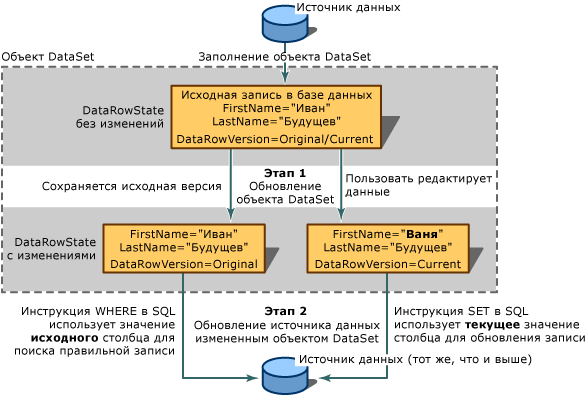

# Сохранение данных в наборах данных
Сохранение данных – процесс переноса изменений данных в приложении обратно к исходному хранилищу данных, обычно реляционной базе данных, например SQL Server.  
  
 Так как набор данных является кэшем данных, то есть их копией в памяти, процесс записи сведений в исходный источник данных отделен от процесса изменения данных в наборе данных.  Можно отправить обновленные данные из наборов данных обратно к базе данных путем вызова одного из методов `Update` TableAdapter или вызвать один из методов DBDirect объекта TableAdapter.  
  
 Дополнительные сведения по отправке изменений в наборе данных обратно к базам данных содержатся в разделах [Практическое руководство. Обновление данных с помощью адаптера таблицы](../data-tools/update-data-by-using-a-tableadapter.md) и [Практическое руководство. Сохранение изменений набора данных в базе данных](../Topic/How%20to:%20Save%20Dataset%20Changes%20to%20a%20Database.md).  
  
 Visual Studio содержит компонент `TableAdapterManager`, который помогает при выполнении сохранения данных в связанных таблицах.  Этот компонент обеспечивает выполнение сохранения в требуемом порядке, основанном на ограничениях внешних ключей, определенных в базе данных.  Для получения дополнительной информации см. [Общие сведения об иерархическом обновлении](../Topic/Hierarchical%20Update%20Overview.md).  
  
 Информация об изменении данных в наборе данных содержатся в разделе [Редактирование данных в приложении](../data-tools/editing-data-in-your-application.md).  
  
## Двухэтапные обновления  
 Обновление источника данных посредством набора данных осуществляется в два этапа.  Первый этап – это обновление набора данных и добавление новых сведений: новых записей, измененных записей или удаленных записей.  Если приложение отвечает только за обработку набора данных, \(например после обновления набора данных он отправляется в другое приложение, которое выполняет дальнейшую обработку набора данных\), тогда обновление заканчивается.  
  
> [!NOTE]
>  В Windows Forms архитектура привязки к данным занимается отправкой изменений из элементов управления с привязкой к данным в набор данных, поэтому не требуется в явном виде обновлять набор данных при помощи собственного кода.  Для получения дополнительной информации см. [Связывание элементов управления Windows Forms с данными](../Topic/Windows%20Forms%20Data%20Binding.md).  
  
 При обновлении источника данных \(например базы данных\) на втором этапе изменения, внесенные в набор данных, будут отправлены в исходный источник данных.  Таким образом, процесс обновления набора данных не записывает также изменения в базовом источнике данных. Необходимо в явном виде выполнять этот второй шаг.  Обычно эта операция реализуется посредством вызова метода Update того же адаптера таблицы \(или адаптера данных\), который используется для заполнения набора данных, хотя допускается использование и других адаптеров, например для перемещения данных из одного источника в другой или для обновления нескольких источников данных.  
  
   
Процесс двухэтапного обновления и роль DataRowVersion в успехе обновления  
  
 Структурно набор данных делает данные доступными в качестве набора коллекций.  Наборы данных содержат коллекции таблиц.  Таблицы содержат коллекции строк.  Таблицы предоставляются как коллекция объекта <xref:System.Data.DataSet>, и записи доступны в коллекции <xref:System.Data.DataTable.Rows%2A> объектов <xref:System.Data.DataTable>.  Таким образом, можно вносить изменения в данные набора данных, просто управляя этими коллекциями, используя базовые методы работы с ними. Однако если требуется обновить базовый источник данных, необходимо использовать специальные методы изменения наборов данных.  
  
 Например, чтобы удалить запись из таблицы данных, следует вызвать [метод RemoveAt](https://msdn.microsoft.com/en-us/library/system.data.datarowcollection.removeat.aspx) коллекции <xref:System.Data.DataTable.Rows%2A> таблицы, который физически удалит записи из набора данных.  Если набор данных используется только в качестве структурного хранилища для данных, и если не требуется передавать сведения об изменениях другому приложению, такое управление коллекциями может быть приемлемым методом обновления набора данных.  
  
 Тем не менее, если есть необходимость отправлять изменения источнику данных или другому приложению, нужно всегда иметь сведения об изменениях \(метаданные\) для каждого обновления.  Позже, после отправки изменений источнику данных или приложению, процесс будет располагать всеми необходимыми сведениями для выявления и обновления соответствующих записей.  Например, при удалении записи в наборе данных сведения об удаленной записи сохраняются в наборе данных.  Таким образом, при вызове `DeleteCommand` TableAdapter, существует достаточно информация для обнаружения исходной записи в источнике данных, чтобы она могла быть удалена.  Дополнительные сведения см. ниже в разделе "Поддерживание сведений об изменениях".  
  
## Слияние наборов данных  
 Содержимое набора данных можно обновлять с помощью *слияния*, т. е. при помощи копирования содержимого одного набора данных \(называемого *исходным* набором данных\) в вызывающий набор данных \(называемый *конечным* набором данных\).  При слиянии наборов данных новые записи из исходного набора добавляются в конечный набор.  Дополнительные столбцы исходного набора добавляются в конечный набор.  Слияние наборов данных бывает полезным, если вы имеете локальный набор данных и получаете второй набор данных из другого приложения или компонента, например из веб\-службы XML.  Оно также полезно при необходимости интегрировать данные из нескольких наборов данных.  
  
 При слиянии наборов данных можно ввести необязательный аргумент типа Boolean \(`preserveChanges`\), который сообщает методу <xref:System.Data.DataSet.Merge%2A>, надо ли сохранять существующие изменения в конечном наборе данных.  Поскольку наборы данных содержат различные версии записей, нужно иметь в виду, что в слиянии задействована не одна версия записей.  Следующая таблица показывает записи двух наборов данных перед слиянием.  
  
|DataRowVersion|Целевой набор данных|Исходный набор данных|  
|--------------------|--------------------------|---------------------------|  
|До преобразования|James Wilson|James C.  Wilson|  
|Текущий|Jim Wilson|James C.  Wilson|  
  
 Вызов метода <xref:System.Data.DataSet.Merge%2A> в таблице выше с `preserveChanges=false targetDataset.Merge(sourceDataset)` дает следующее:  
  
|DataRowVersion|Целевой набор данных|Исходный набор данных|  
|--------------------|--------------------------|---------------------------|  
|До преобразования|James C.  Wilson|James C.  Wilson|  
|Текущий|James C.  Wilson|James C.  Wilson|  
  
 Вызов метода <xref:System.Data.DataSet.Merge%2A> с `preserveChanges = true targetDataset.Merge(sourceDataset, true)` дает следующее:  
  
|DataRowVersion|Целевой набор данных|Исходный набор данных|  
|--------------------|--------------------------|---------------------------|  
|До преобразования|James C.  Wilson|James C.  Wilson|  
|Текущий|Jim Wilson|James C.  Wilson|  
  
> [!CAUTION]
>  В сценарии `preserveChanges = true` после вызова метода <xref:System.Data.DataSet.RejectChanges%2A> для записи в конечном наборе данных он затем вернется к исходным данным из набора данных *источника*.  Это означает, что если требуется обновить исходный источник данных с помощью конечного набора данных, может получиться так, что исходная строка для обновления не будет найдена.  Однако можно предотвратить нарушение параллелизма, заполнив другой набор данных обновленными записями из источника данных и затем выполнив слияние. \(Нарушение параллелизма происходит, когда другой пользователь изменяет запись в источнике данных после заполнения набора данных.\)  
  
## Ограничения на обновление  
 Чтобы внести изменения в существующую строку данных, нужно добавить или обновить данные в отдельных столбцах.  Если набор данных содержит ограничения \(такие как внешние ключи или ненулевые ограничения\), возможно, что пока запись будет обновляться \(после завершения обновления одного столбца и до перехода к следующему\), она может временно находиться в состоянии ошибки.  
  
 Для предотвращения преждевременных нарушений ограничений можно временно приостановить действие ограничений на обновления.  Это служит двум целям.  
  
-   Предотвращение ошибок, генерируемых при обновлении одного столбца и до перехода к другому.  
  
-   Предотвращение инициирования некоторых событий обновления \(событий, часто используемых для проверки\).  
  
 После завершения обновления можно снова разрешить проверку ограничений, что также разрешает события обновления и инициирует их.  
  
> [!NOTE]
>  В Windows Forms архитектура привязки данных, встроенная в таблицу, приостанавливает проверку ограничения до того, как процесс не перейдет к другой строке, поэтому нет необходимости в явном виде вызывать методы <xref:System.Data.DataRow.BeginEdit%2A>, <xref:System.Data.DataRow.EndEdit%2A> или <xref:System.Data.DataRow.CancelEdit%2A>.  
  
 Ограничения автоматически запрещаются, когда на набор данных вызывается метод <xref:System.Data.DataSet.Merge%2A>.  Если после выполнения слияния остается много ограничений, которые невозможно разрешить, создается <xref:System.Data.ConstraintException>.  В этом случае свойству <xref:System.Data.DataSet.EnforceConstraints%2A> присваивается значение `false`, и все нарушения ограничений должны быть разрешены до сброса свойства <xref:System.Data.DataSet.EnforceConstraints%2A> на значение `true`.  
  
 После завершения обновления можно снова разрешить проверку ограничений, что также разрешает события обновления и инициирует их.  
  
 За дополнительными сведениями о делегатах обратитесь к разделу [Практическое руководство. Отключение ограничений при заполнении набора данных](../data-tools/turn-off-constraints-while-filling-a-dataset.md).  
  
## Ошибки при обновлении наборов данных  
 При обновлении записи в наборе данных есть возможность возникновения ошибки.  Например, можно случайно записать данные в столбец с другим типом данных, или в слишком длинный столбец, или в столбец, имеющий другие проблемы целостности.  В дополнение к этому могут возникнуть специфические, связанные с определенным приложением проверки допустимости, которые могут вызвать настраиваемые ошибки на любом этапе выполнения события обновления.  Для получения дополнительной информации см. [Проверка данных в наборах данных](../data-tools/validate-data-in-datasets.md).  
  
## Ведение записей об изменениях  
 Ведение записей об изменениях в наборе данных ведется двумя методами: маркировкой строки, показывающей, были ли в строку внесены изменения \(<xref:System.Data.DataRow.RowState%2A>\), а также созданием множества копий записи \(<xref:System.Data.DataRowVersion>\).  Используя эти сведения, процессы могут определять, какие изменения были внесены в набор данных, и отправлять соответствующие обновления в источник данных.  
  
### Свойство RowState  
 Свойство <xref:System.Data.DataRow.RowState%2A> объекта <xref:System.Data.DataRow> является значением, которое предоставляет сведения о состоянии конкретной строки данных.  
  
 В следующей таблице подробно описаны возможные значения перечисления <xref:System.Data.DataRowState>.  
  
|Значение DataRowState|Описание|  
|---------------------------|--------------|  
|<xref:System.Data.DataRowState>|Строка была добавлена в качестве элемента в <xref:System.Data.DataRowCollection>. \(В этом состоянии строка не имеет соответствующей исходной версии, так как она еще не существовала, когда был вызван последний метод <xref:System.Data.DataRow.AcceptChanges%2A>.\)|  
|<xref:System.Data.DataRowState>|Строка была удалена с помощью метода <xref:System.Data.DataRow.Delete%2A> объекта <xref:System.Data.DataRow>.|  
|<xref:System.Data.DataRowState>|Строка была создана, но не является частью какой\-либо <xref:System.Data.DataRowCollection>.  Объект <xref:System.Data.DataRow> находится в этом состоянии сразу после создания и до его добавления в коллекцию, или после удаления его из коллекции.|  
|<xref:System.Data.DataRowState>|В значение столбца в строке было внесено какое\-то изменение.|  
|<xref:System.Data.DataRowState>|Строка не была изменена с момента последнего вызова <xref:System.Data.DataRow.AcceptChanges%2A>.|  
  
### Перечисление DataRowVersion  
 Наборы данных поддерживают несколько версий записей.  Перечисление <xref:System.Data.DataRowVersion> объекта <xref:System.Data.DataRow> представляет собой значение, которое может использоваться для возврата определенной версии объекта <xref:System.Data.DataRow>.  
  
 В следующей таблице подробно описаны возможные значения перечисления <xref:System.Data.DataRowVersion>.  
  
|Значение DataRowVersio|Описание|  
|----------------------------|--------------|  
|<xref:System.Data.DataRowVersion>|Текущая версия записи содержит все изменения записи с момента последнего вызова <xref:System.Data.DataRow.AcceptChanges%2A>.  Если строка была удалена, текущей версии нет.|  
|<xref:System.Data.DataRowVersion>|Значение записи по умолчанию, определяемое схемой набора данных или источником данных.|  
|<xref:System.Data.DataRowVersion>|Исходная версия записи является копией записи, сделанной в момент последнего внесения изменений в набор данных.  Фактически это версия записи, считанная из источника данных.|  
|<xref:System.Data.DataRowVersion>|Предлагаемая версия записи доступна временно, пока не завершено обновление, т. е. между вызовами методов <xref:System.Data.DataRow.BeginEdit%2A> и <xref:System.Data.DataRow.EndEdit%2A>.  Обычно к предлагаемой версии записи обращаются в обработчике события, такого как <xref:System.Data.DataTable.RowChanging>.  Вызов метода <xref:System.Data.DataRow.CancelEdit%2A> возвращает изменения и удаляет предлагаемую версию строки данных.|  
  
 Исходная и текущая версии полезны при передаче обновленных сведений в источник данных.  Как правило, когда обновление отправляется в источник данных, новые сведения для базы данных находятся в текущей версии записи.  Данные из исходной версии используются для нахождения записи для обновления.  Например, в случае, когда изменяется первичный ключ записи, нужно найти соответствующую запись в источнике данных и обновить изменения.  Если исходной версии нет, то запись, скорее всего, добавится в источник данных, что приведет не просто к появлению нежелательной записи, но к появлению неточной и устаревшей записи.  Две версии также используются при одновременном управлении; можно сравнить исходную версию с версией в источнике данных, чтобы определить, изменилась ли запись с момента ее последней загрузки в набор данных.  
  
 Предлагаемая версия полезна в случае, если необходимо проводить проверку до внесения изменений в набор данных.  
  
 Даже если записи изменялись, не всегда имеется исходная или текущая версия данной строки.  При вставке новой строки в таблицу исходной версии нет, есть только текущая версия.  Таким же образом при удалении строки с помощью вызова табличного метода `Delete` есть только исходная версия, но нет текущей.  
  
 Можно проверить наличие определенной версии записи, запросив метод <xref:System.Data.DataRow.HasVersion%2A> строки данных.  Можно получить доступ к любой версии записи путем передачи значения перечисления <xref:System.Data.DataRowVersion> в качестве дополнительного аргумента при запросе значения столбца.  
  
## Получение измененных записей  
 Не все записи в наборе данных обновляются.  Например, пользователь может работать с элементом управления Windows Forms <xref:System.Windows.Forms.DataGridView>, отображающим множество записей.  Однако пользователь может обновить только несколько записей, удалить одну и вставить одну.  Для возвращения только измененных строк наборы и таблицы данных предоставляют метод \(`GetChanges`\).  
  
 Можно создавать подмножества измененных записей с помощью метода `GetChanges` таблицы данных \(<xref:System.Data.DataTable.GetChanges%2A>\) или самого набора данных \(<xref:System.Data.DataSet.GetChanges%2A>\).  При вызове метода для таблицы данных происходит возврат копии таблицы только с измененными записями.  Аналогично, при вызове метода в наборе данных можно получить новый набор данных, содержащий только измененные записи.  `GetChanges` без дополнительных параметров возвратит все измененные записи.  В противоположность этому, пересылкой нужного в качестве параметра <xref:System.Data.DataRowState> в метод `GetChanges` можно указывать, какое подмножество измененных записей требуется: добавленные записи, помеченные для удаления записи, отсоединенные записи или измененные записи.  
  
 Получение подмножества измененных записей особенно полезно при отправке записей другому компоненту для обработки.  Вместо отправки всего набора данных можно снизить дополнительные издержки на подключение к другому компоненту путем получения только необходимых этому компоненту записей.  Для получения дополнительной информации см. [Практическое руководство. Получение измененных строк](../Topic/How%20to:%20Retrieve%20Changed%20Rows.md).  
  
## Внесение изменений в набор данных  
 При внесении изменений в набор данных устанавливается свойство <xref:System.Data.DataRow.RowState%2A> измененных строк.  Исходные и текущие версии записей устанавливаются, поддерживаются и становятся доступными при использовании свойства <xref:System.Data.DataRowView.RowVersion%2A>.  Метаданные, сохраненные в этих свойствах, представляют изменения, необходимые для отправки соответствующих обновлений источнику данных.  
  
 Если изменения отражают текущее состояние источника данных, не требуется сохранять эти сведения.  Обычно существует два случая, в которых набор данных и его источник синхронны.  
  
-   Сразу после загрузки сведений в набор данных, например после считывания данных из источника.  
  
-   После отправки изменений из набора данных в источник данных, но никак не до этого, так как можно потерять сведения об изменениях, необходимые для отправки изменений в базу данных.  
  
 Можно также выполнять ожидающие изменения набора данных, вызвав метод <xref:System.Data.DataSet.AcceptChanges%2A>.  Обычно метод <xref:System.Data.DataSet.AcceptChanges%2A> вызывается в приложении в следующих случаях.  
  
-   После загрузки набора данных.  При загрузке набора данных вызовом метода адаптера данных `Fill` адаптер данных автоматически выполняет изменения.  Однако при загрузке набора данных путем его слияния с другим набором данных изменения нужно вносить вручную.  
  
    > [!NOTE]
    >  Можно запретить адаптеру автоматическое сохранение изменений при вызове метода `Fill`, присвоив свойству адаптера `AcceptChangesDuringFill` значение `false`.  При значении `false` свойство <xref:System.Data.DataRow.RowState%2A> каждой вставляемой при заполнении строки приобретает значение <xref:System.Data.DataRowState>.  
  
-   После отправки изменений набора данных другому процессу, например веб\-службе XML.  
  
    > [!CAUTION]
    >  Внесение изменений таким способом удаляет все сведения об изменениях.  Нельзя вносить изменения до тех пор, пока все операции, от которых зависит приложение, не будут выполнены при знании всех предыдущих изменений в наборе данных.  
  
 Данный метод выполняет следующее:  
  
-   Записывает версию <xref:System.Data.DataRowVersion> записи в версию <xref:System.Data.DataRowVersion> с перезаписью исходной версии.  
  
-   Удаляет все строки, в которых свойство <xref:System.Data.DataRow.RowState%2A> имеет значение <xref:System.Data.DataRowState>.  
  
-   Задает свойству <xref:System.Data.DataRow.RowState%2A> записи значение <xref:System.Data.DataRowState>.  
  
 Метод <xref:System.Data.DataSet.AcceptChanges%2A> доступен на трех уровнях.  Его можно вызвать для объекта <xref:System.Data.DataRow>, который вносит изменения только для данной строки.  Его также можно вызвать для объекта <xref:System.Data.DataTable>, чтобы задействовать все строки в таблице, или для объекта <xref:System.Data.DataSet>, чтобы выполнить все ожидающие изменения для всех записей всех таблиц набора данных.  
  
 В следующей таблице описаны изменения, выполняемые в зависимости от вызванного метода:  
  
|Метод|Результат|  
|-----------|---------------|  
|<xref:System.Data.DataRow.AcceptChanges%2A?displayProperty=fullName>|Изменения вносятся только в данную строку.|  
|<xref:System.Data.DataTable.AcceptChanges%2A?displayProperty=fullName>|Изменения вносятся во все строки данной таблицы.|  
|<xref:System.Data.DataSet.AcceptChanges%2A?displayProperty=fullName>|Изменения вносятся во все строки всех таблиц набора данных.|  
  
> [!NOTE]
>  При загрузке набора данных путем вызова метода `Fill` адаптера данных необязательно в явном виде принимать изменения. По умолчанию метод `Fill` вызывает метод `AcceptChanges` после завершения заполнения таблицы данных.  
  
 Связанный метод `RejectChanges` отменяет влияние изменений путем копирования <xref:System.Data.DataRowVersion> версии обратно в <xref:System.Data.DataRowVersion> версию записей и установки <xref:System.Data.DataRow.RowState%2A> каждой записи обратно в <xref:System.Data.DataRowState>.  
  
## Проверка данных  
 Чтобы убедиться, что данные в приложении отвечают требованиям процессов, которым они передаются, часто приходится добавлять проверку.  Это может включать в себя проверку правильности данных, введенных пользователем в форму, а также проверку данных, отправленных пользовательскому приложению другим приложением, или даже проверку для установления того, что сведения, вычисленные в пользовательском компоненте, подпадают под ограничения источника данных и требований приложения.  
  
 Данные можно проверять несколькими способами:  
  
-   На бизнес\-уровне – путем добавления в приложение кода для проверки данных.  Набор данных – одно из мест, где это можно сделать.  Набор данных предоставляет некоторые преимущества внутренней проверке, такие как возможность проверять изменения значений столбцов и строк.  Для получения дополнительной информации см. [Проверка данных в наборах данных](../data-tools/validate-data-in-datasets.md).  
  
-   На уровне представления, путем добавления проверки к формам.  Для получения дополнительной информации см. [User Input Validation in Windows Forms](../Topic/User%20Input%20Validation%20in%20Windows%20Forms.md).  
  
-   Проверка серверной части осуществляется путем отсылки данных в источник данных, например в базу данных, и разрешения ему принимать или не принимать данные.  При работе с базой данных с расширенными возможностями проверки данных и предоставления сведений об ошибках это может оказаться очень удобным, так как дает возможность проверки данных независимо от того, откуда они пришли.   Тем не менее этот способ может быть неприспособленным к индивидуальным требованиям проверки приложения.  Кроме того, если источник данных выполняет проверку данных, это может привести к многочисленным циклам обработки источника данных в зависимости от того, как приложение способствует разрешению выявленных при проверке ошибок, вызванных сервером.  
  
    > [!IMPORTANT]
    >  При использовании команд для обработки данных со свойством <xref:System.Data.SqlClient.SqlCommand.CommandType%2A>, равным <xref:System.Data.CommandType>, внимательно проверьте сведения, которые отправляются клиентом, перед передачей их базе данных.  Злоумышленники могут попытаться отправить \(вставить\) измененные или дополнительные инструкции SQL в целях получения несанкционированного доступа к базе данных или ее повреждения.  Перед передачей в базу данных сведений, введенных пользователем, обязательно проверяйте допустимость этих сведений. Рекомендуется использовать запросы с заданными параметрами или, по возможности, сохраненные процедуры.  Для получения дополнительной информации см. [Script Exploits Overview](../Topic/Script%20Exploits%20Overview.md).  
  
 После внесения изменений в наборе данных изменения можно передать источнику данных.  Чаще всего это делается путем вызова метода `Update` адаптера таблиц TableAdapter \(или адаптера данных\).  Метод обрабатывает каждую запись в таблице данных; если требуется, определяет необходимый тип обновления \(обновление, вставка, удаление\), а затем выполняет соответствующую команду.  
  
## Как обновление передается источнику данных  
 В следующем примере выполнения обновления предполагается, что приложение использует набор данных, содержащий только одну таблицу данных.  Приложение извлекает две строки из базы данных.  После получения информации таблица данных, расположенных в памяти, выглядит следующим образом.  
  
```  
(RowState)     CustomerID   Name             Status  
(Unchanged)    c200         Robert Lyon      Good  
(Unchanged)    c400         Nancy Buchanan    Pending  
```  
  
 Приложение меняет статус Nancy Buchanan на "Preferred". В результате выполнения этого изменения значение свойства <xref:System.Data.DataRow.RowState%2A> для данной строки меняется с <xref:System.Data.DataRowState> на <xref:System.Data.DataRowState>.  Значение свойства для первой строки <xref:System.Data.DataRow.RowState%2A> остается равным <xref:System.Data.DataRowState>.  Теперь таблица выглядит следующим образом:  
  
```  
(RowState)     CustomerID   Name             Status  
(Unchanged)    c200         Robert Lyon      Good  
(Modified)     c400         Nancy Buchanan    Preferred  
```  
  
 Приложение теперь вызывает метод `Update` для передачи набора данных в базе данных.  Метод просматривает строку за строкой.  Для первой строки метод не передает базе данных никаких инструкций SQL, так как эту строку не изменяли после ее извлечения из базы данных.  
  
 Однако для второй строки метод `Update` автоматически вызывает соответствующую команду данных и передает ее базе данных.  Особенности синтаксиса инструкций SQL зависят от диалекта SQL, поддерживаемого основным хранилищем данных.  Однако необходимо отметить общие черты передаваемых инструкций SQL.  
  
-   Передаваемая инструкция SQL является инструкцией UPDATE.  Адаптер данных знает, как использовать инструкции UPDATE, так как в значении свойства <xref:System.Data.DataRow.RowState%2A> указано <xref:System.Data.DataRowState>.  
  
-   Передаваемая инструкция SQL включает в себя предложение WHERE, указывающее, что целью инструкции UPDATE является строка со значением `CustomerID = 'c400'`.  Эта часть инструкции SELECT выбирает нужную строку среди других, так как параметр `CustomerID` является первичным ключом целевой таблицы.  Сведения о предложении WHERE являются производными от исходной версии записи \(`DataRowVersion.Original`\) в случае, если значения, необходимые для идентификации строки, были изменены.  
  
-   Передаваемая инструкция SQL включает в себя предложение SET для установки новых значений измененных столбцов.  
  
    > [!NOTE]
    >  Если в качестве значения свойства `UpdateCommand` адаптера таблиц было выбрано имя сохраненной процедуры, адаптер не создает инструкцию SQL.  Вместо этого он вызывает сохраненную процедуру с соответствующими переданными параметрами.  
  
## Передача параметров  
 Значения для обновляемых записей в базе данных обычно передаются при помощи параметров.  Когда метод `Update` адаптера таблицы выполняет инструкцию UPDATE, ему необходимо заполнить значения параметра.  Он получает эти значения из коллекции `Parameters` для соответствующей команды данных, в данном случае для объекта `UpdateCommand` в адаптере таблиц.  
  
 При использовании инструментов Visual Studio для создания адаптера данных объект `UpdateCommand` будет содержать коллекцию параметров, соответствующих каждому шаблону параметра в инструкции.  
  
 Свойство <xref:System.Data.SqlClient.SqlParameter.SourceColumn%2A?displayProperty=fullName> каждого параметра указывает на столбец в таблице данных.  Например, свойство `SourceColumn` для параметров `au_id` и `Original_au_id` устанавливается на любой столбец в таблице данных, который содержит идентификатор автора.  Когда работает метод `Update` адаптера таблицы, он считывает идентификатор автора из обновляемой записи и заполняет значения параметров в инструкции.  
  
 В инструкции UPDATE необходимо задать и новые значения \(которые будут вписаны в запись\), и старые значения \(для того чтобы обновляемую запись можно было найти в базе данных\).  Поэтому для каждого значения имеется два параметра: один для предложения SET, а другой для предложения WHERE.  Оба параметра читают данные из обновляемой записи, но получают разные версии значений столбца, основанные на свойстве параметра [SqlParameter.SourceVersion](https://msdn.microsoft.com/en-us/library/system.data.sqlclient.sqlparameter.sourceversion.aspx).  Параметр предложения SET получает текущую версию, а параметр предложения WHERE получает исходную версию.  
  
> [!NOTE]
>  Можно задать значения в коллекции `Parameters` самостоятельно в коде, который обычно работает в обработчике событий события <xref:System.Data.DataTable.RowChanging> адаптера данных.  
  
## Обновление связанных таблиц  
 Если набор данных содержит несколько таблиц, то необходимо обновлять каждую таблицу отдельно вызовом метода `Update` каждого адаптера отдельно.  Если таблицы имеют отношение "родительский\-дочерний", возможно, придется посылать обновления в базу данных в особом порядке.  В данном случае обычным сценарием является добавление родительских и относящихся к ним дочерних записей в набор данных, например запись о новом клиенте и одна или две относящиеся к ней записи о заказах.  Если сам набор данных заставляет использовать правила реляционной целостности, возникнут ошибки при отсылке дочерних записей в базу данных до создания родительских записей.  
  
 И наоборот, при удалении связанных записей из набора данных обычно необходимо отправлять обновления в обратном порядке: сначала дочерние таблицы, а потом родительские таблицы.  В противном случае в наборе данных может возникнуть ошибка, так как правила ссылочной целостности не дадут удалить родительскую запись, если существуют дочерние записи.  
  
 Существует следующее общее правило отсылки обновлений в таблицы.  
  
1.  Дочерняя таблица: удаление записей.  
  
2.  Родительская таблица: вставка, обновление и удаление записей.  
  
3.  Дочерняя таблица: вставка и обновление записей.  
  
4.  Для получения дополнительной информации см. [Пошаговое руководство. Сохранение данных в базе данных \(несколько таблиц\)](../data-tools/save-data-to-a-database-multiple-tables.md).  
  
## Контроль параллелизма  
 Поскольку наборы данных не связаны с источником данных, нет необходимости блокировать записи в источнике данных.  Поэтому если требуется обновить базу данных, и если для приложения важно поддерживать одновременное управление, необходимо согласовать записи в наборе данных с записями в базе данных.  Например, можно обнаружить, что записи в базе данных были изменены с момента последнего заполнения набора данных.  В этом случае нужно выполнить логику соответствующего приложения, чтобы определить, что должно происходить с записью базы данных или измененной записью в наборе данных.  
  
## См. также  
 [Общие сведения об адаптере таблиц](../data-tools/tableadapter-overview.md)   
 [Практическое руководство. Обновление данных с помощью адаптера таблицы](../data-tools/update-data-by-using-a-tableadapter.md)   
 [Общие сведения о приложениях для работы с данными в Visual Studio](../data-tools/overview-of-data-applications-in-visual-studio.md)   
 [Подключение к данным в Visual Studio](../data-tools/connecting-to-data-in-visual-studio.md)   
 [Подготовка приложения к получению данных](../Topic/Preparing%20Your%20Application%20to%20Receive%20Data.md)   
 [Выборка данных в приложение](../data-tools/fetching-data-into-your-application.md)   
 [Привязка элементов управления к данным в Visual Studio](../data-tools/bind-controls-to-data-in-visual-studio.md)   
 [Редактирование данных в приложении](../data-tools/editing-data-in-your-application.md)   
 [Проверка данных](../Topic/Validating%20Data.md)   
 [Сохранение данных](../data-tools/saving-data.md)