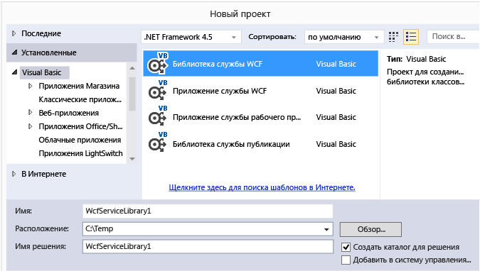

# Пошаговое руководство: Создание простой службы WCF в Windows Forms
В этом пошаговом руководстве демонстрируется создание простой службы [!INCLUDE[vsindigo](../data-tools/includes/vsindigo_md.md)], ее тестирование и последующий доступ к ней из приложения Windows Forms.  
  
[!INCLUDE[note_settings_general](../data-tools/includes/note_settings_general_md.md)]  
  
## Создание службы  
  
#### Создание простой службы WCF  
  
1.  В меню **Файл** выберите пункт **Создать** , а затем команду **Проект**.  
  
2.  В **новый проект** диалогового окна разверните **Visual Basic** или **Visual C#** и выберите команду **WCF**, за которым следует **WCF Библиотека службы**. Нажмите кнопку **ОК** для открытия проекта.  
  
       
  
    > [!NOTE]
    >  Будет создана работающая служба, которую можно протестировать и использовать. Следующие два действия демонстрируют, как можно изменить метод по умолчанию для использования другого типа данных. В реальном приложении необходимо также добавить к службе ее специальные функции.  
  
3.    
  
     В **обозревателе решений**, дважды щелкните файл IService1.vb или IService1.cs и найдите следующую строку:  
  
     [!code-csharp[WCFWalkthrough#4](../data-tools/codesnippet/CSharp/walkthrough-creating-a-simple-wcf-service-in-windows-forms_1.cs)]
     [!code-vb[WCFWalkthrough#4](../data-tools/codesnippet/VisualBasic/walkthrough-creating-a-simple-wcf-service-in-windows-forms_1.vb)]  
  
     Измените тип для `value` параметра строку:  
  
     [!code-csharp[WCFWalkthrough#1](../data-tools/codesnippet/CSharp/walkthrough-creating-a-simple-wcf-service-in-windows-forms_2.cs)]
     [!code-vb[WCFWalkthrough#1](../data-tools/codesnippet/VisualBasic/walkthrough-creating-a-simple-wcf-service-in-windows-forms_2.vb)]  
  
     В приведенном выше коде обратите внимание на атрибуты `<OperationContract()>` или `[OperationContract]` . Эти атрибуты обязательны для любого метода, предоставляемого службой.  
  
4.    
  
     В **обозревателе решений**, дважды щелкните файл Service1.vb или Service1.cs и найдите следующую строку:  
  
     [!code-vb[WCFWalkthrough#5](../data-tools/codesnippet/VisualBasic/walkthrough-creating-a-simple-wcf-service-in-windows-forms_3.vb)]
     [!code-csharp[WCFWalkthrough#5](../data-tools/codesnippet/CSharp/walkthrough-creating-a-simple-wcf-service-in-windows-forms_3.cs)]  
  
     Измените тип параметра значения на строку:  
  
     [!code-csharp[WCFWalkthrough#2](../data-tools/codesnippet/CSharp/walkthrough-creating-a-simple-wcf-service-in-windows-forms_4.cs)]
     [!code-vb[WCFWalkthrough#2](../data-tools/codesnippet/VisualBasic/walkthrough-creating-a-simple-wcf-service-in-windows-forms_4.vb)]  
  
## Тестирование службы  
  
#### Создание простой службы WCF  
  
1.  Нажмите клавишу **F5** для запуска службы. Объект **тестовый клиент WCF** будет показана форма, которая загрузит службу.  
  
2.  В **тестовый клиент WCF** форме, дважды щелкните **GetData()** метод **IService1**. **GetData** будет открыта вкладка.  
  
       
  
3.  В **запроса** выберите **значение** и введите `Hello`.  
  
       
  
4.  Нажмите кнопку **Invoke** кнопки. Если **предупреждение системы безопасности** отображается диалоговое окно, нажмите кнопку **ОК**. Результат будет отображаться в **ответ** поле.  
  
       
  
5.  На **файл** меню, нажмите кнопку **выхода** чтобы закрыть тестовую форму.  
  
## Доступ к службе  
  
#### Обращение к службе WCF  
  
1.  На **файл** последовательно выберите пункты **добавить** и нажмите кнопку **новый проект**.  
  
2.  В **новый проект** диалогового окна разверните **Visual Basic** или **Visual C#** , а затем выберите **Windows**, а затем выберите **Приложения Windows Forms в**. Нажмите кнопку **ОК** для открытия проекта.  
  
       
  
3.  Щелкните правой кнопкой мыши **WindowsApplication1** и нажмите кнопку **добавить ссылку на службу**. **Добавить ссылку на службу** появится диалоговое окно.  
  
4.  В **добавить ссылку на службу** диалоговое окно, нажмите кнопку **Discover**.  
  
       
  
     **Service1** будет отображаться в **служб** области.  
  
5.  Нажмите кнопку **ОК** для добавления ссылки на службу.  
  
#### Создание клиентского приложения  
  
1.  В **обозревателе решений**, дважды щелкните **Form1.vb** или **Form1.cs** открыть конструктор Windows Forms, если он еще не открыт.  
  
2.  Из **элементов**, перетащите `TextBox` управления `Label` управления и `Button` в форму элемент управления.  
  
       
  
3.  Дважды щелкните `Button` и добавьте следующий код в обработчик событий `Click`:  
  
     [!code-csharp[WCFWalkthrough#3](../data-tools/codesnippet/CSharp/walkthrough-creating-a-simple-wcf-service-in-windows-forms_5.cs)]
     [!code-vb[WCFWalkthrough#3](../data-tools/codesnippet/VisualBasic/walkthrough-creating-a-simple-wcf-service-in-windows-forms_5.vb)]  
  
4.  В **обозревателе решений**, щелкните правой кнопкой мыши **WindowsApplication1** и нажмите кнопку **Назначить запускаемым проектом**.  
  
5.  Нажмите клавишу **F5** для запуска проекта. Введите любой текст и нажмите кнопку. Будет отображена надпись «Введено:» с введенным ранее текстом.  
  
       
  
## См. также  
 [Службы Windows Communication Foundation и службы данных WCF в Visual Studio](../data-tools/windows-communication-foundation-services-and-wcf-data-services-in-visual-studio.md)