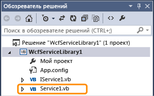
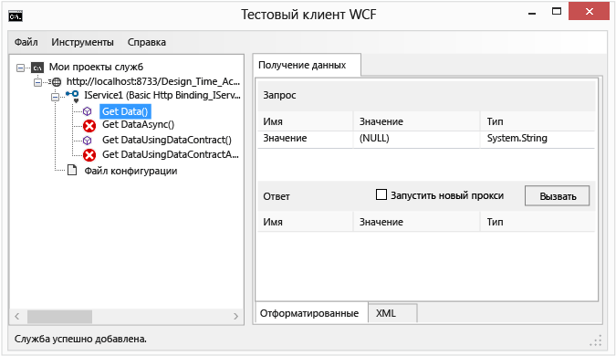
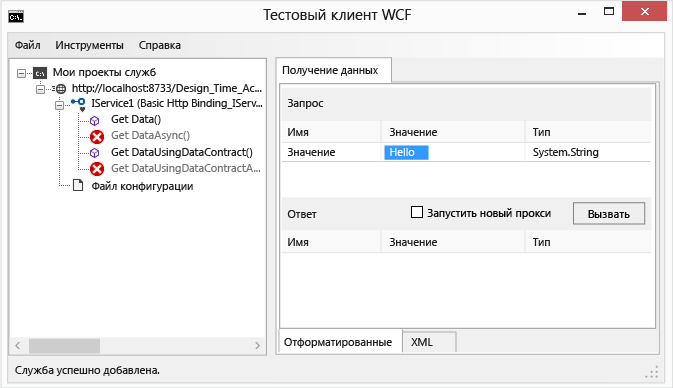
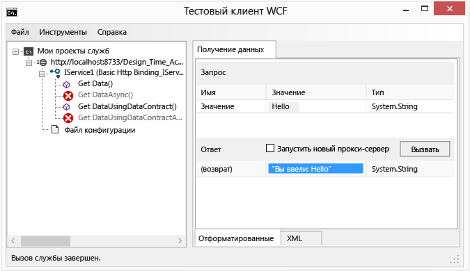
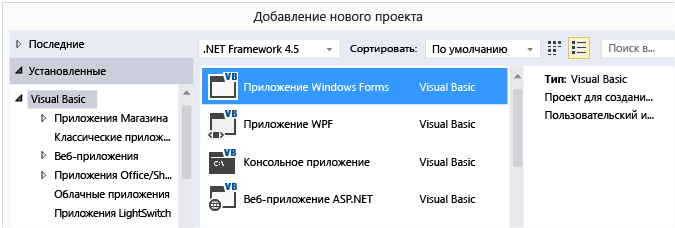
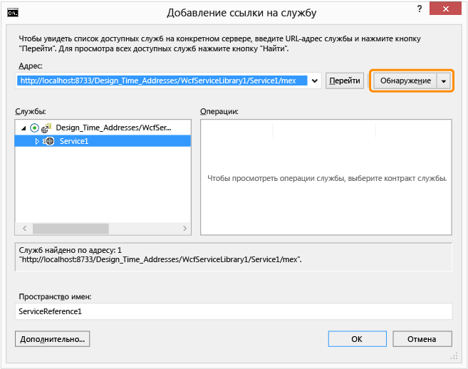

# Пошаговое руководство. Создание простой службы WCF в Windows Forms

В этом пошаговом руководстве показано, как создать простую службу Windows Communication Foundation (WCF), проверить ее, а затем получить к ней доступ из Windows Forms приложения.

[!INCLUDE[note_settings_general](../data-tools/includes/note_settings_general_md.md)]

## Создание службы

1. Запустите Visual Studio.

::: moniker range="vs-2017"

2. В меню **Файл** щелкните **Создать** > **Проект**.

3. В диалоговом окне **Новый проект** разверните узел **Visual Basic** или **Visual C#** и выберите **WCF**, а затем — **библиотеку служб WCF**.

4. Чтобы создать проект, нажмите кнопку **ОК** .

   

::: moniker-end

::: moniker range=">=vs-2019"

2. На начальном экране выберите **Создать проект**.

3. Введите **библиотеку служб WCF** в поле поиска на странице **Создание нового проекта** . Выберите шаблон C# или Visual Basic для **библиотеки службы WCF**, а затем нажмите кнопку **Далее**.

   

   > [!TIP]
   > Если шаблоны не отображаются, может потребоваться установить компонент **Windows Communication Foundation** Visual Studio. Выберите **установить дополнительные инструменты и компоненты** , чтобы открыть Visual Studio Installer. Перейдите на вкладку **отдельные компоненты** , прокрутите вниз до пункта **действия разработки**, а затем выберите **Windows Communication Foundation**. Нажмите кнопку **Изменить**.

4. На странице **Настройка нового проекта** нажмите кнопку **создать**.

::: moniker-end

   > [!NOTE]
   > Будет создана работающая служба, которую можно протестировать и использовать. Следующие два действия демонстрируют, как можно изменить метод по умолчанию для использования другого типа данных. В реальном приложении необходимо также добавить к службе ее специальные функции.

5. В **Обозреватель решений** дважды щелкните **IService1. vb** или **IService1.CS**.

   

   Найдите следующую строку:

   [!code-csharp[WCFWalkthrough#4](../data-tools/codesnippet/CSharp/walkthrough-creating-a-simple-wcf-service-in-windows-forms_1.cs)]
   [!code-vb[WCFWalkthrough#4](../data-tools/codesnippet/VisualBasic/walkthrough-creating-a-simple-wcf-service-in-windows-forms_1.vb)]

   Измените тип `value` параметра на String:

   [!code-csharp[WCFWalkthrough#1](../data-tools/codesnippet/CSharp/walkthrough-creating-a-simple-wcf-service-in-windows-forms_2.cs)]
   [!code-vb[WCFWalkthrough#1](../data-tools/codesnippet/VisualBasic/walkthrough-creating-a-simple-wcf-service-in-windows-forms_2.vb)]

   В приведенном выше коде обратите внимание на атрибуты `<OperationContract()>` или `[OperationContract]` . Эти атрибуты обязательны для любого метода, предоставляемого службой.

6. В **Обозреватель решений** дважды щелкните **Service1. vb** или **Service1.CS**.

   

   Найдите следующую строку:

   [!code-vb[WCFWalkthrough#5](../data-tools/codesnippet/VisualBasic/walkthrough-creating-a-simple-wcf-service-in-windows-forms_3.vb)]
   [!code-csharp[WCFWalkthrough#5](../data-tools/codesnippet/CSharp/walkthrough-creating-a-simple-wcf-service-in-windows-forms_3.cs)]

   Измените тип `value` параметра на String:

   [!code-csharp[WCFWalkthrough#2](../data-tools/codesnippet/CSharp/walkthrough-creating-a-simple-wcf-service-in-windows-forms_4.cs)]
   [!code-vb[WCFWalkthrough#2](../data-tools/codesnippet/VisualBasic/walkthrough-creating-a-simple-wcf-service-in-windows-forms_4.vb)]

## Тестирование службы

1. Нажмите клавишу **F5**, чтобы запустить службу. Откроется форма **тестового клиента WCF** , которая загружает службу.

2. В форме **Тестовый клиент WCF** дважды щелкните метод **GetData()** в разделе **IService1**. Откроется вкладка **GetData** .

     

3. В диалоговом окне **Запрос** выберите поле **Значение** и введите `Hello`.

     

4. Нажмите кнопку **Вызвать**. Если появится диалоговое окно " **предупреждение системы безопасности** ", нажмите кнопку **ОК**. Результат отобразится в поле **ответ** .

     

5. В меню **Файл** щелкните **Выход**, чтобы закрыть тестовую форму.

## Доступ к службе

### Ссылка на службу WCF

1. В меню **файл** выберите команду **Добавить** , а затем — **Новый проект**.

2. В диалоговом окне **Новый проект** разверните узел **Visual Basic** или **Visual C#** , выберите пункт **Windows**, а затем выберите **Windows Forms приложение**. Нажмите кнопку **ОК**, чтобы открыть проект.

     

3. Щелкните правой кнопкой мыши **WindowsApplication1** и выберите команду **Добавить ссылку на службу**. Откроется диалоговое окно **Добавить ссылку на службу**.

4. В диалоговом окне **Добавление ссылки на службу** выберите **Найти**.

     

     **Service1** отображается в области **службы** .

5. Нажмите кнопку **ОК**, чтобы добавить ссылку на службу.

### Создайте клиентское приложение

1. В **Обозревателе решений** дважды щелкните **Form1.vb** или **Form1.cs**, чтобы открыть конструктор Windows Forms, если он еще не открыт.

2. Из **Панели элементов** перетащите на форму элемент управления `TextBox`, элемент управления`Label` и элемент управления `Button`.

     

3. Дважды щелкните `Button` и добавьте следующий код в обработчик событий `Click`:

     [!code-csharp[WCFWalkthrough#3](../data-tools/codesnippet/CSharp/walkthrough-creating-a-simple-wcf-service-in-windows-forms_5.cs)]
     [!code-vb[WCFWalkthrough#3](../data-tools/codesnippet/VisualBasic/walkthrough-creating-a-simple-wcf-service-in-windows-forms_5.vb)]

4. В **Обозревателе решений** щелкните правой кнопкой мыши **WindowsApplication1** и выберите команду **Назначить запускаемым проектом**.

5. Нажмите клавишу **F5** , чтобы запустить проект. Введите любой текст и нажмите кнопку. На этой метке отображается введенный текст:.

     

## См. также

- [Windows Communication Foundation служб и WCF Data Services в Visual Studio](../data-tools/windows-communication-foundation-services-and-wcf-data-services-in-visual-studio.md)
