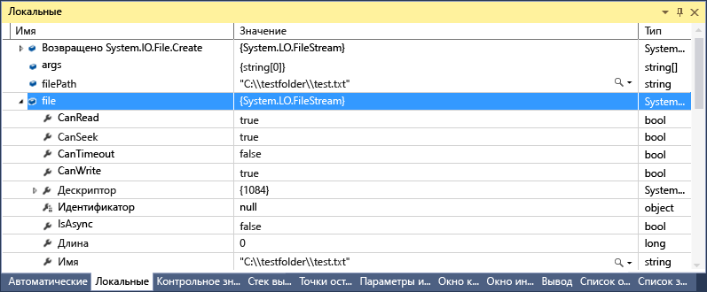
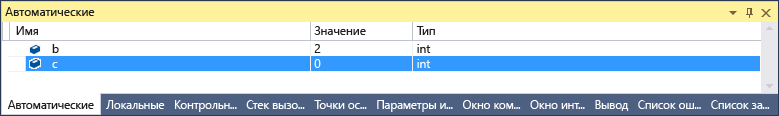
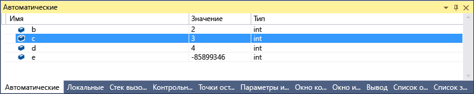

# <a name="inspect-variables-in-the-autos-and-locals-windows"></a>Проверка переменных в окнах "Видимые" и "Локальные" в Visual Studio

В окнах **Видимые** и **Локальные** отображаются значения переменных во время отладки. Окна доступны только во время сеанса отладки. В окне **Видимые** отображаются переменные, используемые вокруг текущей точки останова. В окне **Локальные** отображаются переменные, определенные в локальной области, которая обычно является текущей функцией или методом.

> [!NOTE]
> Если вы не знакомы с процессом отладки кода, перед выполнением задач в этой статье рекомендуется прочесть документ об [отладке для начинающих](../debugger/debugging-absolute-beginners.md) и статью [Методы и инструменты отладки](../debugger/write-better-code-with-visual-studio.md).

 Окно **Видимые** доступно для кода на C#, Visual Basic, C++ и Python, но не для кода на JavaScript или F#.

Чтобы открыть окно **Видимые**, во время отладки последовательно выберите пункты **Отладка** > **Окна** > **Видимые** или нажмите сочетание клавиш **CTRL**+**ALT**+**V** > **A**.

Чтобы открыть окно **Локальные**, во время отладки последовательно выберите пункты **Отладка** > **Окна** > **Локальные** или нажмите сочетание клавиш **ALT**+**4**.

> [!NOTE]
> Этот раздел относится к Visual Studio в Windows. Информацию о Visual Studio для Mac см. в статье [Визуализации данных в Visual Studio для Mac](/visualstudio/mac/data-visualizations).

## <a name="use-the-autos-and-locals-windows"></a>Использование окон "Видимые" и "Локальные"

Массивы и объекты отображаются в окнах **Видимые** и **Локальные** как элементы управления в виде дерева. Щелкните стрелку слева от имени переменной, чтобы развернуть представление и увидеть поля и свойства. Далее приведен пример объекта <xref:System.IO.FileStream?displayProperty=fullName> в окне **Локальные**.



Значение красного цвета в окне **Локальные** или **Видимые** означает, что значение изменилось с момента последнего вычисления. Изменение могло произойти во время предыдущего сеанса отладки или быть выполнено в окне.

По умолчанию в окнах отладчика используется десятичный числовой формат. Чтобы изменить его на шестнадцатеричный, щелкните правой кнопкой мыши в окне **Локальные** или **Видимые** и выберите пункт **Шестнадцатеричный вывод**. Это изменение распространяется на все окна отладчика.

## <a name="edit-variable-values-in-the-autos-or-locals-window"></a>Изменение значений переменных в окне "Видимые" и "Локальные"

Чтобы изменить значения большинства переменных в окнах **Видимые** или **Локальные**, дважды щелкните текущее значение и введите новое.

В качестве значения можно ввести выражение, например `a + b`. Отладчик принимает большинство допустимых выражений языка.

При работе с машинным кодом C++ может потребоваться определить контекст имени переменной. Дополнительные сведения см. в разделе [Оператор контекста (C++)](../debugger/context-operator-cpp.md).

>[!CAUTION]
>Перед изменением значений и выражений нужно оценить его возможные последствия. Возможны следующие проблемы.
>
>- Вычисление некоторых выражений может привести к изменению значения некоторой переменной или иным образом повлиять на состояние программы. Например, вычисление `var1 = ++var2` изменяет значения `var1` и `var2`. Такие выражения называют выражениями с [побочными эффектами](https://en.wikipedia.org/wiki/Side_effect_\(computer_science\)). Если вы не осведомлены о побочных эффектах, они могут привести к непредвиденным результатам.
>
>- Изменение значений с плавающей запятой может привести к незначительной погрешности, связанной с преобразованием дробных компонентов из десятичной формы в двоичную. Даже внешне кажущееся безвредным редактирование может привести к изменениям некоторых младших разрядов переменной с плавающей запятой.

::: moniker range=">= vs-2019" 
## <a name="search-in-the-autos-or-locals-window"></a>Поиск в окне "Видимые" или "Локальные"

Используя панель поиска над каждым окном, можно искать ключевые слова в столбцах "Имя", "Значение" и "Тип" в окнах **Видимые** или **Локальные**. Нажмите клавишу ВВОД или щелкните одну из стрелок, чтобы выполнить поиск. Чтобы отменить текущий поиск, нажмите значок "x" на панели поиска.

Для перехода между найденными совпадениями используйте стрелки влево и вправо (SHIFT + F3 и F3 соответственно).


Чтобы сделать поиск более или менее детальным, воспользуйтесь раскрывающимся списком **Поиск на уровень глубже** в верхней части окна **Видимые** или **Локальные**, чтобы выбрать число уровней детализации поиска во вложенных объектах. 

## <a name="pin-properties-in-the-autos-or-locals-window"></a>Закрепление свойств в окне "Видимые" или "Локальные"

> [!NOTE]
> Эта возможность поддерживается для .NET Core 3.0 или более поздних версий.

С помощью средства **Закрепляемые свойства** можно быстро проверить объекты на основе их свойств в окнах "Видимые" и "Локальные".  Чтобы воспользоваться этим средством, наведите указатель мыши на свойство и выберите значок булавки либо щелкните правой кнопкой мыши и в контекстном меню выберите пункт **Закрепить элемент в избранном**.  Свойство будет размещено в верхней части списка свойств объекта, а имя и значение свойства будут отображаться в столбце **Значение**.  Чтобы открепить свойство, щелкните значок булавки еще раз или в контекстном меню выберите пункт **Открепить элемент в избранном**.


При просмотре списка свойств объекта в окнах "Видимые" или "Локальные" можно также включать и отключать отображение имен свойств и отфильтровывать незакрепленные свойства.  Доступ к каждому параметру можно получить, нажимая кнопки на панели инструментов над окнами "Видимые" или "Локальные".


::: moniker-end

## <a name="change-the-context-for-the-autos-or-locals-window"></a>Изменение контекста для окна "Видимые" или "Локальные"

С помощью панели инструментов **Место отладки** можно выбирать нужную функцию, поток или процесс, что приводит к изменению контекста для окон **Видимые** и **Локальные**.

Чтобы включить панель инструментов **Место отладки**, щелкните в пустой части области панели инструментов и в раскрывающемся списке выберите **Место отладки** или последовательно выберите пункты **Вид** > **Панели инструментов** > **Место отладки**.

Задайте точку останова и начните отладку. При достижении точки останова выполнение приостанавливается и вы можете увидеть расположение на панели инструментов **Место отладки**.


## <a name="variables-in-the-autos-window-c-c-visual-basic-python"></a><a name="bkmk_whatvariables"></a> Переменные в окне "Видимые" (C#, C++, Visual Basic, Python)

При работе с разными языками в окне **Видимые** отображаются разные переменные.

- При использовании C# или Visual Basic в окне **Видимые** отображаются все переменные, используемые в текущей или предыдущей строках. Например, в коде C# или Visual Basic объявите следующие четыре переменные.

   ```csharp
       public static void Main()
       {
          int a, b, c, d;
          a = 1;
          b = 2;
          c = 3;
          d = 4;
       }
   ```

   Задайте точку останова в строке `c = 3;` и запустите отладчик. Когда выполнение приостановится, в окне **Видимые** будет отображено следующее.

   

   Значение `c` равно 0, так как строка `c = 3` еще не была выполнена.

- При использовании C++ в окне **Видимые** отображаются переменные, которые используются по крайней мере в трех строках до текущей строки (строки, в которой выполнение приостановлено). Например, в коде C++ объявите шесть переменных.

   ```C++
       void main() {
           int a, b, c, d, e, f;
           a = 1;
           b = 2;
           c = 3;
           d = 4;
           e = 5;
           f = 6;
       }
   ```

    Задайте точку останова в строке `e = 5;` и запустите отладчик. Когда выполнение остановится, в окне **Видимые** будет отображено следующее.

    

    Переменная `e` не инициализирована, так как код в строке `e = 5` еще не выполнен.

## <a name="view-return-values-of-method-calls"></a><a name="bkmk_returnValue"></a> View return values of method calls
 В коде .NET и C++ можно просматривать возвращаемые значения в окне **Видимые** при выполнении шага с обходом вызова метода или выходом из него. Просмотр возвращаемых значений вызова метода может быть полезен, если они не хранятся в локальных переменных. Метод можно использовать в качестве параметра или возвращаемого значения другого метода.

 Например, следующий код C# добавляет возвращаемые значения двух функций.

```csharp
static void Main(string[] args)
{
    int a, b, c, d;
    a = 1;
    b = 2;
    c = 3;
    d = 4;
    int x = sumVars(a, b) + subtractVars(c, d);
}

private static int sumVars(int i, int j)
{
    return i + j;
}

private static int subtractVars(int i, int j)
{
    return j - i;
}
```

Чтобы просмотреть возвращаемые значения вызовов методов `sumVars()` и `subtractVars()` в окне "Видимые", выполните следующие действия.

1. Установите точку останова на строке `int x = sumVars(a, b) + subtractVars(c, d);`.

1. Начните отладку и, когда выполнение приостановится в точке останова, выберите **Шаг с обходом** или нажмите клавишу **F10**. Вы увидите следующие возвращаемые значения в окне **Видимые**.

  ")

## <a name="see-also"></a>См. также

- [Что такое отладка?](../debugger/what-is-debugging.md)
- [Методы и инструменты отладки](../debugger/write-better-code-with-visual-studio.md)
- [Первое знакомство с отладкой](../debugger/debugger-feature-tour.md)
- [Окна отладчика](../debugger/debugger-windows.md)
