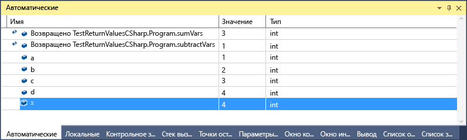

# Окна &quot;Видимые&quot; и &quot;Локальные&quot;
[!INCLUDE[vs2017banner](../code-quality/includes/vs2017banner.md)]

Окна **Видимые** \(во время отладки нажмите клавиши **CTRL\+ALT\+V, A** или выберите пункт **Отладка \> Окна \> Видимые**\) и **Локальные** \(во время отладки нажмите клавиши **CTRL\+ALT\+V, L** или выберите пункт **Отладка \> Окна \> Локальные**\) очень полезны, если вам нужно просмотреть значения переменных во время отладки. В окне **Локальные** отображаются переменные, которые определены в локальной области, которой обычно является функция или метод, выполняемые в текущий момент. В окне **Видимые** отображаются переменные, используемые вокруг текущей строки \(места, где остановилось выполнение отладчика\). Отображаемые переменные зависят от используемого языка. См. подраздел "Какие переменные отображаются в окне "Видимые"?" ниже.  
  
 Более подробную информацию об основных принципах отладки см. в разделе [Начало работы с отладчиком](../debugger/getting-started-with-the-debugger.md).  
  
## Просмотр объектов в окнах "Видимые" и "Локальные"  
 Массивы и объекты отображаются в окнах "Видимые" и "Локальные" как элементы управления типа "дерево". Щелкните стрелку слева от имени переменной, чтобы развернуть представление и увидеть поля и свойства. Ниже приведен пример объекта [FileStream](../Topic/FileStream%20Class.md) в окне **Локальные**.  
  
   
  
## Какие переменные отображаются в окне "Видимые"?  
 Окно **Видимые** можно использовать в коде C\#, Visual Basic и C\+\+. Окно **Видимые** не поддерживает JavaScript и F\#.  
  
 При использовании C\# или Visual Basic в окне **Видимые** отображаются все переменные, используемые в текущей или предыдущей строках. Предположим, что вы объявили четыре переменных и задали их значения следующим образом:  
  
```c#  
public static void Main() { int a, b, c, d; a = 1; b = 2; c = 3; d = 4; }  
```  
  
 Если установить точку останова в строке `c = 3` и запустить отладчик, то после остановки выполнения окно **Видимые** будет выглядеть так:  
  
   
  
 Обратите внимание на то, что значение `c` равно 0, так как строка `c = 3` еще не была выполнена.  
  
 При использовании C\+\+ в окне **Видимые** отображаются переменные, которые используются по крайней мере в трех строках до текущей строки \(строки, в которой выполнение остановилось\). Предположим, вы объявили шесть переменных:  
  
```cpp  
void main() { int a, b, c, d, e, f; a = 1; b = 2; c = 3; d = 4; e = 5; f = 6; }  
```  
  
 Если установить точку останова в строке `e = 5;` и запустить отладчик, то после остановки выполнения окно **Видимые** будет выглядеть так:  
  
   
  
 Обратите внимание на то, что переменная не инициализирована, так как код в строке  `e = 5;`  еще не выполнен.  
  
 При определенных условиях также можно увидеть возвращаемые значения функций и методов. См. раздел [Просмотр значений, возвращаемых при вызове методов](#bkmk_returnValue) ниже.  
  
##  <a name="bkmk_returnValue"></a> Просмотр значений, возвращаемых при вызове методов  
 В коде .NET и C\+\+ можно просматривать возвращаемые значения при выполнении шага с обходом вызова метода или выходом из него. Эта функция полезна в ситуации, когда результат вызова метода не сохраняется в локальной переменной \(например, в случае, когда метод используется в качестве параметра или возвращаемого значения другого метода\).  
  
 Следующий код C\# добавляет возвращаемые значения двух функций:  
  
```c#  
static void Main(string[] args) { int a, b, c, d; a = 1; b = 2; c = 3; d = 4; int x = sumVars(a, b) + subtractVars(c, d); } private static int sumVars(int i, int j) { return i + j; } private static int subtractVars(int i, int j) { return j - i; }  
  
```  
  
 Установите точку останова в строке int `x = sumVars(a, b) + subtractVars(c, d);` .  
  
 Начните отладку и, когда выполнение остановится в первой точке останова, нажмите клавишу **F10 \(шаг с обходом\)**. Окно **Видимые** должно выглядеть так:  
  
   
  
## Почему значения переменных иногда выделяются красным цветом в окнах "Локальные" и "Видимые"?  
 Иногда можно заметить, что значение переменной в окне **Локальные** или **Видимые** выделено красным цветом. Это означает, что значения изменились с момента последнего вычисления. Изменение могло произойти во время предыдущего сеанса отладки или быть внесено в окне.  
  
## Изменение числового формата окна переменных  
 По умолчанию используется десятичный числовой формат, но его можно изменить на шестнадцатеричный. Щелкните правой кнопкой мыши в окне **Локальные** или **Видимые** и выберите пункт **Шестнадцатеричный вывод**. Изменение распространяется на все окна отладчика.  
  
## Изменение значения в окне переменной  
 Вы можете изменять значения большинства переменных, отображаемых в окнах **Видимые**, **Локальные**, **Контрольные значения** и **быстрая проверка**. Информацию об окнах **Контрольные значения** и **Быстрая проверка** см. в разделе [Окна "Контрольные значения" и "Быстрая проверка"](../debugger/watch-and-quickwatch-windows.md). Просто дважды щелкните значение, которое нужно изменить, и введите новое значение.  
  
 В качестве значения можно ввести выражение, например `a + b`. Отладчик принимает большинство допустимых выражений языка.  
  
 При работе с машинным кодом C\+\+ может потребоваться определить контекст имени переменной. Для получения дополнительной информации см. [Оператор контекста \(C\+\+\)](../debugger/context-operator-cpp.md).  
  
 Однако при изменении значений следует соблюдать осторожность. Некоторые из возможных причин:  
  
-   Вычисление некоторых выражений может привести к изменению значения некоторой переменной или иным образом повлиять на состояние программы. Например, вычисление `var1 = ++var2` изменяет значения `var1` и `var2`.  
  
     Выражения, которые изменяют данные, — это [выражения с побочными эффектами](https://en.wikipedia.org/wiki/Side_effect_\(computer_science\)). Они могут привести к непредсказуемым результатам, если не учитывать возможные последствия их выполнения. Перед внесением такого изменения нужно оценить его последствия.  
  
-   Изменение значений с плавающей запятой может привести к незначительной погрешности, связанной с преобразованием дробных компонентов из десятичной формы в двоичную. Даже внешне кажущееся безвредным редактирование может привести к изменениям некоторых младших разрядов переменной с плавающей запятой.  
  
## Панель инструментов "Место отладки"  
 Используйте панель инструментов **Место отладки** для выбора нужной функции, потока или процесса. Задайте точку останова и начните отладку. \(Если эта панель инструментов не отображается, включите ее, щелкнув в пустой области панели инструментов. Должен появиться список панелей инструментов. Выберите панель **Место отладки**\). При достижении точки останова выполнение останавливается и появляется панель "Место отладки". На приведенном ниже рисунке это нижняя строка.  
  
   
  
 Вы также можете переключить контекст на другие вызовы функций, потоки или процессы, дважды щелкнув элемент в окне **Стек вызовов**, окне **Потоки** или окне **Процессы**.  
  
## См. также  
 [Окна отладчика](../debugger/debugger-windows.md)