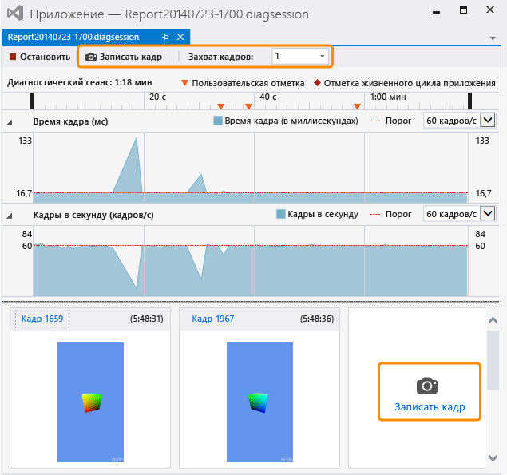

# Запись графических сведений
[!INCLUDE[vs2017banner](../code-quality/includes/vs2017banner.md)]

Захватывайте информацию графики из приложений DirectX, чтобы можно было использовать анализатор графики Visual Studio для диагностики проблем отрисовки и проблем производительности.  
  
## Захват графической информации  
 Захват графической информации представляет собой двухэтапный процесс.  На первом этапе приложение запускается в режиме диагностики графики и указываются один или более кадров для захвата подробной графической информации.  
  
#### Запуск приложения в режиме диагностики графики  
  
-   В строке меню выберите **Отладка**, **Графика**, **Начать диагностику**.  \(Сочетание клавиш: Alt\+F5\)  
  
-   На панели инструментов **Графика** нажмите кнопку **Начать диагностику**.  
  
 Во время выполнения приложения в режиме диагностики графики постоянно записывается определенная графическая информация; она включает настройку устройства, создания цепочки буферов, создание графических объектов и ресурсов и другие важные события, влияющие более чем на один кадр.  В то же время можно записать подробные сведения об определенных кадрах; к ним относятся вызовы рисования и операции вычислительного шейдера, а также объекты Direct3D и поддерживающие их ресурсы.  
  
#### Захват кадра  
  
-   В Visual Studio на панели инструментов **Графика** нажмите кнопку **Захватить кадр**.  
  
-   На клавиатуре нажмите клавишу PRINT SCREEN.  
  
    > [!NOTE]
    >  Во время выполнения приложения в режиме **Диагностика графика** клавишу PRINT SCREEN можно использовать только для захвата кадра графических данных; она не выполняет свою обычную функцию.  Это продолжается до завершения захвата графической информации \(как правило, в результате остановки отладки или выхода из приложения обычным образом\), даже если в фокусе находится другое приложение.  
  
-   В интерфейсе захвата Visual Studio нажмите кнопку **Захват кадра** над временной шкалой **Диагностический сеанс** или нажмите большую кнопку **Захват кадра** под дорожкой **Кадров в секунду** справа от ранее захваченных кадров.  Обе кнопки выделены на рисунке ниже.  
  
       
  
     Когда все будет готово для проверки захваченных кадров, запустите **анализатор графики Visual Studio**, перейдя по ссылке **Кадр...** над эскизами или дважды щелкнув эскиз.  
  
 Могут захватываться только целые кадры, поэтому при запуске захвата фактически записывается только графическая информация из следующего кадра.  Запись начинается сразу после вывода кадра, на котором был запущен захват, и заканчивается после вывода захваченного кадра.  Во время работы приложения в режиме диагностики графики можно захватить любое количество кадров.  Если никакие кадры не захватываются, журнал графики очищается.  
  
 Во время записи кадров Visual Studio отображает окно диагностики сеанса \(.diagsession\).  Если закрыть это окно, остановить отладку или закрыть приложение, записать в этот журнал новые кадры будет невозможно.  Чтобы получить больше информации графики, необходимо снова запустить приложение в режиме диагностики графики, чтобы начать новый журнал графики.  
  
### Параметры захвата диагностики графики  
 Вы можете настроить функцию захвата так, чтобы собирались стеки вызовов для всех событий графики или только для ограниченного их подмножества, отключить HUD захвата и включить или отключить режим совместимости захвата.  
  
##### Настройка параметров захвата диагностики графики  
  
1.  В строке меню в меню "Сервис" выберите пункт "Параметры".  Откроется диалоговое окно "Параметры".  
  
2.  В списке категорий параметров слева выберите пункт «Диагностика графики», а затем настройте необходимые параметры диагностики графики.  
  
     **Сбор стеков вызовов во время захвата \(захват замедляется\)**  
     Чтобы осуществлять сбор стеков вызовов, установите этот флажок.  По умолчанию стеки вызовов не собираются.  Чтобы захватывать стеки вызовов, убедитесь, что флажок **Collect call stacks during capture \(makes capture slower\)** \(Сбор стеков вызова при записи \(замедляет запись\)\) установлен в значение «Включить сбор данных», а затем установите либо параметр **for draw, dispatch, present, and perf markers** \(для маркеров рисования, диспетчеризации, представления и производительности\) \(это параметр по умолчанию\), чтобы собирать только наиболее важные стеки вызовов, либо параметр **for everything** \(для всех\), чтобы собирать все стеки вызовов.  Чтобы позднее прекратить сбор стеков вызовов, снимите флажок **Collect call stacks during capture \(makes capture slower\)** \(Сбор стеков вызова при записи \(замедляет запись\)\).  
  
     **Отключить HUD в игре во время захвата**  
     Установите этот флажок, чтобы отключить наложение HUD, которое обычно отображается в приложении, находящемся в режиме диагностики графики.  Чтобы отображать наложение HUD, снимите этот флажок.  
  
     **Захват в режиме совместимости**  
     Установите этот флажок, чтобы захватывать графические данные в режиме совместимости.  По умолчанию захват выполняется в режиме совместимости.  В режиме совместимости Direct3D не будет сообщать о том, что GPU поддерживает дополнительные функции помимо тех, которые определены на базовом функциональном уровне.  Это позволяет предотвратить использование в приложении, в котором выполняется захват, специфичных для оборудования расширений GPU и обеспечивает возможность воспроизведения журнала графики с помощью любого GPU, поддерживающего тот же или более высокий функциональный уровень.  Чтобы отключить режим совместимости, снимите этот флажок. Журналы, захваченные при отключенном режиме совместимости, не удастся воспроизвести на GPU, который не поддерживает дополнительные функции, использовавшиеся приложением во время захвата.  
  
     **Остановить запись при обнаружении ошибок в слоях пакетов SDK**  
     Установите этот флажок, чтобы немедленно останавливать запись при возникновении ошибок.  
  
## Удаленный захват графической информации  
 Графическую информацию можно захватывать из приложения, работающего на локальном компьютере или на удаленном компьютере или устройстве.  Удаленный захват поддерживается для компьютеров с [!INCLUDE[winblue_client_2](../debugger/includes/winblue_client_2_md.md)] и устройств [!INCLUDE[winblue_winrt_2](../debugger/includes/winblue_winrt_2_md.md)].  Чтобы захватить графическую информацию из приложения, выполняющегося удаленно, настройте проект для удаленной отладки, а затем запустите приложение в режиме диагностики графики, как было описано выше.  Приложение будет выполняться на удаленном компьютере, а захваченная графическая информация будет собираться на компьютере разработки.  
  
 Настройка проекта для удаленной отладки зависит от типа разрабатываемого приложения и используемого языка программирования.  Дополнительные сведения о настройке удаленной отладки приложений для Магазина Windows см. в разделе [Запуск приложений Магазина Windows на удаленном компьютере](../debugger/run-windows-store-apps-on-a-remote-machine.md).  Сведения о настройке удаленной отладки классических приложений Windows см. в разделе [Настройка удаленной отладки для проекта Visual Studio](../Topic/Set%20Up%20Remote%20Debugging%20for%20a%20Visual%20Studio%20Project.md).  
  
 Впоследствии удаленный компьютер или устройство можно использовать для воспроизведения графической информации независимо от того, где она была захвачена.  Дополнительные сведения см. в разделе [Практическое руководство. Изменение машины воспроизведения диагностики графики](../debugger/how-to-change-the-graphics-diagnostics-playback-machine.md).  
  
## Захват графических данных из командной строки  
 С помощью программы командной строки можно захватывать графические данные из любых приложений.  Программа DXCap.exe позволяет быстро захватывать и воспроизводить графические данные без использования Visual Studio или программного захвата.  В частности, программу DXCap.exe можно использовать для автоматизации или в тестовой среде.  Дополнительные сведения о DXCap.exe см. в разделе [Программа командной строки для захвата](../debugger/command-line-capture-tool.md).  
  
## См. также  
 [Пошаговое руководство. Запись графических сведений](../debugger/walkthrough-capturing-graphics-information.md)