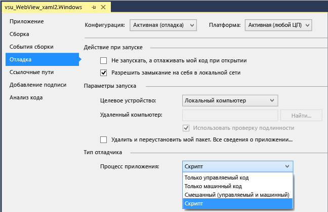
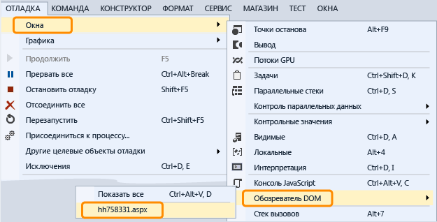

# Отладка элемента управления WebView в приложении UWP

 Для проверки и отладки элементов управления `WebView` в приложении среды выполнения Windows вы можете настроить Visual Studio на вложение отладчика скрипта при запуске приложения. У вас есть два способа взаимодействия с элементами управления `WebView` с помощью отладчика.

- Откройте [Проводник DOM](../debugger/quickstart-debug-html-and-css.md) для экземпляра `WebView`, а затем проверьте элементы DOM, изучите проблемы со стилями CSS и протестируйте динамические отрисовываемые изменения в стилях.

- Выберите веб-страницу или `iFrame`, отображаемые в экземпляре `WebView`, в качестве цели в окне [Консоль JavaScript](../debugger/javascript-console-commands.md?view=vs-2017&preserve-view=true), а затем осуществите взаимодействие с веб-страницей с помощью команд консоли. Консоль предоставляет доступ к текущему контексту выполнения скрипта.

### Добавление делений в код C#, Visual Basic, C++

1. В Visual Studio добавьте элемент управления `WebView` в свое приложение среды выполнения Windows.

2. В обозревателе решений откройте свойства для проекта, выбрав пункт **Свойства** в контекстном меню для проекта.

3. Выберите **Отладка**. В списке **Процесс приложения** выберите **Скрипт**.

     

4. Для версий Visual Studio, не являющихся выпуском Express, отключите JIT-отладку, выбрав **Сервис > Параметры > Отладка > JIT** и отключив JIT-отладку для скрипта (необязательно).

    > [!NOTE]
    > Отключив JIT-отладку, вы можете скрыть диалоговые окна для необработанных исключений, возникающих на некоторых страницах. В Visual Studio Express JIT-отладка всегда отключена.

5. Нажмите клавишу F5, чтобы начать отладку.

### Использование проводника DOM для проверки и отладки элемента управления WebView

1. (C#, Visual Basic, C++) Вложите отладчик скрипта в приложение. Инструкции см. в первом разделе.

2. Если вы еще этого не сделали, добавьте элемент управления `WebView` в свое приложение и нажмите клавишу F5 для запуска отладки.

3. Перейдите на страницу, содержащую элементы управления `Webview`.

4. Откройте окно проводника DOM для элемента управления `WebView`, выбрав **Отладка**, **Окна**, **Проводник DOM**, а затем выберите URL-адрес `WebView`, который хотите проверить.

     

     Проводник DOM, сопоставленный с `WebView`, отображается в Visual Studio в виде новой вкладки.

5. Просмотрите и измените элементы Live DOM и стили CSS, как описано в статье [Отладка стилей CSS с использованием проводника DOM](quickstart-debug-html-and-css.md).

### Использование окна консоли JavaScript для проверки и отладки элемента управления WebView

1. (C#, Visual Basic, C++) Вложите отладчик скрипта в приложение. Инструкции см. в первом разделе.

2. Если вы еще этого не сделали, добавьте элемент управления `WebView` в свое приложение и нажмите клавишу F5 для запуска отладки.

3. Откройте окно консоли JavaScript для элемента управления `WebView`, выбрав **Отладка**, **Окна**, **Консоль JavaScript**.

     Отображается окно консоли JavaScript.

4. Перейдите на страницу, содержащую элементы управления `Webview`.

5. В окне консоли выберите веб-страницу или `iFrame`, отображаемый элементом управления `WebView` в списке **Цель**.

     

    > [!NOTE]
    > С помощью консоли вы можете одновременно взаимодействовать с отдельным `WebView`, `iFrame`, контрактом отправки данных или рабочим веб-процессом. Каждый элемент требует отдельного экземпляра узла веб-платформы (WWAHost.exe). Одновременно можно взаимодействовать с одним узлом.

6. Просмотрите и измените переменные в приложении или используйте команды консоли, как описано в [кратком руководстве по отладке JavaScript](../debugger/quickstart-debug-javascript-using-the-console.md) и [командах консоли JavaScript](../debugger/javascript-console-commands.md?view=vs-2017&preserve-view=true).

## См. также

- [Краткое руководство. Отладка HTML и CSS](../debugger/quickstart-debug-html-and-css.md)