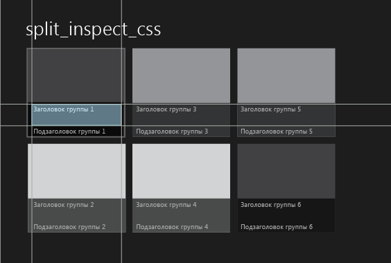
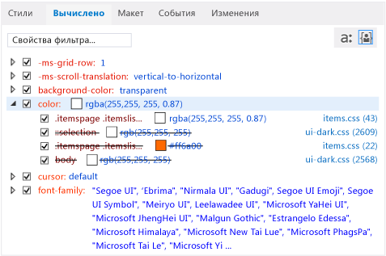

# Отладка стилей CSS с использованием проводника DOM
[!INCLUDE[vs2017banner](../code-quality/includes/vs2017banner.md)]

  
  
 При отладке приложений Магазина Windows, приложений Магазина Windows Phone и приложений, созданных с помощью инструментов Visual Studio для Apache Cordova, можно просматривать и изменять правила CSS для выбранных элементов DOM и их дочерних элементов.  
  
 На вкладках **Стиль** и **Вычисленные** проводника DOM отображаются правила CSS, применимые к выбранному элементу. Эти правила отображаются в порядке их применимости в конкретных ситуациях согласно правилам приоритета CSS. Правила в верхней части селектора или стиля на вкладке \(большинство конкретных правил\) применяются для выбранного элемента последними, а правила в нижней части — первыми. Применяемые правила переопределяют ранее примененные правила.  
  
 Вкладки **Стили**, **Вычисленные** и **Изменения** являются различными представлениями информации о стилях.  
  
-   Вкладка **Стили** служит для просмотра правил, упорядоченных по имени селектора CSS, например `html, body`. Эту вкладку также можно использовать для включения и отключения определенных стилей, изменения значений вручную и просмотра результатов этих изменений.  
  
-   Вкладка **Вычисленные** служит для просмотра вычисленных значений стиля. Например, если задать размер 1em, значение, вычисленное браузером Internet Explorer, может быть 16px. Стили на этой вкладке упорядочиваются по имени стиля, например `height`. Эту вкладку также можно использовать для включения и отключения определенных стилей, изменения значений вручную и просмотра результатов этих изменений.  
  
    > [!NOTE]
    >  В обновлении 2 для Visual Studio 2013 информация, отображаемая на вкладке **Трассировка**, была объединена со вкладкой **Вычисленные**, а сама вкладка **Трассировка** была удалена.  
  
-   Вкладка **Изменения** \(только для приложений Магазина Windows и Магазина Windows Phone\) служит для определения и отслеживания стилей CSS, измененных во время сеанса отладки.  
  
> [!TIP]
>  Изменения, вносимые для стилей на вкладках **Стили** и **Вычисленные**, не являются окончательными. При остановке отладки они удаляются. Чтобы изменить исходный код и перезагрузить страницы, не останавливая и не перезапуская отладчик, обновите приложение, нажав кнопку  \(**Обновить приложение Windows**\) на панели инструментов **Отладка** \(только для приложений Магазина Windows и Магазина Windows Phone\). Дополнительные сведения см. в разделе [Обновление приложения \(JavaScript\)](../debugger/refresh-an-app-javascript.md).  
  
## Пример исправления правила CSS  
 В этом примере продемонстрированы процедуры проверки правил CSS и отладки проблем со стилями. Предположим, нам нужно изменить цвет шрифта, используемого для заголовков групп в приложении, созданном на базе шаблона приложения с разделением [!INCLUDE[win8_appname_long](../debugger/includes/win8_appname_long_md.md)].  
  
> [!NOTE]
>  В этом примере показано приложение Магазина Windows, но все сведения о компонентах проводника DOM справедливы и для приложения Магазина Windows Phone, а также, за исключением вкладки "Изменения", для приложения, созданного с помощью инструментов Visual Studio для Apache Cordova.  
  
#### Просмотр и изменение правил CSS  
  
1.  Создайте приложение [!INCLUDE[win8_appname_long](../debugger/includes/win8_appname_long_md.md)] в Visual Studio, воспользовавшись JavaScript и HTML с шаблоном проекта приложения с разделением.  
  
2.  В окне **Обозреватель решений** откройте файл items.css. \(Этот файл можно найти в папке страниц.\)  
  
3.  Замените представленный ниже код CSS.  
  
    ```css  
    .itemspage .itemslist .item { -ms-grid-columns: 1fr; -ms-grid-rows: 1fr 90px; display: -ms-grid; height: 250px; width: 250px; }  
    ```  
  
     следующим кодом:  
  
    ```css  
    .itemspage .itemslist .item { -ms-grid-columns: 1fr; -ms-grid-rows: 1fr 90px; display: -ms-grid; height: 250px; width: 250px; color: #ff6a00; }  
    ```  
  
     Этот код добавляет стиль, устанавливающий цвет \#ff6a00 \(оранжевый\) для каждого элемента списка. Селектор CSS `.itemspage .itemslist .item` задает набор имен классов для элементов DIV в файле items.html, которые отображаются в виде вложенных элементов в модели DOM в реальном времени. Элемент DIV `item` задает элементы списка.  
  
4.  Выберите **Имитатор** в раскрывающемся списке на панели инструментов **Отладка** \(значение по умолчанию — **Локальный компьютер**\).  
  
       
  
5.  Нажмите клавишу F5, чтобы запустить приложение в режиме отладки.  
  
     После загрузки приложения просмотрите заголовки элементов списка, например **Заголовок группы: 1**. Цвет не изменился, поэтому попытка применить оранжевый цвет для заголовков не удалась. Определим причину неполадки и исправим ее с помощью вкладок CSS в проводнике DOM.  
  
    > [!TIP]
    >  После появления приложения в имитаторе расположите имитатор рядом с окном Visual Studio, чтобы можно было сразу видеть результаты выполняемых действий выбора и изменений, вносимых в стили CSS.  
  
6.  Переключитесь на Visual Studio и в проводнике DOM нажмите кнопку **Выбрать элемент** \(или сочетание клавиш CTRL\+B\). При этом изменится режим выбора, то есть элемент можно будет выбирать щелчком, и приложение появится на переднем плане. Вернуть предыдущий режим можно одним щелчком. Кнопка **Выбрать элемент**:  
  
    > [!TIP]
    >  Выбирать HTML\-элементы можно также непосредственно в проводнике DOM. Дополнительные сведения о выборе элементов см. в разделе [Краткое руководство по отладке HTML и CSS](../debugger/quickstart-debug-html-and-css.md).  
  
7.  В имитаторе наведите курсор на заголовок первого элемента в списке, **Заголовок группы: 1**, на левой панели начальной страницы. Заголовок выделяется, как показано ниже:  
  
       
  
    > [!NOTE]
    >  В эмуляторе Windows Phone выделение элементов с помощью наведения поддерживается лишь частично.  
  
8.  Щелкните выделенный заголовок. Проводник DOM автоматически выбирает соответствующий HTML\-элемент, который выглядит подобно показанному ниже.  
  
    ```html  
    <h4 class="item-title">Group Title: 1</h4>  
    ```  
  
     При выборе элемента H4 в проводнике DOM на вкладках этого проводника отображаются правила, связанные с элементом H4. Ниже показана вкладка **Вычисленные** с открытым свойством `color`:  
  
       
  
     В этом представлении содержится полезная информация о правилах, связанных со стилем `color`, например следующая:  
  
    -   Селектор CSS, измененный в файле items.css \(`.itemspage .itemslist .item`\), в последнем вычислении стиля не используется \(он содержится в зачеркнутом тексте\). Также не используются несколько других экземпляров стиля `color`.  
  
        > [!TIP]
        >  Для более длинных имен селекторов полное имя отображается в подсказке.  
  
    -   Конечное вычисленное значение CSS, `rgba(255, 255, 255, 0.87)`, задается специально для селектора CSS `.itemspage .itemslist .item .item-overlay .item-title`, который также определяется в файле items.css.  
  
        > [!TIP]
        >  Теперь, когда известно, где задается цвет заголовка, известно также, где можно изменить его. Однако изменения также можно проверять в проводнике DOM, не обновляя приложение, как показано в оставшихся пунктах.  
  
9. Снимите флажок для первого экземпляра стиля `color`, предназначенного для селектора `.itemspage .itemslist .item .item-overlay .item-title`. Теперь в имитаторе можно заметить, что цвет всех заголовков элементов изменился на оранжевый, как и было предусмотрено, и селектор, измененный в таблице CSS \(`.itemspage .itemslist .item`\), больше не переопределен \(то есть для него больше не используется зачеркнутый текст\). Ниже показана вкладка **Вычисленные** после снятия флажка.  
  
       
  
10. Перейдите на вкладку **Изменения**.  
  
     Вкладка **Изменения** служит для определения и отслеживания изменений стилей, вносимых во время сеанса отладки. На следующем рисунке показан селектор `.itemspage .itemslist .item .item-overlay .item-title` на вкладке **Изменения**, который сейчас переопределен.  
  
       
  
11. Также можно вручную изменять значения стилей CSS и сразу же видеть результаты на вкладке **Стили**.  
  
12. Перейдите на вкладку **Стили**.  
  
13. Откройте селектор стиля `.itemspage .itemslist .item .item-overlay .item-title`.  
  
14. Выделите первый экземпляр стиля `color`, а затем дважды щелкните значение свойства `rgb(255, 255, 255, 0.87)`.  
  
15. Для изменения этого значения воспользуйтесь клавиатурой. Измените значение на `rgb(255, 255, 0, 0.87)` и нажмите клавишу ВВОД. Цвета заголовков элементов в имитаторе изменятся на желтый.  
  
16. Чтобы внести изменения в исходный CSS\-файл, щелкните ссылку **items.css** на вкладке **Стили**. При этом откроется файл items.css, где можно изменить значение стиля `color` в коде приложения. Чтобы обновить приложение без остановки и перезапуска отладчика, нажмите кнопку  \(**Обновить приложение Windows**\) на панели инструментов **Отладка**.  
  
## См. также  
 [Краткое руководство по отладке HTML и CSS](../debugger/quickstart-debug-html-and-css.md)   
 [Отладка макета с использованием проводника DOM](../debugger/debug-layout-using-dom-explorer.md)   
 [Просмотр прослушивателей событий DOM](../debugger/view-dom-event-listeners.md)   
 [Поддержка и специальные возможности продукта](http://go.microsoft.com/fwlink/?LinkId=253502)