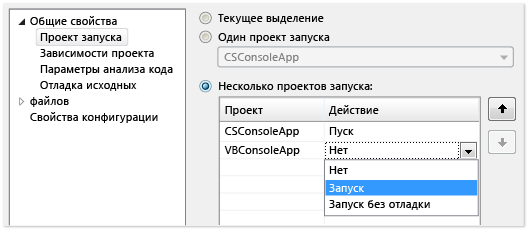
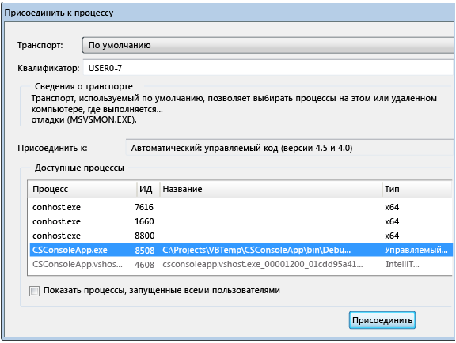
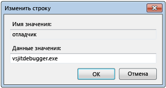
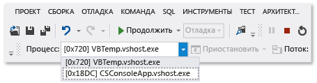

# Отладка нескольких процессов (C#, Visual Basic, C++)

В Visual Studio можно выполнять отладку решения, имеющего несколько процессов. Можно запускать несколько процессов, переключаться между ними, прерывать и возобновлять их выполнение, пошагово проходить исходный код, останавливать отладку, завершать отдельные процессы или отсоединяться от них.

## Запуск отладки с несколькими процессами

Если в решении Visual Studio могут независимо выполняться несколько проектов, можно выбрать проект, запускаемый отладчиком. Текущий запускаемый проект отображается полужирным шрифтом в **обозревателе решений**.

Чтобы изменить запускаемый проект, правой кнопкой мыши щелкните имя другого проекта в **обозревателе решений** и выберите **Назначить запускаемым проектом**.

Чтобы начать отладку проекта из **обозревателя решений** без его назначения запускаемым, щелкните проект правой кнопкой мыши и выберите **Отладка** > **Запустить новый экземпляр** или **Шаг с заходом в новый экземпляр**.

**Назначение запускаемого проекта или нескольких проектов на странице свойств решения**

1. Выберите решение в **обозревателе решений** и щелкните значок **Свойства** на панели инструментов либо щелкните это решение правой кнопкой мыши и выберите пункт **Свойства**.

1. На странице **Свойства** выберите **Общие свойства** > **Запускаемый проект**.

   

1. Выберите **Текущий выбор**, **Один запускаемый проект** и файл проекта либо выберите **Несколько запускаемых проектов**.

   Если выбран параметр **Несколько запускаемых проектов**, можно изменить порядок запуска и действие для каждого проекта: **Запустить**, **Запустить без отладки** или **Нет**.

1. Нажмите **Применить** или **OK**, чтобы применить изменения и закрыть диалоговое окно.

###  Присоединение к процессу

Отладчик также может *присоединяться* к приложениям, выполняемым в процессах вне Visual Studio, включая процессы на удаленных устройствах. После присоединения к приложению можно использовать отладчик Visual Studio. Функции отладки могут быть ограничены. Это зависит от того, было ли приложение построено с отладочной информацией, есть ли у вас доступ к исходному коду приложения и отслеживает ли JIT-компилятор отладочную информацию.

Дополнительные сведения см. в статье [Присоединение к выполняемым процессам](../debugger/attach-to-running-processes-with-the-visual-studio-debugger.md).

**Присоединение к выполняющемуся процессу:**

1. После запуска приложения выберите **Отладка** > **Присоединить к процессу**.

   

1. В диалоговом окне **Присоединение к процессу** выделите процесс в списке **Доступные процессы** и щелкните **Присоединить**.

>[!NOTE]
>Отладчик не присоединяется автоматически к дочернему процессу, который запущен отлаживаемым процессом, даже если дочерний проект находится в том же решении. Чтобы выполнить отладку дочернего процесса, подключитесь к дочернему процессу после его запуска или настройте редактор реестра Windows для запуска дочернего процесса в новом экземпляре отладчика.

###  Использование редактора реестра для автоматического запуска процесса в отладчике

В некоторых случаях может потребоваться отладить код запуска для приложения, которое запускается другим процессом. К ним относятся службы и действия пользовательской настройки. Можно запустить отладчик и автоматически присоединить его к приложению.

1. Запустите редактор реестра Windows с помощью *regedit.exe*.

1. В редакторе реестра перейдите к **параметрам выполнения файла HKEY_LOCAL_MACHINE\Software\Microsoft\Windows NT\CurrentVersion\Image**.

1. Выберите папку приложения, которое требуется запустить в отладчике.

   Если приложение не указано в качестве дочерней папки, щелкните правой кнопкой мыши **Параметры выполнения файла образа**, выберите **Создать** > **Раздел** и введите имя приложения. Или щелкните правой кнопкой мыши новый раздел в дереве, выберите команду **Переименовать**, а затем введите имя приложения.

1. Щелкните правой кнопкой мыши новый раздел в дереве и выберите **Создать** > **Строковое значение**.

1. Измените имя нового значения с **Новое значение № 1** на `debugger`.

1. Щелкните **debugger** правой кнопкой мыши и выберите **Изменить**.

   

1. В диалоговом окне **Изменение строки** введите`vsjitdebugger.exe` в поле **Данные значения**, а затем нажмите кнопку **OK**.

   

##  Отладка с несколькими процессами

При отладке приложения с несколькими процессами команды прерывания, пошагового выполнения и продолжения выполнения затрагивают все процессы по умолчанию. Например, когда процесс приостанавливается в точке останова, выполнение всех остальных процессов также приостанавливается. Можно изменить это принимаемое по умолчанию поведение, чтобы обрести больший контроль над целевыми объектами команд выполнения.

**Включение или отключение приостановки всех процессов при прерывании одного процесса**

- Выберите **Сервис** (или **Отладка**) > **Параметры** > **Отладка** > **Общие**, затем установите или снимите флажок **Прерывать все процессы при прерывании одного процесса**.

###  Команды прерывания, пошагового выполнения и продолжения выполнения

В следующей таблице описано действие команд отладки при установке или снятии флажка **Прерывать все процессы при прерывании одного процесса**.

|**Команда**|Selected|Выбор отменен|
|-|-|-|
|**Отладка**  > **Остановить все**|Все процессы приостанавливаются.|Все процессы приостанавливаются.|
|**Отладка** > **Продолжить**|Все процессы возобновляются.|Все приостановленные процессы возобновляются.|
|**Отладка** > **Шаг с заходом**, **Шаг с обходом** или **Шаг с выходом**|Во время выполнения шага текущего процесса все процессы выполняются.  Затем все процессы приостанавливаются.|Текущий процесс выполняется пошагово.  Приостановленные процессы возобновляются.  Выполняемые процессы продолжают выполняться.|
|**Отладка** > **Шаг с заходом (только текущий процесс)** , **Шаг с обходом (только текущий процесс)** или **Шаг с выходом (только текущий процесс)**|Н/Д|Текущий процесс выполняется пошагово. Остальные процессы сохраняют свое текущее состояние (остаются приостановленными или продолжают выполняться).|
|Окно исходного кода — **Точка остановка**|Все процессы приостанавливаются.|Приостанавливается только процесс окна исходного кода.|
|Окно исходного кода — **Выполнить до курсора** Окно исходного кода должно находиться в текущем процессе.|Все процессы выполняются, а процесс в окне исходного кода выполняется до курсора и приостанавливается. После этого приостанавливаются все остальные процессы.|Процесс в окне исходного кода выполняется до курсора. Остальные процессы сохраняют свое текущее состояние (остаются приостановленными или продолжают выполняться).|
|Окно **Процессы** > **Остановить процесс**|Н/Д|Выбранный процесс приостанавливается. Остальные процессы сохраняют свое текущее состояние (остаются приостановленными или продолжают выполняться).|
|Окно **Процессы** > **Продолжить процесс**|Н/Д|Выбранный процесс возобновляется. Остальные процессы сохраняют свое текущее состояние (остаются приостановленными или продолжают выполняться).|

###  Поиск исходных файлов и файлов символов (PDB)
Для перехода по исходному коду процесса отладчику требуется доступ к исходным файлам и файлам символов процесса. Дополнительные сведения см. в разделе [Указание файлов символов (PDB) и исходных файлов](../debugger/specify-symbol-dot-pdb-and-source-files-in-the-visual-studio-debugger.md).

Если не удается получить доступ к файлам процесса, для перемещения можно воспользоваться окном **Дизассемблирование**. Дополнительные сведения см. в разделе [Практическое руководство. использовать окно дизассемблирования](../debugger/how-to-use-the-disassembly-window.md).

###  Переключение между процессами

Во время отладки можно подключиться к нескольким процессам, но в любой момент времени только один из них будет активным в отладчике. Активный или *текущий* процесс можно выбрать с помощью панели инструментов **Место отладки** или в окне **Процессы**. Для переключения между процессами оба процесса должны находиться в режиме приостановки выполнения.

**Установка текущего процесса на панели инструментов "Место отладки"**

1. Чтобы открыть панель инструментов **Место отладки**, выберите **Вид** > **Панели инструментов** > **Место отладки**.

1. Во время отладки на панели инструментов **Место отладки** в раскрывающемся списке **Процесс** выберите процесс, который необходимо задать в качестве текущего.

   

**Установка текущего процесса в окне "Процессы"**

1. Чтобы открыть окно **Процессы**, во время отладки выберите **Отладка** > **Окна** > **Процессы**.

1. В окне **Процессы** текущий процесс будет отмечен желтой стрелкой. Дважды щелкните процесс, который необходимо задать в качестве текущего.

   

Переключение к процессу делает этот процесс текущим процессом для отладки. Статус текущего процесса отображается в окнах отладчика, и все команды пошагового выполнения влияют только на текущий процесс.

## Остановка отладки с несколькими процессами

По умолчанию при выборе **Отладка** > **Остановить отладку** отладчик завершается или отсоединяется от всех процессов.

- Если в отладчике был запущен текущий процесс, этот процесс завершается.

- Если отладчик был присоединен к текущему процессу, отладчик отсоединяется от процесса, не прекращая его выполнение.

Если отладка процесса запущена из решения Visual Studio, присоединитесь к другому уже запущенному процессу, затем выберите **Остановить отладку** и сеанс отладки завершится. Процесс, запущенный в Visual Studio, завершится, а процесс, к которому вы присоединились, продолжит выполняться.

Чтобы управлять влиянием параметра **Остановить отладку** на отдельный процесс, в окне **Процессы** щелкните процесс правой кнопкой мыши и выберите или снимите флажок **Отсоединиться при остановке отладки**.

>[!NOTE]
>Параметр отладчика **Прерывать все процессы при прерывании одного** не влияет на поведение остановки, завершения процессов и отсоединения от процессов.

### Команды остановки, окончания и отсоединения

В следующей таблице описаны действия команд отладчика по остановке, завершению и отсоединению с несколькими процессами.

|**Команда**|**Описание**|
|-|-|
|**Отладка** > **Остановить отладку**|Пока поведение не будет изменено в окне **Процессы**, процессы, запущенные отладчиком, завершаются, а присоединенные процессы отсоединяются.|
|**Отладка** > **Завершить все**|Все процессы завершаются.|
|**Отладка** > **Отсоединить все**|Отладчик отсоединяется от всех процессов.|
|Окно **Процессы** > **Отсоединить процесс**|Отладчик отсоединяется от выбранного процесса. Остальные процессы сохраняют свое текущее состояние (остаются приостановленными или продолжают выполняться).|
|Окно **Процессы** > **Завершить процесс**|Выбранный процесс завершается. Остальные процессы сохраняют свое текущее состояние (остаются приостановленными или продолжают выполняться).|
|Окно **Процессы** > **Отсоединиться при остановке отладки**|Если параметр выбран, **Отладка** > **Остановить отладку** отсоединяется от выбранного процесса.  Если параметр не выбран, **Отладка** > **Остановить отладку** завершает выбранный процесс. |

## См. также

- [Указание файлов символов (PDB) и файлов с исходным кодом](../debugger/specify-symbol-dot-pdb-and-source-files-in-the-visual-studio-debugger.md)
- [Подключение к выполняющимся процессам](../debugger/attach-to-running-processes-with-the-visual-studio-debugger.md)
- [Навигация по коду с помощью отладчика](../debugger/navigating-through-code-with-the-debugger.md)
- [JIT-отладка](../debugger/just-in-time-debugging-in-visual-studio.md)
- [Отладка многопоточных приложений](../debugger/debug-multithreaded-applications-in-visual-studio.md)