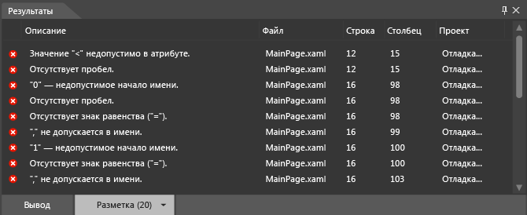

# Отладка XAML в Blend
[!INCLUDE[vs2017banner](../code-quality/includes/vs2017banner.md)]

Можно использовать инструменты в [!INCLUDE[blend_first](../debugger/includes/blend_first_md.md)] для отладки XAML в вашем приложении.  При сборке проекта все ошибки отображаются на панели **Результаты**.  Для поиска разметки, относящейся к ошибке, дважды щелкните ошибку.  Если для работы требуется больше места, можно скрыть панель **Результаты**, нажав клавишу F12.  
  
## Синтаксические ошибки  
 Синтаксические ошибки возникают, если XAML или файлы с выделенным кодом не соответствуют правилам форматирования данного языка.  Описание ошибки, которое может помочь понять, как ее исправить.  В этом списке также указывается имя файла и номер строки, где возникает ошибка.  Ошибки XAML перечислены на вкладке **Разметка** панели **Результаты**.  
  
> [!TIP]
>  Язык разметки XAML основан на XML и следует правилам синтаксиса XML.  
  
 Вот несколько наиболее распространенных причин синтаксических ошибок XAML:  
  
-   Ключевое слово написано неверно или используется неверный регистр символов.  
  
-   Отсутствуют кавычки вокруг атрибутов или текстовых строк.  
  
-   У элемента XAML отсутствует закрывающий тег.  
  
-   Элемент XAML расположен в недопустимом месте.  
  
 Дополнительные сведения об общем синтаксисе XAML см. в разделе [Руководство по базовому синтаксису XAML](http://go.microsoft.com/fwlink/?LinkId=329942).  
  
 Также можно обнаруживать и устранять простые синтаксические ошибки кода программной части, ошибки компиляции и ошибки времени выполнения в [!INCLUDE[blend_subs](../debugger/includes/blend_subs_md.md)].  Однако обнаружить и исправить ошибки кода программной части, возможно, легче в Visual Studio.  
  
### Отладка примера кода XAML  
 Приведенный ниже пример демонстрирует пошаговое выполнение простого сеанса отладки XAML в [!INCLUDE[blend_subs](../debugger/includes/blend_subs_md.md)].  
  
##### Создание проекта  
  
1.  В [!INCLUDE[blend_subs](../debugger/includes/blend_subs_md.md)] откройте меню **Файл** и выберите **Создать проект**.  
  
     В левой части диалогового окна **Создание проекта** отображается список типов проектов.  При выборе типа проекта щелчком связанные с этим типом шаблоны проектов отображаются справа.  
  
2.  В списке типов проектов щелкните **XAML \(Магазин Windows\)**.  
  
3.  В списке шаблонов проектов выберите пункт **Пустое приложение**.  
  
4.  В текстовом поле **Имя** введите `DebuggingSample`.  
  
5.  В текстовом поле **Расположение** проверьте расположение проекта.  
  
6.  В списке **Язык** выберите **Visual C\#** и нажмите **ОК** для создания проекта.  
  
7.  Щелкните правой кнопкой мыши на поверхности разработки, затем нажмите **Показать исходный код**, чтобы переключиться в представление **Разделить**.  
  
8.  Скопируйте следующий код, нажав ссылку **Копировать** в правом верхнем углу области кода.  
  
    ```  
    <Grid HorizontalAlignment="Left" Height="222" VerticalAlignment="Top>  
         <Button content="Button" x:Mame="Home" HorizontalAlignment="Left" VerticalAlignment="Top"/>  
         <Button Content="Button" HorizontalAlignment="Left" VerticalAlignment="Top" Margin="0,38,0,0">  
         <Button Content="Button" HorizontalAlignment="Left" VerticalAlignment="Top" Margin="0,75,0,0"/>  
         <Button Content="Button" HorizontalAlignment="Left" VerticalAlignment="Top" Margin="0,112,0,0"/>  
         <Button Content="Button" HorizontalAlignment="Left" VerticalAlignment="Top Margin="0,149,0,0"/>  
    </Grid>  
  
    ```  
  
9. Найдите элемент **Grid** по умолчанию и вставьте код между открывающим и закрывающим тегами **Grid**.  В результате ваш код должен выглядеть примерно следующим образом.  
  
    ```  
    <Grid Background="{ThemeResource ApplicationPageBackgroundThemeBrush}">  
         <Grid HorizontalAlignment="Left" Height="222" VerticalAlignment="Top>  
              <Button content="Button" x:Mame="Home" HorizontalAlignment="Left" VerticalAlignment="Top"/>  
              <Button Content="Button" HorizontalAlignment="Left" VerticalAlignment="Top" Margin="0,38,0,0">  
              <Button Content="Button" HorizontalAlignment="Left" VerticalAlignment="Top" Margin="0,75,0,0"/>  
              <Button Content="Button" HorizontalAlignment="Left" VerticalAlignment="Top" Margin="0,112,0,0"/>  
              <Button Content="Button" HorizontalAlignment="Left" VerticalAlignment="Top Margin="0,149,0,0"/>  
         </Grid>  
    </Grid>  
  
    ```  
  
10. Нажмите клавиши CTRL\+SHIFT\+B, чтобы выполнить сборку проекта.  
  
 Появится сообщение об ошибке, извещающее о том, что проект не может быть собран, а в нижней части приложения отобразится панель **Результаты** с перечнем ошибок.  
  
   
  
### Разрешение ошибок XAML  
 При обнаружении ошибок XAML поверхность разработки отображает оповещение о том, что проект содержит недопустимую разметку.  По мере разрешения ошибок перечень ошибок на панели **Результаты** обновляется.  После разрешения всех ошибок поверхность разработки включается, и на ней отображается ваше приложение.  
  
##### Устранение ошибок XAML  
  
1.  Двойным щелчком выберите первую ошибку в списке.  Описание гласит: "Значение «\<» недопустимо в атрибуте". При двойном щелчке по ошибке указатель находит соответствующее место в коде.  Элемент `<` перед `Button` допустим, а не является атрибутом, как говорится в сообщении об ошибке.  Если рассмотреть предыдущую строку кода, можно увидеть, что отсутствуют закрывающие кавычки для атрибута `Top`.  Введите закрывающие кавычки.  Обратите внимание, что перечень ошибок на панели **Результаты** обновляется в соответствии с внесенными изменениями.  
  
2.  Двойным щелчком выберите описание «"0" недопустим в начале имени». Судя по всему, элемент `Margin="0,149,0,0"` в полном порядке.  Тем не менее обратите внимание, что цветовая кодировка элемента `Margin` не соответствует другим элементам `Margin` в коде.  Поскольку в предыдущей паре имени и значения отсутствуют закрывающие кавычки \(`VerticalAlignment="Top`\), элемент `Margin="` читается как часть значения предыдущего атрибута, а 0 читается как начало пары имени и значения.  Введите закрывающие кавычки для `Top`.  Перечень ошибок на панели **Результаты** обновляется в соответствии с внесенными изменениями.  
  
3.  Двойным щелчком выберите оставшуюся ошибку — «Несоответствие закрывающего тега XML "Button"». Указатель расположен в закрывающем теге **Grid** \(`</Grid>`\), что означает, что ошибка находится внутри объекта `Grid`.  Обратите внимание, что у второго объекта `Button` отсутствует закрывающий тег.  После добавления закрывающего символа `/` список на панели **Результаты** обновляется.  Теперь, после устранения этих первоначальных ошибок, обнаруживаются две дополнительные ошибки.  
  
4.  Двойным щелчком выберите "Член "содержимое" не распознан или недоступен". Символ `c` в `content` должен быть в верхнем регистре.  Замените строчный символ "c" прописным "c".  
  
5.  Двойным щелчком выберите "Свойство "Mame" не существует в пространстве имен "http:\/\/schemas.microsoft.com\/winfx\/2006\/xaml". Вместо символа "M" в "Mame" должен стоять символ "N". Теперь, когда XAML может быть проанализирован, приложение появляется на рабочей области конструирования.  
  
       
  
     Нажмите Ctrl\+Shift\+B для сборки проекта и подтверждения того, что ошибок больше нет.  
  
## Отладка в Visual Studio  
 Для облегчения отладки кода в приложении можно открывать проекты [!INCLUDE[blend_subs](../debugger/includes/blend_subs_md.md)] в Visual Studio.  Чтобы открыть проект [!INCLUDE[blend_subs](../debugger/includes/blend_subs_md.md)] в Visual Studio, щелкните проект правой кнопкой мыши на панели **Проекты** и выберите команду **Изменить в Visual Studio**.  По завершении сеанса отладки в Visual Studio нажмите Ctrl\+Shift\+S для сохранения всех изменений, а затем переключитесь обратно в [!INCLUDE[blend_subs](../debugger/includes/blend_subs_md.md)].  Вам будет предложено перезагрузить проект.  Нажмите кнопку **Да для всех**, чтобы продолжить работу в [!INCLUDE[blend_subs](../debugger/includes/blend_subs_md.md)].  
  
 Дополнительные сведения об отладке приложения см. в разделе [Отладка приложений Магазина Windows в Visual Studio](http://go.microsoft.com/fwlink/?LinkId=329944).  
  
## Получение справки  
 Если при отладке приложения [!INCLUDE[blend_subs](../debugger/includes/blend_subs_md.md)] вам потребуется дополнительная помощь, вы можете выполнить поиск сообщений, относящихся к вашей проблеме, или разместить свой вопрос на [форумах сообщества создателей приложений для Магазина Windows](http://go.microsoft.com/fwlink/?LinkId=280308).