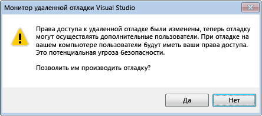

# Безопасность отладчика
Возможность отладки других процессов предоставляет очень широкие возможности, которые отсутствуют при обычной работе. В особенности это относится к удаленной отладке. Злонамеренный отладчик способен причинить масштабные повреждения отлаживаемой машине.

 Тем не менее, многие разработчики не осознают, что угроза безопасности может также распространяться и в обратном направлении. Вредоносный код в отлаживаемом процессе может подвергнуть опасности компьютер, на котором выполняется отладчик: есть ряд способов использования слабых мест защиты, против которых необходимо принимать меры.

## Рекомендации по безопасности
 Между отлаживаемым кодом и отладчиком существуют неявные доверительные отношения. Если требуется отладить какой-либо код, то и его выполнение так или иначе должно быть разрешено. В конечном счете, необходимо иметь возможность доверять тому, что требуется отлаживать. Если доверия к процессу нет, то не следует его отлаживать, или же отлаживать его нужно с того компьютера, с которого можно позволить себе рисковать, причем в изолированной среде.

 Чтобы снизить потенциальный ущерб от атак, отладка на рабочих компьютерах должна быть отключена. По этой же причине отладку никогда не следует включать на неопределенный срок.

### Безопасность при отладке управляемого кода
 Вот некоторые общие рекомендации, применимые к отладке любого управляемого кода.

- Будьте бдительны, присоединяясь к пользовательскому процессу, не заслуживающему доверия: присоединение означает, что вы ему доверяете. При попытке присоединения к такому процессу появится диалоговое окно предупреждения безопасности с запросом о том, действительно ли вы хотите его присоединить. К числу "доверенных пользователей" относится ваша учетная запись, а также ряд стандартных учетных записей пользователей, которые обычно определены на компьютерах с установленной платформой .NET Framework, например **aspnet**, **localsystem**, **networkservice** и **localservice**. Дополнительные сведения см. в статье [Предупреждение системы безопасности. Подключение к процессу, который принадлежит пользователю, не являющемуся доверенным, может быть опасным. Если следующие сведения не вызывают доверия, то не следует присоединяться к процессу](../debugger/security-warning-attaching-to-a-process-owned-by-an-untrusted-user.md).

- Будьте внимательны при загрузке проектов из Интернета и их открытии в [!INCLUDE[vsprvs](../code-quality/includes/vsprvs_md.md)]. Это рискованно даже без всякой отладки. Этим вы предполагаете, что проект и содержащийся в нем код заслуживают доверия.

  Для получения дополнительной информации см. [Debugging Managed Code](../debugger/debugging-managed-code.md).

### Безопасность при удаленной отладке
 Локальная отладка обычно более безопасна, чем удаленная. Удаленная отладка увеличивает общую контактную зону, безопасность которой в общем случае гарантировать нельзя.

 Для удаленной отладки используется Монитор удаленной отладки Visual Studio (msvsmon.exe); можно дать несколько рекомендаций по безопасности, касающихся его конфигурирования. Предпочтительной конфигурационной настройкой является выбор режима проверки подлинности Windows, так как режим без проверки подлинности небезопасен.

 

 Используя режим аутентификации Windows, принимайте во внимание тот факт, что предоставление недоверенному пользователю разрешения на подключение к msvsmon опасно, так как пользователю будут предоставлены все ваши разрешения на компьютере, где размещается msvsmon.

 Не отлаживайте неизвестные процессы на удаленном компьютере: существование потенциальной уязвимости может нарушить работу компьютера, на котором запущен отладчик, или привести к компрометации msvsmon. Если совершенно необходимо отладить неизвестный процесс, попробуйте отладить его локально, и используйте брандмауэр, чтобы локализовать любые потенциальные угрозы.

 Сведения о настройке msvsmon см. в разделе [Настройка удаленного отладчика](../debugger/remote-debugging.md#bkmk_setup).

### Безопасность при отладке веб-служб
 Локальная отладка безопаснее, но поскольку на веб-сервере скорее всего нет [!INCLUDE[vsprvs](../code-quality/includes/vsprvs_md.md)] , локальная отладка может быть нецелесообразной. Как правило, отладка веб-служб, за исключением отладки во время разработки, выполняется удаленно, поэтому рекомендации по безопасности удаленной отладки также применимы к отладке веб-служб. Ниже приведены дополнительные практические рекомендации. Для получения дополнительной информации см. [Debugging XML Web Services](/previous-versions/ms241873(v=vs.100)).

- Не запускайте отладку на веб-сервере, который подвергался угрозе.

- Убедитесь в безопасности веб-сервера, прежде чем вести на нем отладку. Если вы не уверены в его безопасности, не начинайте отладку.

- Будьте особенно осторожны при отладке веб-служб, к которым открыт Интернет-доступ.

### Внешние компоненты
 Следите за статусом доверия для внешних компонентов, с которыми взаимодействует ваша программа, особенно если автором кода являетесь не вы. Кроме того, принимайте во внимание компоненты, которые могут использоваться [!INCLUDE[vsprvs](../code-quality/includes/vsprvs_md.md)] или отладчиком.

### Символы и исходный код
 Два средства [!INCLUDE[vsprvs](../code-quality/includes/vsprvs_md.md)] , для которых необходим анализ безопасности:

- Сервер исходного кода, который предоставляет версии исходного кода из репозитория исходного кода. Он полезен, если у вас нет текущей версии исходного кода программы. [Предупреждение системы безопасности. Отладчик должен выполнить команду без доверия](../debugger/security-warning-debugger-must-execute-untrusted-command.md).

- Сервер символов, который служит для передачи символов, необходимых при отладке после сбоя системного вызова.

  См. статью [Указание файлов символов (.pdb) и файлов с исходным кодом в отладчике Visual Studio](../debugger/specify-symbol-dot-pdb-and-source-files-in-the-visual-studio-debugger.md).

## См. также
- [Параметры отладчика и подготовка](../debugger/debugger-settings-and-preparation.md)
- [Первое знакомство с отладчиком](../debugger/debugger-feature-tour.md)
- [Предупреждение системы безопасности. Подключение к процессу, который принадлежит пользователю, не являющемуся доверенным, может быть опасным. Если следующие сведения не вызывают доверия, то не следует присоединяться к процессу](../debugger/security-warning-attaching-to-a-process-owned-by-an-untrusted-user.md)
- [Предупреждение системы безопасности. Отладчик должен выполнить команду без доверия](../debugger/security-warning-debugger-must-execute-untrusted-command.md)