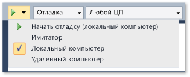
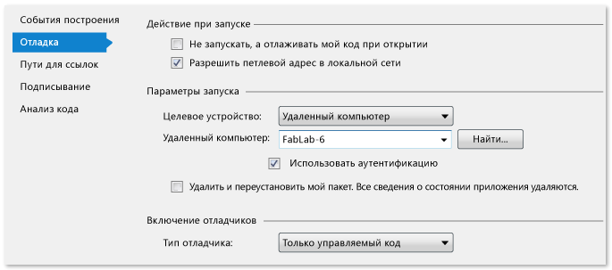

# Развертывание приложений UWP из Visual Studio

Возможности развертывания Visual Studio позволяют выполнить сборку и регистрацию приложений UWP, созданных с помощью Visual Studio на целевом устройстве. Конкретный способ регистрации зависит от того, является ли целевое устройство локальным или удаленным:

- Когда целевое устройство является локальным компьютером Visual Studio, Visual Studio регистрирует приложение из папки сборки.

- Когда целевое устройство является удаленным, Visual Studio копирует требуемые файлы на удаленный компьютер и регистрирует приложение на этом устройстве.

Развертывание осуществляется автоматически при отладке приложения из Visual Studio с помощью параметра **Начать отладку** (на клавиатуре нажмите F5) или **Запуск без отладки** (на клавиатуре нажмите CTRL+F5). Кроме того, приложение можно развернуть вручную. Это удобно в следующих сценариях:

- Специализированное тестирование на локальном или удаленном компьютере.

- Развертывание приложения, запускающего другое приложение, которое требует отладки.

- Развертывание приложения, для которого будет выполнена отладка, при его запуске другим приложением или методом.

##  Развертывание приложения UWP
 Ручное развертывание приложения не вызывает никаких сложностей:

1. Если вы выполняете развертывание на удаленное устройство, укажите имя или IP-адрес устройства на странице свойств для запускаемого проекта приложения. (Необходимые для этого действия перечислены ниже в этом разделе.)

2. На панели инструментов отладчика Visual Studio выберите цель развертывания в раскрывающемся списке рядом с кнопкой **Начать отладку** .

     

3. В меню **Сборка** выберите пункт **Развернуть**.

##  Указание удаленного устройства

**Необходимые компоненты**

На удаленном устройстве Windows 10 необходимо включить [режим разработчика](/windows/uwp/get-started/enable-your-device-for-development). На устройствах под управлением Windows 10 Creators Update или более поздней версии инструменты удаленной отладки автоматически устанавливаются при развертывании приложения. Дополнительные сведения см. в статье [Отладка установленного пакета приложения](../debugger/debug-installed-app-package.md).

> [!NOTE]
> В Windows 10 с версией старше Creators Update необходимо установить инструменты удаленной отладки для Visual Studio на удаленном устройстве, а также запустить удаленный отладчик.

Развертывание использует канал сети удаленного отладчика для отправки файлов приложения на удаленное устройство.

#### Порядок указания удаленного устройства

1. На странице свойств "Отладка" запускаемого проекта укажите имя или IP-адрес удаленной цели развертывания.

2. Чтобы открыть страницу свойств "Отладка", выберите проект в обозревателе решений и щелкните пункт **Свойства** в контекстном меню.

3. После этого выберите узел **Отладка** в окне страниц свойств.

4. Для параметра **Целевое устройство** выберите **Удаленный компьютер**.

5. В разделе **Удаленный компьютер** щелкните **Найти**.

6. Здесь можно ввести имя или IP-адрес удаленного устройства или выбрать нужное устройство в диалоговом окне **Удаленное подключение**.

    

    В диалоговом окне **Удаленное подключение** отображаются устройства в локальной подсети и все устройства, напрямую подключенные к компьютеру Visual Studio по кабелю Ethernet.

   **Указание удаленного устройства на странице проекта C++**

   

7. Выберите **Удаленный отладчик** из списка **Отладчик для запуска** .

8. Введите имя сети для удаленного устройства в поле **Имя компьютера** . Либо вы можете выбрать стрелку вниз в поле, чтобы выбрать устройство в диалоговом окне "Выбрать подключение к удаленному отладчику".

   **Указание удаленного устройства на странице проекта Visual C# или Visual Basic**

   

9. Выберите **Удаленный компьютер** из списка **Целевое устройство** .

10. Введите сетевое имя удаленного устройства в поле **Удаленный компьютер** или щелкните **Найти** , чтобы выбрать устройство в диалоговом окне **Выбрать подключение к удаленному отладчику** .

##  Параметры развертывания

Вы можете задать следующие параметры развертывания на странице свойств "Отладка" запускаемого проекта.

**Разрешить замыкание на себя в локальной сети**

В целях безопасности приложению UWP или [!INCLUDE[win8_appname_long](../debugger/includes/win8_appname_long_md.md)], установленному стандартным образом, не разрешается выполнять сетевые вызовы к устройству, на котором оно установлено. По умолчанию Visual Studio создает для развертываемого приложения исключение из этого правила. Это исключение позволяет тестировать процедуры обмена данными на одном компьютере. Прежде чем отправлять приложение в [!INCLUDE[win8_appstore_long](../debugger/includes/win8_appstore_long_md.md)], необходимо протестировать приложение без этого исключения.

Чтобы удалить исключение сетевого замыкания на себя из приложения, выполните следующие действия:

- На странице свойств отладки для C# и Visual Basic снимите флажок **Разрешить замыкание на себя в локальной сети**.

- На странице свойств отладки для C++ установите для параметра **Разрешить замыкание на себя в локальной сети** значение **Нет**.

**"Не запускать, а отлаживать мой код при открытии" (C# и Visual Basic) или "Запустить приложение" (C++)**

Чтобы настроить развертывание на автоматический запуск сеанса отладки при запуске приложения, выполните следующие действия:

- На странице свойств отладки для C# и Visual Basic установите флажок **Не запускать, а отлаживать мой код при открытии**.

- На странице свойств отладки для C++ установите для параметра **Запустить приложение** значение **Да**.

## См. также

- [Дополнительные параметры удаленного развертывания](/windows/uwp/debug-test-perf/deploying-and-debugging-uwp-apps#advanced-remote-deployment-options)
- [Отладка установленного пакета приложения](../debugger/debug-installed-app-package.md)
- [Запуск приложения из Visual Studio](debugging-windows-store-and-windows-universal-apps.md)
