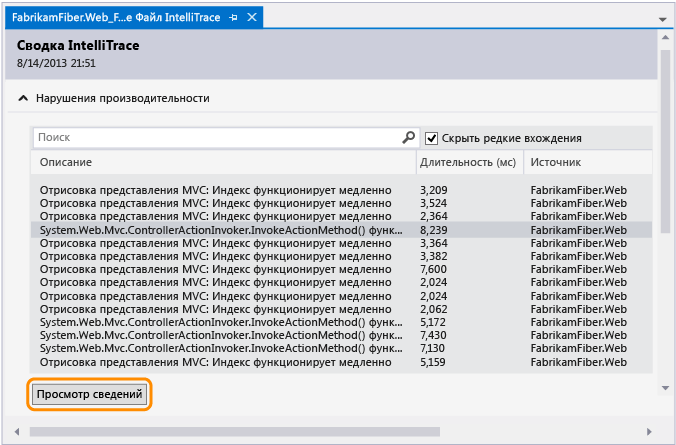
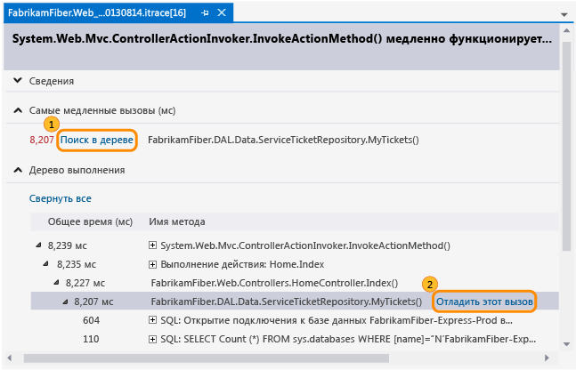
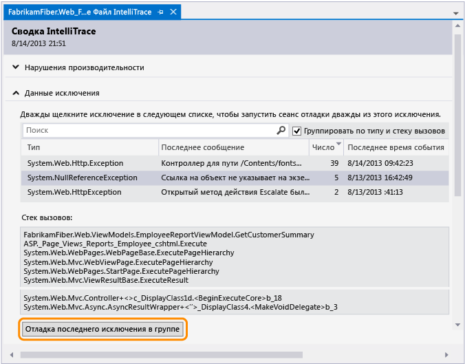
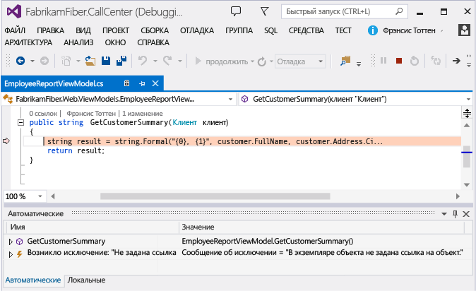

# <a name="diagnose-problems-after-deployment"></a>Диагностика проблем после развертывания
Для диагностики проблем в веб-приложении ASP.NET после развертывания с помощью IntelliTrace включите сведения о построении в свою версию, чтобы Visual Studio могла автоматически найти нужные исходные файлы и файлы символов, необходимые для отладки журнала IntelliTrace.  

 Если для управления IntelliTrace используется Microsoft Monitoring Agent, то также необходимо настроить параметры наблюдения за производительностью приложения на веб-сервере. При этом будет выполняться регистрация событий диагностики во время выполнения приложения и сохранение событий в файл журнала IntelliTrace. События можно будет просматривать в Visual Studio Enterprise (но не в выпусках Professional и Community), переходить к коду, в котором возникло событие, просматривать записанные значения на этот момент времени и переходить вперед и назад по выполнявшемуся коду. После того как вы найдете и исправите проблему, повторите цикл, включая сборку, выпуск и отслеживание выпуска, что позволит раньше выявлять и быстрее решать возможные проблемы в будущем.  

   

 **Вам потребуется:**  
  
-   Visual Studio 2017, Visual Studio 2015 или Team Foundation Server 2017, 2015, 2013, 2012 или 2010 для настройки сборки  
  
-   Microsoft Monitoring Agent для отслеживания приложения и регистрации данных диагностики;  

-   Visual Studio Enterprise (но не выпуск Professional или Community) для просмотра данных диагностики и отладки кода с помощью IntelliTrace.  

##  <a name="SetUpBuild"></a> Шаг 1: Включение в выпуск сведений о сборке  
 Настройте процесс построения для создания манифеста сборки (файл BuildInfo.config) для веб-проекта и включите этот манифест в выпуск. Этот манифест содержит сведения о проекте, систему управления версиями и систему сборки, которые использовались для создания конкретной сборки. Эти сведения позволяют Visual Studio найти соответствующий источник и символы после открытия журнала IntelliTrace для просмотра записанных событий.  

###  <a name="AutomatedBuild"></a> Создание манифеста сборки для автоматизированной сборки с помощью Team Foundation Server  
  
 Выполните эту процедуру, если вы используете систему управления версиями Team Foundation или Git.  
 
 ####  <a name="TFS2017"></a> Team Foundation Server 2017

 Настройте процесс сборки, чтобы добавить расположение источника, сборки и символов в манифест сборки (файл BuildInfo.config). Team Foundation Build автоматически создает этот файл и помещает его в выходную папку проекта.
  
1.  Если уже имеется конвейер сборки с помощью шаблона ASP.NET Core (.NET Framework), вы можете либо [изменить процесс сборки или создайте конвейер сборки.](/azure/devops/pipelines/get-started-designer)
  
     
  
2.  При создании нового шаблона, выберите шаблон ASP.NET Core (.NET Framework). 
  
       
  
3.  Укажите место сохранения файла символов (PDB-файла), чтобы исходный код индексировался автоматически.  
  
     Если используется пользовательский шаблон, убедитесь, что в нем есть действие для индексации исходного кода. Позднее вы добавите аргумент MSBuild, чтобы указать расположение для сохранения файлов символов.
  
       
  
     Дополнительные сведения о символах, см. в разделе [Публикация символьных данных](/azure/devops/pipelines/tasks/build/index-sources-publish-symbols).  
  
4.  Добавьте следующий аргумент MSBuild, чтобы включить расположения символов и TFS в файл манифеста сборки:  
  
     **/p:IncludeServerNameInBuildInfo = true**  
  
     Любой пользователь, у которого есть доступ к вашему веб-серверу, может видеть эти расположения в манифесте сборки. Убедитесь, что сервер системы управления версиями защищен.
  
6.  Запустите новую сборку.  
  
    Перейдите к [шаг 2: выпуск приложения](#DeployRelease)  

####  <a name="TFS2013"></a> Team Foundation Server 2013  
 Настройте процесс сборки, чтобы добавить расположение источника, сборки и символов в манифест сборки (файл BuildInfo.config). Team Foundation Build автоматически создает этот файл и помещает его в выходную папку проекта.  

1.  [Изменить процесс сборки или создайте конвейер сборки.](/azure/devops/pipelines/get-started-designer)  

       

2.  Выберите шаблон по умолчанию (TfvcTemplate.12.xaml) или свой собственный пользовательский шаблон.  

       

3.  Укажите место сохранения файла символов (PDB-файла), чтобы исходный код индексировался автоматически.  

     Если используется пользовательский шаблон, убедитесь, что в нем есть действие для индексации исходного кода. Позднее вы добавите аргумент MSBuild, чтобы указать расположение для сохранения файлов символов.  

       

     Дополнительные сведения о символах, см. в разделе [Публикация символьных данных](/azure/devops/pipelines/tasks/build/index-sources-publish-symbols).  

4.  Добавьте следующий аргумент MSBuild, чтобы включить расположения символов и TFS в файл манифеста сборки:  

     **/p:IncludeServerNameInBuildInfo = true**  
  
     Любой пользователь, у которого есть доступ к вашему веб-серверу, может видеть эти расположения в манифесте сборки. Убедитесь, что сервер системы управления версиями защищен.

5.  Если используется пользовательский шаблон, добавьте следующий аргумент MSBuild, чтобы указать расположение сохранения файла символов:  
  
     **/ p: buildsymbolstorepath =**\<*путь к символам*>  
  
       
  
     Кроме того, добавьте следующие строки в файл веб-проекта (CSPROJ-файл, VBPROJ-файл).  
  
    ```xml
    <!-- Import the targets file. Change the folder location as necessary. -->  
       <Import Project=""$(MSBuildExtensionsPath)\Microsoft\VisualStudio\v$(VisualStudioVersion)\BuildInfo\Microsoft.VisualStudio.ReleaseManagement.BuildInfo.targets" />  
  
    ```  

     Любой пользователь, у которого есть доступ к вашему веб-серверу, может видеть эти расположения в манифесте сборки. Убедитесь, что сервер системы управления версиями защищен.  

6.  Запустите новую сборку.  

    Перейдите к [шаг 2: выпуск приложения](#DeployRelease)  

####  <a name="TFS2012_2010"></a> Team Foundation Server 2012 или 2010  
 Выполните следующие действия, чтобы автоматически создать манифест сборки (файл BuildInfo.config) для проекта и поместить его в выходную папку проекта. Файл отображается в выходной папке как "*ИмяПроекта*.BuildInfo.config", однако после публикации приложения в папке развертывания ему присваивается имя "BuildInfo.config".  

1.  Установите любой выпуск Visual Studio 2013 на сервер сборки Team Foundation Build.  

2.  В процесс сборки укажите место сохранения символов, чтобы источник индексируется автоматически.  

     Если используется пользовательский шаблон, убедитесь, что в нем есть действие для индексации исходного кода.  

3.  Добавьте следующие аргументы MSBuild в ваш конвейер сборки:  

    -   **/p:VisualStudioVersion = 12.0**  

    -   **/p:MSBuildAssemblyVersion = 12.0**  

    -   **/TV:12.0**  

    -   **/p:IncludeServerNameInBuildInfo = true**  

    -   **/ p: buildsymbolstorepath =**\<*путь к символам*>  

4.  Запустите новую сборку.  

    Перейдите к [шаг 2: выпуск приложения](#DeployRelease)  

###  <a name="ManualBuild"></a> Создание манифеста сборки для ручной сборки с помощью Visual Studio  
 Выполните следующие действия, чтобы автоматически создать манифест сборки (файл BuildInfo.config) для проекта и поместить его в выходную папку проекта. Файл отображается в выходной папке как "*ИмяПроекта*.BuildInfo.config", однако после публикации приложения в папке развертывания ему присваивается имя "BuildInfo.config".  

1.  В **обозревателе решений**выгрузите веб-проект.  

2.  Откройте файл проекта (CSPROJ, VBPROJ). Добавьте следующие строки:  

    ```xml  
    <!-- **************************************************** -->  
    <!-- Build info -->  
    <PropertyGroup>  
       <!-- Generate the BuildInfo.config file -->  
       <GenerateBuildInfoConfigFile>True</GenerateBuildInfoConfigFile>  
       <!-- Include server name in build info -->   
       <IncludeServerNameInBuildInfo>True</IncludeServerNameInBuildInfo>   
       <!-- Include the symbols path so Visual Studio can find the matching deployed code when you start debugging. -->  
       <BuildSymbolStorePath><path to symbols></BuildSymbolStorePath>  
    </PropertyGroup>  
    <!-- **************************************************** -->  
    ```  

3.  Верните обновленный файл проекта.  

4.  Запустите новую сборку.  

    Перейдите к [шаг 2: выпуск приложения](#DeployRelease)  

###  <a name="MSBuild"></a> Создание манифеста сборки для ручной сборки с помощью MSBuild.exe  
 Добавьте следующие аргументы сборки при выполнении сборки:  

 **/p:GenerateBuildInfoConfigFile = true**  

 **/p:IncludeServerNameInBuildInfo = true**  

 **/ p: buildsymbolstorepath =**\<*путь к символам*>  

##  <a name="DeployRelease"></a> Шаг 2: Выпуск приложения  
 Если вы используете [пакет Web.Deploy](https://msdn.microsoft.com/library/dd394698.aspx) который был создан процессом сборки для развертывания приложения, манифест сборки автоматически переименовывается из "*имя_проекта*. BuildInfo.config» в «BuildInfo.config» и помещается в той же папке файл Web.config приложения на веб-сервере.  

 Если для развертывания приложения вы используете другие методы, убедитесь, что манифест сборки переименован из "*ИмяПроекта*.BuildInfo.config" в "BuildInfo.config" и помещен в ту же папку, что и файл Web.config приложения, на веб-сервере.  

## <a name="step-3-monitor-your-app"></a>Шаг 3. Отслеживание работы приложения  
 Настройте отслеживание производительности приложения на веб-сервере, чтобы отслеживать проблемы приложения, регистрировать события диагностики и сохранять эти события в файл журнала IntelliTrace. См. в разделе [мониторинг проблем развертывания для выпуска](../debugger/using-the-intellitrace-stand-alone-collector.md).  

##  <a name="InvestigateEvents"></a> Шаг 4: Поиск проблемы  
 Для просмотра записанных событий и отладки кода с помощью IntelliTrace на компьютере разработки или другом компьютере должна быть установлена среда Visual Studio Enterprise. Кроме того, можно использовать такие средства, как CodeLens, карты отладчика и карты кода, которые помогают диагностировать проблемы.  

### <a name="open-the-intellitrace-log-and-matching-solution"></a>Открытие журнала IntelliTrace и соответствующего решения  

1.  Откройте журнал IntelliTrace (iTrace-файл) в Visual Studio Enterprise. При наличии Visual Studio Enterprise вы также можете дважды щелкнуть этот файл на том же компьютере.  

2.  Выберите **Открыть решение** , чтобы автоматически открыть соответствующее решение или проект в Visual Studio, если проект не был собран в составе решения. [Вопрос журнале IntelliTrace отсутствуют сведения о моем развернутом приложении. Почему это произошло? Что делать?](#InvalidConfigFile)  

     Visual Studio автоматически откладывает все ожидающие изменения при открытии соответствующего решения или проекта. Чтобы получить дополнительные сведения об этом наборе отложенных изменений, откройте окно **Выходные данные** или **Team Explorer**.  

     Перед внесением любых изменений убедитесь в наличии правильного источника. Если используется ветвление, вы можете работать в ветви, которая отличается от той, в которой Visual Studio находит соответствующий исходный код, например в ветви выпуска.  

       

     При наличии рабочей области, сопоставленной с этим решением или проектом, Visual Studio выбирает эту рабочую область для размещения найденного исходного кода.  

       

     В противном случае выберите другую рабочую область или создайте новую рабочую область. Visual Studio сопоставит всю ветвь с этой рабочей областью.  

       

     Для создания рабочей области с конкретными сопоставлениями или с именем, отличным от имени вашего компьютера, щелкните **Управление**.  

     [Вопрос. Почему Visual Studio сообщает, что выбранная рабочая область недопустима?](#IneligibleWorkspace)  

     [Вопрос. Почему невозможно продолжать работу, пока не выбрана коллекция командных или другую коллекцию?](#ChooseTeamProject)  

### <a name="diagnose-a-performance-problem"></a>Диагностика проблемы с производительностью  

1.  В области **Нарушения производительности**просмотрите записанные события производительности, значения их полного времени выполнения и другие данные о событиях. Затем более глубоко проанализируйте методы, вызванные во время конкретного события производительности.  

       

     Можно также просто открыть событие двойным щелчком.  

2.  На странице событий проверьте время исполнения этих вызовов. Найдите медленный вызов в дереве выполнения.  

     Самые медленные вызовы отображаются в отдельном разделе, если имеется несколько вызовов, вложенных друг в друга или размещенных иначе.  

     Разверните этот вызов, чтобы просмотреть все вложенные вызовы и значения, которые были записаны в тот момент времени. Затем запустите отладку из этого вызова.  

       

     Можно также дважды щелкнуть вызов.  

     Если метод находится в коде приложения, Visual Studio перейдет к этому методу.  

       

     Теперь можно просмотреть другие записанные значения, стек вызова, выполнить пошаговый обход кода или использовать окно **IntelliTrace** для [перемещения вперед или назад "по времени" между другими методами](../debugger/intellitrace.md) , которые вызывались в ходе этого события производительности. [Что такое, что означают остальные события и сведения в журнале IntelliTrace? ](../debugger/using-saved-intellitrace-data.md) [Что еще можно сделать отсюда?](#WhatElse) [Нужны дополнительные сведения о событиях производительности?](https://blogs.msdn.microsoft.com/devops/2013/09/20/performance-details-in-intellitrace/)  

### <a name="diagnose-an-exception"></a>Диагностика исключения  

1.  В области **Данные исключения**просмотрите записанные события исключения, их типы, сообщения и время возникновения исключений. Чтобы глубже изучить код, начните отладку из последнего события в группе исключений.  

       

     Можно также просто открыть событие двойным щелчком.  

     Если исключение возникло в коде приложения, Visual Studio переходит туда, где произошло исключение.  

       

     Теперь можно просмотреть другие записанные значения, стек вызова или использовать окно **IntelliTrace** для [перемещения вперед или назад "по времени" между различными записанными событиями](../debugger/intellitrace.md), по связанному с ними коду и значениям, записанным в эти моменты времени. [Что такое, что означают остальные события и сведения в журнале IntelliTrace?](../debugger/using-saved-intellitrace-data.md)  

###  <a name="WhatElse"></a> Что еще можно сделать отсюда?  

-   [Получить дополнительные сведения об этом коде](../ide/find-code-changes-and-other-history-with-codelens.md). Чтобы найти ссылки на этот код, журнал изменений, связанные ошибки, рабочие элементы, проверки кода или модульные тесты — все без выхода из редактора — используйте индикаторы CodeLens в редакторе.  

       

       

-   [Сопоставьте текущую позицию в коде, во время отладки.](../debugger/map-methods-on-the-call-stack-while-debugging-in-visual-studio.md) Чтобы визуально отслеживать методы, которые были вызваны во время сеанса отладки, сопоставьте стек вызовов.  

       

###  <a name="FAQ"></a> Вопросы и ответы  

####  <a name="WhyInclude"></a> В. Зачем включать сведения о проекте, системы управления версиями, сборке и символах в выпуск?  
 Visual Studio использует эти сведения для поиска соответствующего решения и исходного кода для отлаживаемого выпуска. Когда вы открываете журнал IntelliTrace и выбираете событие для запуска отладки, Visual Studio использует символы для поиска и отображения участка кода, в котором возникло событие. Вы можете просмотреть записанные значения и перейти вперед или назад по ходу выполнения кода.  

 Если вы используете TFS и эти сведения не находится в манифест сборки (файл BuildInfo.config), Visual Studio выполняет поиск соответствующего исходного кода и символы на подключенном TFS. Если Visual Studio не удается найти правильный экземпляр TFS или соответствующий исходный код, вы получите запрос на выбор другого экземпляра TFS.  

####  <a name="InvalidConfigFile"></a> Вопрос журнале IntelliTrace отсутствуют сведения о моем развернутом приложении. Почему это произошло? Что делать?  
 Это могло произойти при выполнении развертывания с компьютера разработки или в отсутствие подключения к TFS во время развертывания.  

1.  Перейдите в папку развертывания проекта.  

2.  Найдите и откройте манифест сборки (файл BuildInfo.config).  

3.  Убедитесь, что файл содержит необходимые сведения:  

-   **ProjectName**  

     Имя проекта в Visual Studio. Пример:  

    ```xml
    <ProjectName>FabrikamFiber.Extranet.Web</ProjectName>  
    ```  

-   **SourceControl**  

-   Сведения о системе управления версиями и следующих обязательных свойствах:  

    -   **TFS**  

        -   **ProjectCollectionUri**— URI для Team Foundation Server и коллекции проектов  

        -   **ProjectItemSpec**— путь к файлу проекта приложения (CSPROJ- или VBPROJ-файлу)  

        -   **ProjectVersionSpec**— версия проекта  

         Пример:  

        ```xml
        <SourceControl type="TFS">  
           <TfsSourceControl>  
              <ProjectCollectionUri>http://fabrikamfiber:8080/tfs/FabrikamFiber</ProjectCollectionUri>  
              <ProjectItemSpec>$/WorkInProgress/FabrikamFiber/FabrikamFiber.CallCenter/FabrikamFiber.Web/FabrikamFiber.Web.csproj</ProjectItemSpec>  
              <ProjectVersionSpec>LFabrikamFiber_BuildAndPublish_20130813@$/WorkInProgress</ProjectVersionSpec>  
           </TfsSourceControl>  
        </SourceControl>  
        ```  

    -   **Git**  

        -   **GitSourceControl**— расположение схемы **GitSourceControl**  

        -   **RepositoryUrl**— URI для Team Foundation Server, коллекции проектов и репозитория Git  

        -   **ProjectPath**— путь к файлу проекта приложения (CSPROJ- или VBPROJ-файлу)  

        -   **CommitId**— идентификатор фиксации  

         Пример:  

        ```xml
        <SourceControl type="Git">   
           <GitSourceControl xmlns="http://schemas.microsoft.com/visualstudio/deploymentevent_git/2013/09">  
              <RepositoryUrl>http://gittf:8080/tfs/defaultcollection/_git/FabrikamFiber</RepositoryUrl>  
              <ProjectPath>/FabrikamFiber.CallCenter/FabrikamFiber.Web/FabrikamFiber.Web.csproj</ProjectPath>  
              <CommitId>50662c96502dddaae5cd5ced962d9f14ec5bc64d</CommitId>  
           </GitSourceControl>  
        </SourceControl>  
        ```  

-   **Сборка**  

     Сведения о системе сборки, `"TeamBuild"` или `"MSBuild"`, и следующие обязательные свойства:  

    -   **BuildLabel** (для TeamBuild) — имя и номер сборки. Эта метка также используется в качестве имени события развертывания. Дополнительные сведения о номерах сборки см. в разделе [использование номеров сборок для назначения завершенным сборкам значимых имен](/azure/devops/pipelines/build/options).  

    -   **SymbolPath** (рекомендуется) — список URI для расположений символов (PDB-файлов), разделяемых точкой с запятой. Эти URI могут быть URL-адресами или UNC-путями. Это упрощает для Visual Studio поиск соответствующих символов для содействия в отладке.  

    -   **BuildReportUrl** (для TeamBuild) — расположение отчета о сборке в TFS  

    -   **BuildId** (для TeamBuild) — URI для сведений о сборке в TFS. Этот URI также используется в качестве идентификатора события развертывания. Если не используется TeamBuild, идентификатор должен быть уникальным.  

    -   **BuiltSolution**— путь к файлу решения, используемый Visual Studio для поиска и открытия соответствующего решения. Это содержимое свойства **SolutionPath** MsBuild.  

     Пример:  

    -   **TFS**  

        ```xml
        <Build type="TeamBuild">  
           <MsBuild>  
              <BuildLabel kind="label">FabrikamFiber_BuildAndPublish_20130813.1</BuildLabel>  
              <SymbolPath>\\fabrikamfiber\FabrikamFiber.CallCenter\Symbols</SymbolPath>  
              <BuildReportUrl kind="informative, url" url="http://fabrikamfiber:8080/tfs/FabrikamFiber/_releasePipeline/FindRelease?buildUri=fabrikamfiber%3a%2f%2f%2fBuild%2fBuild%2f448">Build Report Url</BuildReportUrl>  
              <BuildId kind="id">1c4444d2-518d-4673-a590-dce2773c7744,fabrikamfiber:///Build/Build/448</BuildId>  
              <BuiltSolution>$/WorkInProgress/FabrikamFiber/FabrikamFiber.CallCenter/FabrikamFiber.CallCenter.sln</BuiltSolution>  
           </MsBuild>  
        </Build>  
        ```  

    -   **Git**  

        ```xml
        <Build type="MSBuild">   
           <MSBuild>  
              <SymbolPath>\\gittf\FabrikamFiber.CallCenter\Symbols</SymbolPath>  
              <BuiltSolution>/FabrikamFiber.CallCenter/FabrikamFiber.CallCenter.sln</BuiltSolution>  
           </MSBuild>  
        </Build>  
        ```  

####  <a name="IneligibleWorkspace"></a> Вопрос. Почему Visual Studio сообщает, что выбранная рабочая область недопустима?  
 **О.** Выбранная рабочая область не имеет сопоставлений между папкой системы управления версиями и локальной папкой. Чтобы создать сопоставление для данной рабочей области, щелкните **Управление**. В противном случае выберите уже сопоставленную рабочую область или создайте новую рабочую область.  

   

####  <a name="ChooseTeamProject"></a> Вопрос. Почему невозможно продолжать работу, пока не выбрана коллекция командных или другую коллекцию?  
 **О.** Это может произойти по любой из следующих причин.  

-   Программа Visual Studio не подключена к TFS.  

       

-   Программа Visual Studio не нашла решение или проект в текущей командной коллекции.  

     Если в файле манифеста сборки (\<*имя_проекта*>. BuildInfo.config) не задано, где Visual Studio может найти соответствующий источник, Visual Studio использует подключенном TFS поиск соответствующего решения или проекта. Если в текущей командной коллекции нет соответствующего источника, Visual Studio предложит подключиться к другой командной коллекции.  

-   Visual Studio не нашла решение или проект в коллекции, указанной в файле манифеста сборки (\<*имя_проекта*>. BuildInfo.config).  

     Указанный сервер TFS может больше не содержать соответствующий источник или вовсе не существовать в результате перехода на новый TFS. Если указанный TFS не существует, по прошествии приблизительно минуты время ожидания Visual Studio завершится, и вам будет предложено подключиться к другой коллекции. Для продолжения подключитесь к правильному серверу TFS.  

       

####  <a name="WhatWorkspace"></a> Вопрос. что такое рабочая область?  
 **Ответ** вашей [рабочей области хранится копия источника](/azure/devops/repos/tfvc/create-work-workspaces) , можно разрабатывать и тестировать его отдельно до возврата работы. Если у вас еще нет рабочей области, которая сопоставлена с найденным решением или проектом, то Visual Studio предложит выбрать доступную рабочую область или создать новую рабочую область с именем вашего компьютера в качестве имени рабочей области по умолчанию.  

####  <a name="UntrustedSymbols"></a> Вопрос. Почему появляется сообщение о ненадежных символах?  
   

 **Ответ** это сообщение появляется, когда путь к символам в файле манифеста сборки (\<*имя_проекта*>. BuildInfo.config) не включен в список доверенных путей к символам. Добавить путь к списку путей к символам можно в параметрах отладчика.
