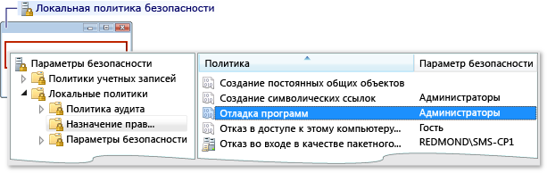
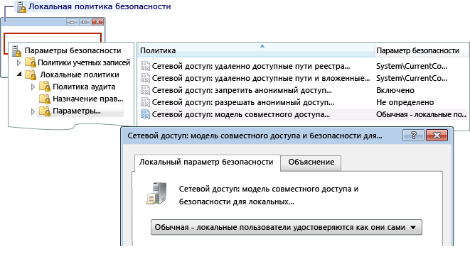

# Ошибка: сбой удаленного входа в систему рабочей группы
Текст сообщения об ошибке:

 "Ошибка входа в систему: неизвестное имя пользователя или неверный пароль"

 **Причина**

 Эта ошибка может возникать, если в ходе отладки с компьютера рабочей группы произведена попытка подключиться к удаленному компьютеру. Возможные причины:

- На удаленном компьютере нет учетной записи с соответствующими именем и паролем.

- Если компьютер с Visual Studio и удаленный компьютер принадлежат рабочим группам, эта ошибка может возникать из-за установленного по умолчанию значения параметра **Локальной политики безопасности** на удаленном компьютере. Значение по умолчанию для параметра **Локальная политика безопасности**: **Гостевая — локальные пользователи удостоверяются как гости**. Чтобы производить отладку при таких настройках, необходимо установить параметр на удаленном компьютере в значение **Обычная — локальные пользователи удостоверяются как они сами**.

> [!NOTE]
>  Для выполнения следующих задач необходимо иметь права администратора.

### Открытие окна "Локальная политика безопасности"

1. Запустите оснастку консоли управления (MMC) **secpol.msc**. Для этого введите secpol.msc в поле поиска файлов, в поле "Выполнить" или в командной строке.

### Добавление назначений прав пользователя

1. Откройте окно **Локальная политика безопасности**.

2. Разверните папку **Локальные политики**.

3. Выберите **Назначение прав пользователя**.

4. В столбце **Политика** дважды щелкните **Отладка программ** для просмотра назначений текущей локальной групповой политики в диалоговом окне **Параметр локальной политики безопасности**.

     

5. Чтобы добавить новых пользователей, нажмите кнопку **Добавить пользователя или группу**.

### Изменение модели безопасности и совместного использования

1. Откройте окно **Локальная политика безопасности**.

2. Разверните папку **Локальные политики**.

3. Нажмите **Параметры безопасности**.

4. В **политики** столбец, дважды щелкните **сетевой доступ: Модель совместного доступа и безопасности для локальных учетных записей**.

5. В **сетевой доступ: Модель совместного доступа и безопасности для локальных учетных записей** диалоговом окне измените значение на **Обычная — локальные пользователи удостоверяются как они сами** и нажмите кнопку **применить** кнопки.

     

## См. также
- [Ошибки удаленной отладки и их устранение](../debugger/remote-debugging-errors-and-troubleshooting.md)
- [Remote Debugging](../debugger/remote-debugging.md)