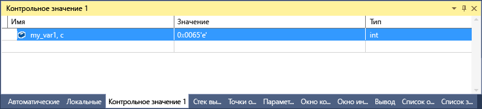

# <a name="format-specifiers-for-c-in-the-visual-studio-debugger"></a>Описатели формата для C++ в отладчике Visual Studio
С помощью описателей формата можно изменить формат, в котором значение отображается в окнах **Контрольные значения**, **Видимые** и **Локальные**.

Кроме того, описатели формата можно использовать в окне **интерпретации**, окне **команд**, [точках трассировки](../debugger/using-breakpoints.md#BKMK_Print_to_the_Output_window_with_tracepoints) и даже в окнах исходного кода. Если вы приостановите выполнение на выражении в одном из этих окон, результат отобразится в [подсказке DataTip](../debugger/view-data-values-in-data-tips-in-the-code-editor.md). В подсказке по данным указывается описатель формата.

> [!NOTE]
> Одновременно с изменением подсистемы отладки в собственном отладчике Visual Studio был добавлен ряд новых описателей формата. Некоторые старые описатели были удалены. Прежний отладчик все еще используется при отладке взаимодействия (то есть смешанной отладке машинного и управляемого кода) с использованием C++/CLI.

## <a name="set-format-specifiers"></a>Настройка описателей формата
Мы применим следующий пример кода:

```C++
int main() {
    int my_var1 = 0x0065;
    int my_var2 = 0x0066;
    int my_var3 = 0x0067;
}
```

Добавьте переменную `my_var1` в окно **контрольных значений** в процессе отладки, поочередно выбрав элементы **Отладка** > **Окна** > **Контрольные значения** > **Контрольное значение 1**. Щелкните переменную правой кнопкой мыши и выберите пункт **Шестнадцатеричный вывод**. Теперь в окне **Контрольные значения** отобразится значение 0x0065. Чтобы представить это значение в виде символа, а не целочисленного значения, сначала щелкните его правой кнопкой мыши и снимите флажок **Шестнадцатеричное отображение**. Теперь добавьте описатель символьного формата **, c**, в колонку **Имя** после имени переменной. Теперь в столбце **Значение** отобразится **101 'e'** .



::: moniker range=">= vs-2019" 
Чтобы просмотреть список доступных описателей формата и выбрать из него нужный вариант, добавьте запятую (,) к значению в окне **Контрольные значения**. 


::: moniker-end

## <a name="format-specifiers"></a><a name="BKMK_Visual_Studio_2012_format_specifiers"></a> Описатели формата
В приведенных ниже таблицах представлены описатели формата, которые можно использовать в Visual Studio. Описатели, выделенные полужирным шрифтом, поддерживаются только для нового отладчика, но не для отладки взаимодействия с использованием C++/CLI.

::: moniker range=">= vs-2019" 

|Описатель|Формат|Исходное контрольное значение|Отображаемое значение|
|---------------|------------|--------------------------|---------------------|
|d|Десятичное целое число|0x00000066|102|
|o|Восьмеричное целое число без знака|0x00000066|000000000146|
|x<br /><br /> **h**|шестнадцатеричное целое число|102|0xcccccccc|
|X<br /><br /> **H**|шестнадцатеричное целое число|102|0xcccccccc|
|xb<br /><br /> **hb**|шестнадцатеричное целое число (без 0x в начале)|102|cccccccc|
|Xb<br /><br /> **Hb**|шестнадцатеричное целое число (без 0x в начале)|102|CCCCCCCC|
|b|двоичное целое число без знака|25|0b00000000000000000000000000011001|
|bb|двоичное целое число без знака (без 0b в начале)|25|00000000000000000000000000011001|
|й|экспоненциальное представление|25000000|2.500000e+07|
|н|более короткое экспоненциальное представление или представление с плавающей запятой|25000000|2.5e+07|
|c|одиночный символ|0x0065|101 'e'|
|s|Строка const char* (с кавычками)|\<location> "hello world"|"Здравствуй, мир!"|
|**sb**|Строка const char* (без кавычек)|\<location> "hello world"|Здравствуй, мир!|
|s8|Строка UTF-8|\<location> "This is a UTF-8 coffee cup ☕"|"This is a UTF-8 coffee cup ☕"|
|**s8b**|Строка UTF-8 (без кавычек)|\<location> "hello world"|Здравствуй, мир!|
|su|Строка в Юникоде (кодировка UTF-16) (с кавычками)|\<location> L"hello world"|L"Здравствуй, мир!"<br /><br /> u"Здравствуй, мир!"|
|sub|Строка в Юникоде (кодировка UTF-16) (без кавычек)|\<location> L"hello world"|Здравствуй, мир!|
|bstr|Двоичная строка BSTR (с кавычками)|\<location> L"hello world"|L"Здравствуй, мир!"|
|env|Блок среды (строка, завершающаяся двумя символами null)|\<location> L"=::=::\\\\"|L"=::=::\\\\\\0=C:=C:\\\\windows\\\\system32\\0ALLUSERSPROFILE=...|
|**s32**|Строка UTF-32 (с кавычками)|\<location> U"hello world"|u"Здравствуй, мир!"|
|**s32b**|Строка UTF-32 (без кавычек)|\<location> U"hello world"|Здравствуй, мир!|
|**en**|enum|Суббота(6)|Суббота|
|**hv**|Тип указателя — указывает на то, что проверяемое значение указателя является результатом выделения кучи для массива, например `new int[3]`.|\<location>{\<first member>}|\<location>{\<first member>, \<second member>, ...}|
|**na**|Подавляет адрес указателя на объект в памяти.|\<location>, {элемент=значение...}|{элемент=значение…}|
|**nd**|Отображает только данные базового класса без учета производных классов.|`(Shape*) square` включает данные базового и производных классов|Отображает только данные базового класса|
|hr|Код ошибки HRESULT или Win32 Этот описатель больше не нужен для значений HRESULT, так как отладчик декодирует их автоматически.|S_OK|S_OK|
|wc|Флаг класса Window|0x0010|WC_DEFAULTCHAR|
|wm|Номера сообщений Windows|16|WM_CLOSE|
|nr|Игнорировать элемент Raw View|
|nvo|Показать элемент "необработанное представление" только для числовых значений|
|!|Формат raw (необработанные данные), все настройки представлений типов данных не учитываются|\<customized representation>|4|

::: moniker-end

::: moniker range="vs-2017" 

|Описатель|Формат|Исходное контрольное значение|Отображаемое значение|
|---------------|------------|--------------------------|---------------------|
|d|Десятичное целое число|0x00000066|102|
|o|Восьмеричное целое число без знака|0x00000066|000000000146|
|x<br /><br /> **h**|шестнадцатеричное целое число|102|0xcccccccc|
|X<br /><br /> **H**|шестнадцатеричное целое число|102|0xcccccccc|
|c|одиночный символ|0x0065, c|101 'e'|
|s|Строка const char* (с кавычками)|\<location> "hello world"|"Здравствуй, мир!"|
|**sb**|Строка const char* (без кавычек)|\<location> "hello world"|Здравствуй, мир!|
|s8|Строка UTF-8|\<location> "This is a UTF-8 coffee cup ☕"|"This is a UTF-8 coffee cup ☕"|
|**s8b**|Строка UTF-8 (без кавычек)|\<location> "hello world"|Здравствуй, мир!|
|su|Строка в Юникоде (кодировка UTF-16) (с кавычками)|\<location> L"hello world"|L"Здравствуй, мир!"<br /><br /> u"Здравствуй, мир!"|
|sub|Строка в Юникоде (кодировка UTF-16) (без кавычек)|\<location> L"hello world"|Здравствуй, мир!|
|bstr|Двоичная строка BSTR (с кавычками)|\<location> L"hello world"|L"Здравствуй, мир!"|
|env|Блок среды (строка, завершающаяся двумя символами null)|\<location> L"=::=::\\\\"|L"=::=::\\\\\\0=C:=C:\\\\windows\\\\system32\\0ALLUSERSPROFILE=...|
|**s32**|Строка UTF-32 (с кавычками)|\<location> U"hello world"|u"Здравствуй, мир!"|
|**s32b**|Строка UTF-32 (без кавычек)|\<location> U"hello world"|Здравствуй, мир!|
|**en**|enum|Суббота(6)|Суббота|
|**hv**|Тип указателя — указывает на то, что проверяемое значение указателя является результатом выделения кучи для массива, например `new int[3]`.|\<location>{\<first member>}|\<location>{\<first member>, \<second member>, ...}|
|**na**|Подавляет адрес указателя на объект в памяти.|\<location>, {элемент=значение...}|{элемент=значение…}|
|**nd**|Отображает только данные базового класса без учета производных классов.|`(Shape*) square` включает данные базового и производных классов|Отображает только данные базового класса|
|hr|Код ошибки HRESULT или Win32 Этот описатель больше не нужен для значений HRESULT, так как отладчик декодирует их автоматически.|S_OK|S_OK|
|wc|Флаг класса Window|0x0010|WC_DEFAULTCHAR|
|wm|Номера сообщений Windows|16|WM_CLOSE|
|!|Формат raw (необработанные данные), все настройки представлений типов данных не учитываются|\<customized representation>|4|

::: moniker-end

> [!NOTE]
> Если есть описатель формата **hv**, отладчик пытается определить длину буфера и отобразить число элементов. Так как отладчик не всегда может точно определить размер буфера массива, по возможности следует использовать описатель размера `(pBuffer,[bufferSize])` . Описатель формата **hv** полезен, когда размер буфера нельзя быстро определить.

### <a name="size-specifiers-for-pointers-as-arrays"></a><a name="BKMK_Size_specifiers_for_pointers_as_arrays_in_Visual_Studio_2012"></a> Описатели размера для указателей как массивов
Если имеется указатель на объект, который требуется просмотреть в виде массива, можно использовать целое число или выражение для указания числа элементов массива.

|Описатель|Формат|Исходное контрольное значение|Отображаемое значение|
|---------------|------------|---------------------------|---------------------|
|n|Десятичное или **шестнадцатеричное** целое число|pBuffer,[32]<br /><br /> pBuffer, **[0x20]**|Отображает `pBuffer` как массив из 32 элементов.|
|**[exp]**|Допустимое выражение C++, результатом которого является целое число.|pBuffer,[bufferSize]|Отображает pBuffer как массив `bufferSize` элементов.|
|**expand(n)**|Допустимое выражение C++, результатом которого является целое число.|pBuffer, expand(2)|Отображает третий элемент  `pBuffer`.|

## <a name="format-specifiers-for-interop-debugging-with-ccli"></a><a name="BKMK_Format_specifiers_for_interop_debugging_and_C___edit_and_continue"></a> Описатели формата для отладки взаимодействия с использованием C++/CLI
Описатели, выделенные **полужирным** шрифтом, поддерживаются только при отладке машинного кода и кода C++/CLI.

|Описатель|Формат|Исходное контрольное значение|Отображаемое значение|
|---------------|------------|--------------------------|---------------------|
|**d**<br /><br />**i**|Десятичное целое число со знаком|0xF000F065|-268373915|
|**u**|Десятичное целое число без знака|0x0065|101|
|o|Восьмеричное целое число без знака|0xF065|0170145|
|x<br /><br />X|шестнадцатеричное целое число|61541|0x0000f065|
|**l**<br /><br />**h**|Префикс длинного или короткого формата для спецификаторов d, i, u, o, x и X|00406042|0x0c22|
|**f**|Число с плавающей запятой со знаком|(3./2.), f|1.500000|
|**e**|Число в экспоненциальном представлении со знаком|(3.0/2.0)|1,500000e+000|
|**g**|Число с плавающей запятой со знаком или число в экспоненциальном представлении со знаком<br/> (в зависимости от того, какой формат короче)|(3.0/2.0)|1.5|
|c|одиночный символ|\<location>|101 'e'|
|s|const char* (с кавычками)|\<location>|"Здравствуй, мир!"|
|su|const wchar_t*<br /><br /> const char16_t\* (с кавычками)|\<location>|L"Здравствуй, мир!"|
|sub|const wchar_t*<br /><br /> const char16_t\*|\<location>|Здравствуй, мир!|
|s8|const char* (с кавычками)|\<location>|"Здравствуй, мир!"|
|hr|Код ошибки HRESULT или Win32<br/>Этот описатель больше не нужен для значений HRESULT, так как отладчик декодирует их автоматически.|S_OK|S_OK|
|wc|Флаг класса Window|0x00000040,|WC_DEFAULTCHAR|
|wm|Номера сообщений Windows|0x0010|WM_CLOSE|
|!|Формат raw (необработанные данные), все настройки представлений типов данных не учитываются|\<customized representation>|4|

### <a name="format-specifiers-for-memory-locations-in-interop-debugging-with-ccli"></a><a name="BKMK_Format_specifiers_memory_locations_in_interop_debugging_and_C___edit_and_continue"></a> Описатели формата для адресов памяти при отладке взаимодействия с использованием C++/CLI
В приведенной ниже таблице представлены символы, используемые для обозначения форматов представления адресов памяти. Спецификатор адреса памяти можно использовать для любого значения или выражения, возвращающего адрес ячейки памяти.

|Символ|Формат|Исходное контрольное значение|Отображаемое значение|
|------------|------------|--------------------------|---------------------|
|**ma**|64 знака ASCII|0x0012ffac|0x0012ffac .4...0...".0W&.......1W&.0.:W..1...."..1.JO&.1.2.."..1...0y....1|
|**m**|16 байт в шестнадцатеричном формате и затем 16 знаков ASCII|0x0012ffac|0x0012ffac B3 34 CB 00 84 30 94 80 FF 22 8A 30 57 26 00 00 .4...0...".0W&amp;.|
|**mb**|16 байт в шестнадцатеричном формате и затем 16 знаков ASCII|0x0012ffac|0x0012ffac B3 34 CB 00 84 30 94 80 FF 22 8A 30 57 26 00 00 .4...0...".0W&amp;.|
|**mw**|8 слов|0x0012ffac|0x0012ffac 34B3 00CB 3084 8094 22FF 308A 2657 0000|
|**md**|4 двойных слова|0x0012ffac|0x0012ffac 00CB34B3 80943084 308A22FF 00002657|
|**mq**|2 учетверенных слова|0x0012ffac|0x0012ffac 7ffdf00000000000 5f441a790012fdd4|
|**mu**|2-байтовые знаки (Юникод)|0x0012ffac|0x0012ffac 8478 77f4 ffff ffff 0000 0000 0000 0000|

### <a name="size-specifier-for-pointers-as-arrays-in-interop-debugging-with-ccli"></a><a name="BKMK_Size_specifier_for_pointers_as_arrays_in_interop_debugging_and_C___edit_and_continue"></a> Описатель размера для указателей как массивов при отладке взаимодействия с использованием C++/CLI
Если имеется указатель на объект, который требуется просмотреть в виде массива, можно использовать целое число для указания числа элементов массива.

|Описатель|Формат|Выражение|Отображаемое значение|
|---------------|------------|----------------|---------------------|
|n|Десятичное целое число|pBuffer[32]|Отображает `pBuffer` как массив из 32 элементов.|