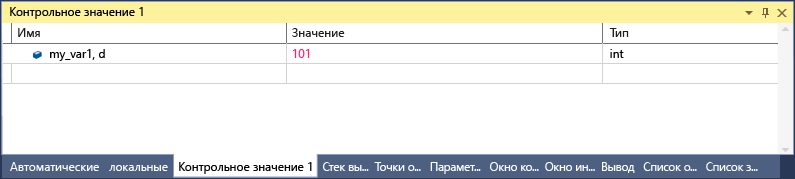

# <a name="format-specifiers-in-c-in-the-visual-studio-debugger"></a>Описатели формата для C# в отладчике Visual Studio
С помощью описателей формата можно изменить формат, в котором значение отображается в окне **Контрольные значения**. Описатели формата можно также использовать в окне **Интерпретация**, окне **Команды**, в [точках трассировки](../debugger/using-breakpoints.md#BKMK_Print_to_the_Output_window_with_tracepoints) и окнах исходного кода. Если вы приостановите выполнение на выражении в одном из этих окон, результат отобразится в [подсказках по данным](../debugger/view-data-values-in-data-tips-in-the-code-editor.md) в указанном формате.

Чтобы применить описатель формата, введите переменное выражение, затем запятую и допустимый описатель.

## <a name="set-format-specifiers"></a>Настройка описателей формата
Мы применим следующий пример кода:

```csharp
{
    int my_var1 = 0x0065;
    int my_var2 = 0x0066;
    int my_var3 = 0x0067;
}
```

Добавьте переменную `my_var1` в окно **контрольных значений** в процессе отладки, поочередно выбрав элементы **Отладка** > **Окна** > **Контрольные значения** > **Контрольное значение 1**. Щелкните переменную правой кнопкой мыши и выберите пункт **Шестнадцатеричный вывод**. Теперь в окне **Контрольные значения** отобразится значение 0x0065. Чтобы это значение отображалось в виде десятичного, а не шестнадцатеричного целого числа, добавьте описатель десятичного формата **, d** в столбец **Имя** после имени переменной. Теперь в столбце **Значение** отобразится **101**.



::: moniker range=">= vs-2019" 

Чтобы просмотреть список доступных описателей формата и выбрать из него нужный вариант, добавьте запятую (,) к значению в окне **Контрольные значения**. 


::: moniker-end

## <a name="format-specifiers"></a>Описатели формата
В следующей таблице перечислены описатели формата для C# в отладчике Visual Studio.

|Описатель|Формат|Исходное контрольное значение|Отображение|
|---------------|------------|--------------------------|--------------|
|ac|Принудительное вычисление выражения, которое полезно в том случае, когда неявное вычисление свойств и неявные вызовы функций отключены.|Сообщение "Неявное вычисление функций выключено пользователем"|\<value>|
|d|Десятичное целое число|0x0065|101|
|dynamic|Отображает указанный объект с помощью динамического представления.|Отображает все члены объекта, включая динамическое представление|Отображает только динамическое представление|
|h|шестнадцатеричное целое число|61541|0x0000F065|
|nq|строка без кавычек|"Моя строка"|Моя строка|
|nse|Задает поведение, а не формат. Вычисляет выражение "без побочных эффектов". Если выражение нельзя интерпретировать, а его разрешение возможно только при вычислении (например, для вызова функции), вы увидите сообщение об ошибке.|Н/Д|Н/Д|
|hidden|Отображает все открытые и не являющиеся открытыми члены.|Отображение открытых членов|Отображение всех членов|
|raw|Отображает элемент в том виде, в котором он отображается в узле необработанного элемента. Допустимо только для прокси-объектов.|Dictionary\<T>|Базовое представление Dictionary\<T>|
|results|Используется с переменной типа, реализующего интерфейс IEnumerable или IEnumerable\<T>. Обычно это выражение запроса. Отображает только члены, которые содержат результат запроса.|Отображение всех членов.|Отображение членов, соответствующих условиям запроса.|

## <a name="see-also"></a>См. также
- [Окна "Контрольные значения" и "Быстрая проверка"](../debugger/watch-and-quickwatch-windows.md)
- [Окна "Видимые" и "Локальные"](../debugger/autos-and-locals-windows.md)
