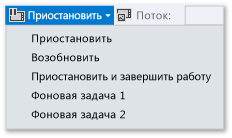
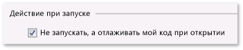

# Активация приостановки, возобновления и фоновых событий во время отладки приложения UWP в Visual Studio
Если в данный момент отладка не выполняется, приложение **Управление жизненным циклом процесса** Windows управляет состоянием выполнения приложения: запуском, приостановкой, возобновлением и завершением работы приложения в ответ на действия пользователя и состояние устройства. При отладке Windows отключает эти события активации. В этом разделе описывается запуск этих событий в отладчике.  
  
 Кроме того, в этом разделе описывается, как отладить **Фоновые задачи**. Фоновые задачи позволяют выполнять определенные операции в фоновом процессе, даже если приложение не выполняется. Можно использовать отладчик, чтобы перевести приложение в режим отладки, а затем, не запуская пользовательский интерфейс, запустить фоновую задачу и начать ее отладку.  
  
 Дополнительные сведения о задачах управления жизненным циклом процесса и фона в разделе [запуск возобновления и многозадачной](/windows/uwp/launch-resume/index).  
  
##   Содержание раздела  
 [События управления жизненным циклом процессов активации](#BKMK_Trigger_Process_Lifecycle_Management_events)  
  
 [Активация фоновых задач](#BKMK_Trigger_background_tasks)  
  
-   [Активация события фоновой задачи из стандартного сеанса отладки](#BKMK_Trigger_a_background_task_event_from_a_standard_debug_session)  
  
-   [Активация фоновой задачи, когда приложение не выполняется](#BKMK_Trigger_a_background_task_when_the_app_is_not_running)  
  
 [Активация событий управления жизненным циклом процесса и фоновых задач из установленного приложения](#BKMK_Trigger_Process_Lifetime_Management_events_and_background_tasks_from_an_installed_app)  
  
 [Диагностика ошибок активации фоновой задачи](#BKMK_Diagnosing_background_task_activation_errors)  
  
##   События управления жизненным циклом процессов активации  
 Windows может приостановить работу приложения, если пользователь переходит из него или если Windows переключается в режим низкого электропотребления. Можно ответить на событие `Suspending` , чтобы сохранить соответствующие данные приложения и пользовательские данные в постоянном хранилище и чтобы освободить ресурсы. При переходе из состояния **Приостановлено** приложение возвращается в состояние **Выполняется** и продолжает работу с того момента, в котором оно было приостановлено. Можно ответить на событие `Resuming` , чтобы восстановить или обновить состояние приложения и получить назад ресурсы.  
  
 Хотя Windows пытается хранить в памяти как можно больше приостановленных приложений, Windows может завершить работу приложения, если ресурсов для хранения приложения в памяти недостаточно. Пользователь также может явно закрыть приложение. Специального события, указывающего, что пользователь закрыл приложение, не существует.  
  
 В отладчике Visual Studio можно вручную приостановить, возобновить и завершить работу приложения для отладки событий жизненного цикла процессов. Чтобы выполнить отладку события жизненного цикла процесса, выполните следующие действия.  
  
1.  Задайте точку останова в обработчике события, которое необходимо отладить.  
  
2.  Нажмите клавишу **F5** , чтобы начать отладку.  
  
3.  На панели инструментов **Место отладки** выберите событие, которое необходимо создать.  
  
       
  
     Обратите внимание, что команда **Приостановить и завершить работу** закрывает приложение и завершает сеанс отладки.  
  
##   Активация фоновых задач  
 Любое приложение может зарегистрировать фоновую задачу, чтобы отвечать на некоторые системные события, даже если приложение не выполняется. Фоновые задачи не могут выполнять код, который непосредственно обновляет пользовательский интерфейс; вместо этого они показывают пользователю сведения об обновлениях плитки, обновлениях эмблемы и всплывающие уведомления. Дополнительные сведения см. в разделе [Supporting your app with background tasks](http://msdn.microsoft.com/en-us/4c7bb148-eb1f-4640-865e-41f627a46e8e).  
  
 Можно активировать события, которые запускают фоновые задачи для приложения, из отладчика.  
  
> [!NOTE]
>  Отладчик может активировать только те события, которые не содержат данные, такие как события, указывающие на изменение состояния устройства. Фоновые задачи, которые требуют ввод данных пользователем или другие данные, необходимо активировать вручную.  
  
 Проще всего активировать событие фоновой задачи, когда приложение не запущено. Однако также поддерживается активация события в стандартном сеансе отладки.  
  
###   Активация события фоновой задачи из стандартного сеанса отладки  
  
1.  Задайте точку останова в коде фоновой задачи, который требуется отладить.  
  
2.  Нажмите клавишу **F5** , чтобы начать отладку.  
  
3.  Из списка событий на панели инструментов **Место отладки** выберите фоновую задачу, которую требуется запустить.  
  
       
  
###   Активация фоновой задачи, когда приложение не выполняется  
  
1.  Задайте точку останова в коде фоновой задачи, который требуется отладить.  
  
2.  Откройте страницу свойств отладки для запускаемого проекта. Выберите проект в Обозревателе решений. В меню **Отладка** выберите пункт **Свойства**.  
  
     Для проектов C++ можно развернуть **Свойства конфигурации** , а затем выбрать **Отладка**.  
  
3.  Выполните одно из следующих действий.  
  
    -   Для проектов Visual C# и Visual Basic выберите **Не запускать, а отлаживать мой код при открытии**.  
  
           
  
    -   Для проектов JavaScript и Visual C++ выберите **Нет** из списка **Запустить приложение** .  
  
           
  
4.  Нажмите клавишу **F5** , чтобы перевести приложение в режим отладки. Обратите внимание, что в списке **Процесс** на панели инструментов **Место отладки** указывается имя пакета приложения, которое требуется указать в режиме отладки.  
  
       
  
5.  Из списка событий на панели инструментов **Место отладки** выберите фоновую задачу, которую требуется запустить.  
  
       
  
##   Активация событий управления жизненным циклом процесса и фоновых задач из установленного приложения  
 Чтобы загрузить приложение, уже установленное в отладчик, используйте диалоговое окно "Отлаживать установленное приложение". Например можно отладить приложение, установленное из магазина Microsoft или отладить приложение при наличии исходных файлов для приложения, но не отдельного проекта Visual Studio для приложения. С помощью диалогового окна "Отлаживать установленное приложение" можно запустить приложение в режиме отладки на компьютере Visual Studio или удаленном устройстве либо настроить приложение для выполнения в режиме отладки, но не запускать его. В разделе **Запуск установленного приложения в отладчике** раздел [запуск сеанса отладки в приложении UWP](../debugger/start-a-debugging-session-for-a-store-app-in-visual-studio-vb-csharp-cpp-and-xaml.md#BKMK_Start_an_installed_app_in_the_debugger).
  
 После загрузки приложения в отладчик можно использовать любую из описанных выше процедур.  
  
##   Диагностика ошибок активации фоновой задачи  
 В журналах диагностики в окне просмотра событий Windows для фоновой инфраструктуры содержались подробные сведения о средствах, которые можно использовать для диагностики и устранения ошибок фоновой задачи. Чтобы просмотреть журнал, выполните следующие действия.  
  
1.  Откройте приложение просмотра событий.  
  
2.  В панели **Действия** выберите **Просмотр** и убедитесь, что установлен флажок **Отобразить аналитический и отладочный журналы** .  
  
3.  На **Просмотр событий (локальных)** разверните узлы **журналы приложений и служб** > **Microsoft** > **Windows**   >  **BackgroundTasksInfrastructure**.  
  
4.  Выберите журнал **Диагностические** .  
  
## См. также  
 [Тестирование приложений UWP в Visual Studio](../test/testing-store-apps-with-visual-studio.md)   
 [Debug apps in Visual Studio](../debugger/debug-store-apps-in-visual-studio.md)   
 [Жизненный цикл приложения](http://msdn.microsoft.com/en-us/53cdc987-c547-49d1-a5a4-fd3f96b2259d)   
 [Запуск, возобновление и многозадачной](http://msdn.microsoft.com/en-us/04307b1b-05af-46a6-b639-3f35e297f71b)