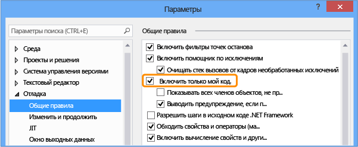

# <a name="debug-only-user-code-with-just-my-code"></a>Отладка пользовательского кода с помощью функции "Только мой код"

*Только мой код* — это функция отладки Visual Studio, которая автоматически обходит вызовы системы, платформы и другой непользовательский код. В окне **Стек вызовов** функция "Только мой код" сворачивает такие вызовы во фреймы **[Внешний код]** .

Функция "Только мой код" по-разному работает в проектах .NET, C++ и JavaScript.

## <a name="enable-or-disable-just-my-code"></a><a name="BKMK_Enable_or_disable_Just_My_Code"></a> Включение или отключение режима "Только мой код"

Для большинства языков программирования режим "Только мой код" включен по умолчанию.

- Чтобы включить или выключить режим "Только мой код" в Visual Studio, в разделе **Средства** > **Параметры** (или **Отладка** > **Параметры**) > **Отладка** > **Общие** установите или снимите флажок **Включить только мой код**.



> [!NOTE]
> Параметр **Включить только мой код** является глобальным параметром, который применяется ко всем проектам Visual Studio на всех языках.

## <a name="just-my-code-debugging"></a>отладка "Только мой код"

Во время сеанса отладки в окне **Модули** отображаются модули кода, которые отладчик воспринимает как "Мой код" (т. е. пользовательский код), а также состояние загрузки их символов. Дополнительные сведения см. в разделе [Дополнительные сведения о присоединении отладчика к приложению](../debugger/debugger-tips-and-tricks.md#modules_window).


В окнах **Стек вызовов** и **Задачи** функция "Только мой код" сворачивает непользовательский код в затененный аннотированный фрейм кода, помеченный как `[External Code]`.


>[!TIP]
>Открывать окна **Модули**, **Стек вызовов** и **Задачи**, как и большинство других окон отладки, можно только в сеансе отладки. В сеансе отладки выберите окна, которые нужно открыть, в разделе **Отладка** > **Окна**.

<a name="BKMK_Override_call_stack_filtering"></a> Чтобы просмотреть код в свернутом фрейме **[Внешний код]** , щелкните правой кнопкой мыши окно **Стек вызовов** или **Задачи** и выберите в контекстном меню пункт **Показать внешний код**. Вместо фрейма **[Внешний код**] появятся развернутые строки внешнего кода.


> [!NOTE]
> Параметр **Показать внешний код** является текущим пользовательским параметром профилировщика, который применяется ко всем проектам на всех языках, открываемых этим пользователем.

Если дважды щелкнуть строку развернутого внешнего кода в окне **Стек вызовов**, строка вызывающего кода в исходном коде будет выделена зеленым. Для библиотек DLL или других модулей, которые не найдены или не загружены, может открыться страница, сообщающая, что символ или источник не найден.

## <a name="net-just-my-code"></a><a name="BKMK__NET_Framework_Just_My_Code"></a>"Только мой код" в .NET

В проектах .NET функция "Только мой код" определяет пользовательский и непользовательский код, исходя из файлов символов ( *.pdb*) и оптимизаций программ. Отладчик .NET считает оптимизированные двоичные файлы и незагруженные файлы *.pdb* непользовательским кодом.

На то, какой код отладчик посчитает пользовательским, также влияют три следующих атрибута.

- <xref:System.Diagnostics.DebuggerNonUserCodeAttribute> сообщает отладчику, что код, к которому применен этот атрибут, не является пользовательским.
- <xref:System.Diagnostics.DebuggerHiddenAttribute> скрывает код от отладчика, даже если режим "Только мой код" включен.
- <xref:System.Diagnostics.DebuggerStepThroughAttribute> указывает отладчику пошагово пройти через код, к которому применен этот атрибут, а не выполнять шаг с заходом в процедуры.

Весь остальной код отладчик .NET рассматривает как пользовательский.

При отладке в .NET:

- Если выбрать **Отладка** > **Шаг с заходом** (или нажать клавишу **F11**) в непользовательском коде, будет выполнен шаг с обходом процедур и переход на следующую строку пользовательского кода.
- Если выбрать **Отладка** > **Шаг с выходом** (или нажать клавиши **Shift**+**F11**) в непользовательском коде, будет выполнен переход на следующую строку пользовательского кода.

Если пользовательского кода больше нет, будет продолжена отладка (до завершения или до достижения другой точки останова) либо появится сообщение об ошибке.

<a name="BKMK_NET_Breakpoint_behavior"></a> Если отладчик прерывается в непользовательском коде (например, вы выбрали **Отладка** > **Прервать все** и приостановили выполнение в непользовательском коде), появляется окно **Нет источника**. Затем вы можете использовать команду **Отладка** > **Шаг**, чтобы перейти к следующей строке пользовательского кода.

При возникновении необработанного исключения в непользовательском коде отладчик прерывается на той строке в пользовательском коде, где было создано исключение.

Если для этого исключения включена первичная обработка исключения, вызывающая строка пользовательского кода в исходном коде выделяется зеленым цветом. В окне **Стек вызовов** отображается аннотированный фрейм с меткой **[Внешний код]** .

## <a name="c-just-my-code"></a><a name="BKMK_C___Just_My_Code"></a> "Только мой код" в C++

Функция "Только мой код" для пошагового выполнения кода поддерживается начиная с Visual Studio 2017 версии 15.8. Чтобы использовать эту функцию, необходимо включить параметр компилятора [/JMC (отладка "Только мой код")](/cpp/build/reference/jmc). В проектах C++ этот параметр включен по умолчанию. Для окна **Стек вызовов** и поддержки стека вызовов в режиме "Только мой код" параметр /JMC не требуется.

<a name="BKMK_CPP_User_and_non_user_code"></a> Чтобы код мог быть классифицирован как пользовательский, отладчик должен загрузить PDB-файл для двоичного файла, содержащего пользовательский код (это можно проверить в окне **Модули**).

В отношении функционирования стека вызовов, например в окне **Стек вызовов**, в режиме "Только мой код" в C++ *непользовательским кодом* считаются только следующие функции.

- Функции с открытой исходной информацией в файле символов.
- Функции, в которых файлы символов указывают, что исходный файл, соответствующий кадру стека, отсутствует.
- Функции, указанные в файлах *\*.natjmc* в папке *%VsInstallDirectory%\Common7\Packages\Debugger\Visualizers*.

Что касается пошагового выполнения кода, в режиме "Только мой код" в C++ *непользовательским кодом* считаются только следующие функции.

- Функции, для которых соответствующий PDB-файл не был загружен в отладчик.
- Функции, указанные в файлах *\*.natjmc* в папке *%VsInstallDirectory%\Common7\Packages\Debugger\Visualizers*.

> [!NOTE]
> Для поддержки пошагового выполнения кода в режиме "Только мой код" код C++ должен быть скомпилирован с использованием компиляторов MSVC в Visual Studio 15.8 предварительной версии 3 или более поздней версии, и должен быть включен параметр компилятора /JMC (он включен по умолчанию). Дополнительные сведения см. в разделе [Настройка поведения стека вызовов и пошагового выполнения кода в C++](#BKMK_CPP_Customize_call_stack_behavior) и в этой [записи блога](https://devblogs.microsoft.com/cppblog/announcing-jmc-stepping-in-visual-studio/). Если код был скомпилирован с использованием более старого компилятора, файлы *.natstepfilter* являются единственным способом настройки пошагового выполнения кода, который не зависит от режима "Только мой код". См. раздел [Настройка поведения пошагового выполнения кода C++](#BKMK_CPP_Customize_stepping_behavior).

<a name="BKMK_CPP_Stepping_behavior"></a> При отладке в C++:

- Если выбрать **Отладка** > **Шаг с заходом** (или нажать клавишу **F11**) в непользовательском коде, будет выполнен шаг с обходом процедур и переход на следующую строку пользовательского кода.
- Если выбрать **Отладка** > **Шаг с выходом** (или нажать клавиши **Shift**+**F11**) в непользовательском коде, будет выполнен переход на следующую строку пользовательского кода.

Если пользовательского кода больше нет, будет продолжена отладка (до завершения или до достижения другой точки останова) либо появится сообщение об ошибке.

Если отладчик прерывается в непользовательском коде (например, вы выбрали **Отладка** > **Прервать все** и приостановили выполнение в непользовательском коде), пошаговое выполнение продолжается в непользовательском коде.

Если отладчик обнаруживает исключение, он останавливается на этом исключении, независимо от того, в каком коде оно находится — пользовательском или непользовательском. Параметры **Не обработанные пользователем** в диалоговом окне **Параметры исключения** игнорируются.

### <a name="customize-c-call-stack-and-code-stepping-behavior"></a><a name="BKMK_CPP_Customize_call_stack_behavior"></a> Настройка поведения стека вызовов и пошагового выполнения кода в C++

В проектах C++ можно указывать модули, исходные файлы и функции, которые окно **Стек вызовов** будет считать непользовательским кодом. Для этого нужно указать их в файлах *\*.natjmc*. Эта настройка также применяется к пошаговому выполнению кода, если используется последняя версия компилятора (см. раздел["Только мой код" в C++](#BKMK_CPP_User_and_non_user_code)).

- Чтобы указать непользовательский код для всех пользователей компьютера с Visual Studio, добавьте файл *.natjmc* в папку *%VsInstallDirectory%\Common7\Packages\Debugger\Visualizers*.
- Чтобы указать непользовательский код для отдельного пользователя, добавьте файл *.natjmc* в папку *%USERPROFILE%\My Documents\\<Версия Visual Studio\>\Visualizers*.

Файл *.natjmc* является XML-файлом и имеет следующий синтаксис.

```xml
<?xml version="1.0" encoding="utf-8"?>
<NonUserCode xmlns="http://schemas.microsoft.com/vstudio/debugger/jmc/2015">

  <!-- Modules -->
  <Module Name="ModuleSpec" />
  <Module Name="ModuleSpec" Company="CompanyName" />

  <!-- Files -->
  <File Name="FileSpec"/>

  <!-- Functions -->
  <Function Name="FunctionSpec" />
  <Function Name="FunctionSpec" Module ="ModuleSpec" />
  <Function Name="FunctionSpec" Module ="ModuleSpec" ExceptionImplementation="true" />

</NonUserCode>

```

 **Атрибуты элементов модуля**

|Атрибут|Описание|
|---------------|-----------------|
|`Name`|Обязательный. Полный путь к модулю или модулям. Вы можете использовать следующие подстановочные знаки Windows: `?` (от 0 до 1 символа) и `*` (от 0 до нескольких символов). Например, примененная к объекту директива<br /><br /> `<Module Name="?:\3rdParty\UtilLibs\*" />`<br /><br /> указывает отладчику, что необходимо рассматривать все модули в *\3rdParty\UtilLibs* на любом диске как внешний код.|
|`Company`|Необязательный элемент. Название компании, публикующей модуль, внедренный в исполняемый файл. Этот атрибут можно использовать для устранения неоднозначности модулей.|

 **Атрибуты элементов файла**

|Атрибут|Описание|
|---------------|-----------------|
|`Name`|Обязательный. Полный путь к файлу или файлам исходного кода, который необходимо считать внешним кодом. При задании пути можно использовать следующие подстановочные знаки Windows: `?` и `*`.|

 **Атрибуты элементов функций**

|Атрибут|Описание|
|---------------|-----------------|
|`Name`|Обязательный. Полное имя функции, которую необходимо рассматривать как внешний код.|
|`Module`|Необязательный элемент. Имя модуля или полный путь к модулю, содержащему эту функцию. Этот атрибут можно использовать для устранения неоднозначности функций с одинаковыми именами.|
|`ExceptionImplementation`|Если задано значение `true`, стек вызовов отображает функцию, которая создала исключение, а не данную функцию.|

### <a name="customize-c-stepping-behavior-independent-of-just-my-code-settings"></a><a name="BKMK_CPP_Customize_stepping_behavior"></a> Настройка поведения пошагового выполнения кода в C++ независимо от параметров режима "Только мой код"

В проектах C++ можно указать функции, для которых будут выполняться шаги с обходом, внеся их в файлы *\*.natstepfilter* как непользовательский код. Функции, указанные в файлах *\*.natstepfilter*, не зависят от параметров режима "Только мой код".

- Чтобы указать непользовательский код для всех локальных пользователей Visual Studio, добавьте файл *.natstepfilter* в папку *%VsInstallDirectory%\Common7\Packages\Debugger\Visualizers*.
- Чтобы указать непользовательский код для отдельного пользователя, добавьте файл *.natstepfilter* в папку *%USERPROFILE%\My Documents\\<Версия Visual Studio\>\Visualizers*.

Файл *.natstepfilter* является XML-файлом и имеет следующий синтаксис.

```xml
<?xml version="1.0" encoding="utf-8"?>
<StepFilter xmlns="http://schemas.microsoft.com/vstudio/debugger/natstepfilter/2010">
    <Function>
        <Name>FunctionSpec</Name>
        <Action>StepAction</Action>
    </Function>
    <Function>
        <Name>FunctionSpec</Name>
        <Module>ModuleSpec</Module>
        <Action>StepAction</Action>
    </Function>
</StepFilter>

```

|Элемент|Описание|
|-------------|-----------------|
|`Function`|Обязательный. Указывает одну или несколько функций как функцию, не написанную пользователем.|
|`Name`|Обязательный. Регулярное выражение в формате ECMA-262, содержащее полное имя функции для сопоставления. Пример:<br /><br /> `<Name>MyNS::MyClass.*</Name>`<br /><br /> сообщает отладчику, что все методы в `MyNS::MyClass`, должны считаться кодом, не написанным пользователем. Сопоставление учитывает регистр.|
|`Module`|Необязательный элемент. Регулярное выражение в формате ECMA-262, указывающее полный путь к модулю, содержащему функцию. Сопоставление не учитывает регистр.|
|`Action`|Обязательный. Одно из следующих чувствительных к регистру значений:<br /><br /> `NoStepInto` — указывает отладчику, что необходимо пройти соответствующую функцию без остановки.<br /> `StepInto` — указывает отладчику, что необходимо осуществлять пошаговое выполнение с заходом в соответствующие функции. Это значение отменяет все остальные значения `NoStepInto` для соответствующей функции.|

## <a name="javascript-just-my-code"></a><a name="BKMK_JavaScript_Just_My_Code"></a> "Только мой код" в JavaScript

<a name="BKMK_JS_User_and_non_user_code"></a> Режим "Только мой код" в JavaScript управляет пошаговым выполнением и отображением стека вызовов путем распределения кода по одной из следующих классификаций:

|Классификация|Описание|
|-|-|
|**MyCode**|Код пользователя, которым вы распоряжаетесь и управляете.|
|**LibraryCode**|Непользовательский код из библиотек, который вы используете регулярно, и от которого зависит правильная работа приложения (например, WinJS или jQuery).|
|**UnrelatedCode**|Непользовательский код в приложении, который не является вашим и от которого не зависит правильная работа приложения. Например, это может быть рекламный пакет SDK, который отображает рекламу. В проектах UWP любой код, который загружается в приложение из URI HTTP или HTTPS, также считается UnrelatedCode.|

Отладчик JavaScript классифицирует код как пользовательский или непользовательский в следующем порядке.

1. Классификации по умолчанию.
   - Скрипт, который выполняется путем передачи строки в предоставленную хостом функцию `eval`, классифицируется как **MyCode**.
   - Скрипт, который выполняется путем передачи строки в конструктор `Function`, классифицируется как **LibraryCode**.
   - Скрипт в ссылке платформы, например WinJS или SDK Azure, классифицируется как **LibraryCode**.
   - Скрипт, который выполняется путем передачи строки в функцию `setTimeout`, `setImmediate` или `setInterval`, классифицируется как **UnrelatedCode**.

2. Классификации, указанные для всех проектов JavaScript Visual Studio в файле *%VSInstallDirectory%\JavaScript\JustMyCode\mycode.default.wwa.json*.

3. Классификации в файле *mycode.json* текущего проекта.

Каждый шаг классификации переопределяет предыдущие шаги.

Весь остальной код классифицируется как **MyCode**.

Вы можете изменить классификации по умолчанию и классифицировать определенные файлы и URL-адреса как пользовательский или непользовательский код путем добавления файла *.json* с именем *mycode.json* в корневую папку проекта JavaScript. См. раздел [Настройка режима "Только мой код" в JavaScript](#BKMK_JS_Customize_Just_My_Code).

<a name="BKMK_JS_Stepping_behavior"></a> При отладке в JavaScript:

- если функция является непользовательским кодом, выбор в меню **Отладка** > **Шаг с заходом**  (или нажатие клавиши **F11**) действует так же, как выбор **Отладка** > **Шаг с обходом** (или нажатие **F10**);
- если шаг начинается в непользовательском коде (**LibraryCode** или **UnrelatedCode**), пошаговое выполнение временно работает так, как если бы режим "Только мой код" не был включен. После возвращения в пользовательский код пошаговое выполнение в режиме "Только мой код" возобновляется.
- Когда шаг в пользовательском коде приводит к выходу из текущего контекста выполнения, отладчик останавливается в следующей выполненной строке пользовательского кода. Например, если обратный вызов выполняется в коде **LibraryCode**, отладчик продолжает выполнение, пока не будет выполнена следующая строка кода пользователя.
- Использование пункта **Шаг с выходом** (или сочетания клавиш **Shift**+**F11**) приводит к остановке на следующей строке пользовательского кода.

Если пользовательского кода больше нет, будет продолжена отладка (до завершения или до достижения другой точки останова) либо появится сообщение об ошибке.

В установленные в коде точки останова переход выполняется всегда, но код классифицируется.

- Если ключевое слово `debugger` обнаруживается в коде **LibraryCode**, отладчик всегда останавливается.
- Если ключевое слово `debugger` обнаруживается в коде **UnrelatedCode**, отладчик не останавливается.

<a name="BKMK_JS_Exception_behavior"></a> Если необработанное исключение встречается в коде **MyCode** или **LibraryCode**, отладчик всегда останавливается.

Если необработанное исключение встречается в коде **UnrelatedCode**, и **MyCode** или **LibraryCode** находится в стеке вызовов, отладчик останавливается.

Если для данного исключения включена первичная обработка и это исключение возникает в коде **LibraryCode** или **UnrelatedCode**:

- Если исключение обрабатывается, отладчик не останавливается.
- Если исключение не обрабатывается, отладчик останавливается.

### <a name="customize-javascript-just-my-code"></a><a name="BKMK_JS_Customize_Just_My_Code"></a> Настройка режима "Только мой код" в JavaScript

Чтобы разделить пользовательский и непользовательский код для отдельного проекта Visual Studio, можно добавить файл *.json* с именем *mycode.json* в корневую папку проекта.

Спецификации в этом файле переопределяют классификации по умолчанию и файл *mycode.default.wwa.json*. В файле *mycode.json* не нужно перечислять все пары "ключ-значение". Значения **MyCode**, **Libraries** и **Unrelated** могут быть пустыми массивами.

В файлах *Mycode.json* используется следующий синтаксис.

```json
{
    "Eval" : "Classification",
    "Function" : "Classification",
    "ScriptBlock" : "Classification",
    "MyCode" : [
        "UrlOrFileSpec",
        . . .
        "UrlOrFileSpec"
    ],
    "Libraries" : [
        "UrlOrFileSpec",
        . .
        "UrlOrFileSpec"
    ],
    "Unrelated" : [
        "UrlOrFileSpec",
        . . .
        "UrlOrFileSpec"
    ]
}

```

**"Eval", "Function" и "ScriptBlock"**

Пары "ключ-значение" **Eval**, **Function** и **ScriptBlock** определяют, как классифицируется динамически создаваемый код:

|name|Описание|
|-|-|
|**Eval**|Скрипт, который выполняется путем передачи строки предоставленной хостом функции `eval`. По умолчанию скрипт Eval классифицируется как **MyCode**.|
|**Function**|Скрипт, который выполняется путем передачи строки конструктору `Function`. По умолчанию скрипт Function классифицируется как **LibraryCode**.|
|**ScriptBlock**|Скрипт, который выполняется путем передачи строки функциям `setTimeout`, `setImmediate` или `setInterval`. По умолчанию скрипт ScriptBlock классифицируется как **UnrelatedCode**.|

Можно изменить это значение на одно из следующих ключевых слов:

- `MyCode` классифицирует скрипт как **MyCode**.
- `Library` классифицирует скрипт как **LibraryCode**.
- `Unrelated` классифицирует скрипт как **UnrelatedCode**.

**"MyCode", "Libraries" и "Unrelated"**

Пары "ключ-значение" **MyCode**, **Libraries** и **Unrelated** определяют URL-адреса или файлы, которые нужно включить в классификацию:

|name|Описание|
|-|-|
|**MyCode**|Массив URL-адресов или файлы, которые классифицируются как **MyCode**.|
|**Libraries**|Массив URL-адресов или файлы, которые классифицируются как **LibraryCode**.|
|**Unrelated**|Массив URL-адресов или файлы, которые классифицируются как **UnrelatedCode**.|

Строка URL-адреса или файла может содержать один или несколько символов `*`, соответствующих любому количеству символов (от 0 и больше). `*` — то же самое, что и регулярное выражение `.*`.
