# Создание визуальной карты стека вызовов во время отладки (C#, Visual Basic, C++, JavaScript)

Для визуального отслеживания стека вызовов при отладке можно создать карту кода. Вы можете вести заметки на карте, чтобы следить за деятельностью кода и сосредоточиться на поиске ошибок.

Пошаговое руководство см. в этом видеоролике: [Видео. Отладка в визуальном режиме с помощью интеграции карты кода с отладчиком (Channel 9)](https://channel9.msdn.com/Series/Visual-Studio-2012-Premium-and-Ultimate-Overview/Visual-Studio-Ultimate-2012Debug-visually-with-Code-Map-debugger-integration)

Сведения о командах и действиях, которые можно использовать при работе с картами кода, см. в статье [Просмотр и переупорядочение карт кода](../modeling/browse-and-rearrange-code-maps.md).

>[!IMPORTANT]
>Карты кода можно создавать только в [выпуске Visual Studio Enterprise](https://visualstudio.microsoft.com/downloads).

Вот краткий обзор карты кода.

 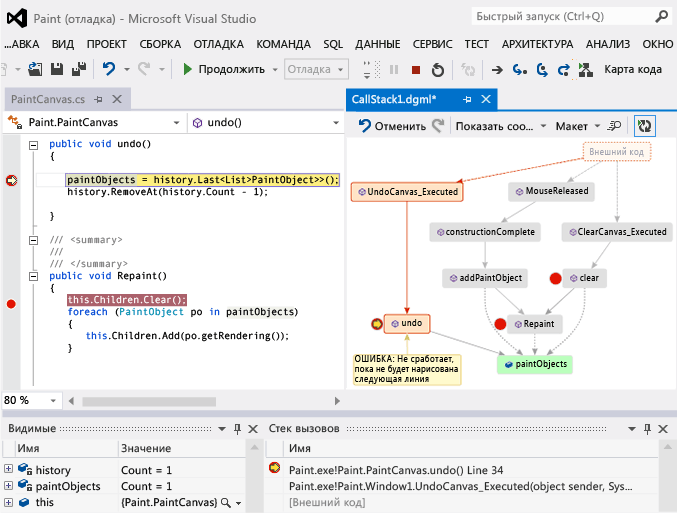

##  Сопоставление стека вызова

1. В проекте Visual Studio Enterprise C#, Visual Basic, C++ или JavaScript запустите отладку, выбрав **Отладка** > **Начать отладку** или нажав клавишу **F5**.

1. При переходе приложения в режим приостановки выполнения или при входе в определенную функцию выберите **Отладка** > **Карта кода** или нажмите сочетание клавиш **CTRL**+**SHIFT**+ **`** .

   Текущий стек вызовов выделен в новой карте кода оранжевым цветом:

   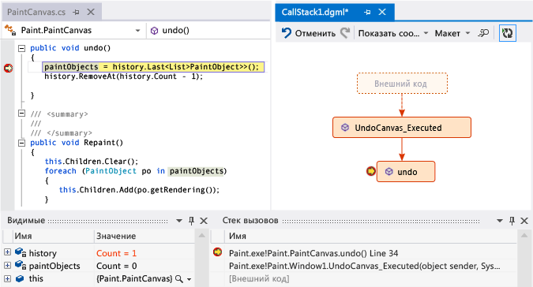

При возобновлении отладки карта кода обновится автоматически. Изменение элементов или макета карты никак не влияет на код. Можно свободно переименовать, изменить или удалить любой элемент в сопоставлении.

Чтобы получить дополнительные сведения об элементе, наведите на него указатель мыши и прочитайте подсказку. Можно также выбрать элемент **Условные обозначения** на панели инструментов, чтобы узнать, что означает каждый значок.

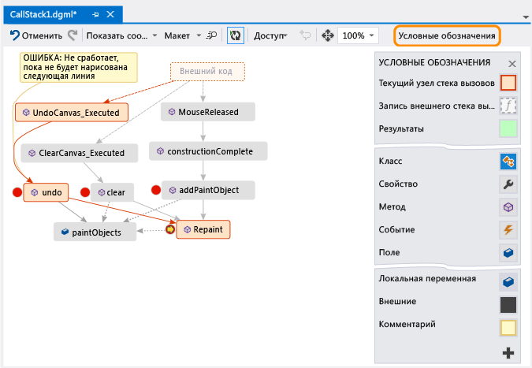

>[!NOTE]
>Сообщение **Диаграмма может быть составлена с использованием более старой версии кода** в верхней части карты кода означает, что код мог измениться с момента последнего обновления карты. Например, вызов в сопоставлении может уже не существовать в коде. Закройте сообщение, а затем попытайтесь повторить сборку решения, прежде чем повторно обновлять сопоставление.

## Отображение внешнего кода

По умолчанию в сопоставлении отображается только ваш код. Чтобы просмотреть внешний код на карте, выполните следующие действия.

- Щелкните правой кнопкой мыши в окне **Стек вызовов** и выберите в контекстном меню пункт **Показать внешний код**.

  
- Или снимите флажок **Включить только мой код**, выбрав в Visual Studio **Сервис** (или **Отладка**) > **Параметры** > **Отладка**.

  

## Управление макетом карты

Изменение макета карты никак не влияет на код.

Для управления макетом карты используется меню **Макет** на панели инструментов карты.

С помощью меню **Макет** можно выполнять следующие задачи.

- Изменить макет по умолчанию.
- Остановить автоматическую перекомпоновку карты, отключив параметр **Автоматически формировать макет при отладке**.
- Выполнить минимальную перекомпоновку карты при добавлении элементов, отключив параметр **Последовательный макет**.

##  Добавление примечаний к коду

Вы можете добавить комментарии для отслеживания операций, выполняемых в коде.

Чтобы добавить комментарий, щелкните правой кнопкой мыши карту кода и выберите **Изменить** > **Новый комментарий**, а затем введите комментарий.

Чтобы добавить новую строку в комментарий, нажмите клавиши **SHIFT**+**ВВОД**.

 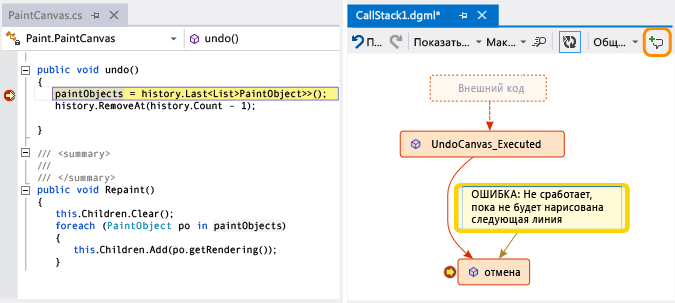

##  Обновление сопоставления путем добавления следующего стека вызовов

При выполнении приложения до следующей точки останова или входе в функцию новые стеки вывозов добавляются на карту автоматически.

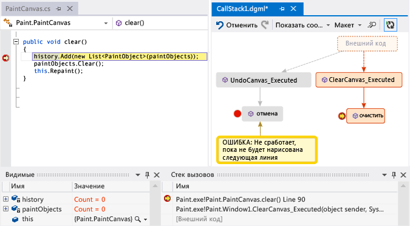

Чтобы остановить автоматическое добавление новых стеков вызова на карту,выберите  на панели инструментов карты кода. Схема продолжит выделять существующие стеки вызовов. Чтобы вручную добавить текущий стек вызовов на карту, нажмите клавиши **CTRL**+**SHIFT**+ **`** .

##  Добавление связанного кода в сопоставление

Теперь, когда у вас есть карта, при работе с C# или Visual Basic можно добавлять на нее элементы, такие как поля, свойства и методы, для отслеживания операций в коде.

Для перехода к определению метода в коде дважды щелкните метод на карте или выберите его и нажмите клавишу **F12** либо щелкните его правой кнопкой мыши и выберите пункт **Перейти к определению**.

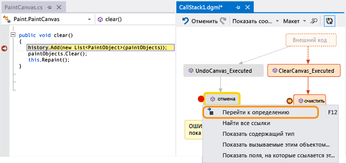

Чтобы добавить отслеживаемые элементы на карту, щелкните метод правой кнопкой мыши и выберите нужные элементы. Последние добавленные элементы отображаются зеленым цветом.

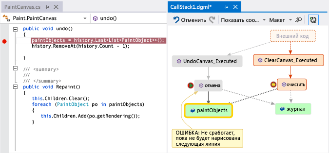

>[!NOTE]
>По умолчанию при добавлении элементов в сопоставление также добавляются узлы родительской группы, соответствующие, например, классу, пространству имен или сборке. Эту функцию можно отключать и включать с помощью кнопки **Включить родительские элементы** на панели инструментов карты кода или нажав клавишу **CTRL** во время добавления элементов.

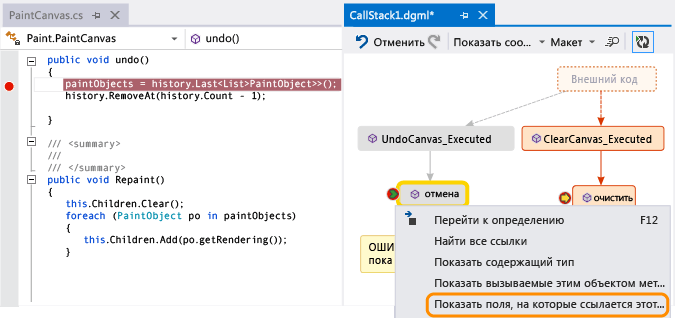

Продолжайте формировать сопоставление, чтобы увидеть дополнительный код.

 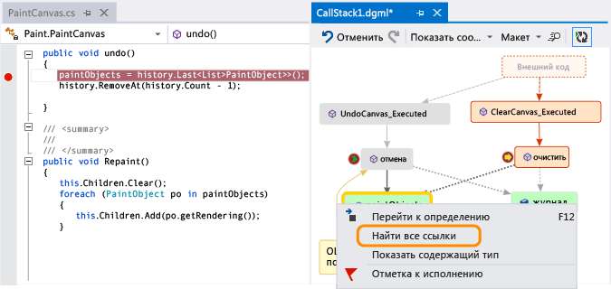

 

##  Поиск ошибок с помощью сопоставления
 Визуализация кода поможет вам быстрее находить ошибки. Например: предположим, что вы ищете ошибку в программе для рисования. Когда вы создаете линию и пробуете отменить ее создание, ничего не происходит до тех пор, пока не будет нарисована следующая линия.

 Установив точки останова в методах `clear`, `undo` и `Repaint`, вы начинаете отладку и создаете сопоставление, аналогичное представленному ниже:

 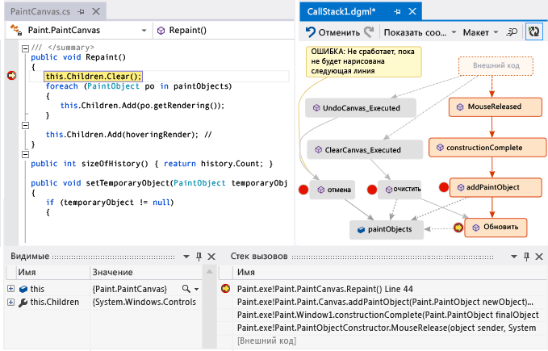

 Учтите, что все жесты пользователя в сопоставлении вызывают метод `Repaint`, за исключением `undo`. Возможно, именно поэтому функция `undo` срабатывает не сразу.

 Когда вы исправите ошибку и продолжите выполнение приложения, на карту будет добавлен новый вызов из `undo` в `Repaint`.

 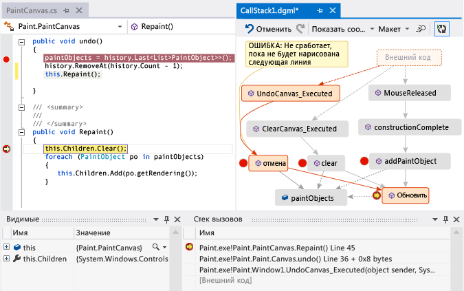

## Использование карты совместно с другими пользователями

Вы можете экспортировать карту, отправлять ее другим пользователям с помощью Microsoft Outlook, сохранять ее в решении и проверять в системе управления версиями.

Чтобы предоставить общий доступ к карте или сохранить карту, нажмите кнопку **Поделиться** на панели инструментов карты кода.

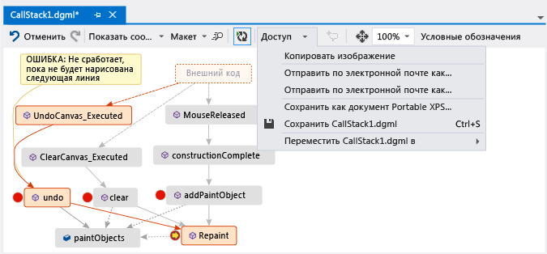

## См. также
[Сопоставление зависимостей во всех решениях](../modeling/map-dependencies-across-your-solutions.md)

[Использование карт кода для отладки приложений](../modeling/use-code-maps-to-debug-your-applications.md)

[Поиск потенциальных проблем с помощью анализаторов карт кода](../modeling/find-potential-problems-using-code-map-analyzers.md)

[Просмотр и реорганизация карт кода](../modeling/browse-and-rearrange-code-maps.md)
