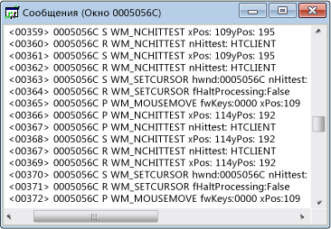

# Представление сообщений
С каждым окном связан отдельный поток сообщений. Этот поток сообщений отображается в окне представления сообщений. Здесь вы увидите дескриптор окна, код сообщения и текст сообщения. Можно также создать представление сообщений для потока или процесса. Это позволяет просматривать сообщения, отправленные во все окна определенного процесса или потока, что особенно полезно для захвата сообщений при инициализации окна.

 Ниже представлен типичный пример окна с представлением сообщений. Обратите внимание, что первый столбец содержит дескриптор окна, а второй — код сообщения (значение этих кодов описано [здесь](../debugger/message-codes.md)). Справа отображаются расшифрованные параметры сообщения и возвращаемые значения.

  Представление сообщений в Spy++

## Процедуры

#### Открытие представления сообщений для окна, процесса или потока

1. Переместите фокус на [представление окон](../debugger/windows-view.md), [представление процессов](../debugger/processes-view.md) или [представление потоков](../debugger/threads-view.md).

2. Найдите узел того элемента, сообщения которого вам нужно просмотреть, и выберите его.

3. В меню **Spy** выберите пункт **Записывать сообщения**.

     Откроется диалоговое окно [Параметры сообщений](../debugger/message-options-dialog-box.md).

4. Отметьте те сообщения, которые хотите отобразить.

5. Нажмите **ОК**, чтобы начать запись сообщений в журнал.

     Откроется окно представления сообщений, а на панели инструментов Spy++ появится меню **Сообщения**. В зависимости от выбранных параметров, сообщения будут поступать в активное окно представления сообщений.

6. Получив достаточное количество сообщений, выберите **Остановить ведение журнала** в меню **Сообщения**.

## В этом разделе
 [Управление представлениями сообщений](../debugger/how-to-control-messages-view.md). Объясняется, как управлять представлением "Сообщения".

 [Открытие представления сообщений из диалогового окна "Поиск окна"](../debugger/how-to-open-messages-view-from-find-window.md). Содержит сведения об открытии представления сообщений из диалогового окна "Поиск окна".

 [Поиск сообщения в представлении сообщений](../debugger/how-to-search-for-a-message-in-messages-view.md). Содержит сведения о поиске конкретного сообщения в представлении сообщений.

 [Запуск и остановка отображения журнала сообщений](../debugger/how-to-start-and-stop-the-message-log-display.md). Объясняется, как запускать и останавливать ведение журнала сообщений.

 [Коды сообщений](../debugger/message-codes.md). Содержит список кодов сообщений, которые встречаются в представлении сообщений.

 [Отображение свойств сообщения](../debugger/how-to-display-message-properties.md). Объясняется, как отобразить дополнительные сведения о сообщении.

## Связанные разделы
 [Представления Spy++](../debugger/spy-increment-views.md). Рассказывает о представлениях Spy++ в виде дерева окон, сообщений, процессов и потоков.

 [Использование Spy++](../debugger/using-spy-increment.md). Содержит вводные сведения о средстве Spy++ и его использовании.

 [Диалоговое окно "Свойства сообщения"](../debugger/message-options-dialog-box.md) используется для выбора сообщений, которые перечислены в активном представлении сообщений.

 [Диалоговое окно "Поиск сообщений"](../debugger/message-search-dialog-box.md) используется для поиска узла для конкретного сообщения в представлении сообщений.

 [Диалоговое окно "Свойства сообщения"](../debugger/message-properties-dialog-box.md) используется для отображения свойств сообщения, выбранного в представлении сообщений.

 [Справочник по Spy++](../debugger/spy-increment-reference.md) содержит разделы с описанием каждого меню и диалогового окна Spy++.