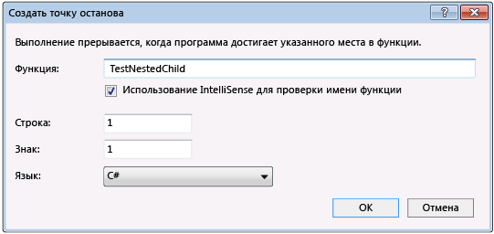

# <a name="navigate-through-code-with-the-visual-studio-debugger"></a>Переходите по коду с помощью отладчика Visual Studio

С помощью отладчика Visual Studio можно переходить по коду для проверки состояния приложения и просмотра последовательности выполнения. Для быстрого перехода к коду, который необходимо изучить, можно использовать сочетания клавиш, команды отладки, точки останова и другие функции. Знание команд навигации и сочетаний клавиш в отладчике ускоряет и упрощает поиск и устранение неполадок в приложениях.

> [!NOTE]
> Если вы не знакомы с процессом отладки кода, перед выполнением задач в этой статье рекомендуется прочесть документ об [отладке для начинающих](../debugger/debugging-absolute-beginners.md) и статью [Методы и инструменты отладки](../debugger/write-better-code-with-visual-studio.md).

## <a name="get-into-break-mode"></a>Переход в режим приостановки выполнения

В *режиме приостановки выполнения* выполнение приложения приостанавливается, но функции, переменные и объекты при этом остаются в памяти. Когда отладчик находится в режиме приостановки выполнения, можно переходить по коду. Наиболее распространенные способы быстрого перехода в режим приостановки выполнения:

- Начните пошаговое выполнение кода, нажав клавишу **F10** или **F11**. Это позволит быстро найти точку входа в приложение, после чего можно продолжать использовать команды пошагового выполнения для перехода по коду.

- [Выполните код до определенного места или функции](#BKMK_Break_into_code_by_using_breakpoints_or_Break_All), например [установив точку останова](using-breakpoints.md) и запустив приложение.

   Например, в редакторе кода в Visual Studio можно использовать команду **Выполнить до текущей позиции**, чтобы запустить приложение, присоединить отладчик и перейти в режим приостановки выполнения, а затем нажать клавишу **F11** для перехода по коду.

   

В режиме приостановки выполнения можно переходить по коду, используя различные команды. Во время режима приостановки выполнения можно выполнять поиск ошибок и нарушений целостности данных, проверяя значения переменных. Для некоторых типов проектов можно также вносить корректировки в приложение.

Большинство окон отладчика, таких как **Модули** и **Контрольные значения**, доступны только тогда, когда отладчик присоединен к приложению. Некоторые возможности отладчика, такие как просмотр значений переменных в окне **локальных переменных** или вычисление выражений в окне **контрольных значений**, доступны только при приостановке отладчика (то есть в режиме приостановки выполнения).

> [!NOTE]
> Если во время приостановки выполнения кода не загружены исходные файлы или файлы символов (*PDB*), отладчик отображает страницу **Исходный файл не найден** или **Символы не найдены**, которая поможет найти и загрузить файлы. См. статью [Указание файлов символов (.pdb) и файлов с исходным кодом в отладчике Visual Studio](../debugger/specify-symbol-dot-pdb-and-source-files-in-the-visual-studio-debugger.md). Если вы не можете загрузить исходные файлы или файлы символов, можно выполнить отладку инструкций на языке ассемблера в окне **Дизассемблирование**.

## <a name="step-through-code"></a>Пошаговое прохождение кода

С помощью команд пошагового выполнения отладчика можно проверять состояние приложения или изучать его последовательность выполнения.

### <a name="step-into-code-line-by-line"></a><a name="BKMK_Step_into__over__or_out_of_the_code"></a> Построчное выполнение кода

Для остановки выполнения на каждом операторе во время отладки используйте команду **Отладка** > **Шаг с заходом** или нажмите клавишу **F11**.

Отладчик осуществляет пошаговое выполнение операторов кода, а не физических строк. Например, предложение `if` может быть записано в одной строке:

  ```csharp
  int x = 42;
  string s = "Not answered";
  if( int x == 42) s = "Answered!";
  ```

  ```vb
  Dim x As Integer = 42
  Dim s As String = "Not answered"
  If x = 42 Then s = "Answered!"
  ```

Однако при пошаговом выполнении этой строки отладчик обрабатывает условие как один шаг, а следствие — как другой. В предыдущем примере условие выполняется.

При вызове вложенных функций команда **Шаг с заходом** позволяет попасть в самую глубокую вложенную функцию. Например, если использовать **Шаг с заходом** на вызове `Func1(Func2())`, отладчик заходит в функцию `Func2`.

>[!TIP]
>При выполнении каждой строки кода можно наводить указатель мыши на переменные, чтобы просматривать их значения, или использовать окна [Локальные переменные](autos-and-locals-windows.md) и [Контрольные значения](watch-and-quickwatch-windows.md) для наблюдения за изменением значений. Кроме того, можно визуально отслеживать [стек вызовов](how-to-use-the-call-stack-window.md) при выполнении шагов с заходом в функции. (Сведения, касающиеся только Visual Studio Enterprise, см. в статье [Сопоставление методов в визуализации стека вызовов при отладке](../debugger/map-methods-on-the-call-stack-while-debugging-in-visual-studio.md).)

### <a name="step-through-code-and-skip-some-functions"></a><a name="BKMK_Step_over_Step_out"></a> Пошаговое прохождение кода и пропуск некоторых функций

Во время отладки некоторые функции могут вас не интересовать или вы можете знать, что они работают, как в случае с тщательно протестированным кодом библиотеки. Чтобы пропустить код во время пошагового выполнения, можно использовать приведенные ниже команды. Функции по-прежнему выполняются, но отладчик пропускает их.

|Команда с клавиатуры|Команда меню «Отладка»|Описание|
|----------------------|------------------|-----------------|
|**F10**|**Шаг с обходом**|Если текущая строка содержит вызов функции, команда **Шаг с обходом** выполняет код, а затем останавливает выполнение в первой строке кода после возврата управления вызываемой функцией.|
|**SHIFT**+**F11**|**Шаг с выходом**|Команда **Шаг с выходом** возобновляет выполнение кода и приостанавливает выполнение, когда текущая функция возвращает управление. Отладчик пропускает текущую функцию.|

## <a name="run-to-a-specific-location-or-function"></a><a name="BKMK_Break_into_code_by_using_breakpoints_or_Break_All"></a> Выполнение до указанного места или функции

Вам может потребоваться выполнить код непосредственно до определенного места или функции, если вы точно знаете, какой код нужно проверить или с какого места следует начать отладку.

### <a name="run-to-a-breakpoint-in-code"></a>Выполнение до точки останова в коде

Чтобы задать простую точку останова в коде, щелкните в левом поле напротив строки кода, в которой нужно приостановить выполнение. Можно также выбрать строку и нажать клавишу **F9**, выбрать команду **Отладка** > **Переключить точку останова** или щелкнуть правой кнопкой мыши и выбрать команду **Точка останова** > **Вставить точку останова**. Точка останова отображается как красный кружок в левом поле рядом со строкой кода. Отладчик приостанавливает выполнение непосредственно перед выполнением строки.


Точки останова в Visual Studio предоставляют широкий набор дополнительных функций, таких как условные точки останова и точки трассировки. Дополнительные сведения см. в статье [Использование точек останова](../debugger/using-breakpoints.md).

### <a name="run-to-a-function-breakpoint"></a>Выполнение до точки останова функции

Можно дать отладчику команду на выполнение до тех пор, пока не будет достигнута определенная функция. Можно задать функцию по имени или выбрать ее из стека вызовов.

**Указание точки останова функции по имени**

1. Выберите команду **Отладка** > **Создать точку останова** > **Точка останова функции**.

1. В диалоговом окне **Новая точка останова функции** введите имя функции и выберите ее язык.

   

1. Нажмите кнопку **ОК**.

Если функция перегружается или находится в нескольких пространствах имен, нужную функцию можно выбрать в окне **Точки останова**.


**Выбор точки останова функции из стека вызовов**

1. Во время отладки откройте окно **Стек вызовов**, выбрав пункт **Отладка** > **Окна** > **Стек вызовов**.

1. В окне **Стек вызовов** щелкните правой кнопкой мыши имя функции и выберите команду **Выполнить до текущей позиции** или нажмите клавиши **CTRL**+**F10**.

Сведения о визуальном отслеживании стека вызовов см. в статье [Сопоставление методов в визуализации стека вызовов при отладке](../debugger/map-methods-on-the-call-stack-while-debugging-in-visual-studio.md).

### <a name="run-to-a-cursor-location"></a>Выполнение до расположения курсора

Чтобы выполнить код до позиции курсора, в окне исходного кода или в окне **Стек вызовов** выберите строку, в которой нужно прервать выполнение, щелкните ее правой кнопкой мыши и выберите команду **Выполнить до текущей позиции** или нажмите клавиши **CTRL**+**F10**. Выбор команды **Выполнить до текущей позиции** аналогичен заданию временной точки останова.

### <a name="run-to-click"></a>Выполнение до щелкнутого

Во время приостановки работы отладчика можно навести указатель мыши на оператор в исходном коде или в окне **Дизассемблирование** и щелкнуть значок с зеленой стрелкой **Выполнить до этого места**. Использование команды **Выполнение до щелкнутого** позволяет не устанавливать временную точку останова.


> [!NOTE]
> Команда **Выполнение до щелкнутого** доступна начиная с версии [!include[vs_dev15](../misc/includes/vs_dev15_md.md)].

### <a name="manually-break-into-code"></a>Приостановка выполнения кода вручную

Чтобы приостановить выполнение в следующей доступной строке кода в выполняющемся приложении, выберите команду **Отладка** > **Прервать все** или нажмите клавиши **CTRL**+**ALT**+**BREAK**.

## <a name="move-the-pointer-to-change-the-execution-flow"></a><a name="BKMK_Set_the_next_statement_to_execute"></a> Перемещение указателя для изменения потока выполнения

Когда работа отладчика приостановлена, желтая стрелка в поле исходного кода или в окне **Дизассемблированный код** отмечает текущее расположение оператора, который должен быть выполнен следующим. Вы можете изменить оператор, который будет выполнен следующим, переместив эту стрелку. Можно пропустить часть кода или вернуться к предыдущей строке. Перемещение указателя полезно при возникновении таких ситуаций, как пропуск раздела кода, содержащего известную ошибку.

 

Для изменения оператора, который будет выполнен следующим, отладчик должен находиться в режиме приостановки выполнения. В окне исходного кода или окне **Дизассемблированный код** перетащите желтую стрелку в другую строку или щелкните правой кнопкой мыши строку, которую нужно выполнить следующей, и выберите команду **Задать следующий оператор**.

Счетчик программы переходит непосредственно к новому расположению, и инструкции между старой и новой точками не выполняются. Однако при перемещении точки выполнения обратно промежуточные инструкции не отменяются.

>[!CAUTION]
>- Перемещение следующего оператора на другую функцию или область обычно приводит к повреждению стека вызова, вызывая ошибку времени выполнения или исключение. При попытке перемещения следующего оператора в другую область, отладчик открывает диалоговое окно с предупреждением и предоставляет возможность отменить операцию.
>- В Visual Basic нельзя переместить следующий оператор на другую область или функцию.
>- Если при использовании машинного кода C++ включены проверки времени выполнения, установка следующего оператора может вызвать исключение, когда выполнение достигнет конца метода.
>- При включенной операции "Изменить и продолжить" команда **Задать следующий оператор** завершится неудачей, если вы внесете изменения, которые операция "Изменить и продолжить" не сможет немедленно применить. Например, это может произойти, если были внесены изменения внутри блока catch. При возникновении такой ситуации появляется сообщение об ошибке, указывающее, что операция не поддерживается.
>- В управляемом коде нельзя перемещать следующий оператор в следующих случаях:
>   - Следующий оператор находится в методе, отличном от метода текущего оператора.
>   - Отладка была запущена через JIT–отладку.
>   - Выполняется очистка стека вызова.
>   - Вызвано исключение System.StackOverflowException или System.Threading.ThreadAbortException.

## <a name="debug-non-user-code"></a><a name="BKMK_Restrict_stepping_to_Just_My_Code"></a>Отладка кода, не являющегося пользовательским

По умолчанию отладчик пытается выполнить отладку только кода вашего приложения, так как включена функция *Только мой код*. Дополнительные сведения о том, как эта функция работает с проектами различных типов и на разных языках, а также о том, как настроить ее, см. в статье [Только мой код](../debugger/just-my-code.md).

Для просмотра кода платформы, кода сторонней библиотеки или системных вызовов во время отладки можно отключить функцию "Только мой код". В меню **Сервис** (или **Отладка**) выберите пункты **Параметры** > **Отладка** и снимите флажок **Включить только мой код**. Когда функция "Только мой код" отключена, в окнах отладчика отображается код, не являющийся пользовательским, и отладчик может выполнять его по шагам.

> [!NOTE]
> Режим "Только мой код" не поддерживается для проектов устройств.

### <a name="debug-system-code"></a>Отладка системного кода

Если вы загрузили отладочные символы для системного кода Майкрософт и отключили режим "Только мой код", можно производить шаг с заходом в системный вызов так же, как в любой другой вызов.

Сведения о загрузке символов Майкрософт см. в разделе [Настройка расположения символов и параметров загрузки](specify-symbol-dot-pdb-and-source-files-in-the-visual-studio-debugger.md#configure-symbol-locations-and-loading-options).

**Чтобы загрузить символы для определенного системного компонента, выполните указанные ниже действия.**

1. Во время отладки откройте окно **Модули**, выбрав пункт **Отладка** > **Окна** > **Модули** или нажав клавиши **CTRL**+**ALT**+**U**.

1. Определить, для каких модулей символы загружены, можно по значению в столбце **Состояние символов** в окне **Модули**. Щелкните правой кнопкой мыши модуль, для которого требуется загрузить символы, и выберите команду **Загрузить символы**.

## <a name="step-into-properties-and-operators-in-managed-code"></a><a name="BKMK_Step_into_properties_and_operators_in_managed_code"></a> Шаг с заходом в свойства и операторы в управляемом коде
 По умолчанию отладчик обходит свойства и операторы при пошаговом выполнении в управляемом коде. В большинстве случаев это делает отладку более удобной и эффективной. Чтобы включить пошаговое выполнение свойств и операторов, выберите пункт **Отладка** > **Параметры**. На странице **Отладка** > **Общие** снимите флажок **Обход свойств и операторов (только управляемый код)** .

## <a name="see-also"></a>См. также
- [Что такое отладка?](../debugger/what-is-debugging.md)
- [Методы и инструменты отладки](../debugger/write-better-code-with-visual-studio.md)
- [Первое знакомство с отладкой](../debugger/debugger-feature-tour.md)
