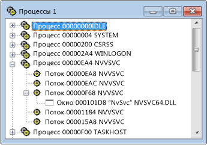

# Представление процессов
В представлении процессов отображается дерево всех активных процессов в системе. Здесь указаны идентификаторы процессов и имена модулей. Используйте представление процессов, если вы намерены изучить определенный системный процесс, который обычно соответствует выполняемой программе. Процессы идентифицируются по именам модулей или обозначаются как "системные процессы".

 Microsoft Windows поддерживает выполнение нескольких процессов. Каждый процесс может иметь один или несколько потоков, а с каждым потоком могут быть связаны одно или несколько окон верхнего уровня. Каждое окно верхнего уровня может иметь несколько дочерних окон. Символ "+" (плюс) указывает, что этот уровень свернут. В свернутом представлении каждому процессу соответствует одна строка. Щелкните символ "+", чтобы развернуть такой уровень.

 Используйте представление процессов, если вы намерены изучить определенный системный процесс, который обычно соответствует выполняемой программе. Процессы идентифицируются по именам модулей или обозначаются как "системные процессы". Чтобы найти процесс, сверните дерево и выполните поиск по списку.

## Процедуры

#### Открытие представления процессов

1. В меню **Spy** выберите пункт **Процессы**.

    Представление процессов в Spy++

   На рисунке выше показано представление процессов, где развернуты узлы процессов и потоков.

### В этом разделе
 [Поиск процесса в представлении процессов.](../debugger/how-to-search-for-a-process-in-processes-view.md) Содержит сведения о поиске конкретного процесса в представлении процессов.

 [Отображение свойств процесса](../debugger/how-to-display-process-properties.md) описывает, как отобразить дополнительные сведения о процессе.

### Связанные разделы
 [Представления Spy++](../debugger/spy-increment-views.md). Рассказывает о представлениях Spy++ в виде дерева окон, сообщений, процессов и потоков.

 [Использование Spy++.](../debugger/using-spy-increment.md) Содержит вводные сведения о средстве Spy++ и его использовании.

 [Диалоговое окно "Поиск процесса"](../debugger/process-search-dialog-box.md) используется для поиска узла конкретного процесса в представлении процессов.

 [Диалоговое окно "Свойства потока"](../debugger/process-properties-dialog-box.md) отображает свойства процесса, выбранного в представлении процессов.

 [Справочник по Spy++](../debugger/spy-increment-reference.md) содержит разделы с описанием каждого меню и диалогового окна Spy++.