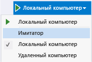
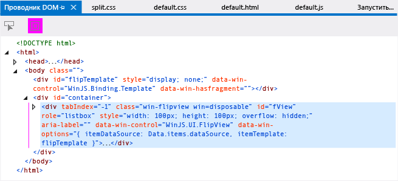
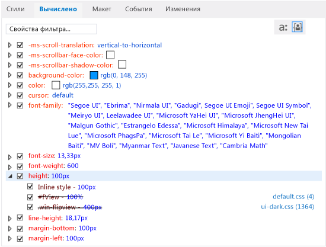
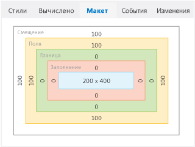
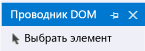

# <a name="debug-html-and-css-in-uwp-apps-in-visual-studio"></a>Отладка файлов HTML и CSS в приложениях UWP с помощью Visual Studio

Для приложений, созданных с использованием языка JavaScript, Visual Studio позволяет выполнять комплексную отладку, которая включает в себя функции, знакомые разработчикам Internet Explorer и Visual Studio. Эти возможности поддерживаются для приложений UWP и приложений, созданных с помощью Средств для Apache Cordova в Visual Studio.

С помощью интерактивной модели отладки, предоставляемой средствами проверки DOM, вы можете просмотреть и изменить визуализируемый код HTML и CSS. Все это можно делать без остановки и перезапуска отладчика.

Сведения о других функциях отладки JavaScript, таких как использование окна консоли JavaScript и задание точек останова, см. в [кратком руководстве по отладка JavaScript](../debugger/quickstart-debug-javascript-using-the-console.md) и статье об [отладке приложений в Visual Studio](debugging-windows-store-and-windows-universal-apps.md).

## <a name="inspecting-the-live-dom"></a><a name="InspectingDOM"></a> Проверка динамической модели DOM
Проводник DOM содержит представление отображаемой страницы. В проводнике можно менять значения и немедленно просматривать результаты. Это позволяет тестировать изменения без остановки и перезапуска отладчика. Исходный код в проекте не меняется, если разработчик выполняет какие-либо операции с этой страницей, используя данный метод, поэтому, найдя места для внесения исправлений в код, вы вносите исправления в исходный код.

> [!TIP]
> Чтобы не останавливать и не перезапускать отладчик при внесении изменений в исходный код, вы можете обновить приложение, нажав кнопку **Обновить приложение Windows** на панели инструментов "Отладка" (или клавишу F4). Дополнительные сведения см. в статье об [обновлении приложения JavaScript](../debugger/refresh-an-app-javascript.md).

Проводник DOM позволяет решать следующие задачи.

- Навигация по поддереву элементов DOM и проверка отображаемого кода HTML, CSS и JavaScript.

- Динамическое изменение атрибутов и стилей CSS отображаемых элементов с немедленным просмотром результатов.

- Проверка применения стилей CSS к элементам страницы и трассировка примененных правил.

  В процессе отладки приложений часто требуется выбрать те или иные элементы в проводнике DOM. При выборе элемента значения, отображаемые на вкладках с правой стороны проводника DOM, автоматически обновляются, отражая текущее состояние выбранного элемента в проводнике DOM. Сюда входят следующие вкладки: **Стили**, **Вычисляемые**, **Макет**. Приложения UWP также поддерживают вкладки **События** и **Изменения**. Дополнительные сведения о выборе элементов см. в разделе [Selecting elements](#SelectingElements).

> [!TIP]
> Если окно проводника DOM закрыто, выберите **Отладка**>**Окна** > **Проводник DOM** , чтобы повторно открыть его. Окно отображается только во время сеанса отладки скрипта.

В описанной ниже процедуре мы выполним отладку приложения в интерактивном режиме с помощью обозревателя DOM. Мы создадим приложение, использующее элемент управления `FlipView` , и отладим это приложение. В приложении имеется несколько ошибок.

> [!WARNING]
> В качестве примера здесь используется приложение UWP. Эти же функции поддерживаются для Cordova, но приложение будет другим.

#### <a name="to-debug-by-inspecting-the-live-dom"></a>Отладка путем проверки динамической модели DOM

1. Создайте новое решение в Visual Studio, выбрав **Файл** > **Новый проект**.

2. Выберите элементы **JavaScript** > **Универсальная платформа Windows**, а затем элемент **Приложение WinJS**.

3. Введите имя проекта, например `FlipViewApp`, и нажмите кнопку **ОК** , чтобы создать приложение.

4. Добавьте следующий код в элемент BODY файла index.html:

    ```html
    <div id="flipTemplate" data-win-control="WinJS.Binding.Template"
            style="display:none">
        <div class="fixedItem" >
            
        </div>
    </div>
    <div id="fView" style="width:100px;height:100px"
        data-win-control="WinJS.UI.FlipView" data-win-options="{
        itemDataSource: Data.items.dataSource, itemTemplate: flipTemplate }">
    </div>
    ```

5. Откройте файл default.css и добавьте следующий код CSS:

    ```css
    #fView {
        background-color:#0094ff;
        height: 100%;
        width: 100%;
        margin: 25%;
    }
    ```

6. Замените код в файле default.js следующим кодом:

    ```javascript
    (function () {
        "use strict";

        var app = WinJS.Application;
        var activation = Windows.ApplicationModel.Activation;

        var myData = [];
        for (var x = 0; x < 4; x++) {
            myData[x] = { flipImg: "/images/logo.png" }
        };

        var pages = new WinJS.Binding.List(myData, { proxy: true });

        app.onactivated = function (args) {
            if (args.detail.kind === activation.ActivationKind.launch) {
                if (args.detail.previousExecutionState !==
                activation.ApplicationExecutionState.terminated) {
                    // TODO: . . .
                } else {
                    // TODO: . . .
                }
                args.setPromise(WinJS.UI.processAll());

                updateImages();
            }
        };

        function updateImages() {

            pages.setAt(0, { flipImg: "http://public-domain-photos.com/free-stock-photos-1/flowers/cactus-76.jpg" });
            pages.setAt(1, { flipImg: "http://public-domain-photos.com/free-stock-photos-1/flowers/cactus-77.jpg" });
            pages.setAt(2, { flipImg: "http://public-domain-photos.com/free-stock-photos-1/flowers/cactus-78.jpg" });
        };

        app.oncheckpoint = function (args) {
        };

        app.start();

        var publicMembers = {
            items: pages
        };

        WinJS.Namespace.define("Data", publicMembers);

    })();
    ```

    На приведенном ниже рисунке показано, что именно мы хотим увидеть, когда запустим это приложение. Тем не менее для доведения приложения до такого состояния нам потребуется сначала устранить несколько ошибок.

    

7. Выберите элемент **Локальный компьютер** из раскрывающегося списка рядом с кнопкой **Начать отладку** на панели инструментов **Отладка**.

    

8. Выберите **Отладка** > **Начать отладку** или нажмите клавишу F5, чтобы запустить приложение в режиме отладки.

    При этом приложение запустится, но экран будет практически пустым, так как в стилях есть несколько ошибок. Первое изображение `FlipView` появляется в малом квадрате около середины экрана.

9. Переключитесь в Visual Studio и выберите вкладку **Проводник DOM** .

    > [!TIP]
    > Для переключения между Visual Studio и работающим приложением можно использовать сочетание клавиш Alt+Tab или клавишу F12.

10. В окне проводника DOM выберите элемент DIV для раздела с идентификатором `"fView"`. Для просмотра и выбора правильного элемента DIV используйте клавиши со стрелкой. (С помощью клавиши со стрелкой вправо можно просмотреть дочерние элементы выбранного элемента.)

    

    > [!TIP]
    > Можно также выбрать элемент DIV в левом нижнем углу окна консоли JavaScript, введя `select(fView)` в строке ввода ">>" и нажав клавишу ВВОД.

    Значения, отображаемые на вкладках в правой части проводника DOM, автоматически обновляются, отражая состояние текущего элемента в проводнике DOM.

11. Выберите вкладку **Вычисляемый** в правой части.

    На этой вкладке отображается вычисляемое или конечное значение каждого свойства выбранного элемента DOM.

12. Откройте правило CSS для высоты. Обратите внимание на наличие встроенного стиля со значением 100 пикс., который не соответствует значению высоты 100 %, установленному для селектора CSS `#fView`. Зачеркнутый текст для селектора `#fView` означает, что встроенный стиль обладает приоритетом перед этим стилем.

    На следующем рисунке показана вкладка **Вычисленные** .

    

13. В главном окне проводника DOM дважды щелкните встроенный стиль высоты и ширины элемента DIV `fView` . Теперь можно изменить здесь значения. В этом сценарии требуется удалить их полностью.

14. В главном окне дважды щелкните `width: 100px;height: 100px;`, нажмите клавишу **DELETE**, а затем клавишу **ВВОД**. После нажатия клавиши ВВОД новые значения немедленно отражаются в приложении, хотя сеанс отладки не был остановлен.

    > [!IMPORTANT]
    > Поскольку можно обновить атрибуты в окне проводника DOM, можно также обновить значения, отображаемые на вкладках **Стили**, **Вычисленные** и **Макет** .

15. Перейдите к приложению, выбрав его нажав сочетание клавиш ALT+TAB.

    Теперь элемент управления `FlipView` больше размера экрана имитатора или эмулятора телефона. Это незапланированный результат. Чтобы изучить вопрос, вернитесь в Visual Studio.

16. В проводнике DOM снова перейдите на вкладку **Вычисляемый** и откройте правило высоты. Элемент fView по-прежнему показывает значение 100 % (как указано в CSS). Но вычисляемое значение теперь равно высоте экрана симулятора (например, 800 или 667,67 пикселей), что не соответствует нашим ожиданиям для приложения. Для изучения этой проблемы на следующих этапах мы удалим высоту и ширину элемента DIV `fView`.

17. На вкладке **Стили** снимите флажки свойств высоты и ширины для селектора CSS `#fView` .

    На вкладке **Вычисляемый** теперь отображается высота 400 пикс. Информация указывает на то, что это значение берется из селектора .win-flipview, заданного в файле ui-dark.css, представляющем собой CSS-файл платформы.

18. Вернитесь к приложению.

    Результат улучшился. Однако есть еще одна проблема, которую следует устранить; поля отображаются слишком большими.

19. Чтобы изучить вопрос, переключитесь в Visual Studio и выберите вкладку **Макет** для просмотра рамочной модели элемента.

    На вкладке **Макет** можно увидеть следующее:

    - 255px (Offset) и 255px (Margin), или другие значения в зависимости от разрешения устройства.

      На следующем рисунке показано, как выглядит вкладка **Макет**, если в симуляторе настроены значения 100 пикселей для смещения и полей.

      

      Это неправильно. На вкладке **Вычисленные** также отображаются те же значения полей.

20. Перейдите на вкладку **Стили** и найдите селектор CSS `#fView` . Здесь вы увидите значение 25 % для свойства **поле** .

21. Выберите 25 %, измените это значение на 25 пикс. и нажмите клавишу ВВОД.

22. На вкладке **Стили** выберите правило высоты для селектора .win-flipview, измените значение 400 пикс. на 500 пикс. и нажмите клавишу ВВОД.

23. Вернитесь к приложению. Теперь элементы размещены правильно. Чтобы внести исправления в источник и обновить приложение, не останавливая и не перезапуская отладчик, выполните следующую процедуру.

#### <a name="to-refresh-your-app-while-debugging"></a>Обновление приложения во время отладки

1. Пока приложение выполняется, переключитесь на Visual Studio

2. Откройте файл default.html и внесите исправления в исходный код, изменив высоту и ширину элемента DIV `"fView"` на 100 %.

3. Нажмите кнопку **Обновить приложение Windows** на панели инструментов "Отладка" (или нажмите F4). Эта кнопка выглядит следующим образом: .

    Страницы приложения перезагружаются, имитатор или эмулятор телефона снова отображается на переднем плане.

    Дополнительные сведения о возможности обновления для приложения JavaScript см. [здесь](../debugger/refresh-an-app-javascript.md).

## <a name="selecting-elements"></a><a name="SelectingElements"></a> Selecting elements
Во время отладки приложения элементы модели DOM можно выбирать тремя способами:

- нажатием элементов непосредственно в окне проводника DOM (или с помощью клавиш со стрелками);

- с помощью кнопки **Выбор элемента** (Ctrl+B);

- с помощью кнопки `select` , входящей в [JavaScript Console commands](../debugger/javascript-console-commands.md?view=vs-2017&preserve-view=true).

  При выборе элементов с помощью окна проводника DOM и наведении указателя мыши на элемент соответствующий элемент выделяется в запущенном приложении. Чтобы выбрать элемент, необходимо щелкнуть по нему в проводнике DOM (или воспользоваться для выбора элементов клавишами со стрелками). Элементы в проводнике DOM можно также выбирать с помощью кнопки **Выбрать элемент** . На следующем рисунке показана кнопка **Выбор элемента** .

  

  При нажатии кнопки **Выбрать элемент** (или сочетания клавиш CTRL+B) меняется режим выделения, то есть элемент в проводнике DOM можно выделить, щелкнув по нему в запущенном приложении. По щелчку режим возвращается в нормальный режим выделения. При нажатии кнопки **Выбор элемента** приложение отображается на переднем плане, а вид курсора меняется в соответствии с новым режимом выделения. Если щелкнуть выделенный элемент, проводник DOM снова отображается на переднем плане, а указанный элемент выделен.

  Перед нажатием **Выбрать элемент** можно задать, необходимо ли выделять элементы в запущенном приложении, с помощью кнопки **Отображать поля выделения веб-страницы** . Эта кнопка показана на следующем рисунке. По умолчанию выделение отображается.

  

  Если выделение элементов включено, элементы, на которые наводится указатель мыши в имитаторе, выделяются. Цвет выделения элементов соответствует рамочной модели, отображаемой на вкладке **Макет** проводника DOM.

> [!NOTE]
> В эмуляторе Windows Phone выделение элементов с помощью наведения поддерживается лишь частично.

## <a name="see-also"></a>См. также

- [Отладка приложений в Visual Studio](debugging-windows-store-and-windows-universal-apps.md)
- [Обновление приложения (JavaScript)](../debugger/refresh-an-app-javascript.md)
- [Отладка элемента управления WebView](../debugger/debug-a-webview-control.md)
- [Сочетания клавиш](../debugger/keyboard-shortcuts-html-and-javascript.md?view=vs-2017&preserve-view=true)
- [Команды консоли JavaScript](../debugger/javascript-console-commands.md?view=vs-2017&preserve-view=true)
- [Отладка примера кода HTML, CSS и JavaScript](../debugger/debug-html-css-and-javascript-sample-code.md)
- [Поддержка и специальные возможности продукта](/previous-versions/tzbxw1af(v=vs.120))