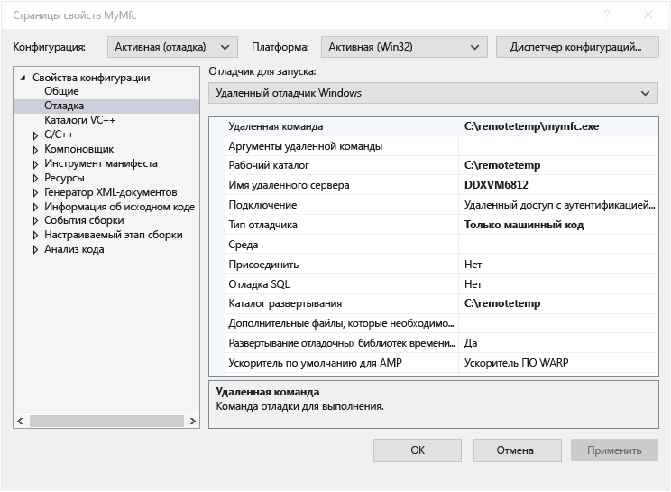

# Удаленная отладка проекта C++ в Visual Studio
Чтобы выполнить отладку приложения Visual Studio на другом компьютере, установите и запустите средства удаленной отладки на том компьютере, где будет развернуто приложение, затем настройте в проекте подключение к удаленному компьютеру из Visual Studio и наконец разверните и запустите приложение.

Сведения об удаленной отладке приложений UWP (универсальной платформы Windows) вы найдете в статье [Отладка установленного пакета приложения](debug-installed-app-package.md).

## Требования

Удаленный отладчик поддерживается в среде Windows 7 и более поздних (но не на телефонах) и в Windows Server, начиная с версии Windows Server 2008 с пакетом обновления 2 (SP2). Полный список требований см. в разделе [Требования](../debugger/remote-debugging.md#requirements_msvsmon).

> [!NOTE]
> Отладка между двумя компьютерами, подключенными через прокси-сервер, не поддерживается. Отладка через подключение с высокой задержкой или низкой пропускной способностью, например при подключении к Интернету по коммутируемой линии или при размещении компьютеров в разных странах, может приводить к сбоям или работать недопустимо медленно и поэтому не рекомендуется.

## Скачивание и установка инструментов удаленной отладки

[!INCLUDE [remote-debugger-download](../debugger/includes/remote-debugger-download.md)]

> [!TIP]
> В некоторых сценариях запуск удаленного отладчика из общей папки может оказаться самым эффективным решением. Дополнительные сведения см. в разделе [Запуск удаленного отладчика из общей папки](../debugger/remote-debugging.md#fileshare_msvsmon).

##  Установка удаленного отладчика

[!INCLUDE [remote-debugger-configuration](../debugger/includes/remote-debugger-configuration.md)]

> [!NOTE]
> Если вам нужно добавить разрешения для дополнительных пользователей, изменить режим проверки подлинности или настроить номер порта для удаленного отладчика, воспользуйтесь инструкциями по [настройке удаленного отладчика](../debugger/remote-debugging.md#configure_msvsmon).

##  Удаленная отладка проекта на C++
 В приведенной ниже процедуре проект расположен в папке C:\remotetemp\MyMfc, а удаленный компьютер имеет имя **MJO-DL**.

1. Создайте приложение MFC с именем **mymfc**.

2. Создайте точку останова в легкодоступном месте приложения, например в файле **MainFrm.cpp**, в начале `CMainFrame::OnCreate`.

3. В обозревателе решений щелкните правой кнопкой мыши проект и выберите **Свойства**. Откройте вкладку **Отладка**.

4. Для параметра **Загружаемый отладчик** задайте значение **Удаленный отладчик Windows**.

    

5. Внесите в свойства следующие изменения:

   |Параметр|Значение|
   |-|-|
   |Удаленная команда|C:\remotetemp\mymfc.exe|
   |Рабочий каталог|C:\remotetemp|
   |Имя удаленного сервера|MJO-DL:*portnumber*|
   |Подключение|Удаленный доступ с аутентификацией Windows|
   |Тип отладчика|Только машинный код|
   |Каталог развертывания|C:\remotetemp.|
   |Дополнительные файлы развертывания|C:\data\mymfcdata.txt.|

    Если требуется развернуть дополнительные файлы (необязательно), соответствующая папка должна существовать на обоих компьютерах.

6. В обозревателе решений щелкните решение правой кнопкой мыши и выберите **Диспетчер конфигураций**.

7. Для конфигурации **Отладка** установите флажок **Развертывание**.

    

8. Начните отладку (выберите **Отладка > Начать отладку** или нажмите клавишу **F5**).

9. Исполняемый файл автоматически развернется на удаленном компьютере.

10. Если появится запрос на подключение к удаленному компьютеру, введите сетевые учетные данные.

     Эти учетные данные будут разными в зависимости от конфигурации безопасности вашей сети. Например, на включенном в домен компьютере обычно нужно выбрать сертификат безопасности либо ввести имя и пароль для входа в домен. Если компьютер не подключен к домену, может потребоваться ввести имя компьютера и имя существующей учетной записи пользователя, например <strong>MJO-DL\name@something.com</strong>, с правильным паролем для нее.

11. На компьютере с Visual Studio вы должны увидеть, что выполнение остановилось в точке останова.

    > [!TIP]
    > Кроме того, файлы можно развернуть как отдельный шаг. В **обозревателе решений** щелкните правой кнопкой мыши узел **mymfc** и выберите пункт **Развернуть**.

    Если приложению требуются дополнительные файлы, не содержащие код, их можно указать в параметре **Дополнительные файлы развертывания** на странице **Удаленный отладчик Windows**.

    Вместо этого вы можете включить такие файлы в проект и задать для свойства **Содержимое** значение **Да** на странице **Свойства** для каждого файла. Это приведет к тому, что файлы будут скопированы в **Каталог развертывания**, указанный на странице **Удаленный отладчик Windows**. Можно также изменить **Тип элемента**, указав значение **Копировать файл**, и дополнительные свойства, если файлы нужно копировать во вложенную папку в **каталоге развертывания**.

## Настройка отладки с удаленными символами

[!INCLUDE [remote-debugger-symbols](../debugger/includes/remote-debugger-symbols.md)]

## См. также
- [Отладка в Visual Studio](../debugger/index.yml)
- [Первое знакомство с отладчиком](../debugger/debugger-feature-tour.md)
- [Настройка брандмауэра Windows для удаленной отладки](../debugger/configure-the-windows-firewall-for-remote-debugging.md)
- [Назначение портов удаленного отладчика](../debugger/remote-debugger-port-assignments.md)
- [Удаленная отладка ASP.NET на удаленном компьютере IIS](../debugger/remote-debugging-aspnet-on-a-remote-iis-computer.md)
- [Ошибки удаленной отладки и их устранение](../debugger/remote-debugging-errors-and-troubleshooting.md)