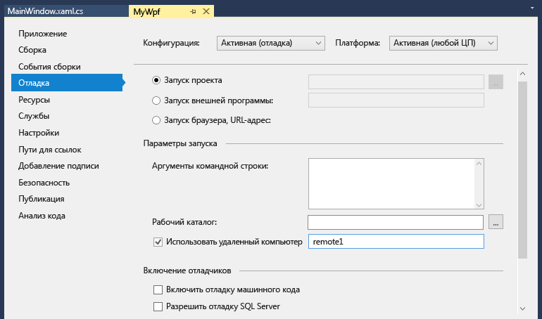

# Удаленная отладка проекта C# или Visual Basic в Visual Studio
Чтобы выполнить отладку приложения Visual Studio, развернутого на другом компьютере, установите и запустите средства удаленной отладки на том компьютере, где будет развернуто приложение, затем настройте в проекте подключение к удаленному компьютеру из Visual Studio и запустите приложение.

Сведения об удаленной отладке приложений UWP (универсальной платформы Windows) вы найдете в статье [Отладка установленного пакета приложения](debug-installed-app-package.md).

## Требования

Удаленный отладчик поддерживается в среде Windows 7 и более поздних (но не на телефонах) и в Windows Server, начиная с версии Windows Server 2008 с пакетом обновления 2 (SP2). Полный список требований см. в разделе [Требования](../debugger/remote-debugging.md#requirements_msvsmon).

> [!NOTE]
> Отладка между двумя компьютерами, подключенными через прокси-сервер, не поддерживается. Отладка через подключение с высокой задержкой или низкой пропускной способностью, например при подключении к Интернету по коммутируемой линии или при размещении компьютеров в разных странах, может приводить к сбоям или работать недопустимо медленно и поэтому не рекомендуется.

## Скачивание и установка инструментов удаленной отладки

[!INCLUDE [remote-debugger-download](../debugger/includes/remote-debugger-download.md)]

> [!TIP]
> В некоторых сценариях запуск удаленного отладчика из общей папки может оказаться самым эффективным решением. Дополнительные сведения см. в разделе [Запуск удаленного отладчика из общей папки](../debugger/remote-debugging.md#fileshare_msvsmon).

##  Установка удаленного отладчика

[!INCLUDE [remote-debugger-configuration](../debugger/includes/remote-debugger-configuration.md)]

> [!NOTE]
> Если вам нужно добавить разрешения для дополнительных пользователей, изменить режим проверки подлинности или настроить номер порта для удаленного отладчика, воспользуйтесь инструкциями по [настройке удаленного отладчика](../debugger/remote-debugging.md#configure_msvsmon).

##  Удаленная отладка проекта
Отладчик не может развертывать классические приложения Visual C# и Visual Basic на удаленном компьютере, но вы все же можете выполнять их удаленную отладку описанным ниже образом. В приведенной ниже процедуре предполагается, что отладка приложения выполняется на компьютере с именем **MJO-DL**, как показано на иллюстрации ниже.

1. Создайте проект WPF с именем **MyWpf**.

2. Установите точку останова в легкодоступном месте кода.

    Например, ее можно установить в обработчике кнопки. Для этого откройте файл MainWindow.xaml и добавьте элемент управления "Кнопка" из панели элементов, а затем дважды щелкните кнопку, чтобы открыть обработчик.

3. В обозревателе решений щелкните правой кнопкой мыши проект и выберите пункт **Свойства**.

4. На странице **Свойства** откройте вкладку **Отладка**.

    

5. Убедитесь, что текстовое поле **Рабочий каталог** пустое.

6. Выберите **Использовать удаленный компьютер** и введите в текстовом поле значение **yourmachinename:port**. (Номер порта отображается в окне удаленного отладчика. Номер порта увеличивается на 2 в каждой версии Visual Studio.)

    В этом примере используйте:
    ::: moniker range=">=vs-2019"
    **MJO-DL:4024** в Visual Studio 2019;
    ::: moniker-end
    ::: moniker range="vs-2017"
    **MJO-DL:4022** в Visual Studio 2017.
    ::: moniker-end

7. Убедитесь в том, что параметр **Разрешить отладку машинного кода** не выбран.

8. Выполните построение проекта.

9. Создайте на удаленном компьютере папку с тем же путем, что и у папки **Debug** на компьютере с Visual Studio: **\<source path>\MyWPF\MyWPF\bin\Debug**.

10. Скопируйте исполняемый файл, сборку которого вы только что выполнили, с компьютера с Visual Studio в созданную на удаленном компьютере папку.

    > [!CAUTION]
    > Не вносите изменения в код и не выполняйте повторную сборку (или придется повторить этот шаг). Исполняемый файл, скопированный на удаленный компьютер, должен в точности совпадать с локальным исходным кодом и символами.

    Вы можете скопировать проект вручную, использовать XCopy, Robocopy, PowerShell или другие варианты.

11. Убедитесь, что удаленный отладчик запущен на целевом компьютере (если это не так, найдите **Удаленный отладчик** в меню **Пуск**). Окно удаленного отладчика выглядит следующим образом.

     

12. В Visual Studio начните отладку (выберите **Отладка > Начать отладку** или нажмите клавишу **F5**).

13. Если появится запрос на подключение к удаленному компьютеру, введите сетевые учетные данные.

     Эти учетные данные зависят от конфигурации безопасности вашей сети. Например, на включенном в домен компьютере введите доменное имя и пароль для входа в домен. Если компьютер не подключен к домену, может потребоваться ввести имя компьютера и имя существующей учетной записи пользователя, например <strong>MJO-DL\name@something.com</strong>, с правильным паролем для нее.

     Главное окно приложения WPF должно быть открыто на удаленном компьютере.

14. При необходимости выполните действия для попадания в точку останова. Она должна быть активна. Если она неактивна, символы для приложения не загрузились. Повторите попытку и, если не получится, информацию о загрузке символов и устранении связанных с ними неполадок см. в записи блога [Основные сведения о файлах символов и параметрах символов Visual Studio](https://devblogs.microsoft.com/devops/understanding-symbol-files-and-visual-studios-symbol-settings/).

15. На компьютере с Visual Studio вы должны увидеть, что выполнение остановилось в точке останова.

    Если приложение должно использовать файлы, не являющиеся файлами кода, их нужно включить в проект Visual Studio. Создайте папку проекта для дополнительных файлов (в **обозревателе решений** выберите **Добавить > Новая папка**). Затем добавьте файлы в папку (в **обозревателе решений** выберите **Добавить > Существующий элемент**, а затем файлы). На странице **Свойства** для каждого файла задайте для свойства **Копировать в выходной каталог** значение **Всегда копировать**.

## Настройка отладки с удаленными символами

[!INCLUDE [remote-debugger-symbols](../debugger/includes/remote-debugger-symbols.md)]

## См. также
- [Отладка в Visual Studio](../debugger/index.yml)
- [Первое знакомство с отладчиком](../debugger/debugger-feature-tour.md)
- [Настройка брандмауэра Windows для удаленной отладки](../debugger/configure-the-windows-firewall-for-remote-debugging.md)
- [Назначение портов удаленного отладчика](../debugger/remote-debugger-port-assignments.md)
- [Удаленная отладка ASP.NET на удаленном компьютере IIS](../debugger/remote-debugging-aspnet-on-a-remote-iis-computer.md)
- [Ошибки удаленной отладки и их устранение](../debugger/remote-debugging-errors-and-troubleshooting.md)