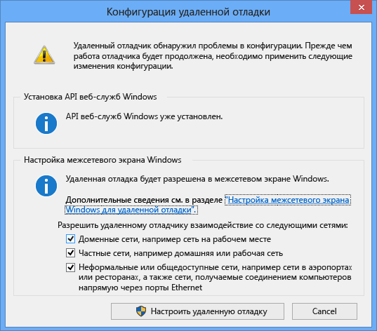

# Удаленная отладка
[!INCLUDE[vs2017banner](../code-quality/includes/vs2017banner.md)]

Вы можете отладить приложение Visual Studio, развернутое на другом компьютере.  Для этого используется удаленный отладчик Visual Studio.  
  
 Информация в этом разделе относится к классическим приложениям Windows и приложениям ASP.NET.  Информацию об удаленной отладке приложений Магазина Windows и приложений Azure см. в разделе [Удаленная отладка в приложениях Магазина Windows и приложениях Azure](#bkmk_winstoreAzure).  
  
## Скачивание и установка инструментов удаленной отладки  
 Скачать инструменты удаленной отладки можно на странице [Инструменты удаленной отладки для Visual Studio 2015](https://www.microsoft.com/en-us/download/details.aspx?id=48155). Можно выбрать 32\-разрядную версию инструментов, 64\-разрядную версию или версию ARM. Скачав исполняемый файл, следуйте инструкциям по установке приложения на удаленном компьютере.  
  
 Загрузить версию обновления 1 удаленных средств можно на странице [Удаленные средства для Visual Studio 2015 с обновлением 1](https://www.microsoft.com/en-us/download/details.aspx?id=49986&44F86079-8679-400C-BFF2-9CA5F2BCBDFC=1).  
  
> [!IMPORTANT]
>  Устанавливаемая версия инструментов удаленной отладки должна соответствовать установленной версии Visual Studio. Использование несовпадающих версий не поддерживается. Кроме того, устанавливаемые инструменты удаленной отладки должны иметь ту же архитектуру, что и приложение, которое нужно отладить. Иными словами, если вы хотите отладить 64\-разрядное приложение, необходимо установить 64\-разрядную версию инструментов.  
  
 Если на удаленном компьютере уже установлена среда Visual Studio 2015 Community, Professional или Enterprise, удаленный отладчик \(**msvsmon.exe**\) уже установлен. Его можно запустить из следующего каталога:  
  
 **\<каталог установки Visual Studio\>\\Common7\\IDE\\Remote Debugger\\\(x64, x86, Appx\)\\msvsmon.exe**  
  
 Однако **мастер настройки удаленного отладчика** \(**rdbgwiz.exe**\) устанавливается только при скачивании и установке инструментов удаленной отладки. Он может понадобиться вам для настройки позднее, особенно если вы хотите запускать удаленный отладчик как службу. Более подробную информацию см. в подразделе [Настройка удаленного отладчика как службы](#bkmk_configureService) ниже.  
  
## Поддерживаемые операционные системы  
 Удаленный компьютер должен работать под управлением одной из следующих операционных систем:  
  
-   Windows 10  
  
-   Windows 8 или 8.1  
  
-   Windows 7 с пакетом обновления 1 \(SP1\)  
  
-   Windows Server 2012 или Windows Server 2012 R2  
  
-   Windows Server 2008 с пакетом обновления 2 \(SP2\), Windows Server 2008 R2 с пакетом обновления 1 \(SP1\)  
  
## Поддерживаемые конфигурации оборудования  
  
-   Процессор с тактовой частотой 1,6 ГГц или большей  
  
-   1 ГБ ОЗУ \(1,5 ГБ при выполнении в виртуальной машине\)  
  
-   1 ГБ доступного пространства на жестком диске  
  
-   Жесткий диск 5400 об\/мин  
  
-   Видеоадаптер с поддержкой DirectX 9 и разрешением экрана 1024x768 или выше  
  
## Конфигурация сети  
 Удаленный компьютер и компьютер Visual Studio должны быть подключены по сети, объединены в рабочую или домашнюю группу либо соединены напрямую с помощью кабеля Ethernet. Отладка через Интернет не поддерживается.  
  
## Установка удаленного отладчика  
 на удаленном компьютере требуются права администратора.  
  
1.  Найдите приложение "Удаленный отладчик". Для этого можно выполнить поиск по запросу **Удаленный отладчик** в меню **Пуск**.  
  
2.  При запуске инструментов удаленной отладки в первый раз \(или до того, как они были настроены\) появляется диалоговое окно **Конфигурация удаленной отладки**.  
  
       
  
3.  Если API\-интерфейс служб Windows не установлен \(что возможно только в Windows Server 2008 R2\), нажмите кнопку **Установить**.  
  
4.  Выберите типы сетей, в которых необходимо использовать инструменты удаленной отладки. Должен быть выбран по крайней мере один тип сети. Если компьютеры соединены через домен, необходимо выбрать первый пункт. Если компьютеры соединены посредством рабочей или домашней группы, необходимо выбрать второй или третий пункт.  
  
5.  Выберите **Настроить удаленную отладку**, чтобы настроить брандмауэр и запустить инструмент.  
  
6.  По завершении настройки появится окно удаленного отладчика.  
  
       
  
 Чтобы завершить работу удаленного отладчика, выберите в окне команду **Файл\/Выход**. Перезапустить его можно из меню **Пуск** или командной строки:  
  
 **\<каталог установки Visual Studio\>\\Common7\\IDE\\Remote Debugger\\\<x86, x64, or Appx\\msvsmon.exe**.  
  
## Настройка удаленного отладчика  
 После первого запуска удаленного отладчика можно изменить некоторые аспекты его конфигурации.  
  
-   Чтобы разрешить другим пользователям подключаться к удаленному отладчику, выберите пункт **Сервис\/Разрешения**. Для предоставления разрешений или отказа в предоставлении необходимо обладать правами администратора.  
  
-   Чтобы изменить режим аутентификации или номер порта либо задать значение времени ожидания для инструментов удаленной отладки, в меню "Сервис" выберите пункт "Параметры".  
  
     Список номеров портов, используемых по умолчанию, см. в разделе [Назначение портов удаленного отладчика](../debugger/remote-debugger-port-assignments.md).  
  
> [!WARNING]
>  Вы можете запускать инструменты удаленной отладки в режиме "без аутентификации", однако настоятельно рекомендуется не использовать этот режим. При работе в этом режиме сетевая безопасность не обеспечивается. Режим без аутентификации можно выбрать, только если вы уверены в отсутствии вредоносного или опасного трафика.  
  
##   Настройка удаленного отладчика как службы  
 Для отладки в ASP.NET и других серверных средах удаленный отладчик следует запускать как службу.  
  
1.  Найдите **мастер настройки удаленного отладчика** \(rdbgwiz.exe\). \(Это отдельное приложение, не входящее в состав удаленного отладчика.\) Он доступен только в том случае, если вы установили инструменты удаленной отладки. Вместе с Visual Studio он не устанавливается.  
  
2.  Запустите мастер настройки. Когда появится первая страница, нажмите кнопку **Далее**.  
  
3.  Установите флажок **Запускать удаленный отладчик Visual Studio 2015 как службу**.  
  
4.  Добавьте имя учетной записи пользователя и пароль.  
  
     Для этой учетной записи может потребоваться добавить разрешение **Вход в качестве службы**. \(Найдите элемент **Локальная политика безопасности** \(secpol.msc\) на **начальной** странице или в начальном окне \(либо введите **secpol** в командной строке\). В открывшемся окне дважды щелкните элемент **Назначение прав пользователя**, а затем в области справа найдите элемент **Вход в качестве службы**. Дважды щелкните его. Добавьте учетную запись пользователя в окно **Свойства** и нажмите кнопку **ОК**.\) Нажмите кнопку **Далее**.  
  
5.  Выберите тип сети, с которой должны взаимодействовать инструменты удаленной отладки. Должен быть выбран по крайней мере один тип сети. Если компьютеры соединены через домен, необходимо выбрать первый пункт. Если компьютеры соединены посредством рабочей или домашней группы, необходимо выбрать второй или третий пункт. Нажмите кнопку **Далее**.  
  
6.  Если службу удается запустить, вы увидите сообщение **Вы успешно завершили работу мастера настройки удаленного отладчика Visual Studio**. Если службу не удается запустить, вы увидите сообщение **Не удалось завершить мастер настройки удаленного отладчика Visual Studio**. На странице также приводится ряд советов по запуску службы.  
  
7.  Нажмите кнопку **Готово**.  
  
 Теперь удаленный отладчик должен работать как служба. Чтобы проверить, так ли это, выберите **Панель управления\/Службы** и найдите службу **Удаленный отладчик Visual Studio 2015**.  
  
 Останавливать и запускать службу удаленного отладчика можно с помощью компонента **Панель управления \/ Службы**.  
  
## Запуск удаленного отладчика с разными учетными записями пользователей  
 Запускать удаленный отладчик можно с помощью учетной записи пользователя, отличной от используемой на компьютере Visual Studio, но эту учетную запись нужно добавить в список разрешений удаленного отладчика.  
  
-   Удаленный отладчик можно запустить из командной строки с параметром **\/allow \<имя\_пользователя\>**: **msvsmon \/allow \<имя\_пользователя@компьютер\>**.  
  
-   Добавить пользователя в список разрешений удаленного отладчика можно, выбрав пункт **Сервис\/Разрешения**.  
  
## Удаленная отладка проекта Visual C\+\+  
 В приведенной ниже процедуре имя и путь проекта — C:\\remotetemp\\MyMfc, а имя удаленного компьютера — **remote1**.  
  
1.  Создайте приложение MFC с именем **mymfc**.  
  
2.  Создайте точку останова в легкодоступном месте приложения, например в файле **MainFrm.cpp**, в начале `CMainFrame::OnCreate`.  
  
3.  в Visual Studio в меню **Проект** выберите пункт **Свойства**. Откройте вкладку **Отладка**.  
  
4.  Для параметра **Загружаемый отладчик** задайте значение **Удаленный отладчик Windows**.  
  
       
  
5.  Внесите в свойства следующие изменения:  
  
    |||  
    |-|-|  
    |**Параметр**|**Значение**|  
    |Удаленная команда|C:\\remotetemp\\mymfc.exe|  
    |Рабочий каталог|C:\\remotetemp|  
    |Имя удаленного сервера|remote1|  
    |Подключение|Удаленный доступ с аутентификацией Windows|  
    |Тип отладчика|Только машинный код|  
    |Каталог развертывания|C:\\remotetemp.|  
    |Дополнительные файлы, которые необходимо развернуть|C:\\data\\mymfcdata.txt.|  
  
6.  На панели инструментов откройте раскрывающееся меню **Конфигурация решения** и выберите **Диспетчер конфигураций**.  
  
7.  Для конфигурации **Отладка** установите флажок **Развертывание**.  
  
       
  
8.  Начните отладку \(выберите **Отладка \> Начать отладку** или нажмите клавишу **F5**\).  
  
9. Исполняемый файл автоматически развернется на удаленном компьютере.  
  
10. На компьютере с Visual Studio вы должны увидеть, что выполнение остановилось в точке останова.  
  
    > [!TIP]
    >  Кроме того, файлы можно развернуть как отдельный шаг. В **обозревателе решений** щелкните правой кнопкой мыши узел **mymfc** и выберите пункт **Развернуть**.  
  
 Если приложение должно использовать файлы, не являющиеся файлами кода, их нужно включить в проект Visual Studio. Создайте папку проекта для дополнительных файлов \(в **обозревателе решений** выберите **Добавить \> Новая папка**.\) Затем добавьте файлы в папку \(в **обозревателе решений** выберите **Добавить \> Существующий элемент**, а затем выберите файлы\). На странице **Свойства** для каждого файла задайте для свойства **Копировать в выходной каталог** значение **Всегда копировать**.  
  
## Удаленная отладка проекта Visual C\# или Visual Basic  
 Отладчик не может развертывать классические приложения Visual C\# и Visual Basic на удаленном компьютере, но вы все же можете выполнять их удаленную отладку описанным ниже образом. В приведенной ниже процедуре предполагается, что отладка приложения выполняется на компьютере с именем **remote1**.  
  
1.  Создайте проект WPF с именем **MyWpf**.  
  
2.  Установите точку останова в легкодоступном месте кода. Например, ее можно установить в обработчике кнопки.  
  
3.  В меню **Проект** выберите пункт **Свойства**.  
  
4.  На странице **Свойства** откройте вкладку **Отладка**.  
  
       
  
5.  Убедитесь, что текстовое поле **Рабочий каталог** пустое.  
  
6.  Выберите **Использовать удаленный компьютер** и введите в текстовом поле значение **remote1**.  
  
7.  Убедитесь в том, что параметр **Разрешить отладку машинного кода** не выбран.  
  
8.  Выполните сборку проекта.  
  
9. Создайте на удаленном компьютере папку с тем же путем, что и у папки **Debug** на компьютере с Visual Studio: **\<исходный путь\>\\MyWPF\\MyWPF\\bin\\Debug**.  
  
10. Скопируйте исполняемый файл, сборку которого вы только что выполнили, с компьютера с Visual Studio в созданную на удаленном компьютере папку.  
  
    > [!CAUTION]
    >  Не вносите изменения в код и не выполняйте повторную сборку до выполнения этого действия. Исполняемый файл, скопированный на удаленный компьютер, должен в точности совпадать с локальным исходным кодом и символами.  
  
11. В Visual Studio начните отладку \(выберите **Отладка \> Начать отладку** или нажмите клавишу **F5**\).  
  
12. Проверьте точку останова. Она должна быть активна. Если она не активна, символы для приложения не загрузились. Информацию о загрузке символов и устранении связанных с ними неполадок см. в записи блога [Основные сведения о файлах символов и параметрах символов Visual Studio](http://blogs.msdn.com/b/visualstudioalm/archive/2015/01/05/understanding-symbol-files-and-visual-studio-s-symbol-settings.aspx).  
  
13. Главное окно приложения WPF должно быть открыто на удаленном компьютере. Выполните действия, которые должны привести к срабатыванию точки останова.  
  
14. На компьютере с Visual Studio вы должны увидеть, что выполнение остановилось в точке останова.  
  
 Если приложение должно использовать файлы, не являющиеся файлами кода, их нужно включить в проект Visual Studio. Создайте папку проекта для дополнительных файлов \(в **обозревателе решений** выберите **Добавить \> Новая папка**.\) Затем добавьте файлы в папку \(в **обозревателе решений** выберите **Добавить \> Существующий элемент**, а затем выберите файлы\). На странице **Свойства** для каждого файла задайте для свойства **Копировать в выходной каталог** значение **Всегда копировать**.  
  
## Удаленная отладка приложения ASP.NET  
 Развертывание приложения ASP.NET на удаленном компьютере со службами IIS выполняется по\-разному в зависимости от операционной системы и версии IIS. Для удаленных компьютеров с операционной системой Windows 8 или более поздней версии либо Windows Server 2012 и установленными службами IIS 8 \(или более поздней версии\) инструкции приведены в статье [Публикация в службах IIS](https://docs.asp.net/en/latest/publishing/iis.html).  
  
 Для удаленных компьютеров с операционной системой Windows 7 или Windows Server 2008 и установленными службами IIS 7.5 инструкции приведены в разделе [Удаленная отладка ASP.NET на удаленном компьютере IIS 7.5](../debugger/remote-debugging-aspnet-on-a-remote-iis-7-5-computer.md).  
  
## Настройка отладки с удаленными символами  
 Вы можете отлаживать код с использованием символов, созданных на компьютере Visual Studio. Производительность удаленного отладчика гораздо выше при использовании локальных символов. Если необходимо использовать удаленные символы, укажите, что монитор удаленной отладки должен искать символы на удаленном компьютере.  
  
 Начиная с версии Visual Studio 2013 с обновлением 2 можно использовать следующий параметр командной строки msvsmon для использования удаленных символов для управляемого кода: `Msvsmon / /FallbackLoadRemoteManagedPdbs`  
  
 Более подробную информацию см. в справке по удаленной отладке \(нажмите клавишу **F1** в окне удаленного отладчика или выберите пункт **Справка \> Использование**\). Более подробную информацию можно найти в записи блога [Изменения, связанные с удаленной загрузкой символов .NET в Visual Studio 2012 и 2013](http://blogs.msdn.com/b/visualstudioalm/archive/2013/10/16/net-remote-symbol-loading-changes-in-visual-studio-2012-and-2013.aspx).  
  
##   Удаленная отладка в приложениях Магазина Windows и приложениях Azure  
 Информацию об удаленной отладке приложений Магазина Windows см. в разделе [Отладка и тестирование приложений Магазина Windows на удаленном устройстве из Visual Studio](http://msdn.microsoft.com/library/windows/apps/hh441469.aspx).  
  
 Сведения об отладке в Azure см. в одном из следующих разделов:  
  
-   [Отладка облачной службы или виртуальной машины в Visual Studio](http://msdn.microsoft.com/library/azure/ff683670.aspx)  
  
-   [Отладка серверной части .NET в Visual Studio](http://blogs.msdn.com/b/azuremobile/archive/2014/03/14/debugging-net-backend-in-visual-studio.aspx)  
  
-   Введение в удаленную отладку на веб\-сайтах Azure \([часть 1](http://azure.microsoft.com/blog/2014/05/06/introduction-to-remote-debugging-on-azure-web-sites/), [часть 2](http://azure.microsoft.com/blog/2014/05/07/introduction-to-remote-debugging-azure-web-sites-part-2-inside-remote-debugging/), [часть 3](http://azure.microsoft.com/blog/2014/05/08/introduction-to-remote-debugging-on-azure-web-sites-part-3-multi-instance-environment-and-git/)\).  
  
## См. также  
 [Отладка в Visual Studio](../debugger/debugging-in-visual-studio.md)   
 [Настройка брандмауэра Windows для удаленной отладки](../debugger/configure-the-windows-firewall-for-remote-debugging.md)   
 [Назначение портов удаленного отладчика](../debugger/remote-debugger-port-assignments.md)   
 [Удаленная отладка ASP.NET на удаленном компьютере IIS 7.5](../debugger/remote-debugging-aspnet-on-a-remote-iis-7-5-computer.md)   
 [Ошибки удаленной отладки и их устранение](../debugger/remote-debugging-errors-and-troubleshooting.md)