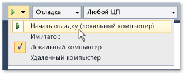

# Выполнение приложений Магазина из Visual Studio
[!INCLUDE[vs2017banner](../code-quality/includes/vs2017banner.md)]

Приложения Магазина выполняются на обширном диапазоне устройств, и Visual Studio предлагает вам несколько способов запуска таких приложений и взаимодействия с ними.  Процедура, вызываемая по нажатию клавиши F5, улучшена в целях упрощения отладки, профилирования и тестирования приложений во время разработки.  
  
   
  
## Содержание раздела  
  
|||  
|-|-|  
|[Запуск приложений для Магазина Windows на локальном компьютере](../debugger/run-windows-store-apps-on-the-local-machine.md)|Запуск приложения Магазина Windows на устройстве Visual Studio.|  
|[Запуск приложений для Магазина Windows в симуляторе](../debugger/run-windows-store-apps-in-the-simulator.md)|Запуск приложения Магазина Windows в окне настольной системы, имитирующем функциональность [!INCLUDE[win8_appname_long](../debugger/includes/win8_appname_long_md.md)], такую как сенсорное управление и ориентация.|  
|[Запуск приложений Магазина Windows на удаленном компьютере](../debugger/run-windows-store-apps-on-a-remote-machine.md)|Развертывание и запуск приложения Магазина Windows на устройстве, подключенном к компьютеру с Visual Studio по сети или непосредственно с помощью кабеля Ethernet.|  
|[Запуск приложений Windows Phone в эмуляторе](../debugger/run-windows-phone-apps-in-the-emulator.md)|Запуск приложения Магазина Windows в окне настольной системы, имитирующем Windows Phone.|  
|[Развертывание приложений для Магазина Windows из Visual Studio](../debugger/deploy-windows-store-apps-from-visual-studio.md)|Развертывание и регистрация приложения Магазина Windows на устройстве для специализированного тестирования.|