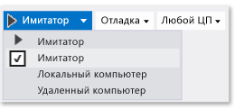

# Запуск приложения UWP и Windows 8.1 в симуляторе
Симулятор Visual Studio для приложений UWP и Windows 8.1 — это классическое приложение, которое имитирует приложение UWP или Windows 8.1. Можно запустить приложения выбирать физический размер и разрешение экрана, которые требуется эмулировать. Можно имитировать распространенные касания и поворота события и свойства сетевых подключений.
  
 Симулятор предоставляет среду, в которой можно проектирования, разработки, отладки и тестирования приложений UWP. Тем не менее прежде чем публиковать приложение в Microsoft Store, следует протестировать приложение на настоящем устройстве.  
  
 Симулятор Visual Studio для приложений UWP не работает в изолированной среде на локальном компьютере. Поэтому ошибки, возникающие в симуляторе, например неустранимая системная ошибка, могут также влиять на весь компьютер.  
  
 Сведения о Windows Phone см. в разделе [Run Windows Phone apps in the emulator](../debugger/run-windows-phone-apps-in-the-emulator.md) .  
  
> [!IMPORTANT]
>  Имитатор Visual Studio 2015 не включает кнопку географического положения. Это вызвано тем, что в имитаторе Windows 10 не предусмотрено моделирование географического положения. Если требуется выполнить моделирование такого рода, можно использовать имитатор Visual Studio 2013 для Windows 8.1 или более ранних операционных систем.  
  
##   Установка симулятора в качестве целевого объекта  
 Чтобы запустить приложение UWP в симуляторе, выберите **симулятор** из раскрывающегося списка рядом с **начать отладку** на панели инструментов **Стандартная** инструментов.  
  
   
  
##   Выбор режима взаимодействия  
 Вы можете выбрать следующие режимы взаимодействия.  
  
-    режим мыши: устанавливает режим взаимодействия с помощью жестов мыши. К жестам мыши относятся щелчки, двойные щелчки и перетаскивания.  
  
-    Эмуляция сенсорного экрана: Start: устанавливает режим взаимодействия с помощью жестов одним пальцем касания. К события касания одним пальцем относятся касания, перетаскивания и проведение пальцем по экрану.  
  
      один целевой значок указывает расположение событий в симуляторе. Используйте мышь для перемещения указателя.  
  
      нажмите кнопку мыши, чтобы активировать сенсорный режим. Например, нажмите кнопку, чтобы сымитировать касание, или нажмите и удерживайте кнопку по мере перетаскивания или проведения.  
  
## Жест сжатия и масштабирования  
 Устанавливает режим взаимодействия с помощью жестов сжатия и масштабирования, выполняемых двумя пальцами.  
  
-     
  
     Двойной целевой значок указывает расположение двух пальцев на экране устройства.  
  
    -   Переместите указатель мыши, чтобы расположить значки над объектом на экране устройства.  
  
    -   Поворачивайте колесико мыши назад или вперед, чтобы изменить сымитированное расстояние между двумя пальцами до сжатия или масштабирования.  
  
-   -     
  
         Нажмите левую кнопку и поворачивайте колесико мыши назад (к себе), чтобы увеличить масштаб (сжатие).  
  
    -   Нажмите левую кнопку и поворачивайте колесико мыши вперед (от себя), чтобы уменьшить масштаб (масштабирование).  
  
## Поворот объекта  
 Кнопка **Эмуляция сенсорного экрана: вращение** устанавливает режим взаимодействия с помощью жестов поворота, выполняемых двумя пальцами.  
  
-   -   Переместите указатель мыши, чтобы расположить значки над объектом на экране устройства.  
  
    -   Поворачивайте колесико мыши назад или вперед, чтобы изменить сымитированную ориентацию двух пальцев до поворота объекта.  
  
-   -   Нажмите левую кнопку и поворачивайте колесико мыши назад (к себе), чтобы повернуть объект против часовой стрелки. По мере поворота колесика мыши один из двух целевых значков вращается вокруг другого для указания относительного размера поворота.  
  
    -   Нажмите левую кнопку и поворачивайте колесико мыши вперед (от себя), чтобы повернуть объект по часовой стрелке.  
  
##   Включение или отключение режима "Поверх остальных окон"  
 Можно указать, чтобы окно симулятора всегда отображалось поверх других окон. Кнопка **Переключение на самое верхнее окно** включает или отключает режим **Поверх остальных окон** для окна имитатора.  
  
##   Изменение ориентации устройства  
 Можно переключиться между книжной и альбомной ориентацией устройства, повернув симулятор на 90 градусов в любом направлении.  
  
> [!NOTE]
>  Имитатор не связан со свойством [DisplayProperties.AutoRotationPreferences](http://go.microsoft.com/fwlink/?LinkId=249460) проекта. Например, если для проекта задать ориентацию `Landscape`, а затем повернуть симулятор для отображения в книжной ориентации, изображение симулятора также будет повернуто, и его размер будет изменен. Проверьте эти параметры на настоящем устройстве.  
  
> [!NOTE]
>  При повороте симулятора таким образом, что один его край больше экрана, на котором он отображается, размер симулятора изменяется автоматически для соответствия размеру экрана. Размер симулятора не изменяется до исходного при повторном повороте симулятора.  
  
##   Изменение размера и разрешения сымитированного экрана  
 Чтобы изменить размер и разрешение смоделированного экрана, нажмите кнопку **Изменить разрешение** в палитре и выберите новый размер и разрешение из списка.  
  
 Размер и разрешение экрана указываются в виде *Ширина экрана в дюймах, ширина в пикселях X высота в пикселях*. Обратите внимание на то, что имитируется и размер, и разрешение экрана. Координаты расположения в симуляторе преобразуются в координаты выбранного размера и разрешения устройства.  
  
> [!NOTE]
>  Можно сохранить масштабированные версии точечных рисунков в приложении, и Windows загрузит правильный рисунок для текущего масштаба. Дополнительные сведения см. в разделе [начальный конструктора и пользовательского интерфейса](/windows/uwp/layout/design-and-ui-intro). Однако, если изменить разрешение симулятора таким образом, чтобы ОС Windows выбрала другое изображение для соответствия разрешению, необходимо остановить и перезапустить сеанс отладки для просмотра нового изображения.  
  
##  Создание снимка приложения для представления магазин Microsoft  
 При отправке приложения в Microsoft Store, необходимо включить снимки экрана приложения.  
  
> [!NOTE]
>  Снимок экрана сохраняется в текущем разрешении симулятора. Чтобы изменить разрешение, нажмите кнопку **Изменить разрешение** .  
  
-   Для создания снимков экрана приложения в симуляторе нажмите кнопку **Запись снимка экрана в буфер обмена** .  
  
-   Чтобы задать расположение снимков экрана, нажмите кнопку **Параметры снимка экрана** и выберите расположение из контекстного меню.  
  
       
  
##   Имитация свойств сетевых подключений  
 Вы можете помочь пользователям приложения управлять затраты на лимитных сетевых подключениях, уведомления о сетевых соединений стоимость или данные плана изменения состояния и предоставления приложению возможности использовать эту информацию, чтобы избежать дополнительных расходов на оплату роуминга или превышение ограничения на передачу данных. [Windows.Networking.Connectivity](/uwp/api/windows.networking.connectivity) API-интерфейсы позволяют реагировать на [NetworkStatusChanged](/uwp/api/windows.networking.connectivity.networkinformation) и [TriggerType](/uwp/api/windows.applicationmodel.background.systemtrigger) события, которые имеется подписка. См. [краткое руководство по управлению ограничениями расходов на оплату сетевых подключений с лимитным тарифным планом](http://msdn.microsoft.com/library/windows/apps/Hh750310.aspx).  
  
 Чтобы выполнить отладку или тестирование кода, учитывающего стоимость сетевых подключений, имитатор может имитировать свойства сети, представляемые с помощью [ConnectionProfile](/uwp/api/windows.networking.connectivity.connectionprofile) объект, возвращаемый [GetInternetConnectionProfile](/uwp/api/windows.networking.connectivity.networkinformation).
  
 Для имитации свойств сети выполните следующие действия.  
  
1.  В панели инструментов имитатора нажмите кнопку **Изменение свойств сети** .  
  
2.  В диалоговом окне **Установка свойств сети** установите флажок **Использовать имитированные свойства сети**.  
  
     Снимите флажок, чтобы удалить имитацию и вернуться к свойствам сети подключенного в данный момент интерфейса.  
  
3.  Введите **Имя профиля** для сымитированной сети. Рекомендуется использовать уникальное имя, которое можно использовать для идентификации имитации в [ProfileName](/uwp/api/windows.networking.connectivity.connectionprofile) свойство [ConnectionProfile](/uwp/api/windows.networking.connectivity.connectionprofile) объекта.  
  
4.  Выберите [NetworkCostType](/uwp/api/windows.networking.connectivity.networkcosttype) для профиля из **тип стоимости сети** списка.  
  
5.  Из **флаг состояния лимита данных** список, можно задать [ApproachingDataLimit](/uwp/api/windows.networking.connectivity.connectioncost) свойство или [OverDataLimit](/uwp/api/windows.networking.connectivity.connectioncost) значение true, или можно выбрать  **В области данных ограничение** для обоих свойств значение false.  
  
6.  Из **состояние роуминга** выберите [перемещаемые](/uwp/api/windows.networking.connectivity.connectioncost) свойство.  
  
7.  Выберите **задать свойства** для имитации свойств сети путем активации переднего плана [NetworkStatusChanged](/uwp/api/windows.networking.connectivity.networkinformation) событий и фон [SystemTrigger](/uwp/api/windows.applicationmodel.background.systemtrigger) типа  **NetworkStateChange**.  
  
 **Дополнительные сведения об управлении сетевыми подключениями**  
  
 [краткое руководство по управлению ограничениями расходов на оплату сетевых подключений с лимитным тарифным планом](http://msdn.microsoft.com/library/windows/apps/Hh750310.aspx)  
  
 [Пример информации по сети](http://code.msdn.microsoft.com/windowsapps/Network-Information-Sample-63aaa201)  
  
 [Анализ энергопотребления](../profiling/analyze-energy-use-in-store-apps.md)  
  
 [Windows.Networking.Connectivity](/uwp/api/windows.networking.connectivity)  
  
 [Реакция на системные события с фоновыми задачами](http://msdn.microsoft.com/en-us/f7c86e86-a7ae-4abb-a923-76b03337a80a)  
  
 [Вызов событий приостановки, возобновления и фоновых событий в приложениях UWP](http://msdn.microsoft.com/library/windows/apps/hh974425.aspx)  
  
##   Навигация по симулятору с помощью клавиатуры  
 Панель инструментов имитатора можно перейти, нажав клавишу **сочетание клавиш CTRL + ALT + СТРЕЛКА ВВЕРХ** чтобы перенести фокус с окна симулятора на панель инструментов симулятора. Используйте клавиши **Стрелка вверх** и **Стрелка вниз** для перемещения между кнопками панели инструментов.  
  
 Можно завершить работу симулятора, нажав клавишу **CTRL + ALT + F4**.  
  
## См. также  
 [Запуск приложения из Visual Studio](../debugger/run-store-apps-from-visual-studio.md)