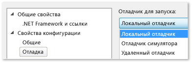

# Запуск приложений для Магазина Windows на локальном компьютере
[!INCLUDE[vs2017banner](../code-quality/includes/vs2017banner.md)]

  
  
 Чтобы провести отладку, тестирование или анализ производительности для приложения Магазина Windows, вы можете запустить это приложение на том же компьютере, где размещается Visual Studio.  Если экран устройства поддерживает сенсорное управление, вам становятся доступны все функции приложения, в противном случае вы сможете использовать только жесты, выполняемые с помощью мыши и клавиатуры.  
  
##   Содержание раздела  
 В разделе содержится следующая информация:  
  
 [Запуск на локальном компьютере](#BKMK_How_to_run_on_a_local_machine)  
  
 [Переключение между приложением Магазина Windows и Visual Studio на одном мониторе](#BKMK_How_to_switch_between_a_Windows_Store_app_and_Visual_Studio_on_a_single_monitor)  
  
##   Запуск на локальном компьютере  
 Чтобы запустить приложение на локальном компьютере, выберите **Локальный компьютер** из раскрывающегося списка рядом с кнопкой "Начать отладку" на панели инструментов **Стандартные** отладчика.  
  
   
  
 Если панель инструментов **Стандартные** не отображается, щелкните меню **Вид**, выберите пункт **Панели инструментов** и затем пункт **Стандартные**.  
  
 Выбор, производимый в раскрывающемся списке, сохраняется в файле свойств проекта и используется для запуска по умолчанию.  
  
 Целевой объект запуска также можно задать напрямую в файле свойств проекта.  В **обозревателе решений** щелкните правой кнопкой мыши имя проекта и выберите **Свойства**.  Выполните одно из следующих действий.  
  
-   В проектах C\# и Visual Basic щелкните элемент **Отладка** и выберите **Локальный компьютер** в раскрывающемся списке **Целевое устройство**.  
  
       
  
-   В проектах C\+\+ и JavaScript разверните узел **Свойства конфигурации**, щелкните **Отладка** и выберите **Локальный отладчик** в списке **Загружаемый отладчик**.  
  
       
  
##   Переключение между приложением Магазина Windows и Visual Studio на одном мониторе  
 **Порядок переключения из выполняемого экземпляра приложения Магазина Windows в Visual Studio**  
  
 Если вы запускаете приложение Магазина Windows на локальном компьютере и используете один монитор, вам может потребоваться вернуться в Visual Studio, оставив приложение выполняющимся.  Например, приложение может находиться в состоянии, которого нельзя добиться с помощью точки останова, например, ожидать события или выполняться в длительном или бесконечном цикле.  Чтобы вернуться в Visual Studio, нажмите ALT\+TAB.