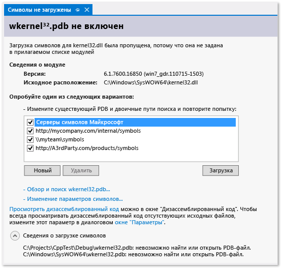

# Указание файлов символов (.pdb) и файлов с исходным кодом в отладчике Visual Studio
PDB-файл программы, также называемый файлом символов, сопоставляет идентификаторы, создаваемые в исходный код для классов, методов и другого кода, идентификаторы, которые используются в скомпилированных исполняемых файлах проекта. PDB-файл также сопоставляет операторы в исходном коде с инструкциями выполнения в исполняемых файлах. Отладчик использует эти сведения для определения ключа следующая информация:

* Имя исходного файла и номер строки для отображения в Интегрированной среде разработки Visual Studio
* Расположение в исполняемом файле, на котором должно останавливаться при задании точки останова

Файл символов также содержит исходное расположение исходных файлов и, при необходимости, расположение сервера системы управления версиями, откуда можно извлечь исходные файлы.
  
> [!TIP]
> Если необходимо выполнить отладку кода за пределами исходного кода проекта, например кода Windows или стороннего кода вызовов проекта, необходимо указать расположение PDB-файл (и, при необходимости, исходных файлов для внешнего кода), и эти файлы должны точно соответствовать сборке t он исполняемые файлы.  
 
##  Где отладчик поиск файлов символов 
  
1.  Расположение, указанное в библиотеке DLL или в исполняемом файле.  
  
     (По умолчанию, если на компьютере производится сборка библиотеки DLL или исполняемого файла, компоновщик помещает полный путь и имя связанного PDB-файла в библиотеку DLL или в исполняемый файл. Отладчик сначала проверяет, существует ли файл символов в расположении, которое задано в библиотеке DLL или в исполняемом файле. Это полезно, так как на компьютере всегда имеются символы для кода, который был скомпилирован на этом компьютере).  
  
2.  PDB-файлы, которые присутствуют в той же папке, в исполняемый файл или DLL.

3. Все расположения, [указан в параметрах отладчика](#BKMK_Specify_symbol_locations_and_loading_behavior) файлов символов. 
  
    * Все папки локального кэша символов.  
  
    * Все сети, Интернета, или серверы символов — локальные и расположений, указанных, таких как сервер символов Майкрософт (если он включен). 

> [!NOTE]
> До Visual Studio 2012 при отладке управляемого кода на удаленном устройстве требовалось размещать файлы символов на удаленном компьютере. Начиная с Visual Studio 2012, все файлы символов должны располагаться на локальном компьютере или в расположении [указан в параметрах отладчика](#BKMK_Specify_symbol_locations_and_loading_behavior).  
  
##   Почему файлы символов должны точно соответствовать исполняемым файлам?  
Отладчик загружает PDB-файл для исполняемого файла, только если он точно соответствует PDB-файлу, который был создан при сборке исполняемого файла (то есть это должен быть либо оригинальный PDB-файл, либо его копия). В дополнение к своей основной задаче — создать правильный и эффективный код, компилятор также стремится обеспечить оптимальную скорость компиляции, вследствие чего фактическая структура исполняемого файла может измениться, даже если сам код не изменяется. Дополнительные сведения см. в статье [Why does Visual Studio require debugger symbol files to exactly match the binary files that they were built with?](https://blogs.msdn.microsoft.com/jimgries/2007/07/06/why-does-visual-studio-require-debugger-symbol-files-to-exactly-match-the-binary-files-that-they-were-built-with/)
  
##  Настройка, где отладчик ищет файлы символов и поведения загрузки символов
 При отладке проекта в Интегрированной среде разработки Visual Studio, отладчик автоматически загружает файлы символов, которые находятся в каталоге проекта. Можно указать альтернативные пути поиска и серверы символов Microsoft, Windows или сторонних компонентов в **Сервис > Параметры > Отладка > символы**. Можно также указать определенные модули, для которых отладчик, чтобы автоматически загрузить символы для. Эти параметры можно будет изменить вручную во время выполнения отладки.  
  
1.  В Visual Studio откройте **Сервис > Параметры > Отладка > символы** страницы.  
  
       
  
2.  Выберите папку  значок. В поле **Места размещения файлов символов (.pdb)** отобразится редактируемый текст.  
  
3.  Введите URL-адрес либо путь к каталогу сервера символов или расположения символов. Завершение операторов помогает найти правильный формат.

    Можно использовать **Ctrl + вверх** и **Ctrl + вниз** для изменения порядка загрузки для расположения символов. Нажмите клавишу **F2** для изменения URL-адрес или путь к каталогу.
  
4.  Чтобы улучшить производительность загрузки символов, в поле **Кэшировать символы в этом каталоге** введите путь к локальному каталогу, в который серверы символов могут копировать символы (локальный каталог, в который можно копировать символы).  
  
    > [!NOTE]
    >  Не помещайте кэш символов в защищенную папку (такую как папка C:\Windows или одна из ее подпапок). Вместо этого следует использовать папку, для которой разрешены чтение и запись.  
  
### Указать поведение загрузки символов 
  
Можно указать, какие файлы, находящиеся в расположениях, которые заданы в поле **Места размещения файлов символов (.pdb)** , должны загружаться автоматически при запуске отладки. Файлы символов в каталоге проекта загружаются всегда.  
  
1.  Выберите **Все модули, кроме исключенных** , чтобы загрузить все символы для всех модулей, кроме тех, что были указаны при выборе ссылки **Укажите исключенные модули** .  
  
2.  Выберите вариант **Только указанные модули** , а затем выберите **Укажите модули** , чтобы перечислить модули, для которых требуется автоматически загружать файлы символов. Файлы символов для других модулей пропускаются.  
  
### Укажите дополнительные параметры символов 
  
Также можно задать следующие параметры на **Сервис > Параметры > Отладка > Общие** страницы:  
  
**Загружать экспортированные DLL (только машинный код)**  
  
Если выбран этот параметр, загружаются таблицы экспорта библиотеки DLL. Символьные данные из таблиц экспорта библиотеки DLL могут быть полезны при работе с сообщениями Windows, процедурами Windows (WindowProcs), объектами COM, при маршалинге или при работе с любой библиотекой DLL, для которой нет символов. Считывание данных экспорта библиотеки DLL создает дополнительную нагрузку. Поэтому данная возможность по умолчанию отключена.  
  
Чтобы посмотреть, какие символы доступны в таблице экспорта библиотеки DLL, можно воспользоваться командой `dumpbin /exports`. Символы доступны для любой 32-разрядной системной библиотеки DLL. В выходных данных команды `dumpbin /exports` можно увидеть точное имя функции, включая символы, отличные от буквенно-цифровых. Это полезно при задании точки останова в функции. Имена функций из таблиц экспорта библиотеки DLL могут отображаться в отладчике в сокращенном виде. Вызовы функций перечисляются в том порядке, в котором эти функции вызываются, при этом текущая функция (наиболее глубоко вложенная) располагается наверху. Дополнительные сведения см. в разделе [dumpbin /exports](/cpp/build/reference/dash-exports).  
  
###   Использование серверов символов для поиска файлов символов не на локальном компьютере  
 [!INCLUDE[vsprvs](../code-quality/includes/vsprvs_md.md)] может загружать отладочные файлы символов с серверов символов, которые реализуют протокол symsrv. [Visual Studio Team Foundation Server](http://msdn.microsoft.com/Library/bd6977ca-e30a-491a-a153-671d81222ce6) и [Средства отладки для Windows](http://msdn.microsoft.com/library/windows/hardware/ff551063\(v=VS.85\).aspx) — два средства, которые могут реализовать функции сервера символов. Используемые серверы символов указываются в диалоговом окне **Параметры** Visual Studio.  
  
 Возможно использование следующих серверов символов:  
  
 **Общедоступные серверы символов Майкрософт**  
  
 При отладке отказов, возникающих при обращении к системной библиотеке DLL или библиотеке стороннего производителя, зачастую требуются системные PDB-файлы, содержащие символьные данные для библиотек DLL, EXE-файлов и драйверов устройств Windows. Эти символы можно получить от общедоступных серверов символов корпорации Майкрософт. Общедоступные серверы символов Майкрософт предоставляют символы для операционных систем Windows, а также для MDAC, IIS, ISA и [!INCLUDE[dnprdnshort](../code-quality/includes/dnprdnshort_md.md)].  
  
 Для использования серверов символов Майкрософт выберите **Параметры и настройки** в меню **Отладка** и выберите **Символы**. Выберите **Серверы символов Майкрософт**.  
  
 **Серверы символов во внутренней сети или на локальном компьютере**  
  
 Команда разработчиков или компания может создавать серверы символов для собственных продуктов и поддерживать кэш для символов из внешних источников. Можно иметь сервер символов на собственном компьютере. Расположение серверов символов можно ввести в форме URL-адреса или как путь на странице **Отладка**/**Символы** диалогового окна **диалогового окна Параметры**(Почему Visual Studio требует, чтобы файлы символов отладчика точно соответствовали двоичным файлам, с которыми они были построены?)  
  
 **Сторонние серверы символов**  
  
 Сторонние поставщики приложений Windows и библиотек могут предоставить доступ к серверу символов в Интернете. В этом случае также введите URL-адрес этих серверов символов на странице **Отладка**/**Символы** ,  
  
> [!NOTE]
>  При использовании сервера символов, отличного от открытых серверов корпорации Майкрософт, следует убедиться в том, что сервер и его путь заслуживают доверия. Поскольку файлы символов могут содержать произвольный исполняемый код, возможно возникновение угроз безопасности.  
  
###   Поиск и загрузка символов при отладке  
 В любое время, когда отладчик находится в режиме приостановки выполнения, можно загрузить символы для модуля, который ранее был исключен в параметрах отладчика или который компилятору не удалось найти. Загрузку символов можно производить с помощью контекстных меню окон "Стек вызовов", "Модули", "Локальные", "Видимые" и всех окон контрольных значений. Если отладчик приостанавливает выполнение кода, для которого отсутствуют файлы символов или исходные файлы, появляется окно документа. В нем можно найти сведения об отсутствующих файлах и предпринять действия для их поиска и загрузки.
  
 **Поиск символов с помощью страниц "Символы не загружены" в окне документа**  
  
 Отладчик может прервать выполнение в коде, для которого отсутствуют символы, в результате любого из следующих событий:  
  
1.  Выполнение шага с заходом в код.  
  
2.  Приостановка выполнения кода из-за точки останова или исключения.  
  
3.  Переключение на другой поток.  
  
4.  Изменение кадра стека двойным щелчком по кадру в окне "Стек вызовов".  
  
 Когда происходит любое из этих событий, отладчик отображает страницу **Символы не загружены** , чтобы помочь найти и загрузить необходимые символы.  
  
   
  
-   Чтобы изменить пути поиска, выберите путь, который не выбран, или выберите **Создать** и введите новый путь. Нажмите **Загрузить** , чтобы повторить поиск в путях и загрузить файл символов, если он будет найден.  
  
-   Нажмите **Обзор для поиска***имя исполняемого файла***...** , чтобы переопределить все параметры символов и повторить поиск в выбранных путях. Если файл символов будет найден, он будет загружен, иначе отобразится Проводник, в котором можно вручную выбрать символьный файл.  
  
-   Выберите **изменить параметры символов...**  для отображения **Отладка** > **символы** VS параметры диалогового окна.  
  
-   Выберите **просмотреть дизассемблированный код** для однократного отображения дизассемблированного кода в новом окне.  
  
-   Чтобы дизассемблированный код отображался всегда, когда не удается найти исходные файлы или файлы символов, щелкните ссылку **Диалоговое окно "Параметры"** и установите флажки **Включить отладку на уровне адреса** и **Показывать дизассемблированный код, если исходный код недоступен**.  
  
       
  
 **Изменение параметров символов из контекстного меню**  
  
 В режиме приостановки выполнения можно найти и загрузить символы для элементов, которые отображаются в окнах "Стек вызовов", "Модули", "Локальные", "Видимые" и во всех окнах "Контрольные значения". Выделите элемент в окне, откройте контекстное меню и выберите одну из следующих команд:  
  
|Параметр|Описание|  
|------------|-----------------|  
|**Загрузить символы**|Пытается загрузить символы из расположений, указанных на **Отладка**/**символы** страница **параметры** диалоговое окно. Если файл символов обнаружить не удается, запускается Проводник, с помощью которого можно указать новое расположение для поиска.|  
|**Сведения о загрузке символов**|Представляет сведения о расположении загруженного файла символов или о расположениях, в которых производился поиск, если отладчику не удалось найти файл.|  
|**Параметры символов...**|Открывает **Отладка**/**символы** в Visual Studio **параметры** диалоговое окно.|  
|**Всегда загружать автоматически**|Добавляет файл символов в список файлов, которые автоматически загружаются отладчиком.|  
  
###   Задание параметров компилятора для файлов символов  
 Если при выполнении сборки проекта из интегрированной среды разработки VS используется стандартная конфигурация сборки **Отладка** , C++ и управляемые компиляторы создают соответствующие файлы символов для кода. Можно также задать параметры компилятора в командной строке для создания файлов символов.  
  
 **Параметры C++**  
  
 Файл базы данных программы (PDB-файл) содержит отладочные данные и сведения о состоянии проекта, позволяющие выполнять инкрементную компоновку отладочной конфигурации программы. PDB-файл создается при сборке с параметрами [/ZI или /Zi](/cpp/build/reference/z7-zi-zi-debug-information-format) (для С/С++).  
  
 В [!INCLUDE[vcprvc](../code-quality/includes/vcprvc_md.md)]параметр [/Fd](/cpp/build/reference/fd-program-database-file-name) определяет имя PDB-файла, созданного компилятором. При создании проекта в [!INCLUDE[vsprvs](../code-quality/includes/vsprvs_md.md)] с использованием мастеров используется параметр **/Fd** с целью создания PDB-файла с именем *project*.pdb.  
  
 При сборке приложения, написанного на C/C++, с использованием файла makefile и указанием параметра **/ZI** или **/Zi** без **/Fd**создаются два описанных ниже PDB-файла.  
  
-   VC*x*.pdb, где *x* представляет версию Visual C++, например VC11.pdb. Этот файл хранит все отладочные данные для отдельных OBJ-файлов и располагается в том же каталоге, что и файл makefile.  
  
-   project.pdb   Этот файл хранит все отладочные данные для исполняемого файла. Для С/С++ он располагается в подкаталоге \debug.  
  
 Каждый раз, создавая OBJ-файл, компилятор C/C++ добавляет отладочную информацию в файл VC*x*.pdb. Вставляемая информация включает информацию о типах, но не включает символьную информацию, такую как определения функций. Таким образом, даже если файл источника включает общие файлы заголовков, такие как \<windows.h >, определения типов из этих заголовков сохраняются только один раз, а не включаются в каждый OBJ-файл.  
  
 Компоновщик создает файл project.pdb, который содержит отладочные данные для исполняемого файла (EXE-файла) проекта. Файл project.pdb содержит полные отладочные данные, включая прототипы функций, а не только сведения о типах, содержащиеся в VC*x*.pdb. Оба PDB-файла позволяют осуществлять добавочное обновление. Компоновщик также включает путь к PDB-файлу в EXE-файл или DLL, который создает.  
  
 Отладчик [!INCLUDE[vsprvs](../code-quality/includes/vsprvs_md.md)] использует путь к PDB-файлу в EXE-файле или в DLL, чтобы найти PDB-файл проекта (project.pdb). Если отладчику не удается найти PDB-файл по этому пути или если путь является недопустимым (например, если проект был перемещен на другой компьютер), отладчик производит поиск в расположении, содержащем исполняемый EXE-файл, а затем в расположениях символов, которые указаны в диалоговом окне **Параметры** (папка**Отладка** , узел **Символы** ). Отладчик не загружает PDB-файл, если тот не соответствует отлаживаемому исполняемому файлу. Если отладчик не может найти PDB-файл, открывается диалоговое окно **Поиск символов** , позволяющее найти символы или добавить дополнительные местоположения в путь поиска.  
  
 **Параметры платформы .NET Framework**  
  
 Файл базы данных программы (PDB-файл) содержит отладочные данные и сведения о состоянии проекта, позволяющие выполнять инкрементную компоновку отладочной конфигурации программы. PDB-файл создается при выполнении сборки с ключом **/debug**. Можно строить приложения с ключом **/debug: full** или **/debug: pdbonly**. При построении с ключом **/debug:full** создается отлаживаемый код. При построении с ключом **/debug:pdbonly** создаются PDB-файлы, но не создается `DebuggableAttribute` , сообщающий JIT-компилятору о доступности отладочной информации. Ключ **/debug:pdbonly** следует использовать при создании PDB-файла для выпускаемой сборки, которая не подлежит отладке. Дополнительные сведения см. в разделе [/debug (C# Compiler Options)](/dotnet/csharp/language-reference/compiler-options/debug-compiler-option) или [/debug (Visual Basic)](/dotnet/visual-basic/reference/command-line-compiler/debug).  
  
 Отладчик [!INCLUDE[vsprvs](../code-quality/includes/vsprvs_md.md)] использует путь к PDB-файлу в EXE-файле или в DLL, чтобы найти PDB-файл проекта (project.pdb). Если отладчику не удается найти PDB-файл по этому пути или если путь является недопустимым, отладчик производит поиск в расположении EXE-файла, а затем в расположениях символов, указанных в диалоговом окне **Параметры** . Этот путь обычно является папкой **Отладка** в узле **Символы** . Отладчик не загружает PDB-файл, если тот не соответствует отлаживаемому исполняемому файлу. Если отладчик не может найти PDB-файл, открывается диалоговое окно **Поиск символов** , позволяющее найти символы или добавить дополнительные местоположения в путь поиска.  
  
 **Веб-приложения**  
  
 В файле конфигурации данного приложения (Web.config) необходимо установить режим отладки. В режиме отладки ASP.NET создает символы для динамически созданных файлов и включает присоединение отладчика к приложению ASP.NET. Visual Studio устанавливает это автоматически при запуске отладки, если проект был создан из шаблона веб-проектов.  
  
##   Поиск исходных файлов  
  
###   Где отладчик ищет исходные файлы  
 Отладчик ищет исходные файлы в следующих местах.  
  
1.  Файлы, открытые в интегрированной среде разработки того экземпляра Visual Studio, который запустил отладчик.  
  
2.  Файлы в решении, открытом в экземпляре Visual Studio.  
  
3.  Каталоги, заданные в **общие свойства**/**исходные файлы отладки** страницы свойств решения. (В **обозревателе решений**выберите узел решения, щелкните его правой кнопкой мыши и выберите **Свойства**. )  
  
4.  Сведения об исходном коде в PDB-файле модуля. Это может быть расположение исходных файлов на момент сборки модуля или команда для сервера системы управления версиями.  
  
###  Поиск и загрузка исходных файлов с помощью страниц символы Source/No не загружены  
 Когда отладчик приостанавливает выполнение в месте, для которого отсутствует исходный файл, он отображает страницу **Нет исходного кода** или **Символы не загружены** , которая может помочь найти исходный файл. Страница **Символы не загружены** отображается, если отладчику не удалось найти файл символов (.pdb) для исполняемого файла с целью выполнения поиска. Страница "Символы не загружены" предоставляет варианты действий для поиска файла. Если PDB-файл оказывается найден после выполнения одного из этих действий и отладчик может извлечь исходный файл на основании информации в файле символов, отображается исходный код. В противном случае будет открыта страница **Нет исходного кода** с описанием проблемы. На странице отображаются ссылки на действия, которые могут помочь в решении проблемы.  
  
###   Добавление путей поиска исходных файлов в решение  
 Для поиска исходных файлов можно указывать сетевые или локальные каталоги.  
  
1.  В Обозревателе решений выберите решение, затем в контекстном меню выберите **Свойства** .  
  
2.  Разверните узел **Общие свойства** и выберите **Исходные файлы отладки**.  
  
3.  Щелкните папку  значок. Изменяемый текст отображается в списке **Каталоги, содержащие исходный код** .  
  
4.  Добавьте путь, по которому требуется вести поиск.  
  
 Обратите внимание, что поиск выполняется только в указанном каталоге. Любые подкаталоги, в которых требуется осуществлять поиск, должны быть внесены в список.  
  
###   Использование серверов системы управления версиями  
 Если исходный код на локальном компьютере отсутствует или PDB-файл не соответствует исходному коду, при отладке приложения может помочь сервер системы управления версиями. Сервер системы управления версиями принимает запросы на файлы и возвращает сами файлы. Сервер системы управления версиями выполняется посредством DLL-файла с именем srcsrv.dll. Сервер системы управления версиями считывает PDB-файл приложения, который содержит указатели на репозиторий исходного кода, а также команды, используемые для получения исходного кода из репозитория. Можно установить, каким командам из PDB-файла приложения разрешено выполняться, составив список разрешенных команд в файле с именем srcsrv.ini, который должен быть помещен в тот же каталог, что и файлы srcsrv.dll и devenv.exe.  
  
> [!IMPORTANT]
>  В PDB-файл приложения можно внедрять произвольные команды, поэтому убедитесь, что в него помещены только те, которые требуется выполнить в файле srcsrv.ini. Любая попытка выполнить команду не из файла srcsvr.ini вызовет диалоговое окно подтверждения. Для получения дополнительной информации см. [Security Warning: Debugger Must Execute Untrusted Command](../debugger/security-warning-debugger-must-execute-untrusted-command.md). Параметры команд не проверяются, поэтому будьте внимательны с доверенными командами. Например, при доверии команде сmd.exe пользователь-злоумышленник может указать параметры, которые сделают команду опасной.  
  
 **Включение использования сервера системы управления версиями**  
  
1.  Убедитесь, что компиляция проведена с учетом мер безопасности, описанных в предыдущем разделе.  
  
2.  В меню **Сервис** выберите пункт **Параметры**.  
  
     Откроется диалоговое окно **Параметры** .  
  
3.  Разверните узел **Отладка** и выберите пункт **Общие**.  
  
4.  Установите флажок **Включить поддержку сервера системы управления версиями** .  
  
       
  
5.  (Необязательно) Выберите дочерние параметры, которые необходимы.  
  
     Обратите внимание, что параметры **Разрешить выполнение частично доверенных сборок (только управляемых) на исходном сервере** и **Всегда выполнять ненадежные команды исходного сервера без запроса** могут повысить риски безопасности, описанные выше.  
  
## См. также  
[Основные сведения о файлах символов и параметры символов Visual Studio](https://blogs.msdn.microsoft.com/visualstudioalm/2015/01/05/understanding-symbol-files-and-visual-studios-symbol-settings/)

[.NET Remote Symbol Loading Changes in Visual Studio 2012 and 2013 (Изменения принципов загрузки удаленных символов .NET в Visual Studio 2012 и 2013)](http://blogs.msdn.com/b/visualstudioalm/archive/2013/10/16/net-remote-symbol-loading-changes-in-visual-studio-2012-and-2013.aspx)