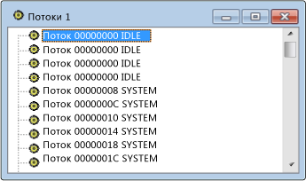

# Представление потоков
Представление потоков — это плоский список всех потоков, связанных с окнами в вашей системе. Отображаются идентификатор потока и имя модуля для каждого потока. Процессы не отображаются, но можно легко узнать, какой процесс владеет выбранным потоком.

## Процедуры

#### Открытие представления потоков

1. В меню **Spy** выберите пункт **Потоки**.

    Spy++ Представление потоков

   На рисунке выше показано представление потоков.

## В этом разделе
 [Поиск потока в представлении потоков](../debugger/how-to-search-for-a-thread-in-threads-view.md). Объясняется, как найти определенный поток в представлении потоков.

 [Отображение свойств потока](../debugger/how-to-display-thread-properties.md). Объясняется, как отобразить дополнительные сведения о потоке.

## Связанные разделы
 [Представления Spy++](../debugger/spy-increment-views.md). Рассказывает о представлениях Spy++ в виде дерева окон, сообщений, процессов и потоков.

 [Использование Spy++](../debugger/using-spy-increment.md). Содержит вводные сведения о средстве Spy++ и его использовании.

 [Диалоговое окно "Поиск потока"](../debugger/thread-search-dialog-box.md). Используется для поиска узла конкретного потока в представлении потоков.

 [Диалоговое окно "Свойства потока"](../debugger/message-properties-dialog-box.md). Отображает свойства потока, выбранного в представлении потоков или сообщений.

 [Справочник по Spy++](../debugger/spy-increment-reference.md). Содержит разделы с описанием каждого меню и диалогового окна Spy++.