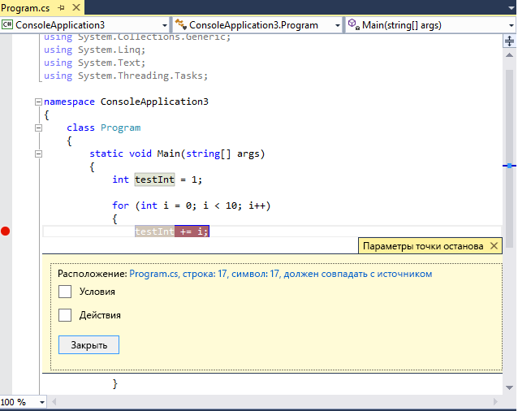
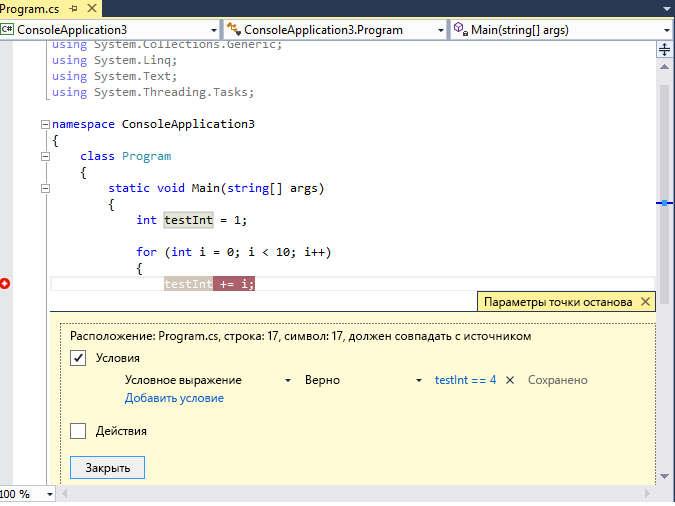
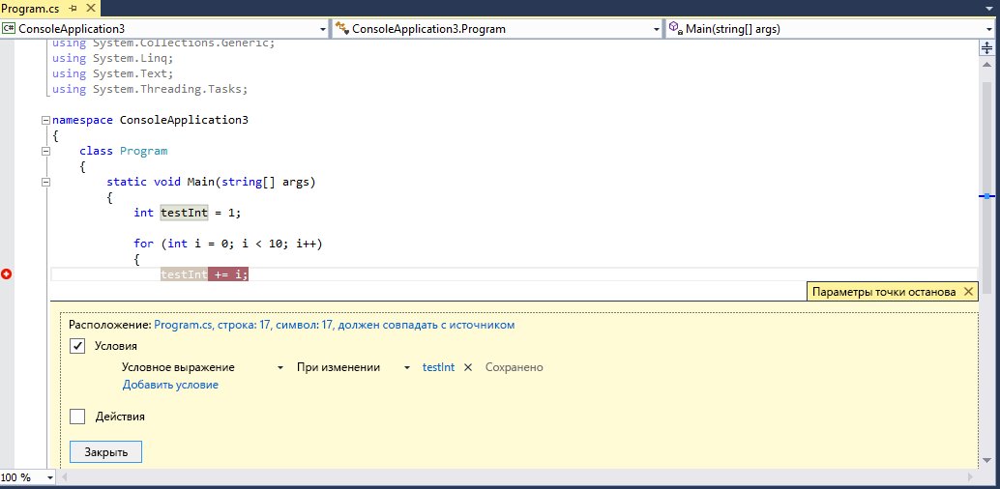
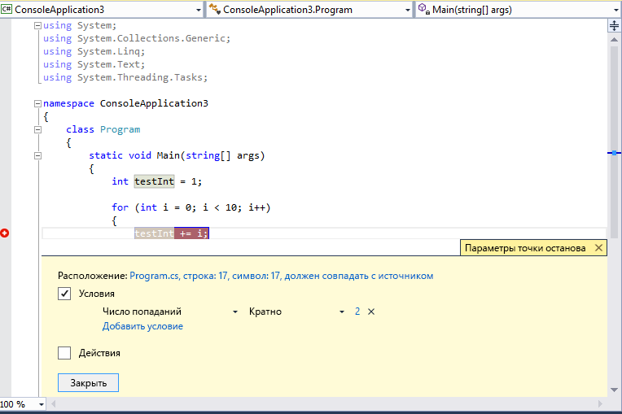

# <a name="use-breakpoints-in-the-visual-studio-debugger"></a>Использование точек останова в отладчике Visual Studio

Точки останова — это один из важнейших инструментов разработчика для выполнения отладки. Точки останова устанавливаются везде, где нужно приостановить выполнение отладчика. Например, вы хотите просмотреть состояние переменных кода или стек вызовов в определенной точке останова.  Если вы пытаетесь разрешить предупреждение или проблему при использовании точек останова, см. раздел [Устранение неполадок точек останова в отладчике Visual Studio](../debugger/troubleshooting-breakpoints.md).

> [!NOTE]
> Если вам известна задача или проблема, которую вы пытаетесь решить, но вы не знаете, какой тип точки останова следует использовать, см. статью [Часто задаваемые вопросы. Поиск нужной функции отладки в Visual Studio](../debugger/find-your-debugging-task.md#pause-running-code).

## <a name="set-breakpoints-in-source-code"></a><a name="BKMK_Overview"></a> Задание точек останова в исходном коде

Можно установить точку останова в любой строке исполняемого кода. Например, в следующем коде C# можно задать точку останова в строке кода с присвоением значения переменной (`int testInt = 1`), в цикле `for` или любом коде в цикле `for`. Точка останова не может быть задана в сигнатурах метода, объявлениях пространства имен или класса, а также в объявлениях переменной, не содержащих присваивания и методов задания или получения.

Чтобы задать точку останова в исходном коде, щелкните в крайнем левом поле рядом со строкой кода. Можно также выбрать строку и нажать клавишу **F9**, выбрать команду **Отладка** > **Переключить точку останова** или щелкнуть правой кнопкой мыши и выбрать команду **Точка останова** > **Вставить точку останова**. В месте установки точки останова в левом поле появится красная точка.

Для большинства языков, включая C#, точка останова и текущие строки выполнения выделяются автоматически. Для кода C++ можно включить выделение точек останова и текущих строк, выбрав **Сервис** (или **Отладка**) > **Параметры** > **Отладка** >  **Выделить всю исходную строку для точек останова и текущий оператор (только C++)** .


При отладке выполнение приостанавливается в точке останова до выполнения кода в этой строке. Символ точки останова отображается с желтой стрелкой.

В точке останова в следующем примере значение `testInt` по-прежнему равно 1. Таким образом, значение не изменилось с момента инициализации переменной (значение 1), так как инструкция, выделенная желтым, еще не была выполнена.


Когда отладчик останавливается в точке останова, можно просмотреть текущее состояние приложения, включая [значения переменных](../debugger/debugger-feature-tour.md#inspect-variables-with-data-tips) и [стека вызова](../debugger/how-to-use-the-call-stack-window.md).

Ниже приведены некоторые общие инструкции по работе с точками останова.

- Точка останова представляет собой переключатель. Можно щелкнуть ее, нажать клавишу **F9** или выбрать **Отладка** > **Переключить точку останова**, чтобы удалить или снова вставить ее.

- Чтобы отключить точку останова, не удаляя ее, наведите указатель мыши на нее или щелкните ее правой кнопкой мыши и выберите **Отключить точку останова**. Отключенные точки останова отображаются как пустые точки в левом поле или окне **Точки останова**. Чтобы повторно включить точку останова, наведите указатель мыши на нее или щелкните ее правой кнопкой мыши и выберите **Включить точку останова**.

- Задайте условия и действия, добавьте и измените метки или экспортируйте точку останова, щелкнув ее правой кнопкой мыши и выбрав нужную команду или наведя на нее курсор и нажав на значок **Параметры**.

## <a name="breakpoint-actions-and-tracepoints"></a><a name="BKMK_Print_to_the_Output_window_with_tracepoints"></a> Действия точки останова и точки трассировки

*Точка трассировки* — это точка останова, которая выводит сообщение в окно **вывода**. Точка трассировки может играть роль временного оператора трассировки в языке программирования и не приостанавливает выполнение кода. Вы создаете точку трассировки, задавая особое действие в окне **Параметры точки останова**. Подробные инструкции см. в разделе [Использование точек трассировки в отладчике Visual Studio](../debugger/using-tracepoints.md).

## <a name="breakpoint-conditions"></a>Условия точки останова

Можно управлять тем, где и когда выполняется точка останова, задавая условия. Условие может быть любым допустимым выражением, которое распознает отладчик. Дополнительные сведения о допустимых выражениях см. в разделе [Выражения в отладчике](../debugger/expressions-in-the-debugger.md).

**Задание условия для точки останова.**

1. Щелкните правой кнопкой мыши символ точки останова и выберите пункт **Условия** (или нажмите клавиши **ALT** + **F9**, **C**). Или наведите курсор на символ точки останова, выберите значок **Параметры**, а затем выберите **Условия** в окне **Параметры точки останова**.

   Можно также задать условия в окне **Точки останова**, щелкнув правой кнопкой мыши точку останова и выбрав пункт **Параметры**, а затем **Условия**.

   

2. В раскрывающемся списке выберите **Условное выражение**, **Количество обращений** или **Фильтр** и задайте соответствующее значение.

3. Выберите **Закрыть** или нажмите клавиши **CTRL**+**ВВОД**, чтобы закрыть окно **Параметры точки останова**. Или в окне **Точки останова** выберите **ОК**, чтобы закрыть диалоговое окно.

Точки останова с установленными условиями отображаются с символом **+** в исходном коде и окне **Точки останова**.

<a name="BKMK_Specify_a_breakpoint_condition_using_a_code_expression"></a>
### <a name="create-a-conditional-expression"></a>Создание условного выражения

Если вы выбрали **Условное выражение**, можно выбрать одно из двух условий: **Имеет значение true** или **При изменении**. Выберите значение **Имеет значение true**, чтобы прервать выполнение при истинности выражения, или значение **При изменении**, если требуется прервать выполнение при изменении значения выражения.

В следующем примере задается применение точки останова, только если значение `testInt` равно **4**:



В следующем примере задается применение точки останова, только если значение `testInt` меняется:



Если условие точки останова имеет недопустимый синтаксис, появится предупреждающее сообщение. Если указать условие для точки останова с недопустимой семантикой, но допустимым синтаксисом, предупреждающее сообщение появится при достижении точки останова в первый раз. В любом случае отладчик прерывает выполнение при попадании на недопустимую точку останова. Точка останова пропускается, только если условие допустимо и принимает значение `false`.

>[!NOTE]
> Для поля **При изменении** отладчик не обрабатывает первое вычисление условия как изменение, поэтому при первом вычислении выражения точка останова не сработает.

<a name="using-object-ids-in-breakpoint-conditions-c-and-f"></a>
### <a name="use-object-ids-in-conditional-expressions-c-and-f-only"></a>Использование идентификаторов объектов в условных выражениях (только C# и F#)

 Иногда возникает необходимость наблюдать за поведением определенного объекта. Например, может потребоваться выяснить, почему объект был вставлен в коллекцию несколько раз. В C# и F# можно создавать идентификаторы объектов для определенных экземпляров [ссылочных типов](/dotnet/csharp/language-reference/keywords/reference-types) и использовать их в условиях точек останова. Идентификатор объекта создается службами отладки среды CLR и связан с объектом.

**Создание идентификатора объекта**

1. Установите точку останова в коде после создания объекта.

2. Запустите отладку и, когда выполнение приостановится на точке останова, выберите **Отладка** > **Windows** > **Локальные** (или нажмите клавиши **CTRL** + **ALT** + **V**, **L**), чтобы открыть окно **Локальные**.

   Найдите конкретный экземпляр объекта в окне **Локальные**, щелкните его правой кнопкой мыши и выберите **Сделать идентификатор объекта**.

   В окне **$** вы должны увидеть символ **Локальные** . Это и есть идентификатор объекта.

3. Добавьте новую точку останова в точке, которую нужно исследовать, например в точке добавления объекта в коллекцию. Щелкните правой кнопкой мыши точку останова и выберите пункт **Условие**.

4. Используйте идентификатор объекта в поле **Условное выражение**. Например, если переменная `item` является объектом, который должен быть добавлен в коллекцию, выберите **Имеет значение true** и введите **item == $\<n>** , где \<n> — номер идентификатора объекта.

   Выполнение прервется в точке добавления объекта в коллекцию.

   Чтобы удалить идентификатор объекта, щелкните правой кнопкой мыши переменную в окне **Локальные** и выберите пункт **Удалить идентификатор объекта**.

> [!NOTE]
> Идентификаторы объектов создают слабые ссылки и не предотвращают сборку мусора для объекта. Они действительны только в рамках текущего сеанса отладки.

### <a name="set-a-hit-count-condition"></a>Установка условия количества обращений

Если есть подозрение, что цикл в коде начинает неправильно вести себя после определенного числа итераций, можно установить точку останова для остановки выполнения после указанного количества обращений, вместо того чтобы многократно нажимать клавишу **F5** для достижения этой итерации.

В разделе **Условия** в окне **Параметры точки останова** выберите **Количество обращений**, а затем укажите число итераций. В следующем примере задается выполнение точки останова при каждой второй итерации:



### <a name="set-a-filter-condition"></a>Задание условия фильтра

Вы можете ограничить точку останова, сделав ее срабатывание возможным лишь на определенных устройствах или в определенных процессах или потоках.

В разделе **Условия** в окне **Параметры точки останова** выберите **Фильтр**, а затем введите одно или несколько из следующих выражений.

- MachineName = "имя"
- ProcessId = значение
- ProcessName = "имя"
- ThreadId = значение
- ThreadName = "имя"

Значения строк следует заключить в двойные кавычки. Для комбинации условий можно использовать знаки `&` (И), `||` (ИЛИ), `!` (НЕ) и скобки.

## <a name="set-function-breakpoints"></a><a name="BKMK_Set_a_breakpoint_in_a_source_file"></a> Задание точек останова функции

Выполнение можно прерывать при вызове функции. Это полезно, например, если известно имя функции, но не ее расположение. Это также полезно, если у вас есть функции с одинаковым именем и вы хотите приостановить их все (например, перегруженные функции или функции в разных проектах).

**Установка точки останова функции:**

1. Выберите **Отладка** > **Создать точку останова** > **Точка останова функции** или нажмите клавиши **CTRL** + **K**, **B**.

   Можно также выбрать **Создать** > **Точка останова функции** в окне **Точки останова**.

1. В диалоговом окне **Новая точка останова функции** заполните поле **Имя функции**.

   Чтобы уточнить функцию, сделайте следующее.

   - Используйте полное имя функции.

     Пример: `Namespace1.ClassX.MethodA()`

   - Добавьте типы параметров перегруженной функции.

     Пример: `MethodA(int, string)`

   - Используйте символ "!", чтобы указать модуль.

     Пример: `App1.dll!MethodA`

   - Используйте оператор контекста в машинном коде C++.

     `{function, , [module]} [+<line offset from start of method>]`

     Пример: `{MethodA, , App1.dll}+2`

1. В раскрывающемся списке **Язык** выберите язык функции.

1. Нажмите кнопку **ОК**.

### <a name="set-a-function-breakpoint-using-a-memory-address-native-c-only"></a>Задание точки останова функции по адресу памяти (только в машинном коде C++)
 Вы можете использовать адрес объекта, чтобы установить точку останова функции в методе, вызываемом для конкретного экземпляра класса.  Например, если имеется адресуемый объект типа `my_class`, вы можете задать точку останова функции в методе `my_method`, вызываемом экземпляром.

1. Установите точку останова после создания экземпляра класса.

2. Найдите адрес экземпляра (например, `0xcccccccc`).

3. Выберите **Отладка** > **Создать точку останова** > **Точка останова функции** или нажмите клавиши **CTRL** + **K**, **B**.

4. В поле **Имя функции** добавьте следующий текст и выберите язык **C++** .

   ```cpp
   ((my_class *) 0xcccccccc)->my_method
   ```

::: moniker range=">= vs-2019"

## <a name="set-data-breakpoints-net-core-30-or-higher"></a><a name="BKMK_set_a_data_breakpoint_managed"></a>Задание точек останова в данных (.NET Core 3.0 или более поздней версии)

Точки останова в данных прерывают выполнение при изменении свойства конкретного объекта.

**Задание точки останова в данных**

1. В проекте .NET Core начните отладку и подождите, пока не будет достигнута точка останова.

2. В окне **Видимые**, **Контрольные значения** или **Локальные** щелкните правой кнопкой мыши свойство и выберите **Прервать выполнение при изменении значения** в контекстном меню.

    

Точки останова в данных в .NET Core не будут работать для следующих элементов:

- Свойства, которые не могут быть расширены в подсказках, окнах "Локальные", "Видимые" или "Контрольные значения"
- Статические переменные
- Классы с атрибутом DebuggerTypeProxy
- Поля внутри структур

::: moniker-end

## <a name="set-data-breakpoints-native-c-only"></a><a name="BKMK_set_a_data_breakpoint_native_cplusplus"></a>Задание точек останова в данных (только машинный код C++)

 Точки останова в данных приостанавливают выполнение, когда изменяется значение, хранящееся в указанном адресе памяти. Если значение только считывается, но не изменяется, выполнение программы не прерывается.

**Задание точки останова в данных**

1. В проекте C++ начните отладку и подождите, пока не будет достигнута точка останова. В меню **Отладка** выберите команду **Создать точку останова** > **Точка останова в данных**.

    Можно также выбрать **Создать** > **Точка останова в данных** в окне **Точки останова** или щелкнуть правой кнопкой мыши элемент **Видимые**, **Контрольные значения** или **Локальные** и выбрать **Прервать выполнение при изменении значения** в контекстном меню.

2. В поле **Адрес** введите адрес памяти или выражение, результатом вычисления которого будет адрес памяти. Например, для прерывания при изменении содержимого переменной `&avar` введите `avar` .

3. В раскрывающемся списке **Счетчик байтов** введите количество байтов, за которыми должен наблюдать отладчик. Например, если выбрать **4**, отладчик будет наблюдать за четырьмя байтами начиная с `&avar` и выполнит прерывание, если какой-либо из этих байтов изменит значение.

Точки останова в данных не работают при следующих условиях.
- Процесс, для которого не выполняется отладка, производит запись в область памяти.
- Область памяти совместно используется двумя или более процессами.
- Область памяти обновляется в ядре. Например, если память передается в функцию `ReadFile` 32-разрядной версии Windows, то память будет обновляться из режима ядра и отладчик не будет прерывать выполнение при обновлении.
- Контрольное значение превышает 4 байта на 32-разрядном оборудовании и 8 байт на 64-разрядном оборудовании. Это ограничение архитектуры x86.

> [!NOTE]
> - Точки останова в данных зависят от конкретных адресов памяти. Адрес переменной меняется между сеансами отладки, поэтому точки останова в данных автоматически отключаются в конце каждого сеанса отладки.
>
> - Если установить точку останова по данным на локальную переменную, точка останова остается включенной при завершении выполнения функции, но адрес памяти больше не применяется, поэтому поведение точки останова будет непредсказуемым. Если установить точку останова в данных на локальную переменную, рекомендуется удалить или отключить точку останова до окончания функции.

## <a name="manage-breakpoints-in-the-breakpoints-window"></a><a name="BKMK_Specify_advanced_properties_of_a_breakpoint_"></a> Управление точками останова в окне "Точки останова"

 Используйте окно **Точки останова** для просмотра всех точек останова в вашем решении и управления ими. Это централизованное расположение особенно полезно в больших решениях или сложных сценариях отладки, в которых точки останова являются критически важными.

В окне **Точки останова** можно выполнять поиск, сортировку, фильтрацию, включение, отключение или удаление точек останова. Можно также задать условия и действия или добавить новую функцию или точку останова в данных.

Чтобы открыть окно **Точки останова**, выберите **Отладка** > **Windows** > **Точки останова** или нажмите клавиши **CTRL**+**ALT**+**B**.


Чтобы выбрать столбцы для отображения в окне **Точки останова**, выберите **Показать столбцы**. Выберите заголовок столбца, чтобы отсортировать список точек останова по этому столбцу.

### <a name="breakpoint-labels"></a><a name="BKMK_Set_a_breakpoint_at_a_function_return_in_the_Call_Stack_window"></a> Метки точки останова
Используйте метки для сортировки и фильтрации списка точек останова в окне **Точки останова**.

1. Чтобы добавить метку к точке останова, щелкните правой кнопкой мыши точку останова в исходном коде или в окне **Точки останова**, а затем выберите **Изменить метки**. Добавьте новую метку или выберите существующую, а затем выберите **ОК**.
2. Отсортируйте список точек останова в окне **Точки останова**, выбрав **Метки**, **Условия** или другие заголовки столбцов. Можно выбрать отображаемые столбцы, нажав **Показать столбцы** на панели инструментов.

### <a name="export-and-import-breakpoints"></a>Экспорт и импорт точек останова
 Чтобы сохранить или предоставить состояние и расположение точек останова, их можно экспортировать или импортировать.

- Чтобы экспортировать одну точку останова в XML-файл, щелкните правой кнопкой мыши точку останова в исходном коде или окне **Точки останова** и выберите **Экспорт** или **Экспорт выбранных**. Выберите расположение экспорта и щелкните **Сохранить**. Расположением по умолчанию является папка решения.
- Чтобы экспортировать несколько точек останова, в окне **Точки останова** установите флажки рядом с точками останова или введите условия поиска в поле **поиска**. Нажмите на значок **Экспортировать все точки останова, соответствующие текущим критериям поиска** и сохраните файл.
- Чтобы экспортировать все точки останова, снимите все флажки и оставьте поле **поиска** пустым. Нажмите на значок **Экспортировать все точки останова, соответствующие текущим критериям поиска** и сохраните файл.
- Чтобы импортировать точки останова, в окне **Точки останова** выберите значок **Импортировать точки останова из файла**, перейдите к расположению XML-файла и нажмите **Открыть**.

## <a name="set-breakpoints-from-debugger-windows"></a><a name="BKMK_Set_a_breakpoint_from_debugger_windows"></a> Установка точек останова из окон отладчика

Можно также задать точки останова из окон отладчика **Стек вызовов** и **Дизассемблирование**.

### <a name="set-a-breakpoint-in-the-call-stack-window"></a>Задание точки останова в окне стека вызовов

 Чтобы прервать выполнение на инструкции или строке, к которой возвращается вызывающая функция, установите соответствующую точку останова в окне **Стек вызовов**.

**Задание точки останова в окне стека вызовов**

1. Чтобы открыть окно **Стек вызовов**, необходимо приостановить процесс отладки. Выберите **Отладка** > **Windows** > **Стек вызовов** или нажмите клавиши **CTRL**+**ALT**+**C**.

2. В окне **Стек вызовов** щелкните правой кнопкой мыши вызывающую функцию и выберите **Точка останова** > **Вставить точку останова** или нажмите **F9**.

   В левом поле стека вызовов рядом с именем вызова функции появится символ точки останова.

В окне **Точки останова** точка останова стека вызова будет представлена как адрес с областью памяти, который соответствует следующей исполняемой инструкции в функции.

Отладчик приостанавливает выполнение на этой инструкции.

Более подробную информацию о стеке вызовов см. в разделе [Практическое руководство. Использование окна стека вызова](../debugger/how-to-use-the-call-stack-window.md).

Сведения о визуальном отслеживании точек останова во время выполнения кода см. в разделе [Сопоставление методов в стеке вызовов при отладке](../debugger/map-methods-on-the-call-stack-while-debugging-in-visual-studio.md).

### <a name="set-a-breakpoint-in-the-disassembly-window"></a>Задание точки останова в окне дизассемблирования

1. Чтобы открыть окно **Дизассемблирование**, необходимо приостановить процесс отладки. Выберите **Отладка** > **Windows** > **Дизассемблирование** или нажмите клавиши **CTRL**+**ALT**+**D**.

2. В окне **Дизассемблирование** щелкните в левом поле инструкции, на которой нужно прервать выполнение. Можно также выбрать строку и нажать клавишу **F9** или щелкнуть правой кнопкой мыши и выбрать **Точка останова** > **Вставить точку останова**.

## <a name="see-also"></a>См. также

- [Что такое отладка?](../debugger/what-is-debugging.md)
- [Улучшение кода C# с помощью Visual Studio](../debugger/write-better-code-with-visual-studio.md)
- [Первое знакомство с отладкой](../debugger/debugger-feature-tour.md)
- [Устранение неполадок с точками останова в отладчике Visual Studio](../debugger/troubleshooting-breakpoints.md)
