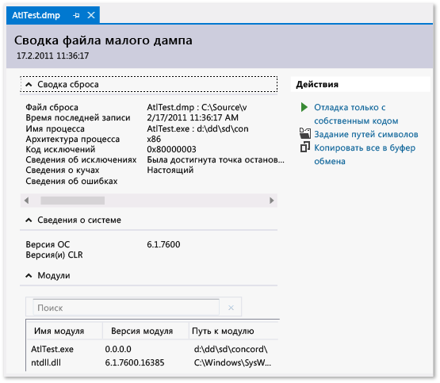

# Файлы дампа в отладчике Visual Studio

 *Файл дампа* — это моментальный снимок, показывающий выполнявшийся процесс и загруженные для приложения модули в определенный момент времени. Дамп со сведениями о куче также содержит моментальный снимок памяти приложения на этот момент.

Открытие файла дампа с кучей в Visual Studio в чем-то подобно остановке в точке останова во время сеанса отладки. Хотя вы не можете продолжить выполнение, но можете проверить стеки, потоки и значения переменных приложения на момент создания дампа.

В основном дампы используются для отладки проблем на компьютерах, к которым у разработчиков нет доступа. Если вы не можете воспроизвести на своем компьютере аварийное завершение или зависание программы, возникшие на компьютере клиента, вы можете записать файл дампа с его компьютера. Дампы также создаются тест-инженерами, чтобы сохранить данные для дополнительного тестирования.

Отладчик Visual Studio может сохранять файлы дампа для управляемого и машинного кода. Он может отлаживать файлы дампа, созданные Visual Studio или другими приложениями, способными сохранять файлы в формате *минидампа*.

##  Требования и ограничения

- Для отладки файлов дампа, полученных с 64-разрядных компьютеров, необходимо запустить Visual Studio на 64-разрядном компьютере.

- Visual Studio поддерживает отладку файлов дампа, создаваемых приложениями в машинных кодах на устройствах ARM. Он также поддерживает отладку дампов управляемых приложений с устройств ARM, но только в отладчике машинного кода.

- Для отладки файлов дампа, полученных в [режиме ядра](/windows-hardware/drivers/debugger/kernel-mode-dump-files), или использования расширения отладки [SOS.dll](/dotnet/framework/tools/sos-dll-sos-debugging-extension) в Visual Studio загрузите средства отладки для Windows из [комплекта разработки драйверов для Windows (WDK)](/windows-hardware/drivers/download-the-wdk).

- Visual Studio не поддерживает отладку файлов дампа, сохраненных в старом формате [полного дампа в режиме пользователя](/windows/desktop/wer/collecting-user-mode-dumps). Полный дамп в режиме пользователя не то же самое, что и дамп с кучей.

- Отладка с использованием файлов дампа оптимизированного кода может сопровождаться ложной информацией. К примеру, встраивание компилятором функций может приводить к непредвиденным стекам вызовов, а другие виды оптимизации могут изменять время существования переменных.

##  Файлы дампа, с кучами или без куч

В файлах дампа могут содержаться сведения о куче, но могут и отсутствовать.

- **Файл дампа со сведениями о куче** содержит снимок памяти приложения, включая значения переменных на момент создания дампа. Visual Studio также сохраняет в файле дампа с кучей двоичные файлы загруженных модулей машинного кода, что может значительно упростить отладку. Visual Studio может загружать символы из файла дампа с кучей, даже если не удается найти двоичный файл приложения.

- **Файлы дампа без сведений о куче** намного меньше, чем дампы с кучами, но отладчику нужно будет загрузить двоичные файлы приложения, чтобы найти сведения о символах. Загруженные двоичные файлы должны точно соответствовать тем, которые выполнялись во время создания дампа. В файлах дампа без сведений о куче хранятся только значения переменных стека.

##  Создание файла дампа

При отладке процесса в Visual Studio можно сохранить дамп, когда отладчик останавливает выполнение при возникновении исключения или в точке останова.

Если включена [JIT-отладка](../debugger/just-in-time-debugging-in-visual-studio.md), можно подключить отладчик Visual Studio к аварийному процессу, который выполняется вне Visual Studio, а затем сохранить файл дампа из отладчика. См. раздел [Подключение к выполняющимся процессам](../debugger/attach-to-running-processes-with-the-visual-studio-debugger.md).

**Сохранение файла дампа**

1. Когда во время отладки происходит остановка (при возникновении ошибки или в точке останова), выберите **Отладка** > **Сохранить дамп как**.

1. В диалоговом окне **Сохранить дамп как** в разделе **Тип файла** можно выбрать **Минидамп** или **Минидамп с кучей** (значение по умолчанию).

1. Укажите путь сохранения и выберите имя файла дампа, а затем нажмите **Сохранить**.

>[!NOTE]
>Вы можете создавать файлы дампа с помощью любой программы, которая поддерживает формат минидампов Windows. Такой программой, например, может быть программа командной строки **Procdump** из [Windows Sysinternals](/sysinternals/), которая может создавать файлы аварийного дампа процесса на основе триггеров или по требованию. Дополнительные сведения об использовании других средств для создания файлов дампа см. в разделе [Требования и ограничения](../debugger/using-dump-files.md#BKMK_Requirements_and_limitations).

##  Открытие файла дампа

1. В Visual Studio последовательно выберите **Файл** > **Открыть** > **Файл**.

1. В диалоговом окне **Открытие файла** найдите и выберите файл дампа. Обычно они имеют расширение *DMP*. Нажмите кнопку **ОК**.

   В окне **Сводка файла минидампа** отображается сводка и сведения о модулях для файла дампа, а также действия, которые можно выполнить.

   

1. В разделе **Действия**:
   - чтобы задать расположения для загрузки символов, выберите **Set symbol paths** (Задать пути к символам);
   - чтобы начать отладку, выберите **Debug with Managed Only** (Отладка только с управляемым кодом), **Debug with Native Only** (Отладка только с машинным кодом), **Debug with Mixed** (Отладка со смешанным кодом) или **Debug with Managed Memory** (Отладка с управляемой памятью).

##  Поиск файлов EXE, PDB и исходных файлов

Для использования всех возможностей отладки в файле дампа Visual Studio требуются следующие файлы.

- *EXE*-файл, для которого был создан дамп, и другие двоичные файлы (DLL и т. п.), использовавшиеся процессом дампа.
- Файлы символов ( *.pdb*) для *EXE*-файлов и других двоичных файлов.
- *EXE*- и *PDB*-файлы, в точности соответствующие версии и сборке файлов, использовавшихся при создании дампа.
- Исходные файлы для соответствующих модулей. Если не удается найти исходные файлы, можно использовать дизассемблирование модулей.

Если в дампе содержатся данные кучи, Visual Studio может обойтись без двоичных файлов для некоторых модулей, но необходимы двоичные файлы для достаточного количества модулей, чтобы создавать допустимые стеки вызовов.

### Пути поиска для EXE-файлов

Visual Studio автоматически ищет *EXE*-файлы, не включенные в файл дампа, в следующих расположениях.

1. В папке, содержащей файл дампа.
2. В пути к модулю, указанному файлом дампа (это путь к модулю на компьютере, на котором был собран дамп).
3. В путях к символам, указанных в разделе **Инструменты** (или **Отладка**) > **Параметры** > **Отладка** > **Символы**. Можно также открыть страницу **Символы** из панели **Действия** окна **Сводка файла дампа**. На этой странице можно добавить другие расположения для поиска.

### Использование страниц No Binary, No Symbols или No Source Found

Если Visual Studio не может найти файлы, необходимые для отладки модуля в дампе, отображается соответствующая страница **No Binary Found** (Двоичные файлы не найдены), **No Symbols Found** (Символы не найдены) или **No Source Found** (Исходные файлы не найдены). На этих страницах содержатся подробные сведения о причине проблемы, а также ссылки на действия, которые могут помочь найти файлы. См. статью [Указание файлов символов (.pdb) и файлов с исходным кодом в отладчике Visual Studio](../debugger/specify-symbol-dot-pdb-and-source-files-in-the-visual-studio-debugger.md).

## См. также

- [JIT-отладка](../debugger/just-in-time-debugging-in-visual-studio.md)
- [Указание файлов символов (PDB) и файлов с исходным кодом](../debugger/specify-symbol-dot-pdb-and-source-files-in-the-visual-studio-debugger.md)
- [IntelliTrace](../debugger/intellitrace.md)