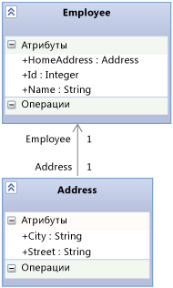

# <a name="using-the-intellitrace-stand-alone-collector-c-visual-basic"></a>Использование автономного сборщика данных IntelliTrace (C#, Visual Basic)

**Автономный сборщик IntelliTrace** позволяет собирать диагностические данные IntelliTrace для приложений на производственных серверах или в других средах без установки Visual Studio на целевом компьютере и без изменения среды в целевой системе. Автономный сборщик IntelliTrace работает в веб-приложениях, а также приложениях SharePoint, WPF и Windows Forms. По окончании сбора данных просто удалите сборщик.

 Посмотрите IntelliTrace в действии: [Сбор и анализ данных IntelliTrace в производстве для отладки (видео на канале 9)](https://channel9.msdn.com/Series/Visual-Studio-2012-Premium-and-Ultimate-Overview/Visual-Studio-Ultimate-2012-Collecting-and-analyzing-data-in-production)

> [!NOTE]
> Те же данные IntelliTrace для веб-приложений и приложений SharePoint, которые выполняются на удаленных компьютерах, также можно собирать с помощью **Microsoft Monitoring Agent** в режиме **трассировки** .
>
> События, связанные с производительностью, можно собирать в данных IntelliTrace путем запуска агента в режиме **монитора** . Режим **монитора** влияет на производительность в меньшей степени, чем режим **трассировки** или **Intelliтрассировки stand-alone collector**. После установки агент Microsoft Monitoring Agent изменяет среду в целевой системе. См. статью [Использование Microsoft Monitoring Agent](../debugger/using-the-microsoft-monitoring-agent.md).
> Автономный сборщик IntelliTrace не поддерживает обработку моментальных снимков.

 **Требования**

- .NET Framework 3.5 или более поздней версии

- Visual Studio Enterprise (не Professional и не Community) на компьютере разработчика или на другом компьютере для открытия ITRACE-файлов

  > [!NOTE]
  > Убедитесь, что файлы символов (.pdb) сохранены. Для отладки с помощью IntelliTrace и пошагового выполнения кода необходимо иметь соответствующие друг другу исходные файлы и файлы символов. См. статью [Диагностика проблем после развертывания](../debugger/diagnose-problems-after-deployment.md).

  **FAQ**

- [Какие приложения работают со сборщиком?](#WhatApps)

- [Начало работы](#GetStarted)

- [Как получить подробные данные, не замедляя работу приложения?](#Minimizing)

- [Где еще можно получить данные IntelliTrace?](#WhereElse)

## <a name="what-apps-work-with-the-collector"></a><a name="WhatApps"></a> Какие приложения работают со сборщиком?

- Веб-приложения ASP.NET, размещенные в службах IIS, версия 7.0, 7.5, 8.0, 12.0 и 16.0

- Приложения SharePoint 2010 и SharePoint 2013

- Приложения Windows Presentation Foundation (WPF) и Windows Forms.

## <a name="how-do-i-get-started"></a><a name="GetStarted"></a> Начало работы

1. [Установка сборщика](#BKMK_Install_the_IntelliTrace_Stand_Alone_Collector)

2. [Настройка разрешений для каталога сборщика](#ConfigurePermissionsRunningCollector)

3. [Установка командлетов PowerShell IntelliTrace для сбора данных для веб-приложений или приложений SharePoint](#BKMK_Set_up_the_IntelliTrace_PowerShell_commandlets)

4. [Настройка разрешений для каталога с ITRACE-файлами](#BKMK_Create_and_Configure_a_Log_File_Directory)

5. [Сбор данных из веб-приложения или приложения SharePoint](#BKMK_Collect_Data_from_IIS_Application_Pools)

     -или-

     [Сбор данных из управляемого приложения](#BKMK_Collect_Data_from_Executables)

6. [Откройте файл ITRACE в Visual Studio Enterprise.](#BKMK_View_IntelliTrace_Log_Files)

## <a name="install-the-collector"></a><a name="BKMK_Install_the_IntelliTrace_Stand_Alone_Collector"></a> Установка сборщика

1. На сервере приложения создайте каталог сборщика, например: **C:\IntelliTraceCollector**

2. Скачайте сборщик из [Центра загрузки Майкрософт](https://visualstudio.microsoft.com/downloads/#intellitrace-standalone-collector-for-visual-studio-2019), [my.visualstudio.com](https://my.visualstudio.com/Downloads?q=intellitrace%20standalone%20collector%20visual%20studio%202017) или из папки установки Visual Studio 2013 с обновлением 3. [IntelliTrace Collector для Visual Studio 2013 с обновлением 4](https://www.microsoft.com/download/details.aspx?id=44909)::

   - **Центр загрузки Майкрософт** или **my.visualstudio.com**:

     1. Рядом с **IntelliTraceCollector.exe** выберите **Загрузка**.

     2. Сохраните IntelliTraceCollector.exe в каталоге сборщика, например: **C:\IntelliTraceCollector**

     3. Запустите IntelliTraceCollector.exe. Пои этом будет извлечен файл IntelliTraceCollection.cab.

        \- или -

   - **Папка установки Visual Studio**:

     1. Скопируйте файл IntelliTraceCollection.cab из папки, в которой установлен сборщик, например:

          **..\Microsoft Visual Studio\2019\Enterprise\Common7\IDE\CommonExtensions\Microsoft\IntelliTrace**

          или для предыдущих версий Visual Studio:

          **..\Microsoft Visual Studio 12.0\Common7\IDE\CommonExtensions\Microsoft\IntelliTrace\12.0.0**

     2. Поместите IntelliTraceCollection.cab в каталог сборщика, например: **C:\IntelliTraceCollector**

3. Разверните файл IntelliTraceCollection.cab:

   1. На сервере приложения откройте окно командной строки с правами администратора.

   2. Перейдите в каталог сборщика, например: **C:\IntelliTraceCollector**

   3. Чтобы развернуть файл IntelliTraceCollection.cab, используйте команду **expand** , включая точку ( **.** ) в конце:

        `expand  /f:* IntelliTraceCollection.cab .`

       > [!NOTE]
       > Точка ( **.** ) сохраняет вложенные папки, которые содержат локализованные планы сбора данных.

## <a name="set-up-permissions-for-the-collector-directory"></a><a name="ConfigurePermissionsRunningCollector"></a> Настройка разрешений для каталога сборщика

1. На сервере приложения откройте окно командной строки с правами администратора.

2. С помощью Windows-команды **icacls** предоставьте администратору полные права на каталог сборщика на сервере. Пример:

     `icacls "C:\IntelliTraceCollector" /grant "` *\<Domain\AdministratorID>* `":F`

3. Для сбора данных для веб-приложения или приложения SharePoint:

    1. Предоставьте пользователю, который будет выполнять командлеты IntelliTrace PowerShell, полные права на каталог сборщика.

         Пример:

         `icacls "C:\IntelliTraceCollector" /grant "` *\<Domain\UserID>* `":F`

    2. Предоставьте пулу приложений для веб-приложения или приложения SharePoint права на чтение и выполнение для каталога сборщика.

         Пример:

        - Для веб-приложения в пуле приложений **DefaultAppPool** введите:

             `icacls "C:\IntelliTraceCollector" /grant "IIS APPPOOL\DefaultAppPool":RX`

        - для приложения SharePoint в пуле приложений **SharePoint - 80** введите

             `icacls "C:\IntelliTraceCollector" /grant "IIS APPPOOL\SharePoint - 80":RX`

## <a name="install-intellitrace-powershell-cmdlets-to-collect-data-for-web-apps-or-sharepoint-applications"></a><a name="BKMK_Set_up_the_IntelliTrace_PowerShell_commandlets"></a> Установка командлетов PowerShell IntelliTrace для сбора данных для веб-приложений или приложений SharePoint

1. На сервере приложения убедитесь, что компонент PowerShell включен. Для большинства версий Windows Server эту функцию можно добавить в средство администрирования **Server Manager** .

     

2. Установите командлеты IntelliTrace PowerShell.

    1. Откройте окно командной строки PowerShell в качестве администратора.

        1. Выберите **Пуск**, **Все программы**, **Стандартные**, **Windows PowerShell**.

        2. Выберите один из следующих шагов:

            - В 64-разрядных операционных системах откройте контекстное меню для **Windows PowerShell**. Выберите **Запуск от имени администратора**.

            - В 32-разрядных операционных системах откройте контекстное меню для **Windows PowerShell (x86)** . Выберите **Запуск от имени администратора**.

    2. В окне командной строки PowerShell с помощью команды **Import-Module** импортируйте файл **Microsoft.VisualStudio.IntelliTrace.PowerShell.dll**.

         Пример:

         `Import-Module "C:\IntelliTraceCollector\Microsoft.VisualStudio.IntelliTrace.PowerShell.dll"`

## <a name="set-up-permissions-for-the-itrace-file-directory"></a><a name="BKMK_Create_and_Configure_a_Log_File_Directory"></a> Настройка разрешений для каталога с ITRACE-файлами

1. На сервере приложения создайте каталог для ITRACE-файлов, например: **C:\IntelliTraceLogFiles**

   > [!NOTE]
   > - Чтобы избежать замедления работы приложения, выберите расположение на локальном высокоскоростном диске с небольшой нагрузкой.
   >   - ITRACE-файлы и файлы сборщика можно размещать в одном и том же месте. Тем не менее, если у вас есть веб-приложение или приложение SharePoint, убедитесь, что это место находится вне каталога, где размещается приложение.
   >
   > [!IMPORTANT]
   > - Предоставьте доступ к каталогу с ITRACE-файлами только тем пользователям, которые должны работать со сборщиком. ITRACE-файл может содержать конфиденциальные сведения, например, данные пользователей, баз данных, другие расположения исходных файлов и строки соединения, так как IntelliTrace может записывать любые данные, которые передаются в параметры метода или являются возвращаемыми значениями.
   >   - Убедитесь, что пользователи, которые могут открывать ITRACE-файлы, имеют право просмотра конфиденциальных данных. Соблюдайте осторожность при совместном использовании ITRACE-файлов. Если другие пользователи должны иметь доступ, скопируйте файлы в безопасную общую папку.

2. Для веб-приложения или приложения SharePoint предоставьте для его пула приложений полный доступ к каталогу с ITRACE-файлами. Это можно сделать с помощью команды **icacls** в Windows или проводника Windows.

    Пример:

   - Чтобы настроить разрешения с помощью команды **icacls** в Windows:

     - Для веб-приложения в пуле приложений **DefaultAppPool** введите:

        `icacls "C:\IntelliTraceLogFiles" /grant "IIS APPPOOL\DefaultAppPool":F`

     - для приложения SharePoint в пуле приложений **SharePoint - 80** введите

        `icacls "C:\IntelliTraceLogFiles" /grant "IIS APPPOOL\SharePoint - 80":F`

       -или-

   - Чтобы настроить разрешения с помощью проводника Windows:

     1. Откройте **Свойства** для каталога с ITRACE-файлами.

     2. На вкладке **Безопасность** выберите **Изменить**, затем **Добавить**.

     3. Убедитесь, что в окне **Выберите тип объекта** отображаются **Встроенные субъекты безопасности** . Если его там нет, выберите **Типы объектов** для его добавления.

     4. Убедитесь, что локальный компьютер отображается в поле **Из этого расположения** . Если его там нет, выберите **Местоположения**, чтобы его изменить.

     5. В поле **Введите имена выбираемых объектов** добавьте пул приложений для веб-приложения или приложения SharePoint.

     6. Выберите **Проверить имена** , чтобы разрешить имя. Нажмите кнопку **ОК**.

     7. Убедитесь, что для пула приложений установлен **полный доступ**.

## <a name="collect-data-from-a-web-app-or-sharepoint-application"></a><a name="BKMK_Collect_Data_from_IIS_Application_Pools"></a> Сбор данных из веб-приложения или приложения SharePoint

1. Для запуска процесса сбора данных откройте окно командной строки PowerShell с правами администратора, а затем выполните следующую команду:

     `Start-IntelliTraceCollection` `"` *\<ApplicationPool>* `"` *\<PathToCollectionPlan>* *\<FullPathToITraceFileDirectory>*

    > [!IMPORTANT]
    > После выполнения этой команды введите **Y** для подтверждения начала сбора данных.

     Например, для сбора данных от приложения SharePoint в пуле приложений **SharePoint - 80** введите:

     `Start-IntelliTraceCollection "SharePoint - 80" "C:\IntelliTraceCollector\collection_plan.ASP.NET.default.xml" "C:\IntelliTraceLogFiles"`

    |name|Описание|
    |-|-|
    |*ApplicationPool*|Имя пула приложений, где выполняется конкретное приложение|
    |*PathToCollectionPlan*|Путь к плану сбора данных (XML-файлу, который позволяет настроить параметры сборщика).<br /><br /> Можно указать план, поставляемый вместе со сборщиком. Для веб-приложений и приложений SharePoint работают следующие планы:<br /><br /> -   collection_plan.ASP.NET.default.xml<br />     Собирает только события IntelliTrace и SharePoint, включая исключения, вызовы базы данных и запросы веб-сервера.<br />-   collection_plan.ASP.NET.trace.xml<br />     Собирает вызовы функций и все данные в файле collection_plan.ASP.NET.default.xml. Этот план позволяет выполнить подробный анализ, но может замедлять работу приложения в большей степени, чем collection_plan.ASP.NET.default.xml.<br /><br /> Во избежание снижения производительности приложения настройте эти планы или создайте собственный план. Для обеспечения безопасности размещайте все пользовательские планы в той же безопасной папке, что и файлы сборщика. См. раздел [Создание и настройка планов сбора данных IntelliTrace](https://devblogs.microsoft.com/devops/modifying-an-intellitrace-collection-plan-for-the-stand-alone-collector/) и [Как получить подробные данные, не замедляя работу приложения?](#Minimizing) **Примечание.**  По умолчанию максимальный размер ITRACE-файла составляет 100 МБ. Если ITRACE-файл достигает этого предела, сборщик удаляет в нем самые старые записи, чтобы освободить место для новых записей. Чтобы изменить это ограничение, введите другое значение для атрибута `MaximumLogFileSize` плана сбора данных. <br /><br /> *Где можно найти локализованные версии этих планов сбора данных?*<br /><br /> Локализованные планы можно найти во вложенных папках сборщика.|
    |*FullPathToITraceFileDirectory*|Полный путь к каталогу ITRACE-файлов. **Примечание о безопасности.**  Указывайте полный, а не относительный путь.|

     Сборщик присоединяется к пулу приложений и начинает сбор данных.

     *Можно ли открыть ITRACE-файл в данный момент?* Нет, во время сбора данных файл заблокирован.

2. Воспроизведите проблему.

3. Чтобы создать контрольную точку ITRACE-файла, используйте следующий синтаксис:

     `Checkpoint-IntelliTraceCollection` `"` *\<ApplicationPool>* `"`

4. Для проверки состояния процесса сбора данных используйте следующий синтаксис:

     `Get-IntelliTraceCollectionStatus`

5. Для останова процесса сбора данных используйте следующий синтаксис:

     `Stop-IntelliTraceCollection` `"` *\<ApplicationPool>* `"`

    > [!IMPORTANT]
    > После выполнения этой команды введите **Y** для подтверждения останова сбора данных. В противном случае сборщик может продолжить процесс сбора данных, ITRACE-файл останется заблокирован, или в файле будут отсутствовать полезные данные.

6. [Откройте файл ITRACE в Visual Studio Enterprise.](#BKMK_View_IntelliTrace_Log_Files)

## <a name="collect-data-from-a-managed-app"></a><a name="BKMK_Collect_Data_from_Executables"></a> Сбор данных из управляемого приложения

1. Для запуска приложения и одновременного сбора данных используйте следующий синтаксис:

     *\<FullPathToIntelliTraceCollectorExecutable>* `\IntelliTraceSC.exe launch /cp:` *\<PathToCollectionPlan>* `/f:` *\<FullPathToITraceFileDirectoryAndFileName>* *\<PathToAppExecutableFileAndFileName>*

     Например, для сбора данных от приложения с именем **MyApp**:

     `C:IntelliTraceCollectorIntelliTraceSC.exe launch /cp:"C:IntelliTraceCollectorcollection_plan.ASP.NET.default.xml" /f:"C:IntelliTraceLogFilesMyApp.itrace" "C:MyAppMyApp.exe"`

    |name|Описание|
    |-|-|
    |*FullPathToIntelliTraceCollectorExecutable*|Полный путь к исполняемому файлу сборщика (IntelliTraceSC.exe)|
    |*PathToCollectionPlan*|Путь к плану сбора данных (XML-файлу, который позволяет настроить параметры сборщика).<br /><br /> Можно указать план, поставляемый вместе со сборщиком. Для управляемых приложений работают следующие планы:<br /><br /> -   collection_plan.ASP.NET.default.xml<br />     Собирает только события IntelliTrace, включая исключения, вызовы базы данных и запросы веб-сервера.<br />-   collection_plan.ASP.NET.trace.xml<br />     Собирает вызовы функций и все данные в файле collection_plan.ASP.NET.default.xml. Этот план позволяет выполнить подробный анализ, но может замедлять работу приложения в большей степени, чем collection_plan.ASP.NET.default.xml.<br /><br /> Во избежание снижения производительности приложения настройте эти планы или создайте собственный план. Для обеспечения безопасности размещайте все пользовательские планы в той же безопасной папке, что и файлы сборщика. См. раздел [Создание и настройка планов сбора данных IntelliTrace](https://devblogs.microsoft.com/devops/modifying-an-intellitrace-collection-plan-for-the-stand-alone-collector/) и [Как получить подробные данные, не замедляя работу приложения?](#Minimizing) **Примечание.**  По умолчанию максимальный размер ITRACE-файла составляет 100 МБ. Если ITRACE-файл достигает этого предела, сборщик удаляет в нем самые старые записи, чтобы освободить место для новых записей. Чтобы изменить это ограничение, введите другое значение для атрибута `MaximumLogFileSize` плана сбора данных. <br /><br /> *Где можно найти локализованные версии этих планов сбора данных?*<br /><br /> Локализованные планы можно найти во вложенных папках сборщика.|
    |*полный_путь_к_каталогу_с_файлом_itrace_и_имя_файла*|Полный путь к каталогу ITRACE-файлов и имя ITRACE-файла с расширением **.itrace** . **Примечание о безопасности.**  Указывайте полный, а не относительный путь.|
    |*путь_к_исполняемому_файлу_приложения_и_его_имя*|Путь к управляемому приложению и имя файла для него|

2. Для останова процесса сбора данных выйдите из приложения.

3. [Откройте файл ITRACE в Visual Studio Enterprise.](#BKMK_View_IntelliTrace_Log_Files)

## <a name="open-the-itrace-file-in-visual-studio-enterprise"></a><a name="BKMK_View_IntelliTrace_Log_Files"></a> Откройте файл ITRACE в Visual Studio Enterprise.

> [!NOTE]
> Для отладки с помощью IntelliTrace и пошагового выполнения кода необходимо иметь соответствующие друг другу исходные файлы и файлы символов. См. статью [Диагностика проблем после развертывания](../debugger/diagnose-problems-after-deployment.md).

1. Переместите ITRACE-файл или скопируйте его на компьютер с Visual Studio Enterprise (не Professional и не Community).

2. Двойным щелчком откройте ITRACE-файл вне Visual Studio или откройте его из Visual Studio.

     В Visual Studio отображается страница **Сводка IntelliTrace** . В большинстве разделов можно просматривать события или другие элементы, выбрать элемент и начать процесс отладки с помощью IntelliTrace в той точке, где и когда произошло событие. См. статью [Использование сохраненных данных IntelliTrace](../debugger/using-saved-intellitrace-data.md).

    > [!NOTE]
    > Для отладки с помощью IntelliTrace и пошагового выполнения кода на компьютере разработки необходимо иметь соответствующие друг другу исходные файлы и файлы символов. См. статью [Диагностика проблем после развертывания](../debugger/diagnose-problems-after-deployment.md).

## <a name="how-do-i-get-the-most-data-without-slowing-down-my-app"></a><a name="Minimizing"></a> Как получить подробные данные, не замедляя работу приложения?
 IntelliTrace может собирать большой объем данных, поэтому степень влияния на производительность приложения зависит от данных, собираемых с помощью IntelliTrace, а также типа кода, который данная программа анализирует. См. раздел [Оптимизация сбора данных IntelliTrace на рабочих серверах](https://devblogs.microsoft.com/devops/optimizing-intellitrace-collection-on-production-server/).

 Ниже приведены несколько способов получения подробных данных, не замедляющих приложение.

- Запускайте сборщик только в том случае, если вы предполагаете наличие проблемы или если можно воспроизвести проблему.

   Запустите процесс сбора данных, воспроизведите проблему, а затем остановите сам процесс. Откройте ITRACE-файл в Visual Studio Enterprise и проанализируйте данные. См. раздел [Откройте файл ITRACE в Visual Studio Enterprise](#BKMK_View_IntelliTrace_Log_Files).

- Работая с веб-приложениями и приложениями SharePoint, сборщик записывает данные для каждого приложения, который относится к заданному пулу приложений. Поэтому, даже если указать модули для одного приложения в плане сбора данных, работа других приложений из этого пула может замедляться.

   Этого можно избежать, если размещать каждое приложение в отдельном пуле.

- Просмотрите события в плане сбора данных, для которых IntelliTrace собирает данные. Отключите не имеющие значения и не представляющие интереса события.

   Чтобы отключить событие, задайте атрибуту `enabled` элемента `<DiagnosticEventSpecification>` значение `false`.

   `<DiagnosticEventSpecification enabled="false">`

   Если атрибут `enabled` не существует, значит событие включено.

   *Как это повышает производительность?*

  - Время запуска можно сократить путем отключения событий, которые не относятся к приложению. Например, отключите события рабочего процесса Windows для приложений, которые его не используют.

  - Для повышения производительности при запуске и во время выполнения можно отключить события в реестре для приложений, которые обращаются к реестру, но не показывают проблемы с параметрами реестра.

- Просмотрите модули в плане сбора данных, для которых IntelliTrace собирает данные. Исключите из плана модули, которые вас не интересуют.

  1. Откройте план коллекции. Найдите элемент `<ModuleList>` .

  2. В `<ModuleList>`задайте атрибуту `isExclusionList` значение `false`.

  3. Используйте элемент `<Name>` , чтобы задать модули с помощью одного из следующих параметров: имя файла, строковое значение для включения любого модуля, имя которого содержит эту строку, или открытый ключ.

     Например, для сбора данных только от основного веб-модуля веб-приложения Fabrikam Fiber создайте приблизительно следующий список:

  ```xml
  <ModuleList isExclusionList="false">
     <Name>FabrikamFiber.Web.dll</Name>
  </ModuleList>
  ```

   Для сбора данных из любого модуля, имя которого содержит "Fabrikam", создайте подобный список:

  ```xml
  <ModuleList isExclusionList="false">
     <Name>Fabrikam</Name>
  </ModuleList>
  ```

   Для сбора данных из модулей, заданных с помощью токенов открытых ключей, создайте подобный список:

  ```xml
  <ModuleList isExclusionList="false">
     <Name>PublicKeyToken:B77A5C561934E089</Name>
     <Name>PublicKeyToken:B03F5F7F11D50A3A</Name>
     <Name>PublicKeyToken:31BF3856AD364E35</Name>
     <Name>PublicKeyToken:89845DCD8080CC91</Name>
     <Name>PublicKeyToken:71E9BCE111E9429C</Name>
  </ModuleList>
  ```

   *Как это повышает производительность?*

   Это сокращает объем информации о вызове метода и других данных инструментирования, которые IntelliTrace собирает при запуске и выполнении приложения. Эта информация позволит выполнять следующие операции:

  - Пошагово просматривать код после сбора данных.

  - Анализировать значения, переданные и возвращенные из вызовов функций.

    *Почему нельзя просто исключать модули?*

    По умолчанию для исключения модулей из планов сбора данных атрибуту `isExclusionList` требуется задать значение `true`. Однако это не предотвращает сбор данных из модулей, которые не соответствуют критериям списка и не интересуют вас, например, из модулей сторонних производителей или модулей с открытым исходным кодом.

- *Существуют ли данные, которые IntelliTrace не собирает?*

   Да, для уменьшения степени влияния на уровень производительность IntelliTrace при сборе данных учитывает только значения примитивных типов данных, передаваемые и возвращаемые из методов, а также значения примитивных типов данных в полях объектов верхнего уровня, передаваемые и возвращаемые из методов.

   Предположим, имеется сигнатура метода `AlterEmployee` , которая принимает целое число `id` и объект `Employee` с именем `oldemployee`:

   `public Employee AlterEmployee(int id, Employee oldemployee)`

   Тип `Employee` имеет следующие атрибуты: `Id`, `Name`и `HomeAddress`. Между типом `Employee` и типом `Address` существует отношение ассоциации.

   

   Сборщик записывает значения для `id`, `Employee.Id`, `Employee.Name` и объекта `Employee` , возвращаемого из метода `AlterEmployee` . Однако он не записывает какую-либо информацию об объекте `Address` , а просто указывает, имеет он значение NULL или нет. Также сборщик не записывает данные о локальных переменных в методе `AlterEmployee` , за исключением случаев, когда эти локальные переменные используются в качестве параметров других методов. Тогда они записываются как параметры метода.

## <a name="where-else-can-i-get-intellitrace-data"></a><a name="WhereElse"></a> Где еще можно получить данные IntelliTrace?

Данные IntelliTrace можно получить из сеанса отладки IntelliTrace в Visual Studio Enterprise. См. статью [Возможности IntelliTrace](../debugger/intellitrace-features.md).

## <a name="where-can-i-get-more-information"></a>Где можно получить дополнительные сведения?
 [Использование сохраненных данных IntelliTrace](../debugger/using-saved-intellitrace-data.md)

 [IntelliTrace](../debugger/intellitrace.md)

### <a name="blogs"></a>Блоги
 [Удаленное использование автономного сборщика данных IntelliTrace](https://devblogs.microsoft.com/devops/using-the-intellitrace-standalone-collector-remotely/)

 [Создание и настройка планов сбора данных IntelliTrace](https://devblogs.microsoft.com/devops/modifying-an-intellitrace-collection-plan-for-the-stand-alone-collector/)

 [Оптимизация сбора данных IntelliTrace на рабочих серверах](https://devblogs.microsoft.com/devops/optimizing-intellitrace-collection-on-production-server/)

 [Microsoft DevOps](https://devblogs.microsoft.com/devops/)

### <a name="forums"></a>Форумы
 [Отладчик Visual Studio](https://social.msdn.microsoft.com/Forums/en-US/home)

### <a name="videos"></a>Видеоролики
 [Видео на Channel 9. Сбор и анализ данных IntelliTrace](https://channel9.msdn.com/Series/Visual-Studio-2012-Premium-and-Ultimate-Overview/Visual-Studio-Ultimate-2012-Collecting-and-analyzing-data-in-production)
