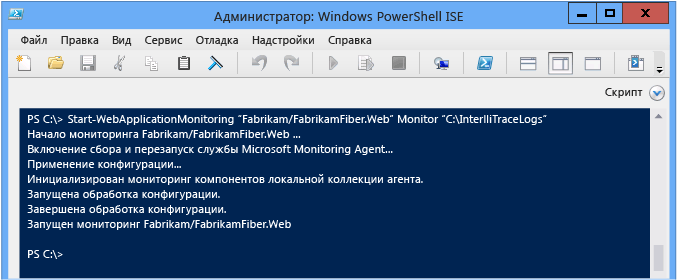
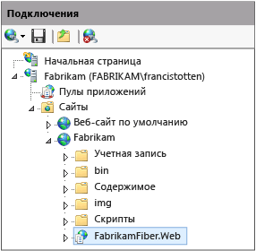

# <a name="using-the-microsoft-monitoring-agent"></a>Использование Microsoft Monitoring Agent
Вы можете локально проверять размещенные в IIS веб-приложения ASP.NET и приложения SharePoint 2010 и 2013 на наличие ошибок, проблем производительности и других неполадок с помощью агента **Microsoft Monitoring Agent** События диагностики, созданные агентом, можно сохранять в файле журнала IntelliTrace (ITRACE). Открыв журнал в Visual Studio Enterprise (но не в выпуске Professional или Community), можно выполнить отладку с помощью любых диагностических средств Visual Studio. Для сбора диагностических данных IntelliTrace и данных метода можно запустить агент в режиме **трассировки** . Microsoft Monitoring Agent можно интегрировать с [Application Insights](/azure/application-insights/) и [System Center Operation Manager](http://technet.microsoft.com/library/hh205987.aspx). После установки агент Microsoft Monitoring Agent изменяет среду в целевой системе.  
  
> [!NOTE]
>  Можно также собирать диагностические данные и данные метода IntelliTrace для веб-приложений, приложений Sharepoint, WPF и Windows Form на удаленных компьютерах без изменения целевой среды с помощью **автономного сборщика IntelliTrace**. Автономный сборщик в меньшей степени влияет на уровень производительности, чем Microsoft Monitoring Agent в режиме **монитора** . В разделе [использование автономного сборщика IntelliTrace](../debugger/using-the-intellitrace-stand-alone-collector.md).  
  
 Если вы пользуетесь пакетом System Center 2012, то, применяя агент Microsoft Monitoring Agent совместно с Operations Manager, вы можете получать оповещения о проблемах и создавать рабочие элементы Team Foundation Server со ссылками на сохраненные журналы IntelliTrace. Затем можно делегировать отладку рабочих элементов другим разработчикам. См. раздел [Интеграция Operations Manager с процессом разработки](http://technet.microsoft.com/library/jj614609.aspx) и [Отслеживание с помощью Microsoft Monitoring Agent](http://technet.microsoft.com/en-us/library/dn465153.aspx).  
  
 Перед началом работы убедитесь, что у вас есть надлежащий исходный код и символы для встроенного и развернутого кода. Тогда, начав отладку, вы сможете сразу же перейти к коду приложения и просматривать диагностические события в журнале IntelliTrace. [Настройте сборки](../debugger/diagnose-problems-after-deployment.md) таким образом, чтобы программа Visual Studio могла автоматически находить и открывать соответствующий источник развернутого кода.  
  
1.  [Шаг 1. Настройка Microsoft Monitoring Agent](#SetUpMonitoring)  
  
2.  [Шаг 2. Запуск отслеживания приложения](#MonitorEvents)  
  
3.  [Шаг 3. Сохранение записанных событий](#SaveEvents)  
  
##  <a name="SetUpMonitoring"></a> Шаг 1. Настройка Microsoft Monitoring Agent  
 Настройте изолированный агент на веб-сервере, чтобы выполнить локальное отслеживание, не изменяя приложение. Если вы пользуетесь System Center 2012, см. раздел [Установка Microsoft Monitoring Agent](http://technet.microsoft.com/library/dn465156.aspx).  
  
###  <a name="SetUpStandaloneMMA"></a> Настройка изолированного агента  
  
1.  Убедитесь, что:  
  
    -   На веб-сервере установлены [поддерживаемые версии Internet Information Services (IIS)](http://technet.microsoft.com/en-us/library/dn465154.aspx).  
  
    -   На веб-сервере установлена платформа .NET Framework версии 3.5, 4 или 4.5.  
  
    -   На веб-сервере установлена оболочка Windows PowerShell 3.0 или более поздней версии. [В. Могу ли я продолжить работу, если на сервере установлена оболочка Windows PowerShell 2.0?](#PowerShell2)  
  
    -   У вас есть права администратора веб-сервера, чтобы выполнять команды PowerShell и повторно использовать пул приложений для отслеживания.  
  
    -   Все предыдущие версии Microsoft Monitoring Agent удалены.  
  
2.  [Скачайте бесплатное средство Microsoft Monitoring Agent](http://go.microsoft.com/fwlink/?LinkId=320384)из Центра загрузки Майкрософт на веб-сервер (32-разрядная версия — **MMASetup-i386.exe** , 64-разрядная версия — **MMASetup-AMD64.exe**).  
  
3.  Запустите загруженный исполняемый файл. Откроется средство установки.  
  
4.  Создайте на веб-сервере защищенный каталог для хранения журналов IntelliTrace, например, **C:\IntelliTraceLogs**.  
  
     Каталог необходимо создать перед началом отслеживания. Чтобы избежать замедления работы приложения, выберите расположение на локальном высокоскоростном диске с небольшой нагрузкой.  
  
    > [!IMPORTANT]
    >  Журналы IntelliTrace могут содержать личные и конфиденциальные данные. Предоставляйте доступ к этому каталогу исключительно тем, кто с ним работает. Уточните политику конфиденциальности своей компании.  
  
5.  Если требуется выполнить более подробное отслеживание на уровне функций или отслеживание приложений SharePoint, предоставьте пулу приложений, где размещается ваше веб-приложение или приложение SharePoint, разрешение на чтение и запись в каталог журнала IntelliTrace. [В. Как настроить разрешения для пула приложений?](#FullPermissionsITLog)  
  
### <a name="q--a"></a>Вопросы и ответы  
  
####  <a name="PowerShell2"></a> В. Могу ли я продолжить работу, если на сервере установлена оболочка Windows PowerShell 2.0?  
 **О.** Настоятельно рекомендуем использовать PowerShell 3.0. В противном случае требуется импортировать командлеты PowerShell для Microsoft Monitoring Agent при каждом запуске PowerShell. Также у вас не будет доступа к загружаемому содержимому справки.  
  
1.  Откройте окно командной строки **Windows PowerShell** или **Windows PowerShell ISE** с правами администратора.  
  
2.  Импортируйте модуль PowerShell Microsoft Monitoring Agent из расположения установки по умолчанию:  
  
     **PS C: > Import-Module «C:\Program Files\Microsoft мониторинг Agent\Agent\PowerShell\Microsoft.MonitoringAgent.PowerShell\Microsoft.MonitoringAgent.PowerShell.dll»**  
  
3.  Актуальные статьи справки вы найдете на[веб-сайте TechNet](http://technet.microsoft.com/systemcenter/default) .  
  
####  <a name="FullPermissionsITLog"></a> В. Как настроить разрешения для пула приложений?  
 **О.** Это можно сделать с помощью команды **icacls** в Windows или проводника Windows. Пример:  
  
-   Чтобы настроить разрешения с помощью команды **icacls** в Windows:  
  
    -   для веб-приложения в пуле приложений **DefaultAppPool** введите  
  
         `icacls "C:\IntelliTraceLogs" /grant "IIS APPPOOL\DefaultAppPool":RX`  
  
    -   для приложения SharePoint в пуле приложений **SharePoint - 80** введите  
  
         `icacls "C:\IntelliTraceLogs" /grant "IIS APPPOOL\SharePoint - 80":RX`  
  
     - или -  
  
-   Чтобы настроить разрешения с помощью проводника Windows:  
  
    1.  Откройте **Свойства** каталога журнала IntelliTrace.  
  
    2.  На вкладке **Безопасность** выберите **Изменить**, затем **Добавить**.  
  
    3.  Убедитесь, что **Встроенные субъекты безопасности** отображаются в окне **Выберите тип объекта** . Если его там нет, выберите **типы объектов** Чтобы добавить его.  
  
    4.  Убедитесь, что локальный компьютер отображается в поле **Из этого расположения** . Если его там нет, выберите **расположения** изменить его.  
  
    5.  В поле **Введите имена выбираемых объектов** добавьте пул приложений для веб-приложения или приложения SharePoint.  
  
    6.  Выберите **Проверить имена** , чтобы разрешить имя. Нажмите кнопку **ОК**.  
  
    7.  Убедитесь, что пул приложений имеет **чтение & выполнение** разрешения.  
  
##  <a name="MonitorEvents"></a> Шаг 2. Запуск отслеживания приложения  
 Приступите к отслеживанию приложения с помощью команды [Start-WebApplicationMonitoring](http://go.microsoft.com/fwlink/?LinkID=313686) Windows PowerShell. Если вы пользуетесь System Center 2012, см. раздел [Отслеживание веб-приложений с помощью Microsoft Monitoring Agent](http://technet.microsoft.com/library/dn465157.aspx).  
  
1.  На веб-сервере откройте окно командной строки **Windows PowerShell** или **Windows PowerShell ISE** с правами администратора.  
  
       
  
2.  Выполните команду [Start-WebApplicationMonitoring](http://go.microsoft.com/fwlink/?LinkID=313686) , чтобы начать наблюдение за приложением. При этом все приложения на веб-сервере будут перезапущены.  
  
     Вы можете использовать следующий короткий синтаксис:  
  
     **Start-WebApplicationMonitoring** *»\<appName >»*  *\<Режим_наблюдения >* *»\<outputPath >»*  *\<UInt32 >* *»\<Путь_и_имя_файла_плана_сбора >»*  
  
     В следующем примере используется только имя веб-приложения и упрощенный режим **Monitor** :  
  
     **PS C: > Start-WebApplicationMonitoring» FabrikamFabrikamFiber.Web» мониторинг «C:IntelliTraceLogs»**  
  
     В следующем примере используется путь IIS и упрощенный режим **Monitor** :  
  
     **PS C: > Start-WebApplicationMonitoring» IIS:sitesFabrikamFabrikamFiber.Web» мониторинг «C:IntelliTraceLogs»**  
  
     Возможно, когда вы приступите к отслеживанию и приложения будут перезапускаться, работа Microsoft Monitoring Agent приостановится.  
  
       
  
    |||  
    |-|-|  
    |*«\<appName >»*|Укажите путь к имени веб-сайта и веб-приложения в IIS. При желании можно также указать путь IIS.<br /><br /> *«\<IISWebsiteName >\\< IISWebAppName\>»*<br /><br /> - или -<br /><br /> **«IIS:\sites**  *\\< IISWebsiteName\>\\< IISWebAppName\>»*<br /><br /> Его можно посмотреть в диспетчере IIS. Пример:<br /><br /> <br /><br /> Можно также использовать команды [Get-WebSite](http://technet.microsoft.com/library/ee807832.aspx) и [Get-WebApplication](http://technet.microsoft.com/library/ee790554.aspx) .|  
    |*\<Режим_наблюдения >*|Выберите режим отслеживания.<br /><br /> <ul><li>**Monitor**. Запись минимальных сведений о событиях исключения и производительности. В этом режиме используется план сбора данных по умолчанию.</li><li>**Trace**. Запись сведений на уровне функций и отслеживание приложений SharePoint 2010 и приложений SharePoint 2013 с использованием указанного плана сбора данных. При выборе этого режима работа приложения может замедляться.<br /><br /> <ul><li>[В. Как настроить разрешения для пула приложений?](#FullPermissionsITLog)</li><li>[В. Как получить подробные данные, не замедляя работу приложения?](#Minimizing)</li></ul><br />     В этом примере записываются события приложения SharePoint, размещенного на сайте SharePoint.<br /><br />     **Start-WebApplicationMonitoring «FabrikamSharePointSite\FabrikamSharePointApp» трассировка «C:\Program Files\Microsoft мониторинга Agent\Agent\IntelliTraceCollector\collection_plan.ASP.NET.default.xml» «C:\IntelliTraceLogs»**</li><li>**Custom**. Запись пользовательских сведений с помощью заданного пользовательского плана сбора данных. Если после запуска отслеживания изменить план сбора данных, отслеживание необходимо перезапустить.</li></ul>|  
    |*«\<outputPath >»*|Укажите полный путь к каталогу для сохранения журналов IntelliTrace. Каталог необходимо создать перед началом отслеживания.|  
    |*\<UInt32 >*|Укажите максимальный размер журнала IntelliTrace. По умолчанию максимальный размер журнала IntelliTrace — 250 МБ.<br /><br /> Если размер журнала превосходит это ограничение, агент записывает новые записи вместо наиболее старых. Это ограничение можно изменить с помощью параметра **-MaximumFileSizeInMegabytes** или атрибута `MaximumLogFileSize` в плане сбора данных.|  
    |*«\<Путь_и_имя_файла_плана_сбора >»*|Укажите полный или относительный путь и имя файла плана сбора данных. План представляет собой XML-файл, определяющий параметры агента.<br /><br /> Следующие планы поставляются вместе с агентом и поддерживаются веб-приложениями и приложениями SharePoint.<br /><br /> -   **collection_plan.ASP.NET.Default.XML**<br />     Собирает только события, например исключения, события производительности, вызовы базы данных и запросы веб-сервера.<br />-   **collection_plan.ASP.NET.trace.xml**<br />     Собирает вызовы на уровне функций, а также все данные, указанные в плане сбора по умолчанию. Этот план позволяет выполнить подробный анализ, но может замедлять работу приложения.<br /><br /> Локализованные версии этих планов находятся во вложенных папках агента. Чтобы предотвратить замедление работы приложения, [настройте имеющиеся планы или создайте собственные](http://go.microsoft.com/fwlink/?LinkId=227871) . Помещайте все пользовательские планы в то же защищенное расположение, где находится агент.<br /><br /> [В. Как получить подробные данные, не замедляя работу приложения?](#Minimizing)|  
  
     Дополнительные сведения о полном синтаксисе и другие примеры, запустите **get-help Start-WebApplicationMonitoring-detailed** команды или **get-help Start-WebApplicationMonitoring-примеры** команда.  
  
3.  Чтобы проверить состояние всех отслеживаемых веб-приложений, выполните команду [Get-WebApplicationMonitoringStatus](http://go.microsoft.com/fwlink/?LinkID=313685) .  
  
### <a name="q--a"></a>Вопросы и ответы  
  
####  <a name="Minimizing"></a> В. Как получить подробные данные, не замедляя работу приложения?  
 **Ответ.** Microsoft Monitoring Agent позволяет собирать большой объем данных. Производительность приложения зависит от типа собираемых данных и метода сбора. Ниже приведены несколько способов получения подробных данных, не замедляющих приложение.  
  
-   Работая с веб-приложениями и приложениями SharePoint, агент записывает данные для каждого приложения из указанного пула. Поэтому, даже если ограничить сбор данных модулями одного приложения, работа других приложений из этого пула может замедляться. Этого можно избежать, если размещать каждое приложение в отдельном пуле.  
  
-   Просмотрите в плане сбора события, о которых агент собирает данные. Отключите нерелевантные и не представляющие интереса события. Возможно, это позволит увеличить быстродействие при запуске и выполнении.  
  
     Чтобы отключить событие, задайте атрибуту `enabled` элемента `<DiagnosticEventSpecification>` значение `false`.  
  
     `<DiagnosticEventSpecification enabled="false">`  
  
     Если атрибут `enabled` не существует, значит событие включено.  
  
     Например:  
  
    -   Отключите события рабочего процесса Windows для приложений, которые его не используют.  
  
    -   Отключите события реестра для приложений, которые обращаются к реестру, но не отображают проблемы с параметрами реестра.  
  
-   Просмотрите в плане сбора модули, о которых агент собирает данные. Исключите из плана модули, которые вас не интересуют.  
  
     Это сокращает объем данных о вызове метода и других данных инструментирования, которые агент собирает при запуске и выполнении приложения. Эти данные позволяют выполнить код по шагам при отладке и просмотре значений, которые передаются в функции и возвращаются из них.  
  
    1.  Откройте план коллекции. Найдите элемент `<ModuleList>` .  
  
    2.  В `<ModuleList>`задайте атрибуту `isExclusionList` значение `false`.  
  
    3.  Используйте элемент `<Name>` , чтобы задать модули с помощью одного из следующих параметров: имя файла, строковое значение для включения любого модуля, имя которого содержит эту строку, или открытый ключ.  
  
     В этом примере создается список, который собирает данные только из главного модуля веб-приложения Fabrikam Fiber:  
  
    ```xml  
    <ModuleList isExclusionList="false">  
       <Name>FabrikamFiber.Web.dll</Name>  
    </ModuleList>  
  
    ```  
  
     Для сбора данных из любого модуля, имя которого содержит "Fabrikam", создайте подобный список:  
  
    ```xml  
    <ModuleList isExclusionList="false">  
       <Name>Fabrikam</Name>  
    </ModuleList>  
  
    ```  
  
     Для сбора данных из модулей, заданных с помощью токенов открытых ключей, создайте подобный список:  
  
    ```xml  
    <ModuleList isExclusionList="false">  
       <Name>PublicKeyToken:B77A5C561934E089</Name>  
       <Name>PublicKeyToken:B03F5F7F11D50A3A</Name>  
       <Name>PublicKeyToken:31BF3856AD364E35</Name>  
       <Name>PublicKeyToken:89845DCD8080CC91</Name>  
       <Name>PublicKeyToken:71E9BCE111E9429C</Name>  
    </ModuleList>  
  
    ```  
  
     **В. Почему нельзя просто исключить модули?**  
  
     **О.** По умолчанию, чтобы исключить модуль из плана сбора данных, требуется задать атрибуту `isExclusionList` значение `true`. Однако это не предотвращает сбор данных из модулей, которые не соответствуют критериям списка или не интересуют вас, например из модулей сторонних производителей или модулей с открытым исходным кодом.  
  
#### <a name="q-what-values-does-the-agent-collect"></a>В. Какие значения собирает агент?  
 **О.** Чтобы избежать снижения производительности, агент собирает только следующие значения:  
  
-   примитивные типы данных, передаваемые в методы и возвращаемые из них;  
  
-   примитивные типы данных в полях объектов верхнего уровня, передаваемые в методы и возвращаемые из них.  
  
 Предположим, имеется сигнатура метода `AlterEmployee` , которая принимает целое число `id` и объект `Employee` с именем `oldemployee`:  
  
 `public Employee AlterEmployee(int id, Employee oldemployee)`  
  
 Тип `Employee` имеет следующие атрибуты: `Id`, `Name`и `HomeAddress`. Между типом `Employee` и типом `Address` существует отношение ассоциации.  
  
   
  
 Агент записывает значения `id`, `Employee.Id`, `Employee.Name` и объекта `Employee` , возвращаемого из метода `AlterEmployee` . Однако он не записывает какую-либо информацию об объекте `Address` , а просто указывает, имеет ли он значение NULL или нет. Также агент не записывает данные о локальных переменных в методе `AlterEmployee` , за исключением случаев, когда эти локальные переменные используются в качестве параметров других методов. Тогда они записываются как параметры метода.  
  
##  <a name="SaveEvents"></a> Шаг 3. Сохранение записанных событий  
 Если вы обнаружите ошибку или проблему производительности, сохраните записанные события в журнал IntelliTrace. Агент создает журнал, только если события записывались. Если вы пользуетесь System Center 2012, см. раздел [Отслеживание веб-приложений с помощью Microsoft Monitoring Agent](http://technet.microsoft.com/library/dn465157.aspx).  
  
### <a name="save-recorded-events-but-continue-monitoring"></a>Как сохранить записанные события и продолжить отслеживание  
 Выполните следующие шаги, если требуется создать журнал IntelliTrace, не перезапуская приложение и не останавливая отслеживание. Агент продолжает отслеживание даже при перезапуске сервера или приложения.  
  
1.  На веб-сервере откройте окно командной строки Windows PowerShell с правами администратора.  
  
2.  Выполните команду [Checkpoint-WebApplicationMonitoring](http://go.microsoft.com/fwlink/?LinkID=313684) , чтобы сохранить снимок журнала IntelliTrace:  
  
     **CHECKPOINT-WebApplicationMonitoring** *»\<IISWebsiteName >\\< IISWebAppName\>»*  
  
     \- или -  
  
     **CHECKPOINT-WebApplicationMonitoring» IIS:\sites**  *\\< IISWebsiteName\>\\< IISWebAppName\>»*  
  
     Пример:  
  
     **PS C:\\> Checkpoint-WebApplicationMonitoring «Fabrikam\FabrikamFiber.Web»**  
  
     - или -  
  
     **PS C: > Checkpoint-WebApplicationMonitoring «IIS:sitesFabrikamFabrikamFiber.Web»**  
  
     Чтобы получить дополнительные сведения, запустите **get-help Checkpoint-WebApplicationMonitoring-подробные** команды или **get-help Checkpoint-WebApplicationMonitoring-примеры** команды.  
  
3.  Скопируйте журнал в защищенную общую папку, а затем откройте журнал на компьютере, где установлена программа Visual Studio Enterprise (но не выпуск Professional или Community).  
  
    > [!IMPORTANT]
    >  Соблюдайте меры предосторожности, предоставляя общий доступ к журналам IntelliTrace, поскольку они могут содержать личные и конфиденциальные данные. Убедитесь, что доступ к журналам имеют только те пользователи, у которых есть разрешение на просмотр этих данных. Уточните политику конфиденциальности своей компании.  
  
 **Далее:** [Диагностика записанных событий в Visual Studio Enterprise](../debugger/diagnose-problems-after-deployment.md#InvestigateEvents)  
  
### <a name="save-recorded-events-and-stop-monitoring"></a>Как сохранить записанные события и остановить отслеживание  
 Выполните следующие шаги, если требуется просто получить диагностические сведения при воспроизведении определенной ошибки. При этом все приложения на веб-сервере будут перезапущены.  
  
1.  На веб-сервере откройте окно командной строки Windows PowerShell с правами администратора.  
  
2.  Выполните команду [Stop-WebApplicationMonitoring](http://go.microsoft.com/fwlink/?LinkID=313687) , чтобы создать журнал IntelliTrace и остановить отслеживание определенного веб-приложения:  
  
     **STOP-WebApplicationMonitoring** *»\<IISWebsiteName >\\< IISWebAppName\>»*  
  
     \- или -  
  
     **STOP-WebApplicationMonitoring» IIS:\sites**  *\\< IISWebsiteName\>\\< IISWebAppName\>»*  
  
     Выполните следующую команду, если требуется завершить отслеживание всех веб-приложений:  
  
     **STOP-WebApplicationMonitoring - все**  
  
     Пример:  
  
     **PS C:\\> Stop-WebApplicationMonitoring «Fabrikam\iFabrikamFiber.Web»**  
  
     \- или -  
  
     **PS C:\\> Stop-WebApplicationMonitoring «IIS:\sites\Fabrikam\FabrikamFiber.Web»**  
  
     Чтобы получить дополнительные сведения, запустите **get-help Stop-WebApplicationMonitoring-подробные** команды или **get-help Stop-WebApplicationMonitoring-примеры** команды.  
  
3.  Скопируйте журнал в защищенную общую папку, а затем откройте журнал на компьютере, где установлена программа Visual Studio Enterprise.  
  
 **Далее:** [Диагностика записанных событий в Visual Studio Enterprise](../debugger/diagnose-problems-after-deployment.md#InvestigateEvents)  
  
## <a name="q--a"></a>Вопросы и ответы  
  
### <a name="q-where-can-i-get-more-information"></a>В. Где найти дополнительные сведения?  
  
#### <a name="blogs"></a>Блоги  
 [Введение в Microsoft Monitoring Agent](http://blogs.msdn.com/b/visualstudioalm/archive/2013/09/20/introducing-microsoft-monitoring-agent.aspx)  
  
 [Оптимизация сбора данных IntelliTrace на рабочих серверах](http://go.microsoft.com/fwlink/?LinkId=255233)  
  
#### <a name="forums"></a>Форумы  
 [Visual Studio Diagnostics](http://go.microsoft.com/fwlink/?LinkId=262263)