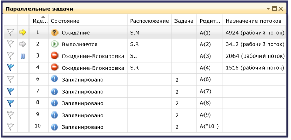
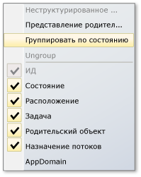
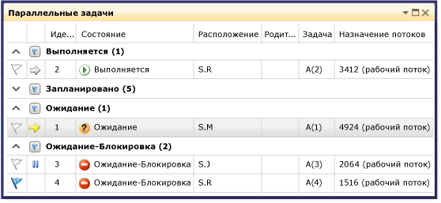
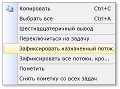

# Использование окна задач (C#, Visual Basic, C++)

Окно **Задачи** выглядит так же, как окно **Потоки**, за тем исключением, что вместо сведений о каждом потоке в нем отображаются сведения об объектах <xref:System.Threading.Tasks.Task?displayProperty=fullName>, [task_handle](/cpp/parallel/concrt/reference/task-group-class) или [WinJS.Promise](/previous-versions/windows/apps/br211867(v=win.10)). Как и потоки, задачи представляют асинхронные операции, которые могут выполняться параллельно; однако несколько задач могут выполняться в одном потоке.

В случае управляемого кода окно **Задачи** можно использовать при работе с объектами <xref:System.Threading.Tasks.Task?displayProperty=fullName> или ключевыми словами **await** и **async** (**Await** и **Async** в Visual Basic). Дополнительные сведения о задачах в управляемом коде см. в статье о [параллельном программировании](/dotnet/standard/parallel-programming/index).

В случае машинного кода окно **Задачи** можно использовать при работе с [группами задач](/cpp/parallel/concrt/task-parallelism-concurrency-runtime), [параллельными алгоритмами](/cpp/parallel/concrt/parallel-algorithms), [асинхронными агентами](/cpp/parallel/concrt/asynchronous-agents) и [упрощенными задачами](/cpp/parallel/concrt/task-scheduler-concurrency-runtime). Дополнительные сведения о задачах в машинном коде см. в статье [Среда выполнения с параллелизмом](/cpp/parallel/concrt/concurrency-runtime).

Для JavaScript окно "Задачи" помогает в работе с кодом, содержащим метод обещания `.then`. Дополнительные сведения см. в статье об [асинхронном программировании в JavaScript для приложений UWP](/previous-versions/windows/apps/hh700330(v=win.10)).

Окно **Задачи** можно использовать всякий раз при переключении в режим отладчика. Его можно открыть в меню **Отладка**, щелкнув пункт **Окна**, а затем выбрав **Задачи**. На следующем рисунке показано окно **Задачи** в режиме по умолчанию.

> [!NOTE]
> Для управляемого кода объект <xref:System.Threading.Tasks.Task> с состоянием [TaskStatus.Created](<xref:System.Threading.Tasks.TaskStatus.Created>), [TaskStatus.WaitingForActivation](<xref:System.Threading.Tasks.TaskStatus.WaitingForActivation>) или [TaskStatus.WaitingToRun](<xref:System.Threading.Tasks.TaskStatus.WaitingToRun>) может не отображаться в окне **Задачи**, если управляемые потоки находятся в состоянии сна или соединения.

## Сведения в столбцах окна "Задачи"

В столбцах окна **Задачи** отображаются следующие сведения.

|Имя столбца|Описание|
|-----------------|-----------------|
|**Флаги**|Показывает, какие задачи помечены, и позволяет помечать задачи и снимать с них метки.|
|**Значки**|Рядом с текущей задачей отображается желтая стрелка. Текущая задача находится на самом верхнем уровне текущего потока.   Белая стрелка указывает прерванную задачу, т.е. задачу, которая была текущей во время вызова отладчика.   Значок паузы указывает задачу, замороженную пользователем. Задачу можно заморозить или разморозить, щелкнув ее в списке правой кнопкой мыши.|
|**ID**|Предоставленный системой номер задачи. В машинном коде этот номер является адресом задачи.|
|**Состояние**|Текущее состояние задачи (запланирована, активна, заблокирована, взаимоблокировка, ожидание или завершена). Запланированная задача – это задача, которая еще не выполнялась и, следовательно, не имеет стека вызова, назначенного потока и других соответствующих сведений.   Активная задача — это задача, которая выполняла код, пока не была прервана в отладчике.   Находящаяся в ожидании (заблокированная) задача – это задача, которая бездействует в ожидании сигнала о событии, освобождения блокировки или завершения другой задачи.   Заблокированная задача – это находящаяся в ожидании задача, чей поток заблокирован другим потоком.   Наведите указатель мыши на ячейку **Состояние** для задачи в состоянии взаимоблокировки или ожидания, чтобы просмотреть дополнительные сведения о блокировке. **Предупреждение.**  Окно **Задачи** сообщает о состоянии взаимоблокировки только для заблокированных задач, использующих примитив синхронизации, который поддерживается функцией прохождения цепочки ожидания (Wait Chain Traversal, WCT). Например, для объекта <xref:System.Threading.Tasks.Task>, который использует WCT и находится в состоянии взаимоблокировки, отладчик отображает состояние **Awaiting-deadlocked**. Для заблокированной задачи, управляемой средой выполнения с параллелизмом, которая не поддерживает WCT, отладчик отображает состояние **Ожидание**. Дополнительные сведения о функции WCT см. в статье [Wait Chain Traversal](/windows/desktop/Debug/wait-chain-traversal) (Прохождение цепочки ожидания).|
|**Время начала**|Время, когда задача стала активной.|
|**Длительность**|Количество секунд, в течение которого задача была активна.|
|**Время выполнения**|Время, когда задача была завершена.|
|**Расположение**|Текущее расположение в стеке вызова задачи. Наведите указатель мыши на эту ячейку, чтобы увидеть весь стек вызова задачи. У запланированных задач значение в этом столбце отсутствует.|
|**Задача**|Исходный метод и какие-либо аргументы, которые были переданы в задачу при ее создании.|
|**AsyncState**|В случае управляемого кода указывает состояние задачи. По умолчанию этот столбец скрыт. Для отображения этого столбца откройте контекстное меню для одного из заголовков столбцов. Выберите **Столбцы**, **AsyncState**.|
|**Родительский объект**|Идентификатор задачи, создавшей данную задачу. Если эта ячейка пуста, то у задачи нет родительской задачи. Это применимо только для управляемых программ.|
|**Назначение потоков**|Идентификатор и имя потока, в котором запущена задача.|
|**AppDomain**|Для управляемого кода это домен приложения, в котором выполняется задача.|
|**task_group**|Для машинного кода это адрес объекта [task_group](/cpp/parallel/concrt/reference/task-group-class), который запланировал задачу. Для асинхронных агентов и упрощенных задач этот столбец содержит значение 0.|
|**Process**|Идентификатор процесса, к которому относится выполняемая задача.|

 В это представление можно добавлять столбцы, щелкнув правой кнопкой мыши заголовок столбца и выбрав нужные столбцы. (Отмените выбор элементов, чтобы удалить столбцы.) Кроме того, можно изменять порядок столбцов, перетаскивая их влево или вправо. На следующем рисунке показано контекстное меню столбца.

 

## Сортировка задач
 Чтобы выполнить сортировку задач, щелкните заголовок столбца. Например, если щелкнуть заголовок столбца **ИД**, задачи будут отсортированы по идентификаторам: 1,2,3,4,5 и так далее. Чтобы изменить порядок сортировки, еще раз щелкните заголовок столбца. Текущий столбец сортировки и порядок сортировки указывается стрелкой в столбце.

## Группирование задач
 Задачи можно группировать на основе любого столбца в представлении списка. Например, если щелкнуть правой кнопкой мыши заголовок столбца **Состояние**, а затем выбрать **Group by** > **[*состоянию*]** , то можно сгруппировать все задачи, имеющие одинаковое состояние. Например, вы можете быстро просмотреть задачи в состоянии ожидания, чтобы понять причину их блокировки. Можно также свернуть группу, которая не представляет интереса в текущем сеансе отладки. Таким же образом можно группировать задачи по другим столбцам. Можно установить или удалить пометку группы, просто нажав кнопку рядом с заголовком группы. На следующем рисунке показано окно **Задачи** в режиме группирования.

 

## Представление родительского и дочернего объектов
 (Это представление доступно только для управляемого кода.) Щелкнув правой кнопкой мыши заголовок столбца **Состояние** и выбрав элементы **Группировать по** > **Родительский элемент**, можно переключить список задач в иерархическое представление. В нем каждая дочерняя задача представлена вложенным узлом, который можно отобразить или скрыть, в соответствующем родительском элементе.

## Пометка задач
 Можно пометить поток, в котором выполняется задача. Для этого следует выделить элемент списка задач и выбрать команду **Пометить назначенный поток** в контекстном меню либо щелкнуть значок флажка в первом столбце. Если помечается несколько задач, то затем их можно сортировать по столбцу флага, чтобы вывести все помеченные задачи наверх и далее сосредоточиться только на них. Для просмотра только помеченных флагом задач можно также воспользоваться окном **Параллельные стеки**. Это позволяет отфильтровывать задачи, которые не нужны для отладки. Между сеансами отладки пометки не существуют.

## Замораживание и размораживание задач
 Чтобы заморозить поток, в котором запущена задача, можно щелкнуть правой кнопкой мыши элемент задачи в списке и выбрать **Заморозить назначенный поток**. (Если задача уже заморожена, то вместо этого пункта в контекстном меню появляется пункт **Разморозить назначенный поток**.) Когда поток замораживается, он не будет выполняться при пошаговом проходе по коду после текущей точки останова. Команда **Заморозить все потоки, кроме этого** замораживает все потоки, за исключением того, который выполняет указанный в списке элемент задачи.

 На следующем рисунке показаны остальные пункты меню для каждой задачи.

 

## Переключение активной задачи или кадра

Команда **Перейти к задаче** делает текущую задачу активной задачей. Команда **Перейти к кадру** делает текущий кадр стека активным кадром стека. Контекст отладчика при этом переключается на текущую задачу или выбранный кадр стека.

## См. также

- [Первое знакомство с отладчиком](../debugger/debugger-feature-tour.md)
- [Отладка управляемого кода](../debugger/debugging-managed-code.md)
- [Параллельное программирование](/dotnet/standard/parallel-programming/index)
- [Среда выполнения с параллелизмом](/cpp/parallel/concrt/concurrency-runtime)
- [Использование окна "Параллельные стеки"](../debugger/using-the-parallel-stacks-window.md)
- [Пошаговое руководство: Отладка параллельного приложения в Visual Studio](../debugger/walkthrough-debugging-a-parallel-application.md)