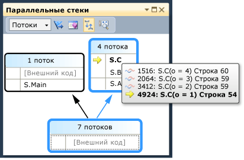
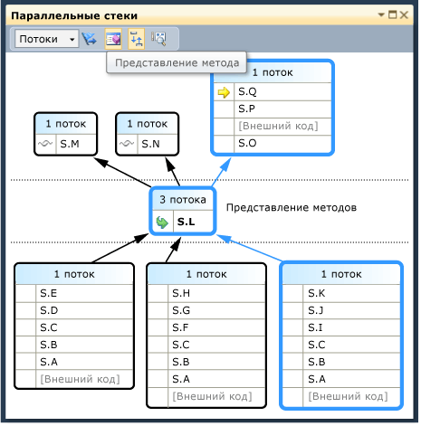
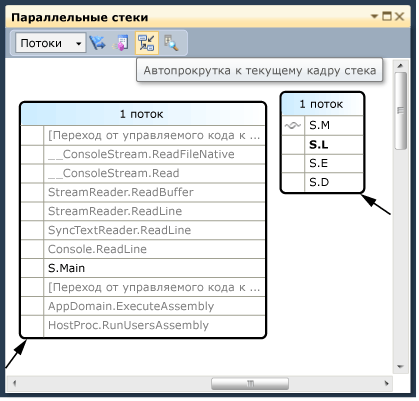
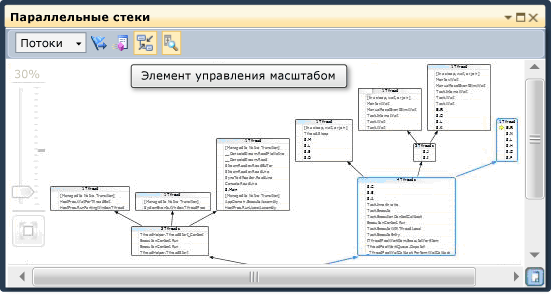
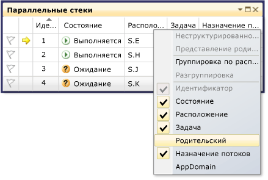
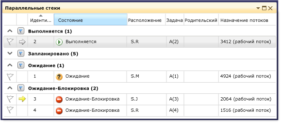
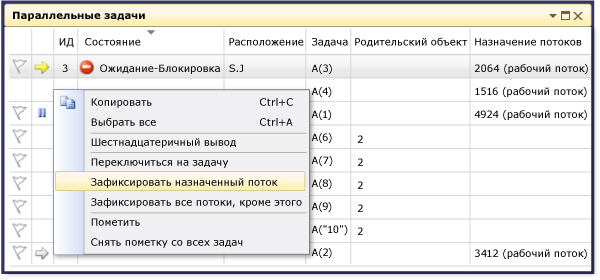

# Пошаговое руководство. Отладка параллельного приложения
[!INCLUDE[vs2017banner](../code-quality/includes/vs2017banner.md)]

В этом пошаговом руководстве описывается использование окон **Параллельные задачи** и **Параллельные стеки** для отладки параллельного приложения.  Эти окна помогают понять и проверить поведение во время выполнения кода, который использует [Task Parallel Library \(TPL\)](../Topic/Task%20Parallel%20Library%20\(TPL\).md) или [Среда выполнения с параллелизмом](/visual-cpp/parallel/concrt/concurrency-runtime).  Примеры кода, приведенные в этом пошаговом руководстве, имеют встроенные точки останова.  Возможности диалоговых окон **Параллельные задачи** и **Параллельные стеки** показаны после прерывания выполнения программы.  
  
 В этом пошаговом руководстве рассматриваются следующие задачи:  
  
-   Просмотр стеков вызовов всех потоков в одном представлении.  
  
-   Просмотр списка экземпляров `System.Threading.Tasks.Task`, созданных в приложении.  
  
-   Просмотр активных стеков вызовов задач вместо потоков.  
  
-   Переход к коду из окон **Параллельные стеки** и **Параллельные задачи**.  
  
-   Работа функций группирования, масштабирования и прочих связанных функций в окнах.  
  
## Обязательные компоненты  
 Предполагается, что режим **Только мой код** включен.  В меню **Сервис** выберите пункт **Параметры**, разверните узел **Отладка**, выберите пункт **Общие** и затем установите флажок **Включить режим "Только мой код" \(только управляемый код\)**.  Если эта функция не задана, можно продолжить выполнение инструкций настоящего пошагового руководства, однако полученные результаты могут отличаться от описанных здесь.  
  
## Пример на языке C\#  
 При использовании примера для C\# предполагается, что внешний код является скрытым.  Для переключения между режимами отображения внешнего кода щелкните правой кнопкой мыши заголовок столбца **Имя** окна **Стек вызовов** и затем установите или снимите флажок **Показать внешний код**.  Если эта функция не задана, можно продолжить выполнение инструкций настоящего пошагового руководства, однако полученные результаты могут отличаться от описанных здесь.  
  
## Пример на языке C\+\+  
 При использовании примера для языка C\+\+ можно пропускать ссылки на внешний код, приведенные в данном разделе.  Внешний код применяется только к примеру для языка C\#.  
  
## Рисунки  
 Рисунки, приведенные в настоящем разделе, получены на двухъядерном компьютере, на котором выполняется пример C\#.  Для выполнения инструкций настоящего пошагового руководства можно использовать другие конфигурации, однако диалоговые окна могут отличаться от приведенных в руководстве.  
  
## Создание примера проекта  
 Пример кода, приведенный в данном пошаговом руководстве, предназначен для приложения, которое не выполняет никаких действий.  Цель данного примера кода: понять использование окон инструментов для отладки параллельного приложения.  
  
#### Создание примера проекта  
  
1.  В меню **Файл** окна Visual Studio выберите команду **Создать** и щелкните **Проект**.  
  
2.  В области **Установленные шаблоны** выберите Visual C\#, Visual Basic или Visual C\+\+.  При использовании управляемых языков убедитесь, что в окне среды отображается [!INCLUDE[net_v40_short](../debugger/includes/net_v40_short_md.md)].  
  
3.  Выберите **Консольное приложение**, а затем нажмите кнопку **ОК**.  Оставайтесь в конфигурации отладки, которая используется по умолчанию.  
  
4.  Откройте CPP\-файл, CS\-файл или VB\-файл кода в проекте.  Удалите его содержимое, чтобы создать пустой файл кода.  
  
5.  Вставьте в пустой файл кода следующий код для данного языка.  
  
 [!code-cs[Debugger#1](../debugger/codesnippet/CSharp/walkthrough-debugging-a-parallel-application_1.cs)]
 [!code-cpp[Debugger#1](../debugger/codesnippet/CPP/walkthrough-debugging-a-parallel-application_1.cpp)]
 [!code-vb[Debugger#1](../debugger/codesnippet/VisualBasic/walkthrough-debugging-a-parallel-application_1.vb)]  
  
1.  В меню **Файл** выберите команду **Сохранить все**.  
  
2.  Выберите пункт **Перестроить решение** в меню **Построение**.  
  
     Обратите внимание, что имеются четыре вызова `Debugger.Break` \(`DebugBreak` в примере C\+\+\). Следовательно, установка точек останова не требуется. При выполнении приложения отладчик будет вызываться до 4 раз.  
  
## Использование окна "Параллельные стеки". Представление "Потоки"  
 В меню **Отладка** щелкните **Начать отладку**.  Дождитесь попадания в первую точку останова.  
  
#### Просмотр стека вызовов одного потока  
  
1.  В меню **Отладка** выберите пункт **Окна** и затем щелкните **Потоки**.  Закрепите окно **Потоки** в верхней части окна Visual Studio.  
  
2.  В меню **Отладка** наведите указатель на пункт **Окна** и выберите команду **Стек вызовов**.  Закрепите окно **Стек вызовов** в верхней части окна Visual Studio.  
  
3.  Дважды щелкните поток в окне **Потоки**, чтобы сделать его текущим.  Рядом с текущими потоками отображается желтая стрелка.  При изменении текущего потока его стек вызовов отображается в окне **Стек вызовов**.  
  
#### Изучение окна "Параллельные стеки"  
  
1.  В меню **Отладка** наведите указатель на пункт **Окна** и затем выберите пункт **Параллельные стеки**.  Убедитесь, что в верхнем левом углу выбрано значение **Потоки**.  
  
     С помощью окна **Параллельные стеки** можно одновременно просматривать несколько стеков вызовов в одном представлении.  На следующем рисунке показано окно **Параллельные стеки** над окном **Стек вызовов**.  
  
       
  
     Стек вызовов главного потока отображается в одном окне, а стеки вызовов для других четырех потоков сгруппированы в другом окне.  Четыре потока сгруппированы вместе, поскольку их кадры стека совместно используют одни и те же контексты методов: `A`, `B` и `C`.  Чтобы просмотреть идентификаторы и имена потоков, которые совместно используют одно окно, наведите указатель мыши на заголовок \(**4 потока**\)  Текущий поток выделен полужирным шрифтом, как показано на следующем рисунке.  
  
       
  
     Желтая стрелка указывает активный кадр стека текущего потока.  Чтобы получить более подробные сведения, наведите указатель мыши.  
  
       
  
     Чтобы задать объем сведений, отображаемых для кадров стеков \(**Имена модулей**, **Типы параметров**, **Имена параметров**, **Значения параметров**, **Номера строк** и **Смещение в байтах**\), щелкните правой кнопкой мыши в окне **Стек вызовов**.  
  
     Синяя рамка вокруг окна указывает, что текущий поток является частью этого окна.  Текущий поток также обозначается полужирным шрифтом в подсказке для кадра стека.  Если дважды щелкнуть главный поток в окне "Потоки", синяя рамка в окне **Параллельные стеки** переместится на поле, содержащее этот поток.  
  
       
  
#### Возобновление выполнения до второй точки останова  
  
1.  Чтобы возобновить выполнение до попадания во вторую точку останова, в меню **Отладка** выберите пункт **Продолжить**.  На следующем рисунке показано дерево потоков для второй точки останова.  
  
       
  
     В первой точке останова все четыре потока были получены от методов S.A, S.B и S.C.  Эти сведения все еще отображаются в окне **Параллельные стеки**, однако четыре потока создали дополнительные потоки.  Один из них продолжает выполнение сначала в S.D, а затем в S.E.  Другой продолжает выполнение в S.F, S.G и S.H.  Два других потока продолжают выполнение в S.I и S.J и один из них перешел в S.K, а другой продолжает выполнение во внешнем коде, не принадлежащем пользователю.  
  
     Чтобы просмотреть идентификаторы потоков, наведите указатель мыши на заголовок окна, например **1 поток** или **2 потока**.  Чтобы узнать идентификаторы и другие сведения о кадре, наводите указатель мыши на кадры стека.  Синяя рамка указывает текущий поток, а желтая стрелка — активный кадр стека текущего потока.  
  
     Значок с перекрывающейся синей и красной волнистыми линиями указывает активные кадры стека потоков, не являющихся текущими.  В окне **Стек вызовов** дважды щелкните S.B, чтобы переключить кадры.  Текущий кадр стека текущего потока показан в окне **Параллельные стеки** с помощью зеленой круговой стрелки.  
  
     В окне **Потоки** переключитесь между потоками и обратите внимание, что представление в окне **Параллельные стеки** обновилось.  
  
     Для переключения на другой поток или кадр другого потока используйте команды контекстного меню в окне **Параллельные стеки**.  Например, щелкните правой кнопкой мыши S.J, выберите команду **Перейти к кадру** и затем выберите команду.  
  
       
  
     Щелкните правой кнопкой мыши S.C и выберите команду **Перейти к кадру**.  Напротив одной из команд установлен флажок, который указывает кадр стека текущего потока.  Можно переключиться в кадр того же потока \(зеленая стрелка будет перемещена\) или можно переключиться в другой поток \(синяя рамка также будет перемещена\).  На следующем рисунке показаны команды вложенного меню.  
  
       
  
     Если контекст метода связан только с одним кадром стека, отображается заголовок окна **1 поток**. Для переключения в кадр стека дважды щелкните его.  При двойном щелчке контекста метода, имеющего более 1 кадра стека, связанного с ним, автоматически откроется всплывающее меню.  При наведении указателя мыши на контексты методов справа отображается черный треугольник.  Контекстное меню также отображается при щелчке этого треугольника.  
  
     В больших приложениях, имеющих множество потоков, можно выделить подмножество потоков.  В окне **Параллельные стеки** могут отображаться стеки вызовов только для отмеченных потоков.  На панели инструментов нажмите кнопку **Показать только отмеченные**, расположенную рядом со списком.  
  
       
  
     В окне **Потоки** по очереди отметьте потоки, чтобы просмотреть их стеки вызовов в окне **Параллельные стеки**.  Чтобы отметить потоки, используйте команды контекстного меню или первую ячейку потока.  Чтобы отобразить все потоки, нажмите кнопку **Показать только отмеченные** еще раз.  
  
#### Возобновление выполнения до третьей точки останова  
  
1.  Чтобы возобновить выполнение до попадания в третью точку останова, в меню **Отладка** выберите пункт **Продолжить**.  
  
     Если в одном методе присутствует несколько потоков, но метод находится не в начале стека вызовов, метод отображается в отдельных окнах.  В примере текущей точкой останова является S.L, которая имеет три потока и отображается в трех окнах.  Дважды щелкните точку останова S.L.  
  
       
  
     Обратите внимание, что S.L выделена полужирным шрифтом в других двух окнах для облегчения поиска.  Если необходимо просмотреть, какие кадры вызываются в S.L, а также какие кадры вызывает она, нажмите кнопку **Представление метода**, расположенную на панели инструментов.  На следующем рисунке показано представление методов окна **Параллельные стеки**.  
  
       
  
     Обратите внимание, как схема расположена на выбранном методе, а также расположение метода в собственном окне схемы в середине представления.  В верхней части окна отображается вызываемый и вызывающий метод.  Нажмите кнопку **Представление метода** еще раз, чтобы отключить этот режим.  
  
     В контекстном меню окна **Параллельные стеки** также представлены следующие элементы.  
  
    -   **Шестнадцатеричный вывод** — переключение между десятичным и шестнадцатеричным представлением чисел в подсказке.  
  
    -   **Сведения о загрузке символов** и **Параметры символов** — открытие соответствующих диалоговых окон.  
  
    -   **К исходному коду** и **К дизассемблированному коду** — переход в редактор для выбранного метода.  
  
    -   **Показать внешний код** — отображение всех кадров, даже не используемых в пользовательском коде.  Выберите эту команду, чтобы увидеть как расширяется схема для отображения дополнительных кадров \(кадры могут быть затемнены, поскольку для них отсутствуют символы\).  
  
     При наличии объемной схемы и переходе к следующей точке останова может потребоваться автоматическая прокрутка активных кадров стека текущего потока, т. е. просмотр потока, который первым достигает точки останова.  В окне **Параллельные стеки** убедитесь, что кнопка **Автопрокрутка к текущему кадру стека**, расположенная на панели инструментов, нажата.  
  
       
  
2.  Прежде чем продолжить, в окне **Параллельные стеки** прокрутите схему влево и вниз.  
  
#### Возобновление выполнения до четвертой точки останова  
  
1.  Чтобы возобновить выполнение до попадания в четвертую точку останова, в меню **Отладка** выберите пункт **Продолжить**.  
  
     Обратите внимание, как представление автоматически прокрутило схему в требуемое расположение.  Переключите потоки в окне **Потоки** или переключите кадры стека в окне **Стек вызовов** и обратите внимание, как представление всегда автоматически выполняет прокрутку к требуемому кадру.  Отключите функцию **Автопрокрутка к текущему кадру стека** и просмотрите отличие.  
  
     При наличии больших схем в окне **Параллельные стеки** также удобно воспользоваться функцией **Вид с высоты птичьего полета**.  Для просмотра **Вида с высоты птичьего полета** нажмите кнопку, расположенную между полосами прокрутки в нижнем правом углу окна, как показано на следующем рисунке.  
  
       
  
     Для быстрого перемещения по схеме переместите прямоугольник в требуемую область.  
  
     Другой способ перемещения схемы в любом направлении: щелкните по пустой области и перетащите схему в требуемое место.  
  
     Чтобы увеличить или уменьшить схему, нажав и удерживая клавишу CTRL, прокрутите колесико мыши.  Другой способ: на панели инструментов нажмите кнопку "Увеличить" и затем воспользуйтесь средством "Увеличить".  
  
       
  
     Чтобы просмотреть стеки в направлении сверху вниз вместо направления снизу вверх, в меню **Сервис** выберите пункт **Параметры** и затем установите или снимите флажок в узле **Отладка**.  
  
2.  Прежде чем продолжить в меню **Отладка** выберите команду**Остановить отладку**, чтобы завершить выполнение.  
  
## Использование окна "Параллельные задачи" и представления "Задачи" окна "Параллельные стеки"  
 Прежде чем продолжить, рекомендуется завершить ранее начатые процедуры.  
  
#### Перезапуск приложения до попадания в первую точку останова  
  
1.  В меню **Отладка** выберите команду **Начать отладку** и дождитесь попадания в первую точку отладки.  
  
2.  В меню **Отладка** выберите пункт **Окна** и затем щелкните **Потоки**.  Закрепите окно **Потоки** в верхней части окна Visual Studio.  
  
3.  В меню **Отладка** наведите указатель на пункт **Окна** и выберите команду **Стек вызовов**.  Закрепите окно **Стек вызовов** в верхней части окна Visual Studio.  
  
4.  Дважды щелкните поток в окне **Потоки**, чтобы сделать его текущим.  Рядом с текущими потоками должна отображаться желтая стрелка.  При изменении текущего потока сведения в других окнах обновляются.  Далее изучим содержимое окна "Параллельные задачи".  
  
5.  В меню **Отладка** наведите указатель на пункт **Окна** и затем выберите пункт **Параллельные задачи**.  На следующем рисунке показано окно **Параллельные задачи**.  
  
       
  
     Для каждой запущенной задачи можно увидеть ее идентификатор, который возвращен свойством с тем же самым именем, имя потока, который запускает задача, ее расположение \(при наведении указателя мыши отображается подсказка, у которой есть целый стек вызовов\).  Кроме того, в столбце **Задача** отображается метод, который передан в задачу, или иными словами, точка запуска.  
  
     Любой столбец можно отсортировать.  Обратите внимание на глиф сортировки, который указывает столбец и направление сортировки.  Расположение столбцов можно изменять, перетаскивая их вправо или влево.  
  
     Рядом с текущей задачей отображается желтая стрелка.  Чтобы переключить задачи, дважды щелкните задачу или воспользуйтесь командной контекстного меню.  При переключении задач потоки, расположенные ниже, становятся текущими, а сведения в других окнах обновляются.  
  
     При переключении с одной задачи на другую вручную желтая стрелка перемещается, но при этом белая стрелка по\-прежнему показывает задачу, которая привела к прерыванию работы отладчика.  
  
#### Возобновление выполнения до второй точки останова  
  
1.  Чтобы возобновить выполнение до попадания во вторую точку останова, в меню **Отладка** выберите пункт **Продолжить**.  
  
     Ранее в столбце **Состояние** все задачи отображались как запущенные, но теперь две задачи отображаются как ожидающие.  Задачи могут быть заблокированы по разным причинам.  Чтобы узнать причину блокирования задачи, наведите указатель мыши на задачу в столбце **Состояние**.  Например, на следующем рисунке задача 3 ожидает задачу 4.  
  
       
  
     Задача 4, в свою очередь, ожидает монитор, принадлежащий потоку, назначенному задаче 2.  
  
       
  
     Можно пометить задачу, щелкнув значок флага в первом столбце окна **Параллельные задачи**.  
  
     Отметки с помощью флагов можно использовать для отслеживания задач между различными точками останова в одном сеансе отладки или для фильтрации задач, у которых стеки вызовов отображаются в окне **Параллельные стеки**.  
  
     Ранее в окне **Параллельные стеки** отображались потоки приложения.  Если сейчас открыть окно **Параллельные стеки**, то в нем уже будет отображаться представление времени задач приложения.  В списке, расположенном в верхнем левом углу, выберите пункт **Задачи**.  На следующем рисунке показано представление "Задачи".  
  
       
  
     Потоки, которые в настоящий момент не выполняют задачи, не отображаются в представлении "Задачи" окна **Параллельные стеки**.  Кроме того, для потоков, которые выполняют задачи, некоторые из кадров стека, которые не относятся к задачам, отфильтрованы от верхней и нижней границы стека.  
  
     Откройте окно **Параллельные задачи** еще раз.  Щелкните правой кнопкой мыши заголовок любого столбца, чтобы открыть контекстное меню для столбца.  
  
       
  
     Контекстное меню можно использовать для удаления или добавления столбцов.  Например, столбец AppDomain не выбран, поэтому он не отображается в списке.  Щелкните **Родитель**.  В столбце **Родитель** не отображаются значения ни для одной из четырех задач.  
  
#### Возобновление выполнения до третьей точки останова  
  
1.  Чтобы возобновить выполнение до попадания в третью точку останова, выберите пункт **Продолжить** в меню **Отладка**.  
  
     Теперь запускается новая задача под номером 5, а задача 4 переходит в режим ожидания.  Для просмотра причины перехода в режим ожидания наведите указатель мыши на задачу в окне **Состояние**.  В столбце **Родитель** обратите внимание, что задача 4 является родительской по отношению к задаче 5.  
  
     Чтобы получить более наглядное представление связи "родитель\-потомок", щелкните правой кнопкой мыши заголовок столбца **Родитель** и затем выберите пункт **Представление родительского и дочернего объектов**.  Должно отображаться такое же окно, как на следующем рисунке.  
  
       
  
     Обратите внимание, что задачи 4 и 5 запущены в одном потоке.  Эти сведения отображаются не в окне **Потоки**, а в окне **Параллельные задачи**, что является преимуществом данного окна.  Чтобы проверить это, откройте окно **Параллельные стеки**.  Убедитесь, что в качестве представления выбран пункт **Задачи**.  Определите расположение задач 4 и 5, дважды щелкнув их в окне **Параллельные задачи**.  После выполнения этого действия синяя граница в окне **Параллельные стеки** будет обновлена.  Кроме того, расположение задач 4 и 5 можно определить путем сканирования подсказок в окне**Параллельные стеки**.  
  
       
  
     В окне **Параллельные стеки** щелкните правой кнопкой мыши S.P и затем выберите команду **Перейти к потоку**.  Окно переключается в представление "Потоки" и соответствующий кадр в представлении.  В одном потоке можно увидеть обе задачи.  
  
       
  
     Это является еще одним преимуществом представления "Задачи" в окне **Параллельные стеки** по сравнению с окном **Потоки**.  
  
#### Возобновление выполнения до четвертой точки останова  
  
1.  Чтобы возобновить выполнение до попадания в третью точку останова, выберите пункт **Продолжить** в меню **Отладка**.  Щелкните заголовок столбца **ИД**, чтобы выполнить сортировку по идентификатору.  Должно отображаться такое же окно, как на следующем рисунке.  
  
       
  
     Поскольку задача 5 уже завершена, она больше не отображается.  Если на экране компьютера не отображается взаимоблокировка, перейдите на другой шаг, нажав клавишу F11.  
  
     Задачи 3 и 4 ожидают друг друга и являются взаимоблокированными.  5 новых задач являются дочерними по отношению к задаче 2 и в данный момент запланированы.  Запланированными задачами являются задачи, которые были запущены в коде, но еще не запущены на компьютере.  Поэтому для этих задач значения в столбцах **Расположение** и **Назначение потоков** отсутствуют.  
  
     Просмотрите окно **Параллельные стеки** еще раз.  Для заголовка каждого окна есть подсказка, в которой отображаются идентификаторы и имена потоков.  Переключитесь в представление "Задачи" в окне **Параллельные стеки**.  Наведите указатель мыши на заголовок, чтобы просмотреть идентификатор и имя задачи, а также состояние задачи, как показано на следующем рисунке.  
  
       
  
     Можно сгруппировать задачи по столбцу.  В окне **Параллельные задачи** щелкните правой кнопкой мыши заголовок столбца **Состояние** и затем выберите команду **Сгруппировать по состоянию**.  На следующем рисунке показано окно **Параллельные задачи**, сгруппированное по состоянию.  
  
       
  
     Задачи можно группировать по любому другому столбцу.  Группировка задач позволяет сосредоточиться на подмножестве задач.  Каждая разворачиваемая группа имеет счетчик сгруппированных элементов.  Чтобы быстро снять отметку всех элементов в группе, нажмите кнопку **Отметить**, расположенную справа от кнопки **Свернуть**.  
  
       
  
     Последняя изучаемая функция окна **Параллельные задачи** — контекстное меню, которое отображается при щелчке правой кнопкой мыши задачи.  
  
       
  
     В зависимости от состояния задачи в контекстном меню отображаются различные команды.  В контекстном меню могут отображаться следующие команды: **Копировать**, **Выделить все**, **Шестнадцатеричный вывод**, **Переключение на задачу**, **Зафиксировать назначенный поток**, **Зафиксировать все потоки, кроме этого**, **Поток, назначенный разморозке** и **Отметить**.  
  
     Можно зафиксировать поток задачи или задачи, либо зафиксировать все потоки, за исключением назначенного.  Зафиксированный поток отображается в окне **Параллельные задачи** так же, как в окне **Потоки** с помощью синего значка *пауза*.  
  
## Сводка  
 В этом пошаговом руководстве описаны окна **Параллельные задачи** и **Параллельные стеки**.  Используйте эти окна в проектах, в которых используется многопоточный код.  Можно проверить параллельный код, написанный на языке C\+\+, C\# или Visual Basic.  
  
## См. также  
 [Debugging Multithreaded Applications](../debugger/walkthrough-debugging-a-parallel-application.md)   
 [Основы отладки](../debugger/debugger-basics.md)   
 [Отладка управляемого кода](../debugger/debugging-managed-code.md)   
 [Parallel Programming](../Topic/Parallel%20Programming%20in%20the%20.NET%20Framework.md)   
 [Среда выполнения с параллелизмом](/visual-cpp/parallel/concrt/concurrency-runtime)   
 [Использование окна "Параллельные стеки"](../debugger/using-the-parallel-stacks-window.md)   
 [Использование окна задач](../debugger/using-the-tasks-window.md)