# Пошаговое руководство. Отладка параллельного приложения в Visual Studio (C#, Visual Basic, C++)

В этом пошаговом руководстве описывается использование окон **Параллельные задачи** и **Параллельные стеки** для отладки параллельного приложения. Эти окна помогают понять и проверить поведение во время выполнения кода, который использует [библиотеку параллельных задач (TPL)](/dotnet/standard/parallel-programming/task-parallel-library-tpl) или [среду выполнения с параллелизмом](/cpp/parallel/concrt/concurrency-runtime). Примеры кода, приведенные в этом пошаговом руководстве, имеют встроенные точки останова. Возможности диалоговых окон **Параллельные задачи** и **Параллельные стеки** показаны после прерывания выполнения программы.

 В этом пошаговом руководстве рассматриваются следующие задачи:

- Просмотр стеков вызовов всех потоков в одном представлении.

- Просмотр списка экземпляров `System.Threading.Tasks.Task`, созданных в приложении.

- Просмотр активных стеков вызовов задач вместо потоков.

- Переход к коду из окон **Параллельные задачи** и **Параллельные стеки**.

- Работа возможностей группирования, масштабирования и прочих связанных возможностей в окнах.

## Предварительные требования
 В этом пошаговом руководстве предполагается, что включена функция **Только мой код** (она включена по умолчанию в более поздних версиях Visual Studio). В меню **Сервис** выберите пункт **Параметры**, разверните узел **Отладка**, выберите пункт **Общие** и затем установите флажок **Включить режим "Только мой код" (только управляемый код)** . Если эта возможность не задана, можно продолжить выполнение инструкций настоящего пошагового руководства, однако полученные результаты могут отличаться от описанных здесь.

## Пример на языке C#
 При использовании примера для C# предполагается, что внешний код является скрытым. Для переключения между режимами отображения внешнего кода щелкните правой кнопкой мыши заголовок столбца **Имя** окна **Стек вызовов** и затем установите или снимите флажок **Показать внешний код**. Если эта возможность не задана, можно продолжить выполнение инструкций настоящего пошагового руководства, однако полученные результаты могут отличаться от описанных здесь.

## Пример на языке C++
 При использовании примера для языка C++ можно пропускать ссылки на внешний код, приведенные в данном разделе. Внешний код применяется только к примеру для языка C#.

## Рисунки
 Рисунки, приведенные в настоящем разделе, получены на двухъядерном компьютере, на котором выполняется пример C#. Для выполнения инструкций настоящего пошагового руководства можно использовать другие конфигурации, однако диалоговые окна могут отличаться от приведенных в руководстве.

## Создание примера проекта
 Пример кода, приведенный в данном пошаговом руководстве, предназначен для приложения, которое не выполняет никаких действий. Цель данного примера кода: понять использование окон инструментов для отладки параллельного приложения.

#### Создание примера проекта

1. Откройте Visual Studio и создайте новый проект.

   ::: moniker range=">=vs-2019"

   Если окно запуска не открыто, выберите **Файл** > **Окно запуска**.

   На начальном экране выберите **Создать проект**.

   В поле поиска окна **Создание проекта** введите *консоль*. Затем выберите **C#** , **C++** или **Visual Basic** в списке языков и **Windows** в списке платформ. 

   Применив фильтры языка и платформы, выберите шаблон **Консольное приложение (.NET Core)** или (для C++) **Консольное приложение** и нажмите кнопку **Далее**.

   > [!NOTE]
   > Если нужный шаблон проекта отсутствует, перейдите в меню **Сервис** > **Получить средства и компоненты...** , после чего запустится Visual Studio Installer. Выберите рабочую нагрузку **Разработка классических приложений .NET** или **Разработка классических приложений на C++** , а затем нажмите кнопку **Изменить**.

   В окне **Настроить новый проект** введите имя в поле **Имя проекта** или оставьте имя по умолчанию. Затем нажмите **Создать**.

   ::: moniker-end
   ::: moniker range="vs-2017"
   В верхней строке меню последовательно выберите **Файл**  > **Создать**  > **Проект**. В левой области диалогового окна **Создание проекта** выберите следующие элементы.

   - Для приложения C# в разделе **Visual C#** выберите **Рабочий стол Windows**, а затем в средней области выберите **Консольное приложение (.NET Framework)** .
   - Для приложения Visual Basic в разделе **Visual Basic** выберите **Рабочий стол Windows**, а затем в средней области выберите **Консольное приложение (.NET Framework)** .
   - Для приложения C++ в разделе **Visual C++** выберите **Рабочий стол Windows**, а затем выберите **Консольное приложение Windows**.

   Если шаблон проекта **Консольное приложение (.NET Core)** или (для C++) **Консольное приложение** отсутствует, перейдите в меню **Сервис** > **Получить средства и компоненты...** , после чего запустится Visual Studio Installer. Выберите рабочую нагрузку **Разработка классических приложений .NET** или **Разработка классических приложений на C++** , а затем нажмите кнопку **Изменить**.

   Введите имя или оставьте имя по умолчанию и нажмите кнопку **ОК**.

   Нажмите кнопку **ОК**.
   ::: moniker-end

   Появится новый проект консольного приложения. Когда проект будет создан, откроется файл исходного кода.

1. Откройте CPP-файл, CS-файл или VB-файл кода в проекте. Удалите его содержимое, чтобы создать пустой файл кода.

1. Вставьте в пустой файл кода следующий код для данного языка.

   [!code-csharp[Debugger#1](../debugger/codesnippet/CSharp/walkthrough-debugging-a-parallel-application_1.cs)]
   [!code-cpp[Debugger#1](../debugger/codesnippet/CPP/walkthrough-debugging-a-parallel-application_1.cpp)]
   [!code-vb[Debugger#1](../debugger/codesnippet/VisualBasic/walkthrough-debugging-a-parallel-application_1.vb)]

1. В меню **Файл** выберите команду **Сохранить все**.

1. В меню **Построить** выберите пункт **Перестроить решение**.

    Обратите внимание, что имеются четыре вызова `Debugger.Break` (`DebugBreak` в примере C++). Следовательно, установка точек останова не требуется. При выполнении приложения отладчик будет вызываться до 4 раз.

## Использование окна "Параллельные стеки": Представление потоков
 В меню **Отладка** щелкните **Начать отладку**. Дождитесь попадания в первую точку останова.

#### Просмотр стека вызовов одного потока

1. В меню **Отладка** выберите пункт **Окна** и затем щелкните **Потоки**. Закрепите окно **Потоки** в нижней части окна Visual Studio.

2. В меню **Отладка** наведите указатель на пункт **Окна** и выберите команду **Стек вызовов**. Закрепите окно **Стек вызовов** в нижней части окна Visual Studio.

3. Дважды щелкните поток в окне **Потоки**, чтобы сделать его текущим. Рядом с текущими потоками отображается желтая стрелка. При изменении текущего потока его стек вызовов отображается в окне **Стек вызовов**.

#### Изучение окна "Параллельные стеки"

1. В меню **Отладка** наведите указатель на пункт **Окна** и затем выберите пункт **Параллельные стеки**. Убедитесь, что в верхнем левом углу выбрано значение **Потоки**.

     С помощью окна **Параллельные стеки** можно одновременно просматривать несколько стеков вызовов в одном представлении. На следующем рисунке показано окно **Параллельные стеки** над окном **Стек вызовов**.

     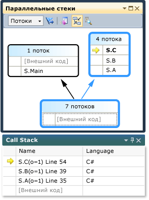

     Стек вызовов главного потока отображается в одном окне, а стеки вызовов для других четырех потоков сгруппированы в другом окне. Четыре потока сгруппированы вместе, поскольку их кадры стека совместно используют одни и те же контексты методов: `A`, `B` и `C`. Чтобы просмотреть идентификаторы и имена потоков, которые совместно используют одно окно, наведите указатель мыши на поле заголовка (**4 потока**). Текущий поток выделен полужирным шрифтом.

     

     Желтая стрелка указывает активный кадр стека текущего потока.

     Чтобы задать объем сведений, отображаемых для кадров стеков (**Имена модулей**, **Типы параметров**, **Имена параметров**, **Значения параметров**, **Номера строк** и **Смещение в байтах**), щелкните правой кнопкой мыши в окне **Стек вызовов**.

     Синяя рамка вокруг окна указывает, что текущий поток является частью этого окна. Текущий поток также обозначается полужирным шрифтом в подсказке для кадра стека. Если дважды щелкнуть главный поток в окне "Потоки", синяя рамка в окне **Параллельные стеки** переместится на поле, содержащее этот поток.

     

#### Возобновление выполнения до второй точки останова

1. Чтобы возобновить выполнение до попадания во вторую точку останова, в меню **Отладка** выберите пункт **Продолжить**. На следующем рисунке показано дерево потоков для второй точки останова.

     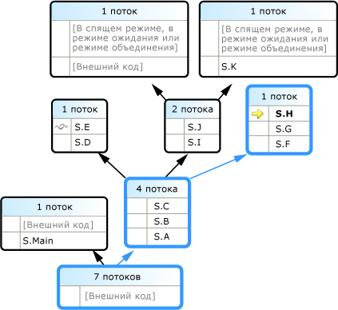

     В первой точке останова все четыре потока были получены от методов S.A, S.B и S.C. Эти сведения все еще отображаются в окне **Параллельные стеки**, однако четыре потока создали дополнительные потоки. Один из них продолжает выполнение сначала в S.D, а затем в S.E. Другой продолжает выполнение в S.F, S.G и S.H. Два других потока продолжают выполнение в S.I и S.J и один из них перешел в S.K, а другой продолжает выполнение во внешнем коде, не принадлежащем пользователю.

     Чтобы просмотреть идентификаторы потоков, наведите указатель мыши на заголовок окна, например **1 поток** или **2 потока**. Чтобы узнать идентификаторы и другие сведения о кадре, наводите указатель мыши на кадры стека. Синяя рамка указывает текущий поток, а желтая стрелка — активный кадр стека текущего потока.

     Значок с переплетающимися линиями указывает активные кадры стека потоков, не являющихся текущими. В окне **Стек вызовов** дважды щелкните S.B, чтобы переключить кадры. Текущий кадр стека текущего потока показан в окне **Параллельные стеки** с помощью зеленой круговой стрелки.

     В окне **Потоки** переключитесь между потоками и обратите внимание, что представление в окне **Параллельные стеки** обновилось.

     Для переключения на другой поток или кадр другого потока используйте команды контекстного меню в окне **Параллельные стеки**. Например, щелкните правой кнопкой мыши S.J, выберите команду **Перейти к кадру** и затем выберите команду.

     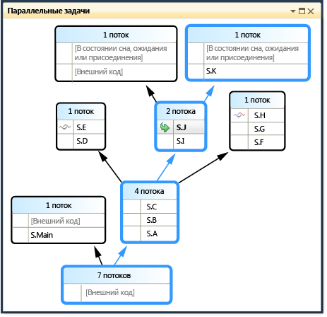

     Щелкните правой кнопкой мыши S.C и выберите команду **Перейти к кадру**. Напротив одной из команд установлен флажок, который указывает кадр стека текущего потока. Можно переключиться в кадр того же потока (зеленая стрелка будет перемещена) или можно переключиться в другой поток (синяя рамка также будет перемещена). На следующем рисунке показаны команды вложенного меню.

     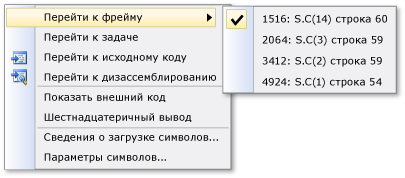

     Если контекст метода связан только с одним кадром стека, отображается заголовок окна **1 поток**. Для переключения в кадр стека дважды щелкните его. При двойном щелчке контекста метода, имеющего более 1 кадра стека, связанного с ним, автоматически откроется всплывающее меню. При наведении указателя мыши на контексты методов справа отображается черный треугольник. Контекстное меню также отображается при щелчке этого треугольника.

     В больших приложениях, имеющих множество потоков, можно выделить подмножество потоков. В окне **Параллельные стеки** могут отображаться стеки вызовов только для отмеченных потоков. Чтобы отметить потоки, используйте команды контекстного меню или первую ячейку потока.

     На панели инструментов нажмите кнопку **Показать только отмеченные**, расположенную рядом со списком.

     

     Теперь в окне **Параллельные стеки** отображается только отмеченный поток.

#### Возобновление выполнения до третьей точки останова

1. Чтобы возобновить выполнение до попадания в третью точку останова, в меню **Отладка** выберите пункт **Продолжить**.

     Если в одном методе присутствует несколько потоков, но метод находится не в начале стека вызовов, метод отображается в отдельных окнах. В примере текущей точкой останова является S.L, которая имеет три потока и отображается в трех окнах. Дважды щелкните точку останова S.L.

     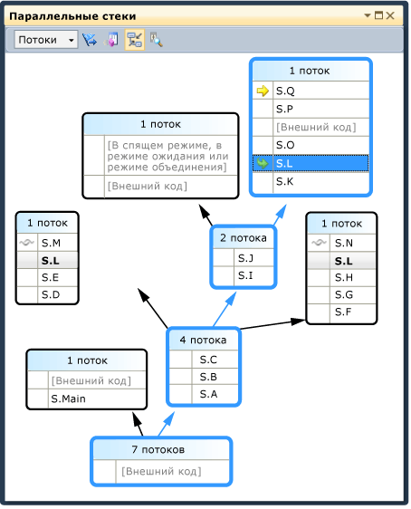

     Обратите внимание, что S.L выделена полужирным шрифтом в других двух окнах для облегчения поиска. Если необходимо просмотреть, какие кадры вызываются в S.L, а также какие кадры вызывает она, нажмите кнопку **Переключить представление методов**, расположенную на панели инструментов. На следующем рисунке показано представление методов окна **Параллельные стеки**.

     

     Обратите внимание, как схема расположена на выбранном методе, а также расположение метода в собственном окне схемы в середине представления. В верхней части окна отображается вызываемый и вызывающий метод. Нажмите кнопку **Переключить представление методов** еще раз, чтобы отключить этот режим.

     В контекстном меню окна **Параллельные стеки** также представлены следующие элементы.

    - **Шестнадцатеричный вывод** — переключение между десятичным и шестнадцатеричным представлением чисел в подсказке.

    - **Параметры символов** — открытие соответствующих диалоговых окон.

    - **Показать потоки в исходном коде** — переключение режима отображения меток потоков в исходном коде для просмотра расположения потоков в нем.

    - **Показать внешний код** — отображение всех кадров, даже не используемых в пользовательском коде. Выберите эту команду, чтобы увидеть как расширяется схема для отображения дополнительных кадров (кадры могут быть затемнены, поскольку для них отсутствуют символы).

2. В окне **Параллельные стеки** убедитесь, что кнопка **Автопрокрутка к текущему кадру стека**, расположенная на панели инструментов, нажата.

     При наличии объемной схемы и переходе к следующей точке останова может потребоваться автоматическая прокрутка активных кадров стека текущего потока, т. е. просмотр потока, который первым достигает точки останова.

3. Прежде чем продолжить, в окне **Параллельные стеки** прокрутите схему влево и вниз.

#### Возобновление выполнения до четвертой точки останова

1. Чтобы возобновить выполнение до попадания в четвертую точку останова, в меню **Отладка** выберите пункт **Продолжить**.

     Обратите внимание, как представление автоматически прокрутило схему в требуемое расположение. Переключите потоки в окне **Потоки** или переключите кадры стека в окне **Стек вызовов** и обратите внимание, что представление всегда автоматически выполняет прокрутку к требуемому кадру. Отключите функцию **Автопрокрутка к текущему кадру стека** и просмотрите отличие.

     При наличии больших схем в окне **Параллельные стеки** также удобно воспользоваться функцией **Вид с высоты птичьего полета**. По умолчанию включен **вид с высоты птичьего полета**. Для его переключения нажмите кнопку, расположенную между полосами прокрутки в правом нижнем углу окна, как показано на рисунке ниже.

     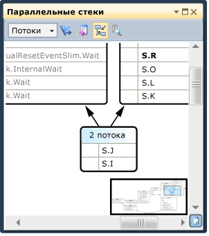

     Для быстрого перемещения по схеме в режиме вида с высоты птичьего полета переместите прямоугольник в требуемую область.

     Другой способ перемещения схемы в любом направлении: щелкните по пустой области и перетащите схему в требуемое место.

     Чтобы увеличить или уменьшить схему, нажав и удерживая клавишу CTRL, прокрутите колесико мыши. Другой способ: на панели инструментов нажмите кнопку "Увеличить" и затем воспользуйтесь средством "Увеличить".

     Чтобы просмотреть стеки в направлении сверху вниз вместо направления снизу вверх, в меню **Сервис** выберите пункт **Параметры** и затем установите или снимите флажок в узле **Отладка**.

2. Прежде чем продолжить в меню **Отладка** выберите команду **Остановить отладку**, чтобы завершить выполнение.

## Использование окна "Параллельные задачи" и представления "Задачи" окна "Параллельные стеки"
 Прежде чем продолжить, рекомендуется завершить ранее начатые процедуры.

#### Перезапуск приложения до попадания в первую точку останова

1. В меню **Отладка** выберите команду **Начать отладку** и дождитесь попадания в первую точку отладки.

2. В меню **Отладка** выберите пункт **Окна** и затем щелкните **Потоки**. Закрепите окно **Потоки** в нижней части окна Visual Studio.

3. В меню **Отладка** наведите указатель на пункт **Окна** и выберите команду **Стек вызовов**. Закрепите окно **Стек вызовов** в нижней части окна Visual Studio.

4. Дважды щелкните поток в окне **Потоки**, чтобы сделать его текущим. Рядом с текущими потоками должна отображаться желтая стрелка. При изменении текущего потока сведения в других окнах обновляются. Далее изучим содержимое окна "Параллельные задачи".

5. В меню **Отладка** наведите указатель на пункт **Окна** и выберите пункт **Задачи**. На рисунке ниже показано окно **Задачи**.

     

     Для каждой запущенной задачи можно увидеть ее идентификатор, который возвращен свойством с тем же самым именем, имя потока, который запускает задача, ее расположение (при наведении указателя мыши отображается подсказка, у которой есть целый стек вызовов). Кроме того, в столбце **Задача** отображается метод, который передан в задачу, или, иными словами, точка запуска.

     Любой столбец можно отсортировать. Обратите внимание на глиф сортировки, который указывает столбец и направление сортировки. Расположение столбцов можно изменять, перетаскивая их вправо или влево.

     Рядом с текущей задачей отображается желтая стрелка. Чтобы переключить задачи, дважды щелкните задачу или воспользуйтесь командной контекстного меню. При переключении задач потоки, расположенные ниже, становятся текущими, а сведения в других окнах обновляются.

     При переключении с одной задачи на другую вручную желтая стрелка перемещается, но при этом белая стрелка по-прежнему показывает задачу, которая привела к прерыванию работы отладчика.

#### Возобновление выполнения до второй точки останова

1. Чтобы возобновить выполнение до попадания во вторую точку останова, в меню **Отладка** выберите пункт **Продолжить**.

     Ранее в столбце **Состояние** все задачи отображались как активные, но теперь две задачи отображаются как заблокированные. Задачи могут быть заблокированы по разным причинам. Чтобы узнать причину блокирования задачи, наведите указатель мыши на задачу в столбце **Состояние**. Например, на следующем рисунке задача 3 ожидает задачу 4.

     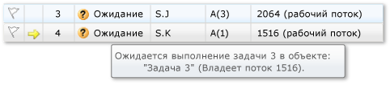

     Задача 4, в свою очередь, ожидает монитор, принадлежащий потоку, назначенному задаче 2. (Щелкните правой кнопкой мыши строку заголовка и выберите пункты **Столбцы** > **Назначение потоков**, чтобы просмотреть значение назначения потока для задачи 2.)

     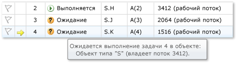

     Можно пометить задачу, щелкнув флажок в первом столбце окна **Задачи**.

     Отметки с помощью флагов можно использовать для отслеживания задач между различными точками останова в одном сеансе отладки или для фильтрации задач, у которых стеки вызовов отображаются в окне **Параллельные стеки**.

     Ранее в окне **Параллельные стеки** отображались потоки приложения. Если сейчас открыть окно **Параллельные стеки**, то в нем уже будут отображаться задачи приложения. В списке, расположенном в верхнем левом углу, выберите пункт **Задачи**. На следующем рисунке показано представление "Задачи".

     

     Потоки, которые в настоящий момент не выполняют задачи, не отображаются в представлении "Задачи" окна **Параллельные стеки**. Кроме того, для потоков, которые выполняют задачи, некоторые из кадров стека, которые не относятся к задачам, отфильтрованы от верхней и нижней границы стека.

     Снова откройте окно **Задачи**. Щелкните правой кнопкой мыши заголовок любого столбца, чтобы открыть контекстное меню для столбца.

     Контекстное меню можно использовать для удаления или добавления столбцов. Например, столбец AppDomain не выбран, поэтому он не отображается в списке. Щелкните **Родитель**. В столбце **Родитель** не отображаются значения ни для одной из четырех задач.

#### Возобновление выполнения до третьей точки останова

1. Чтобы возобновить выполнение до попадания в третью точку останова, в меню **Отладка** выберите пункт **Продолжить**.

     Теперь запускается новая задача под номером 5, а задача 4 переходит в режим ожидания. Для просмотра причины перехода в режим ожидания наведите указатель мыши на задачу в окне **Состояние**. В столбце **Родитель** обратите внимание, что задача 4 является родительской по отношению к задаче 5.

     Чтобы получить более наглядное представление связи "родитель-потомок", щелкните правой кнопкой мыши строку заголовка столбца и выберите пункт **Представление родительского и дочернего объектов**. Должно отображаться такое же окно, как на следующем рисунке.

     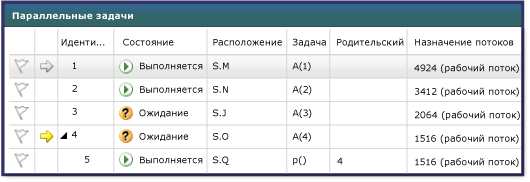

     Обратите внимание, что задачи 4 и 5 запущены в одном потоке (отобразите столбец **Назначение потоков**, если он скрыт). Эти сведения отображаются не в окне **Потоки**, а в окне **Задачи**, что является преимуществом данного окна. Чтобы проверить это, откройте окно **Параллельные стеки**. Убедитесь, что в качестве представления выбран пункт **Задачи**. Определите расположение задач 4 и 5, дважды щелкнув их в окне **Задачи**. После выполнения этого действия синяя граница в окне **Параллельные стеки** будет обновлена. Кроме того, расположение задач 4 и 5 можно определить путем просмотра подсказок в окне **Параллельные стеки**.

     

     В окне **Параллельные стеки** щелкните правой кнопкой мыши S.P и затем выберите команду **Перейти к потоку**. Окно переключается в представление "Потоки" и соответствующий кадр в представлении. В одном потоке можно увидеть обе задачи.

     

     Это является еще одним преимуществом представления "Задачи" в окне **Параллельные стеки** по сравнению с окном **Потоки**.

#### Возобновление выполнения до четвертой точки останова

1. Чтобы возобновить выполнение до попадания в третью точку останова, в меню **Отладка** выберите пункт **Продолжить**. Щелкните заголовок столбца **ИД**, чтобы выполнить сортировку по идентификатору. Должно отображаться такое же окно, как на следующем рисунке.

     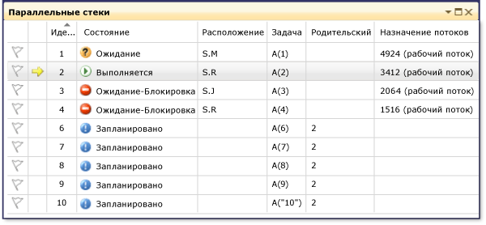

     Поскольку задача 5 уже завершена, она больше не отображается. Если на экране компьютера не отображается взаимоблокировка, перейдите на другой шаг, нажав клавишу **F11**.

     Задачи 3 и 4 ожидают друг друга и являются заблокированными. 5 новых задач являются дочерними по отношению к задаче 2 и в данный момент запланированы. Запланированными задачами являются задачи, которые были запущены в коде, но еще не запущены на компьютере. Поэтому для этих задач значения в столбцах **Расположение** и **Назначение потоков** отсутствуют.

     Просмотрите окно **Параллельные стеки** еще раз. Для заголовка каждого окна есть подсказка, в которой отображаются идентификаторы и имена потоков. Переключитесь в представление "Задачи" в окне **Параллельные стеки**. Наведите указатель мыши на заголовок, чтобы просмотреть идентификатор и имя задачи, а также состояние задачи, как показано на следующем рисунке.

     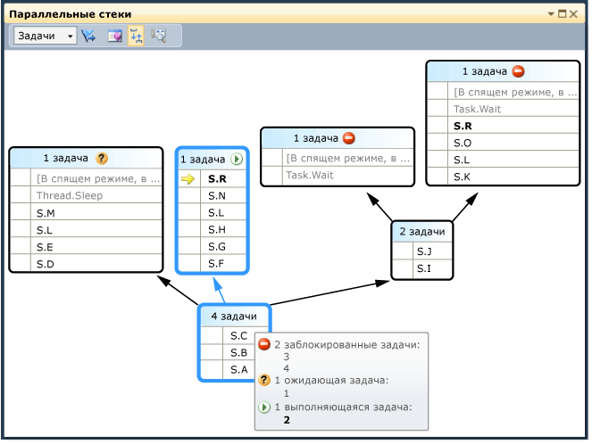

     Можно сгруппировать задачи по столбцу. В окне **Задачи** щелкните правой кнопкой мыши заголовок столбца **Состояние**, а затем выберите команду **Сгруппировать по состоянию**. На рисунке ниже показано окно **Задачи** с группировкой по состоянию.

     

     Задачи можно группировать по любому другому столбцу. Группировка задач позволяет сосредоточиться на подмножестве задач. Каждая разворачиваемая группа имеет счетчик сгруппированных элементов.

     Последняя изучаемая возможность окна **Задачи** — контекстное меню, которое отображается при щелчке правой кнопкой мыши по задаче.

     В зависимости от состояния задачи в контекстном меню отображаются различные команды. В контекстном меню могут отображаться следующие команды: **Копировать**, **Выделить все**, **Шестнадцатеричный вывод**, **Переключение на задачу**, **Заморозить назначенный поток**, **Заморозить все потоки, кроме этого**, **Поток, назначенный разморозке** и **Отметить**.

     Можно зафиксировать поток задачи или задачи, либо зафиксировать все потоки, за исключением назначенного. Зафиксированный поток отображается в окне **Задачи** так же, как в окне **Потоки** с помощью синего значка *пауза*.

## Сводка
 В этом пошаговом руководстве описаны окна **Параллельные задачи** и **Параллельные стеки**. Используйте эти окна в проектах, в которых используется многопоточный код. Можно проверить параллельный код, написанный на языке C++, C# или Visual Basic.

## См. также
- [Отладка многопоточных приложений](../debugger/walkthrough-debugging-a-parallel-application.md)
- [Первое знакомство с отладчиком](../debugger/debugger-feature-tour.md)
- [Отладка управляемого кода](../debugger/debugging-managed-code.md)
- [Параллельное программирование](/dotnet/standard/parallel-programming/index)
- [Среда выполнения с параллелизмом](/cpp/parallel/concrt/concurrency-runtime)
- [Использование окна "Параллельные стеки"](../debugger/using-the-parallel-stacks-window.md)
- [Использование окна задач](../debugger/using-the-tasks-window.md)
