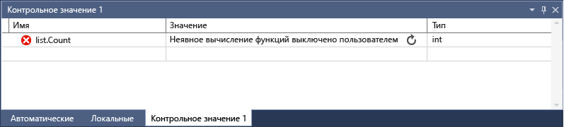

# <a name="watch-variables-with-watch-windows-and-quickwatch"></a>Просмотр переменных с помощью окна контрольных значений и быстрой проверки

Во время отладки для просмотра переменных и выражений можно использовать **окна контрольных значений** и диалоговое окно **Быстрая проверка**. Окна доступны только во время сеанса отладки.

В **окнах контрольных значений** в процессе отладки могут отображаться несколько переменных. В диалоговом окне **Быстрая проверка** отображается одна переменная за раз. Его следует закрыть до того, как можно будет продолжить отладку.

> [!NOTE]
> Если вы не знакомы с процессом отладки кода, перед выполнением задач в этой статье рекомендуется прочесть документ об [отладке для начинающих](../debugger/debugging-absolute-beginners.md) и статью [Методы и инструменты отладки](../debugger/write-better-code-with-visual-studio.md).

## <a name="observe-variables-with-a-watch-window"></a>Наблюдение за переменными с помощью окна контрольных значений

Можно открыть несколько **окон контрольных значений** и наблюдать за несколькими переменными в  **окне контрольных значений**.

Например, чтобы организовать просмотр значений `a`, `b` и `c`, в следующем коде:

```C++
int main()
{
    int a, b, c;
    a = 1;
    b = 2;
    c = 0;

    for (int i = 0; i < 10; i++)
    {
        a++;
        b *= 2;
        c = a + b;
    }

    return 0;
}

```

1. Установите точку останова на строке `c = a + b;`, щелкнув в левое поле, выбрав **Отладка** > **Переключить точку останова** или нажав клавишу **F9**.

1. Начните отладку, выбрав зеленую стрелку **Старт** или выбрав **Отладка** > **Начать отладку** или нажав клавишу **F5**. Выполнение останавливается в точке останова.

1. Откройте окно **Контрольные значения**, выбрав **Отладка** > **Окна** > **Контрольные значения** > **Контрольные значения 1** или нажав клавиши **CTRL**+**ALT**+**W** > **1**.

   Вы можете открыть дополнительные **окна контрольных значений**, выбрав окна **2**, **3** или **4**.

1. В окне **Контрольные значения** выберите пустую строку и тип переменной `a`. Сделайте то же самое для `b` и `c`.

   

1. Продолжите отладку, выбрав **Отладка** > **Шаг с заходом** или нажав клавишу **F11** по мере необходимости для перехода. В процессе итерации по циклу `for` значения переменных в окне **Контрольные значения** должны меняться.

>[!NOTE]
>Только для C++
>- Может потребоваться уточнить контекст имени переменной или выражение, использующее имя переменной. Контекст — это функция, файл исходного кода или модуль, где находится переменная. Если необходимо уточнить контекст, используйте синтаксис [оператора контекста (C++)](../debugger/context-operator-cpp.md) в поле **Имя** в окне **Контрольные значения**.
>
>- Вы можете добавить имена регистров и имена переменных с помощью **$\<register&nbsp;name>** или **@\<register&nbsp;name>** в поле **Имя** в окне **Контрольные значения**. Для получения дополнительной информации см. [Pseudovariables](../debugger/pseudovariables.md).

## <a name="use-expressions-in-a-watch-window"></a>Использование выражений в окне контрольных значений

В окне **Контрольные значения** можно просмотреть любое допустимое выражение, которое распознает отладчик.

Например, для кода, приведенного в предыдущем разделе, можно вычислить среднее трех значений, введя `(a + b + c) / 3` в **окне контрольных значений**:


Правила вычисления выражений в окне **Контрольные значения** обычно аналогичны правилам вычисления выражений в используемом языке программирования. Если в выражении есть синтаксическая ошибка, должна произойти та же ошибка компилятора, которая возникла бы в редакторе кода. Например, опечатка в предыдущем выражении выдает следующую ошибку в окне **Контрольные значения**:


В окне **Контрольные значения** может появиться значок кружки с двумя волнистыми линиями. Он указывает на то, что отладчик не вычисляет выражение из-за возможной зависимости между потоками. Для оценки кода необходимо, чтобы другие потоки в приложении выполнялись временно, но, поскольку вы находитесь в режиме приостановки выполнения, все потоки в приложении обычно останавливаются. Разрешение временного запуска других потоков может привести к непредвиденным результатам в работе приложения, а также к тому, что отладчик будет игнорировать различные события, например точки останова и исключения, созданные в этих потоках.

::: moniker range=">= vs-2019" 
## <a name="search-in-the-watch-window"></a>Поиск в окне контрольных значений

Используя панель поиска над каждым окном, можно искать ключевые слова в столбцах "Имя", "Значение" и "Тип" в окне **Контрольные значения**. Нажмите клавишу ВВОД или щелкните одну из стрелок, чтобы выполнить поиск. Чтобы отменить текущий поиск, нажмите значок "x" на панели поиска.

Для перехода между найденными совпадениями используйте стрелки влево и вправо (SHIFT + F3 и F3 соответственно).


Чтобы сделать поиск более или менее детальным, воспользуйтесь раскрывающимся списком **Поиск на уровень глубже** в верхней части окна **Контрольные значения**, чтобы выбрать число уровней детализации поиска во вложенных объектах. 

## <a name="pin-properties-in-the-watch-window"></a>Закрепление свойств в окне контрольных значений

>[!NOTE]
> Эта возможность поддерживается в .NET Core 3.0 или более поздних версий.

С помощью средства **Закрепляемые свойства** можно быстро проверить объекты на основе их свойств в окне контрольных значений.  Чтобы воспользоваться этим средством, наведите указатель мыши на свойство и выберите значок булавки либо щелкните правой кнопкой мыши и в контекстном меню выберите пункт **Закрепить элемент в избранном**.  Свойство будет размещено в верхней части списка свойств объекта, а имя и значение свойства будут отображаться в столбце **Значение**.  Чтобы открепить свойство, щелкните значок булавки еще раз или в контекстном меню выберите пункт **Открепить элемент в избранном**.


При просмотре списка свойств объекта в окне контрольных значений можно также включать и отключать отображение имен свойств и отфильтровывать незакрепленные свойства.  Доступ к каждому параметру можно получить, нажимая кнопки на панели инструментов над окном контрольных значений.

::: moniker-end

### <a name="refresh-watch-values"></a><a name="bkmk_refreshWatch"></a> Обновление контрольных значений

При вычислении выражения в окне **Контрольные значения** может отображаться значок обновления (круговая стрелка). Значок обновления указывает на ошибочные или устаревшие значения.

Чтобы обновить значение, щелкните значок обновления или нажмите клавишу ПРОБЕЛ. Отладчик попытается пересчитать выражение. Однако вы, возможно, не захотите или не сможете повторно вычислить выражение, в зависимости от того, почему значение не было вычислено.

Наведите указатель мыши на значок обновления или обратитесь к столбцу **Значение**, чтобы узнать причину, по которой выражение не было вычислено. Причины.

- При вычислении выражения возникла ошибка, как в предыдущем примере. Возможно, истекло время ожидания или переменная находится вне области действия.

- Выражение содержит вызов функции, который мог вызвать побочный эффект в приложении. См. раздел [Побочные эффекты](#bkmk_sideEffects).

- Автоматическое вычисление свойств и неявные вызовы функций должны быть отключены.

Если значок обновления отображается ввиду того, что автоматическое вычисление свойств и неявные вызовы функций отключены, его можно включить, установив флажок **Включить вычисление свойств и другие неявные вызовы функций** в разделе **Сервис** > **Параметры** > **Отладка** > **Общие**.

Демонстрация использования значка обновления

1. В разделе **Сервис** > **Параметры** > **Отладка** > **Общие** снимите флажок **Включить вычисление свойств и другие неявные вызовы функций**.

1. Введите следующий код и в окне **Контрольные значения** задайте контрольное значение свойства `list.Count`.

   ```csharp
   static void Main(string[] args)
   {
       List<string> list = new List<string>();
       list.Add("hello");
       list.Add("goodbye");
   }
   ```

1. Приступите к отладке. В окне **Контрольные значения** отображается примерно следующее сообщение:

   

1. Чтобы обновить значение, щелкните значок обновления или нажмите клавишу ПРОБЕЛ. Отладчик повторно вычислит выражение.

### <a name="expression-side-effects"></a><a name="bkmk_sideEffects"></a> Побочные эффекты выражения

Вычисление некоторых выражений может привести к изменению значения некоторой переменной или иным образом повлиять на состояние приложения. Например, вычисление следующего выражения изменяет значение `var1`:

```csharp
var1 = var2
```

Этот код может вызвать [побочный эффект](https://en.wikipedia.org/wiki/Side_effect_\(computer_science\)). Побочные эффекты могут усложнить отладку из-за изменения способа работы приложения.

Выражение, у которого есть побочные эффекты, вычисляется только один раз при первом его вводе. После этого выражение отображается в окне **Контрольные значения** серым цветом, а дальнейшие вычисления отключаются. В столбце подсказки или **Значение** объясняется, что выражение вызывает побочный эффект. Можно принудительно выполнить повторное вычисление, щелкнув значок обновления рядом с этим значением.

Один из способов предотвратить побочные эффекты — отключить автоматическое вычисление функций. В разделе **Сервис** > **Параметры** > **Отладка** > **Общие** снимите флажок **Включить вычисление свойств и другие неявные вызовы функций**.

Только для C#: если вычисление свойств и неявных вызовов функций отключено, можно принудительно вычислить выражение, добавив модификатор формата **ac** к переменной **Имя** в окне **Контрольные значения**. См. раздел [Определители формата C#](../debugger/format-specifiers-in-csharp.md).

## <a name="use-object-ids-in-the-watch-window-c-and-visual-basic"></a><a name="bkmk_objectIds"></a> Использование идентификаторов объектов в окне "Контрольные значения" (C# и Visual Basic)

Иногда возникает необходимость наблюдать за поведением определенного объекта. Например, может потребоваться отслеживать объект, на который ссылается локальная переменная, после того как эта переменная вышла из области действия. В C# и Visual Basic можно создавать идентификаторы объектов для определенных экземпляров ссылочных типов и использовать их в окне **Контрольные значения** и условиях точек останова. Идентификатор объекта создается службами отладки среды CLR и связан с объектом.

> [!NOTE]
> Идентификаторы объектов создают слабые ссылки, которые не предотвращают сборку мусора для объекта. Они действительны только в рамках текущего сеанса отладки.

В следующем коде метод `MakePerson()` создает `Person` с помощью локальной переменной:

```csharp
class Person
{
    public Person(string name)
    {
        Name = name;
    }
    public string Name { get; set; }
}

public class Program
{
    static List<Person> _people = new List<Person>();
    public static void Main(string[] args)
    {
        MakePerson();
        DoSomething();
    }

    private static void MakePerson()
    {
        var p = new Person("Bob");
        _people.Add(p);
    }

    private static void DoSomething()
    {
        // more processing
         Console.WriteLine("done");
    }
}
```

Чтобы узнать имя `Person` в методе `DoSomething()`, можно добавить ссылку на идентификатор объекта `Person` в окне **Контрольные значения**.

1. Установите точку останова в коде после создания объекта `Person`.

1. Приступите к отладке.

1. Когда выполнение приостанавливается на точке останова, откройте окно **Локальные**, выбрав **Отладка** > **Окна** > **Локальные**.

1. В окне **Локальные** щелкните переменную `Person` правой кнопкой мыши и выберите пункт **Создать идентификатор объекта**.

   В окне **Локальные** вы должны увидеть знак доллара ( **$** ) плюс число, которое является идентификатором объекта.

1. Добавьте идентификатор объекта в окно **Контрольные значения**, щелкнув правой кнопкой мыши идентификатор объекта и выбрав пункт **Добавить контрольное значение**.

1. Задайте другую точку останова в методе `DoSomething()`.

1. Продолжайте отладку. Когда выполнение остановится в методе `DoSomething()`, в окне **Контрольные значения** отобразится объект `Person`.

   > [!NOTE]
   > Чтобы просмотреть свойства объекта, например `Person.Name`, необходимо включить вычисление свойств, выбрав **Сервис** > **Параметры** > **Отладка** > **Общие** > **Включить вычисление свойств и другие неявные вызовы функций**.

## <a name="dynamic-view-and-the-watch-window"></a>Динамическое представление и окно "Контрольные значения"

Некоторые языки сценариев (например, JavaScript или Python) используют динамическую или [неявную](https://en.wikipedia.org/wiki/Duck_typing) типизацию, а в .NET версии 4.0 и более поздней поддерживаются объекты, которые трудно наблюдать в обычных окнах отладки.

В окне **Контрольные значения** эти объекты отображаются как динамические объекты, которые создаются из типов, реализующих интерфейс <xref:System.Dynamic.IDynamicMetaObjectProvider>. В узле динамического объекта показаны динамические члены динамического объекта, но не разрешено изменять их значения.

Чтобы обновить значения в **динамическом представлении**, щелкните [значок обновления](#bkmk_refreshWatch) рядом с узлом динамического объекта.

Чтобы отобразить только **динамическое представление** для объекта, добавьте описатель **динамического** формата после имени динамического объекта в окне **Контрольные значения**.

- Для C#: `ObjectName, dynamic`
- Для Visual Basic: `$dynamic, ObjectName`

>[!NOTE]
>- Отладчик C# автоматически не пересчитывает значения, отображаемые в **динамическом представлении** при переходе на новую строку кода.
>- В Visual Basic отладчик автоматически обновляет выражения, добавляемые с помощью **динамического представления**.
>- Вычисление членов **динамического представления** может иметь [побочные эффекты](https://en.wikipedia.org/wiki/Side_effect_\(computer_science\)).

**Вставка новой переменной контрольного значения, которая приводит объект к динамическому объекту**

1. Щелкните правой кнопкой мыши любой дочерний элемент **динамического представления**.
1. Выберите **Добавить контрольное значение**. `object.name` становится `((dynamic) object).name` и появляется в новом окне **Контрольные значения**.

Отладчик также добавляет дочерний узел **динамического представления** объекта в окно **Видимые**. Чтобы открыть окно **Видимые**, во время отладки последовательно выберите пункты **Отладка** > **Окна** > **Видимые**.

**Динамическое представление** также улучшает процесс отладки для COM-объектов. Когда отладчик встречает COM-объект, инкапсулированный в **System.__ComObject**, он добавляет узел **Динамическое представление** для объекта.

## <a name="observe-a-single-variable-or-expression-with-quickwatch"></a>Наблюдение за одной переменной или выражением с помощью быстрой проверки

Окно **Быстрая проверка** можно использовать для наблюдения за одной переменной.

Например, для следующего кода:

```csharp
static void Main(string[] args)
{
    int a, b;
    a = 1;
    b = 2;
    for (int i = 0; i < 10; i++)
    {
        a = a + b;
    }
}
```

Чтобы просмотреть переменную `a`, выполните следующие действия:

1. Установите точку останова на строке `a = a + b;` .

1. Приступите к отладке. Выполнение останавливается в точке останова.

1. Выберите переменную `a` в коде.

1. Выберите **Отладка** > **Быстрая проверка**, нажмите клавиши **SHIFT**+**F9** или щелкните правой кнопкой мыши и выберите в контекстном меню команду **Быстрая проверка**.

   Появится диалоговое окно **Быстрая проверка**. Переменная `a` находится в поле **Выражение** со **значением** **1**.

   

1. Чтобы вычислить выражение, использующее переменную, введите выражение, например `a + b`, в поле **Выражение** и выберите **Пересчитать**.

   

1. Чтобы добавить переменную или выражение из окна **Быстрая проверка** в окно **Контрольные значения**, выберите **Добавить контрольное значение**.

1. Нажмите **Закрыть**, чтобы закрыть окно **Быстрая проверка**. (**Быстрая проверка** — это модальное диалоговое окно, поэтому вы не можете продолжать отладку, пока оно открыто.)

1. Продолжайте отладку. Переменную можно наблюдать в окне **Контрольные значения**.

## <a name="see-also"></a>См. также
- [Что такое отладка?](../debugger/what-is-debugging.md)
- [Методы и инструменты отладки](../debugger/write-better-code-with-visual-studio.md)
- [Первое знакомство с отладкой](../debugger/debugger-feature-tour.md)
- [Окна отладчика](../debugger/debugger-windows.md)
